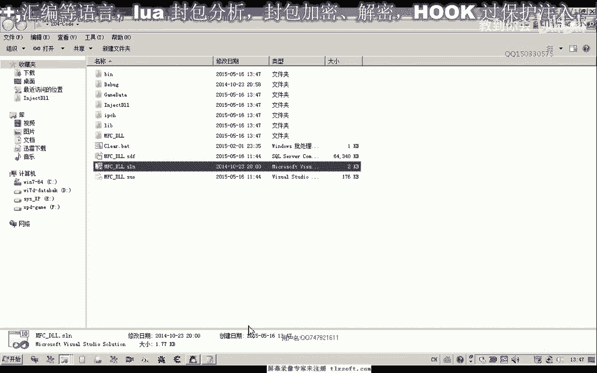
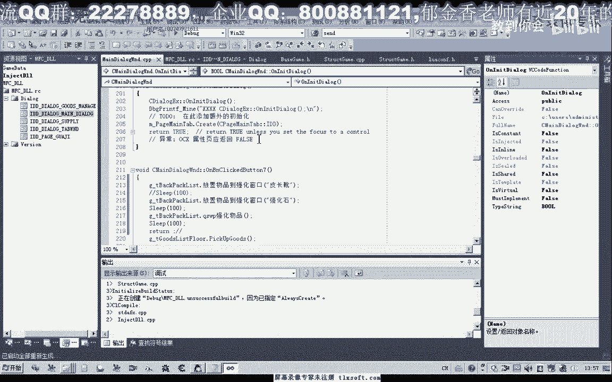
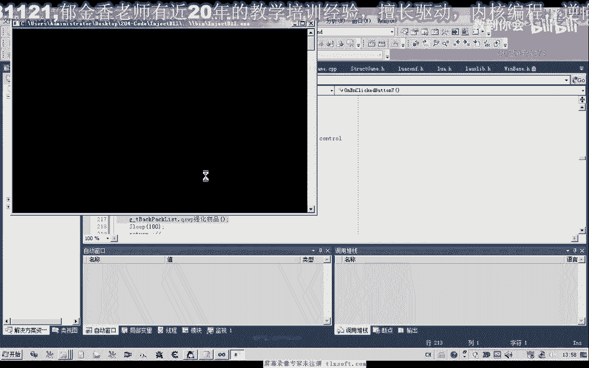
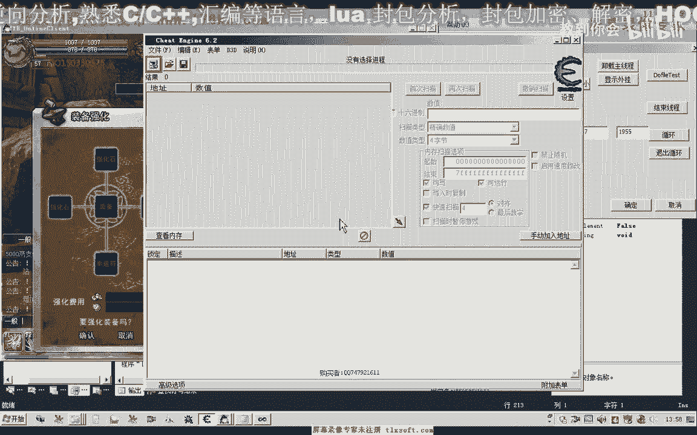

# P189：204-封装强化CALL - 教到你会 - BV1DS4y1n7qF

大家好，我是郁金香老师，这节课呢我们一起来封装强化的。

封装强化课，那么上一节课呢我们拼装了啊，放置强化物品的相关功能，那么这节课呢我们把它进行完善，那么最终呢要强化物品呢，还需要调用这一个扩，当然我们也可以直接把这一段汇编代码转换成我们的c语言的代码呃。

直接简单的进行一个转换，那么另外一种方式呢，我们可以调用我们之前已经写好的相关的函数。

嗯嗯。

首先呢我们也展开结构单元，然后在那么在这里边呢，我们可以看到这里有个w的cd，专门是用发包的，那么我们可以直接用这个函数来来替代我们的汇编代码好，那么我们首先呢添加强化物品的扣到我们的背包结构里边。

然后我们到cpp单元的最后添加我们的代理，这样写是可以的，在这里呢我们把它16进制写一下，那么这样写是可以的，但是这样写的话，我们很多机子的话呃不是很方便维护啊。

那么实际上我们之前呢封装了一个相应的扣啊，当然我们也可以先测试一下，用这个空，实际上在这个地方我们已经有一个呃封装了一个扩啊，刚才我们看了一下，那么这个机子的话，这个才是我们最新的机子。

f38840 啊，这个没有变，38840，好的，我们先测试一次，然后在这里放置之后呢，我们调用一下强化物品，那么经过这三个步骤的话，他每执行一次的话，就会强化一次这个青铜复审。

当然这里呢我们还没有加上一些其他条件的判断，比如说只强化到几阶段啊，因为我们相应的这个属性还没有分析，那么我们直接啊这样呢就可以强化一次，那么但是呢现在这一次呢他是强化失败了啊。

好那么可以继续强化下一个物品，那么这个时候呢我们可以把这个物品呢放到前面来啊，换一个窗口来测试，或者是给它加加上一个条件的限制，那么也就是说呃当某一个物品呢他已经强化过几次的话。

我们就绕过它可以加上这类的条件的一个判断，不然的话他会一直的强化，而且我们发现如果这里按快了的话，它必须要有一个时间的一个建构，如果我们按的太快的话，它可能呃就不会被执行，会卡在这里啊。

中间呢它需要有一段停的一个时间的一个间隔，放置这个强化物品之后，那么这里呢我们最好加上一个实例，好的，那么这样写的话也是可以的，我们最好的我们说的我们还是调用相应的这个库来实现这一段代码，把它关掉啊。

我们直接调用一下这个库就可以了，那么这里呢我们需要进行一个缓冲区，然后这里呢我们可以来直接给他初始化轻盈有几个数字，然后我们这里来缓冲区里面最主要的就只有这两个数字，那么这里呢相当于是我们的数组名啊。

这里是数组一，当然这个是针对我们四肢解的，那么所以说这里呢我们要用一个四字节d word的一个指针，为此向他进行一个转换，那么转换之后呢，它的第一个数据，就是我们站点的这个数据，注意是这样赎回去的啊。

因为先压战的他在底部啊，最后压战的呢他才在顶部啊，在一个站，那么这是它的第二个数据，好那么这就是缓冲区的第一个参数，那么从这个地址也可以传这一个，那么这两个呢实际上地址是等价的啊，等价的。

然后第二个就是它的一个大小，或者直接传这个常量米x61 啊，进去，因为这里的话它的参数呢要求是0x61 可能改变的话啊，会造成不成功，那么我们也可以进行一下尝试，那么这样写的话就要简单很多啊。

要简单很多，不用去管理这个机制，那么以后这个机子的话，我在这个地方进行管理就行，那么这里也做了相应的异常的一个处理，好的，我们再来看一下青铜复审，啊强化到四阶段了，强化到五阶段哈。

再强化的话就可能失败了啊，这个手机没有，好的，那么我们来改一下啊，看一下这个缓冲区的数值是否有这个影响，做一下相应的测试，比如说这里我们传大一点，传承欺凌，看会不会影响到，那么在这之前呢。

我们需要去买一个啊青铜护手到凌霄龙这个地方，是不是快下，那么看来的话呃这个数值的话应当就是一个缓冲区的大小，那么我们把它改大了之后的话，它也可以使用啊，所以说这里的写好的话。

我们就用这个size of size of，那就再应当是一个缓冲区的大小，那么这里呢我们还是它是多大的，我就给他写为多大，这样是最好的，那么在这里我们测试完成之后呢，我们再来测试一下啊。

嗯另外添加一个按钮，把这一段代码复制一下，那么这里呢我们换成皮肠修，也就是这个物品啊，那么我们再进行一下测试。

当然我们也可以把这三个呃扣把它封装成一个啊一个功能函数啊，就是强化的一个物品，只强强化一次啊。

那么这个时候呢我们看到能够强化一次，好的，那么这节课我们就讲到这里，那么下一节课呢我们分析一下这个强化的阶段的这个属性是1234，因为大家说呃很简单啊，这个属性我们直接呃这节课呢我们就把它分析一下。

或者，还是留到下一节课了啊，或者大家自己先下去分析一下，那么我们到时候到时候呢嗯在进行这个物品合成的呃功能的封装，那么物品合成的话，因为它涉及到的这个属性呢要多一些，可能的封装起来呢要稍微复杂一点。

好的。