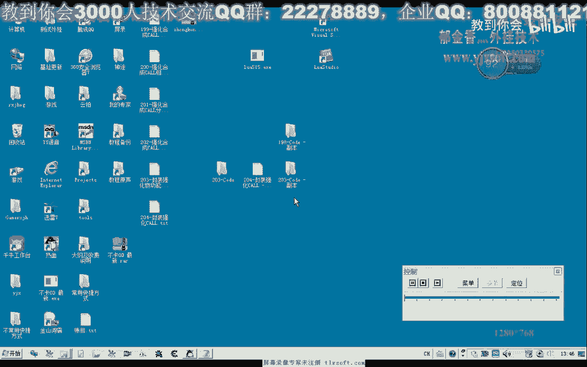
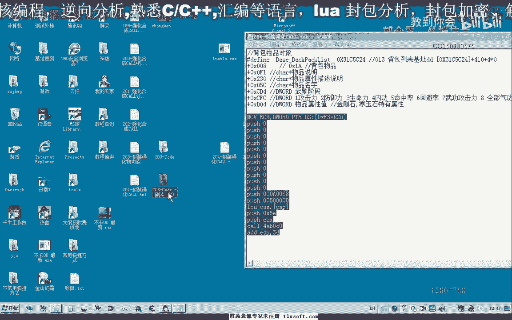

# 课程 P189：204-封装强化CALL 🛠️



在本节课中，我们将学习如何封装一个用于强化游戏物品的CALL函数。我们将把之前拼装好的功能进行完善，并学习如何用更简洁、更易维护的C++代码来调用它，替代直接的汇编代码。



---


上一节我们介绍了放置强化物品的相关功能。本节中，我们来看看如何调用强化CALL，并对其进行封装。

首先，我们展开结构单元。在这里，可以看到一个名为 `w_send` 的函数，专门用于发包。我们可以直接使用这个函数来替代我们之前编写的汇编代码。

以下是添加和调用强化CALL的步骤：

1.  **添加强化物品的CALL到背包结构**
    我们需要在背包相关的结构体中，添加指向强化CALL的指针或函数声明。

2.  **在CPP单元末尾添加代理函数**
    我们可以编写一个代理函数来调用这个CALL。虽然可以直接写入十六进制地址，但这种方式不便于代码维护。

实际上，我们之前已经封装了一个相应的CALL。最新的CALL地址是 `0xF38840`。我们可以先测试一下直接调用这个地址。

```cpp
// 示例：直接调用地址（不推荐用于最终代码）
typedef void (*StrengthenFunc)();
StrengthenFunc pStrengthen = (StrengthenFunc)0xF38840;
pStrengthen(); // 调用强化
```

经过“放置物品”和“调用强化”这两个步骤，每执行一次，就会对目标物品进行一次强化。目前，我们还没有加入条件判断，例如只强化到特定阶段，因为相关的物品属性我们尚未分析。

直接调用可以完成一次强化，但可能会失败。为了连续强化下一个物品，我们需要将物品移到前面，或者为循环添加条件限制。否则，程序会一直尝试强化同一个物品。

此外，操作之间需要有一定的时间间隔。如果点击太快，指令可能无法正确执行，导致卡顿。因此，在放置强化物品后，最好添加一个延时。

```cpp
// 示例：添加延时
Sleep(100); // 暂停100毫秒
```

虽然直接调用地址可行，但我们更推荐调用封装好的库函数来实现这段代码。这样更简洁，且便于后续维护。

以下是调用封装库函数的推荐方法：

```cpp
// 定义缓冲区
BYTE buffer[0x61] = {0};
// 初始化缓冲区前两个DWORD数据（针对4字节系统）
*(DWORD*)&buffer[0] = 第一个数据; // 先压栈的数据在底部
*(DWORD*)&buffer[4] = 第二个数据; // 后压栈的数据在顶部

// 调用封装好的库函数进行强化
// 参数1：缓冲区地址，也可以直接传 &buffer[0]
// 参数2：缓冲区大小，这里使用 sizeof(buffer)
CallStrengthenFunction(buffer, sizeof(buffer));
```

`buffer` 的第一个 `DWORD` 对应最先压入栈的数据，第二个 `DWORD` 对应后压入的数据。传递 `buffer` 和 `&buffer[0]` 的地址是等价的。第二个参数是缓冲区大小，固定为 `0x61` 可以确保调用成功，但使用 `sizeof(buffer)` 是更安全的做法，这样即使缓冲区大小改变，代码也无需修改。封装函数内部也应包含相应的异常处理。

我们进行测试，将缓冲区大小参数改大一些（例如 `0x100`），发现强化功能依然正常。这说明该参数主要表示缓冲区大小，只要不小于所需空间即可。因此，使用 `sizeof` 是最佳实践。


测试完成后，我们可以为另一个物品（例如“皮长靴”）添加一个测试按钮，复用上述代码逻辑。


当然，我们也可以将“放置物品”、“调用强化”、“添加延时”这三个步骤封装成一个独立的函数，例如 `StrengthenItemOnce()`，专门用于执行一次完整的物品强化操作。

---


本节课中，我们一起学习了如何封装和调用游戏中的强化CALL。我们比较了直接调用地址和使用封装库函数两种方法的优劣，并实现了通过缓冲区传递参数、调用库函数来完成物品强化的流程。我们还讨论了添加延时和条件判断的必要性。

下一节课，我们将分析物品的强化阶段属性（如+1，+2，+3，+4），为后续实现更智能的强化循环（例如强化到指定阶段后停止）打下基础。之后，我们会进一步封装更复杂的物品合成功能。