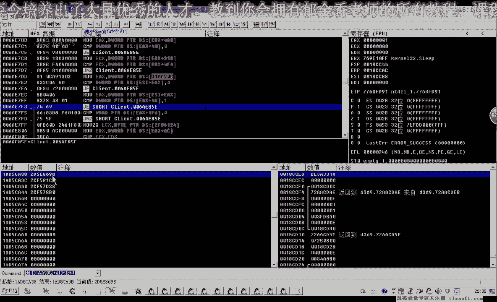
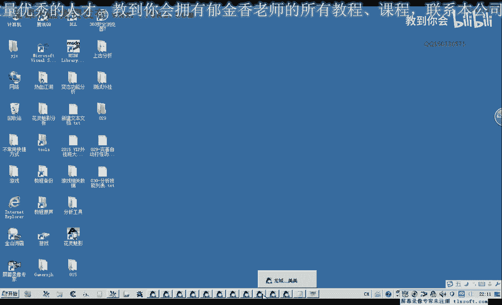
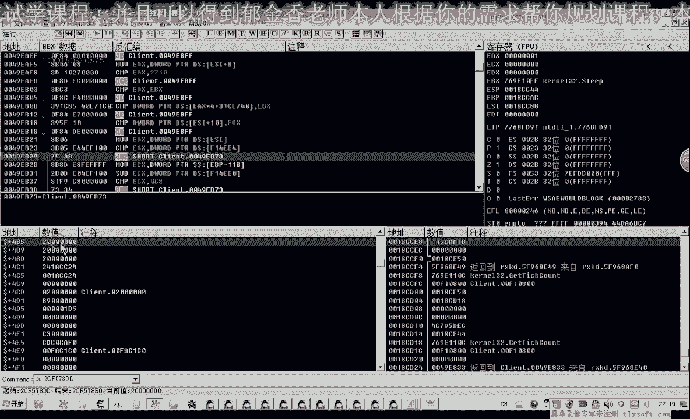
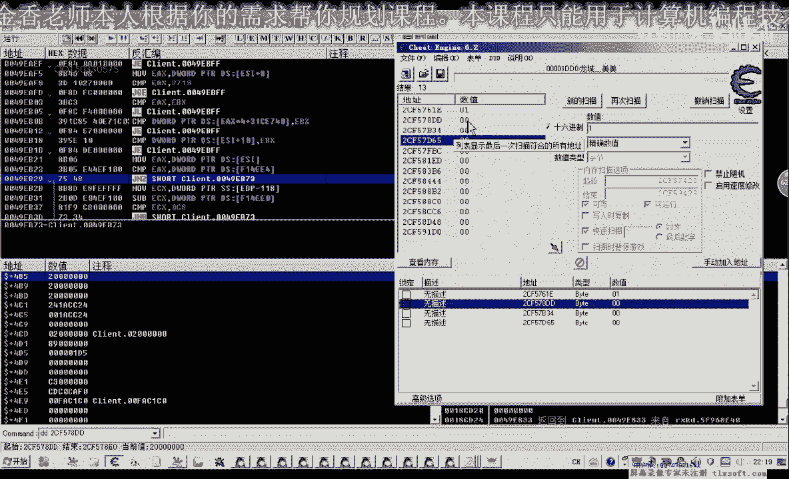
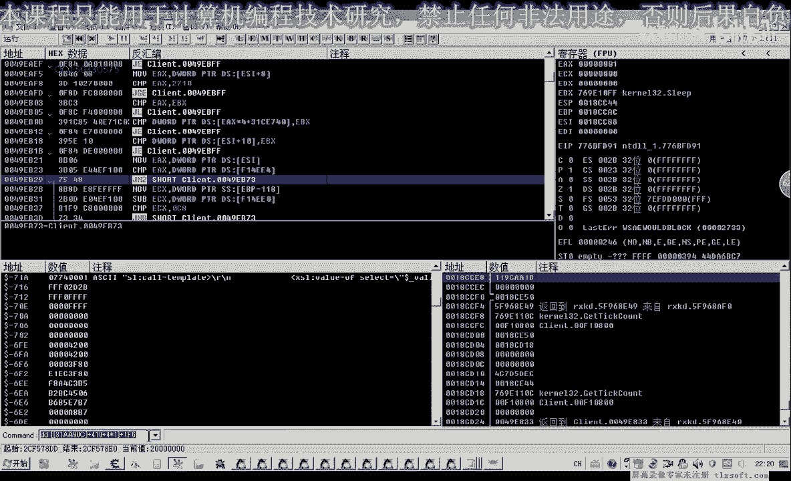

# 逆向工程课程 P19：030-分析技能列表 📚

在本节课中，我们将学习如何分析游戏中的技能列表数据结构。我们将通过动态调试的方法，定位技能列表在内存中的基址、偏移量以及关键属性，为后续编写功能代码打下基础。

## 概述与目标

上一节我们介绍了动作列表的分析方法。本节中，我们来看看技能列表的分析过程。我们的目标是找到技能列表的数组结构、每个技能对象的属性（如名称、是否已学习），并理解其内部组织方式。

## 分析技能列表对象

在游戏中，技能通常被组织在一个列表里。使用技能时，需要将其从列表拖拽到快捷栏。这个拖拽操作背后，必然有一个变量临时存放了被选中的技能对象。

我们可以使用调试器（如CE）搜索这个存放选中技能对象的变量。搜索思路是：初始状态为“未知数值”，选中一个技能时数值“变动”，放回列表时数值“未变动”或变为特定值（如0）。

以下是搜索此变量的步骤：

1.  开始扫描，设置扫描类型为“未知的初始值”。
2.  在游戏内选中一个技能，此时变量值变动，搜索“变动的数值”。
3.  将技能放回列表，变量值可能未变或归零，搜索“未变动的数值”或“数值0”。
4.  重复选中、放回操作，并配合搜索“增加的数值”、“减少的数值”或“精确数值”，逐步过滤出候选地址。
5.  最终，我们得到几个以`0xC`开头的地址，这些地址很可能与技能对象相关。

## 定位技能列表数组

找到存放选中技能对象的变量后，我们需要查看是哪些代码访问或修改了它。通过下访问断点，我们可以追踪到写入该变量的汇编指令。

在关键指令处，我们发现了类似 `[基址 + 下标*4 + 0x410]` 的数组访问模式。这里的 `0x410` 偏移量与之前分析动作列表时的结构非常相似，这很可能就是技能对象数组的访问方式。

我们记录下此处的基址（例如来自 `EDI` 寄存器）和偏移量 `0x410`。这个基址就是技能列表数组的起始地址。

## 解析技能对象结构

获得数组基址后，我们可以遍历数组中的每个元素（即技能对象），并查看其内存结构。

通过查看不同下标对象的内存，我们发现技能对象有两种类型：
*   **类型 `0x1B`**：代表技能分类（如同一系技能的第一本“技能书”）。
*   **类型 `0x1C`**：代表具体的技能对象。

一个完整的技能列表可能包含多个分类和多个具体技能，它们交替排列在同一个数组中。

以下是技能对象的关键属性偏移（示例，具体游戏可能不同）：
*   **对象名称偏移**：`+0x5C` 处存放技能名称的指针。
*   **技能职业偏移**：`+0xB1` 处可能表示技能所属职业。
*   **是否已学习标志偏移**：`+0x1F6` 处的一个字（2字节）可能表示该技能是否已学习（1为已学，0为未学）。

我们可以通过修改 `+0x1F6` 处的值来验证，将0改为1后，游戏中对应的未学习技能会变为可用状态。

## 总结与下节预告

本节课中我们一起学习了如何分析游戏技能列表的数据结构。我们掌握了从选中操作追踪到内存变量，再定位到整个技能数组基址的方法。同时，我们解析了技能对象的内部结构，找到了表示技能名称、类型以及是否已学习的关键内存偏移。

下一节课，我们将基于本节课的分析结果，开始编写代码来读取技能列表中的数据，并尝试实现一些自动化操作。