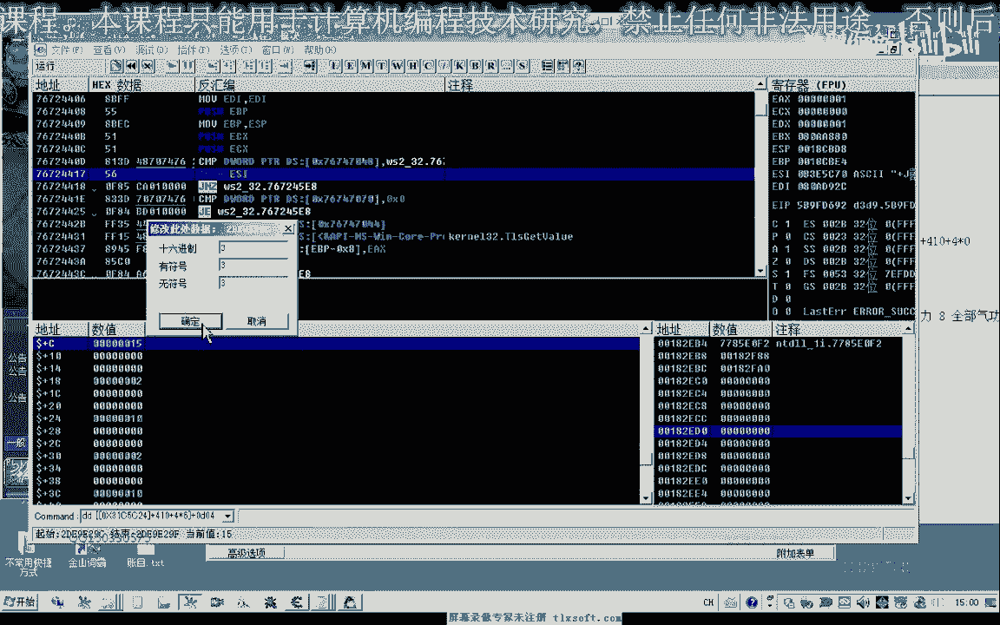

# 课程 P190：205 - 完善强化函数 🛠️


在本节课中，我们将学习如何完善游戏物品的强化功能。我们将通过分析游戏内存数据，找到物品强化次数的存储位置，并修改我们的代码，使其能够判断物品是否已达到指定的强化次数，从而避免重复强化。


---


## 概述


上一节我们实现了物品强化的基本功能。本节中，我们来看看如何控制强化的次数。我们需要找到并利用游戏内存中存储物品强化次数的属性，以完善我们的强化函数。


## 定位强化次数属性

在之前的课程中，我们曾分析过一个位于偏移 `300` 的属性，它记录了物品的强化次数。但现在这个偏移已经失效，我们需要重新搜索。

以下是重新搜索的步骤：


1.  以第一格物品为例，其初始强化状态为 `1`。
2.  使用内存搜索工具，附加到游戏进程，搜索字节类型的数值 `1`。
3.  将物品强化一次，此时强化状态变为 `2`。
4.  在搜索结果中继续搜索数值 `2`。
5.  重复此过程，直到筛选出唯一或少数几个地址。


通过此方法，我们最终定位到存储强化次数的正确偏移地址为 `D04`。这意味着物品的强化次数信息存储在其基础地址加上 `D04` 偏移的位置。


## 分析物品属性结构

接下来，我们查看其他带有附加属性（如“防御力+47”）的物品，以理解其数据结构。


我们发现，从偏移 `D10` 开始，存在一个数组，用于描述物品的附加属性。这个数组的结构如下：

*   它是一个 `word` 类型的数组。
*   数组大小可能为 `6` 或 `7` 个元素。
*   其中，`T[0]` 表示属性类型（例如，`2` 代表防御力，`3` 代表生命力）。
*   `T[3]` 表示该属性的具体数值。


我们可以通过修改这个数组来为物品添加或更改附加属性。例如，将一个无属性的物品的 `T[0]` 改为 `2`，`T[3]` 改为 `16`，即可为其添加“防御力+16”的属性。


## 理解强化相关数据结构

我们注意到，偏移 `D04` 处的数值表示强化阶段数（例如，`4` 表示+4）。此外，在属性数组的起始位置（如 `CF8`），还有一个数值（通常为 `2`）可能与强化状态相关。

综合来看，一个物品的强化与属性信息可能由以下部分构成：


1.  **强化阶段计数器**：位于 `D04`，记录物品被强化了多少次。
2.  **属性数组**：从 `CF8` 或 `D10` 开始，每个属性由一组数据描述，结构可能类似于：
    ```c
    struct ItemAttribute {
        int attributeType; // 属性类型，如防御力、生命力
        int unknown1;      // 未知值
        int attributeValue;// 属性数值
        int unknown2;      // 未知值
    };
    ```
    强化增加的属性值也通过这个结构来体现。

## 完善强化函数代码


分析清楚数据结构后，我们开始修改代码。核心目标是：在强化物品前，先判断其当前强化次数是否已达到上限。



以下是修改思路：


1.  在代码的结构定义单元中，为物品信息添加 `强化次数` 字段，对应偏移 `D04`。
2.  封装一个独立的函数，用于判断物品是否可强化。
    ```pascal
    function CanEnhanceItem(item: TItemInfo; maxEnhanceTimes: Integer): Boolean;
    begin
      Result := item.强化次数 < maxEnhanceTimes;
    end;
    ```
3.  在主强化流程中调用此函数。在遍历背包、选择要强化的物品时，增加条件判断：
    *   物品不是强化石。
    *   物品的当前强化次数小于目标次数。
4.  如果物品已达到强化上限，则跳过该物品，寻找下一个目标。
5.  在关键操作（如放置物品、点击强化按钮）后，添加适当的延迟，确保游戏客户端能及时响应。

修改完成后，我们的强化脚本将能够智能地识别物品状态，只对未达到强化上限的物品进行操作，从而实现了强化次数的控制。

---


## 总结

本节课中，我们一起学习了如何完善游戏物品的强化函数。


1.  **我们首先**通过内存搜索，重新定位了存储物品强化次数的关键偏移地址 `D04`。
2.  **接着**，我们分析了物品附加属性的数组结构，理解了如何读取和修改属性值。
3.  **然后**，我们梳理了与强化相关的数据结构，区分了强化计数器和属性数组的作用。
4.  **最后**，我们修改了代码，添加了强化次数判断逻辑，使强化函数具备了控制强化次数的能力。


通过本课的学习，你的强化脚本将变得更加可靠和智能。记得在实际使用中，根据不同游戏版本的数据结构变化，适时调整偏移地址和判断逻辑。