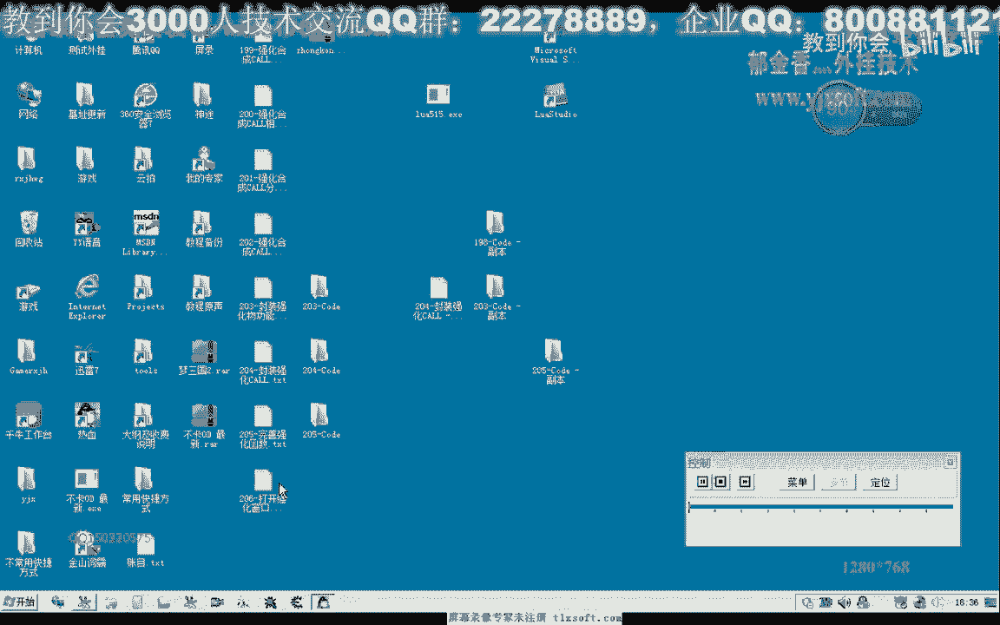

# 课程 P191：206 - 打开强化与合成窗口数据分析 📊

在本节课中，我们将学习如何分析并获取游戏中打开“强化装备”与“合成物品”窗口所需的数据包。我们将通过逆向工程的方法，定位关键函数，并提取出构造数据包的必要参数。

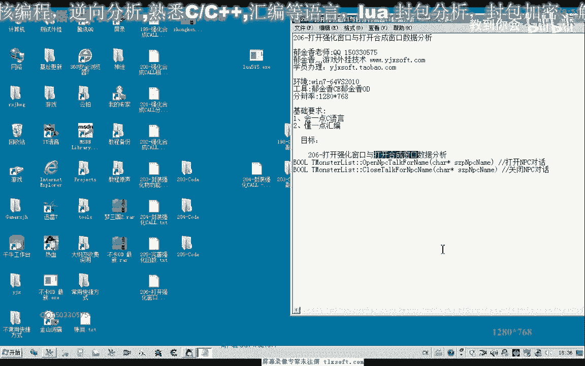

---

上一节我们分析了与NPC对话和关闭窗口的数据。本节中，我们来看看如何打开强化与合成这两个核心功能窗口。

根据之前的分析经验，在游戏里打开任何功能窗口前，客户端都会向服务器发送一个特定的数据包，服务器响应后才会打开窗口。因此，我们的目标就是找到并模拟发送这个“打开窗口”的指令包。

以下是分析打开强化窗口数据包的步骤：

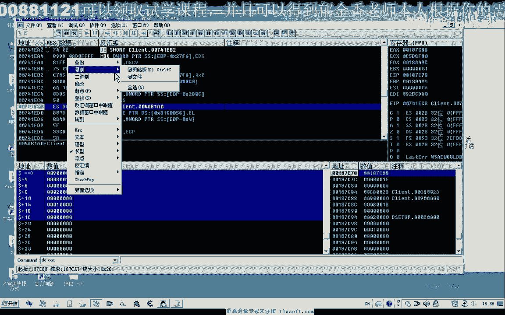

1.  在发包函数上下断点。
2.  在游戏中点击“强化”按钮，使游戏在发包时断下。
3.  回溯调用栈，找到触发发包的准确位置。
4.  重新在此位置下断点，并再次点击“强化”，观察并记录缓冲区中的数据。

通过此方法，我们获得了打开强化窗口的数据包结构。其缓冲区大小约为36字节（0x24），其中包含关键的NPC ID和标识“强化”动作的特定字节。

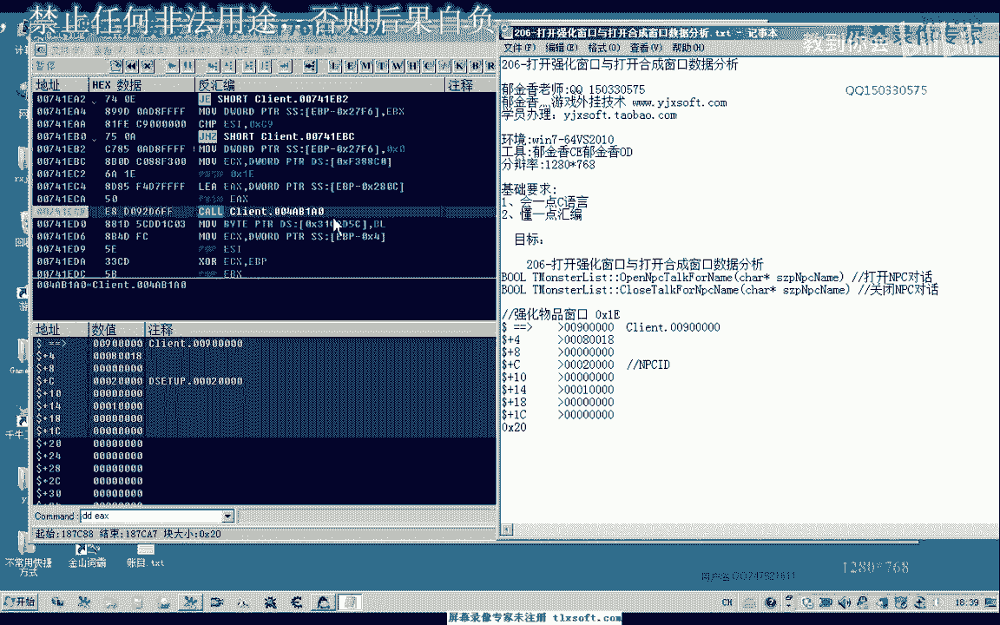

---

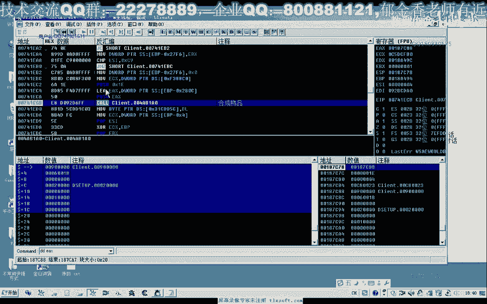

接下来，我们用同样的方法分析打开合成窗口的数据。

我们发现，打开合成窗口的数据包流程与强化窗口在同一个函数中处理。只需在游戏中点击“合成物品”，并记录下此时的缓冲区数据。

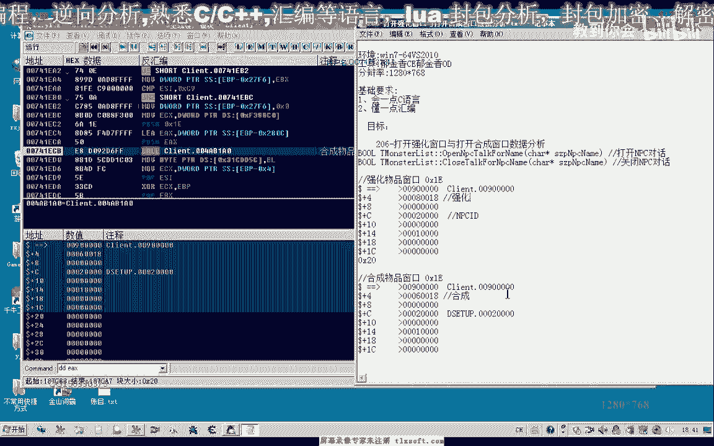

对比两个数据包，我们发现它们的结构高度相似，主要区别仅在于其中一个字节的值不同。这个字节用于区分是“强化”操作还是“合成”操作。

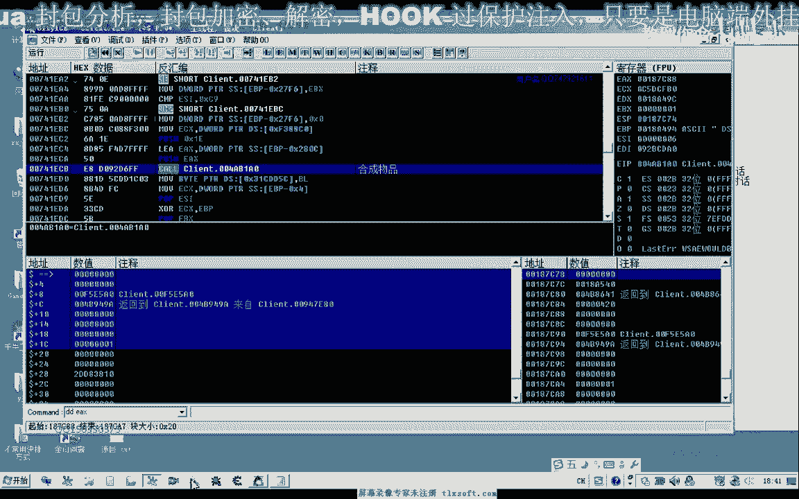

---

在获取了原始数据后，我们需要编写代码来模拟发送这些数据包。

以下是使用汇编指令手动构建并发送数据包的核心思路：

1.  使用 `push` 指令按特定顺序将数据压入栈中，以构建缓冲区。
2.  在压栈前，需要先保存 `ESP` 寄存器的地址，以确保栈平衡。
3.  调用我们之前封装好的发包函数，将构建好的缓冲区地址和大小作为参数传入。

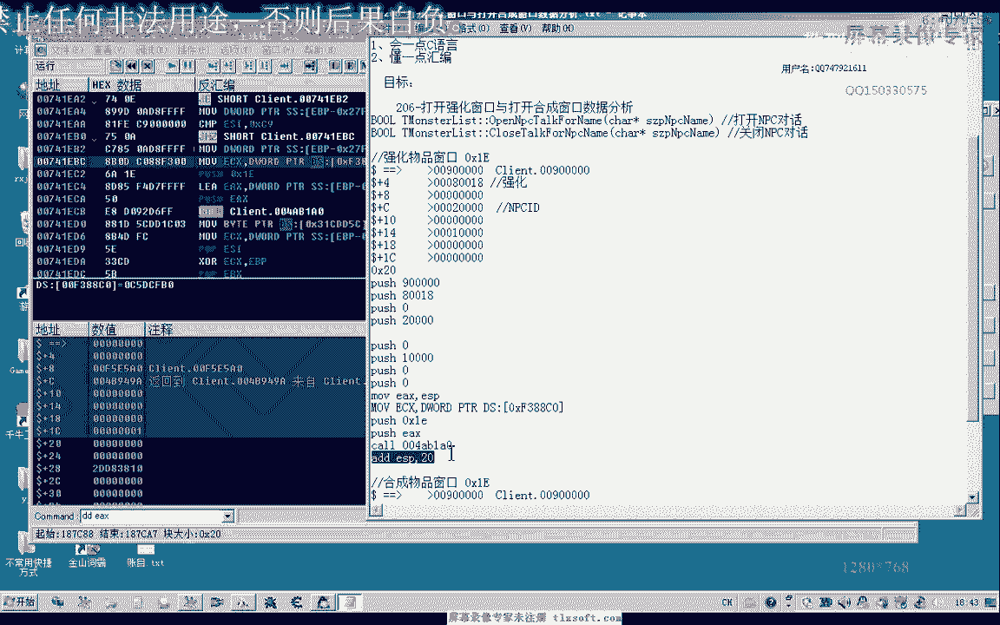

例如，构建强化窗口数据包的代码逻辑如下（伪代码表示）：
```assembly
; 保存原始ESP
mov eax, esp
; 开始压入数据包内容
push 0
push 0
push 0x00010000
... ; 压入其他数据
push 0x00008018
push 0x00000009
; 调用发包函数 (假设函数地址在 0x4FBBA0)
push 0x24 ; 缓冲区大小
push eax  ; 缓冲区起始地址 (当前ESP)
call 0x4FBBA0
```
对于合成窗口，只需修改其中标识动作的那个字节值即可。

---

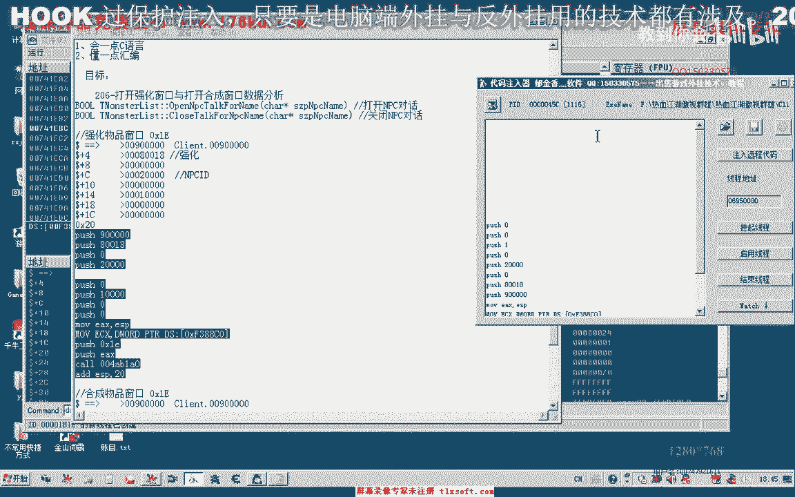

最后，我们进行功能测试。首先确保已打开NPC对话窗口，然后注入我们编写的代码。

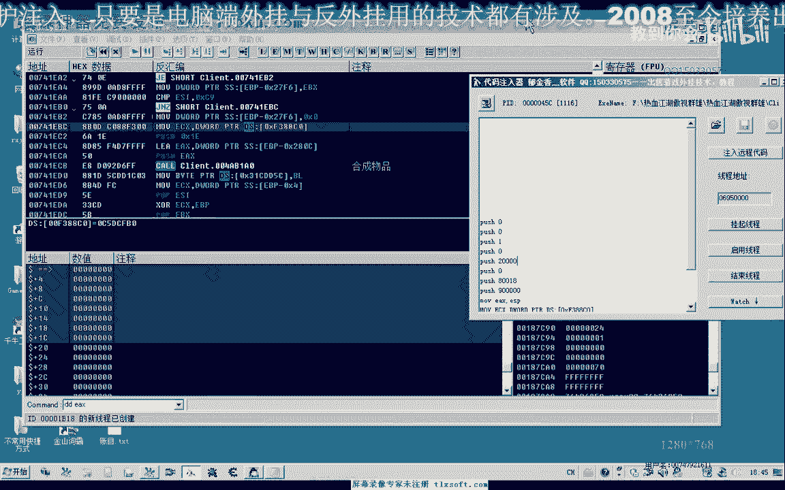

1.  测试强化窗口：注入对应数据包代码，游戏成功打开了强化窗口。
2.  测试合成窗口：修改动作标识字节后注入代码，游戏成功打开了合成窗口。
3.  关闭窗口：使用我们之前封装的关闭NPC对话函数即可。

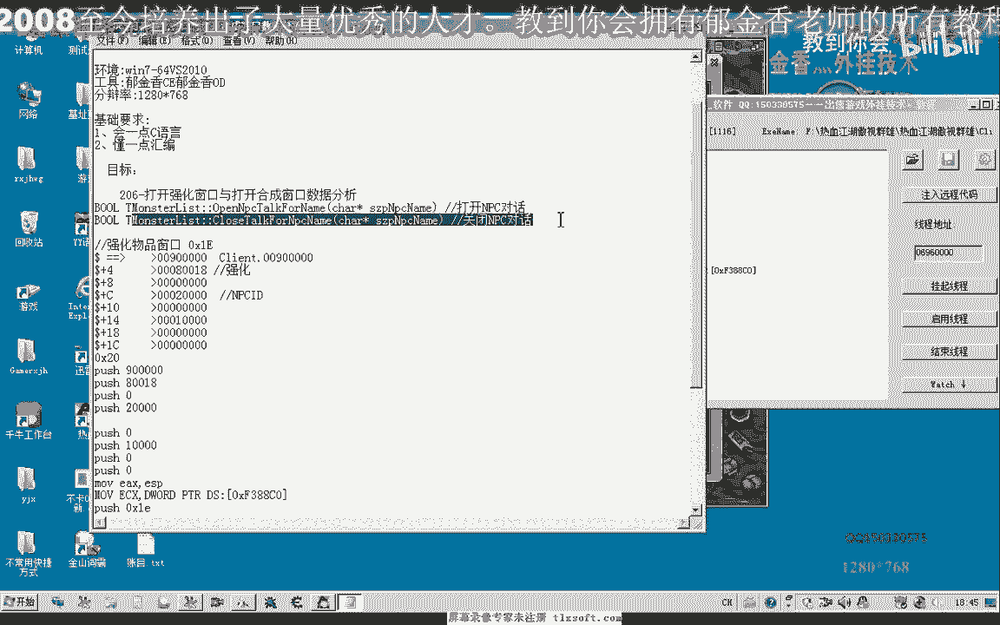

至此，实现自动强化与合成功能所需的所有关键数据——打开NPC、选择强化/合成、放置物品、操作装备、关闭窗口——都已找齐。

---

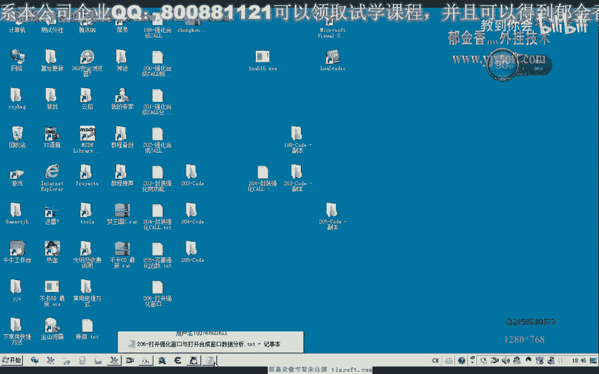

本节课中我们一起学习了如何分析并获取打开强化与合成窗口的网络数据包。我们掌握了通过对比分析找到关键差异字节的方法，并了解了使用底层代码模拟发送数据包的基本流程。下一期，我们将开始进行这些功能的代码封装与实现。

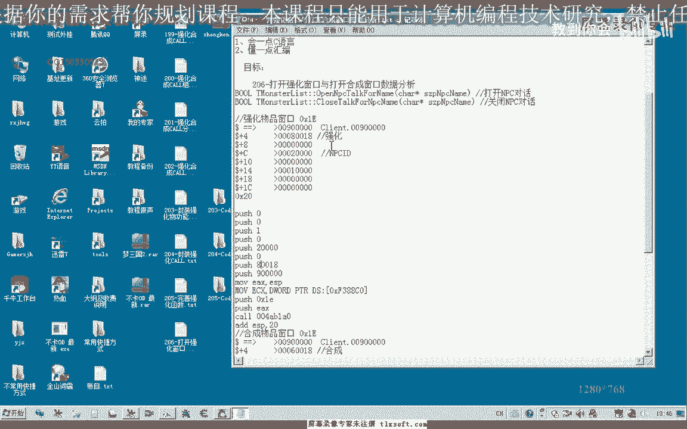

我们下期再见。