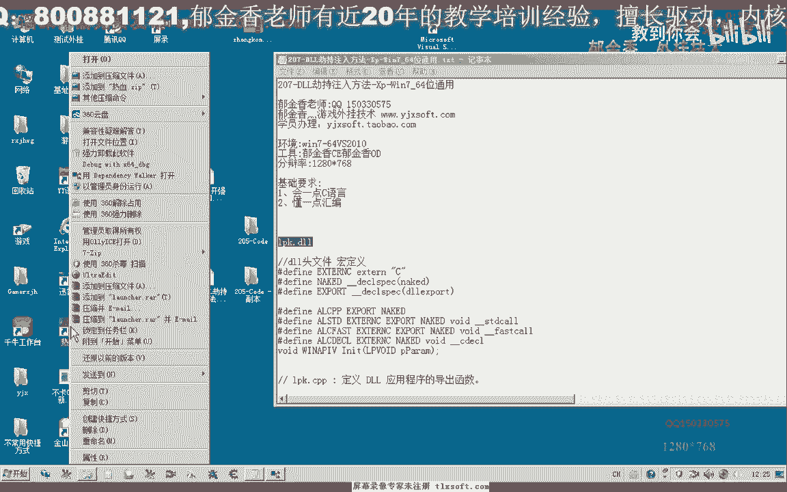
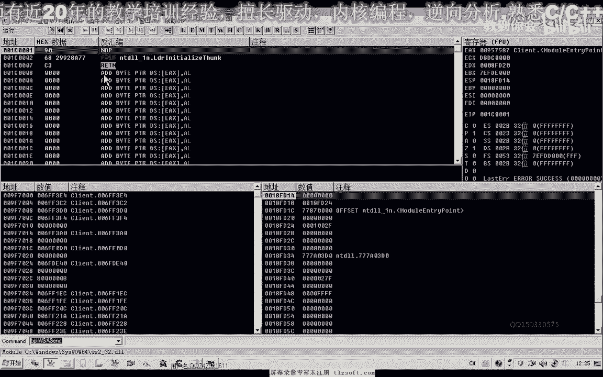
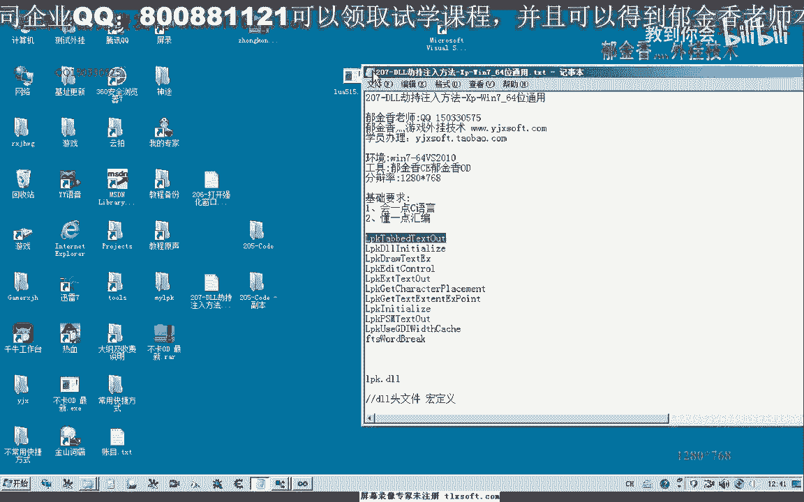
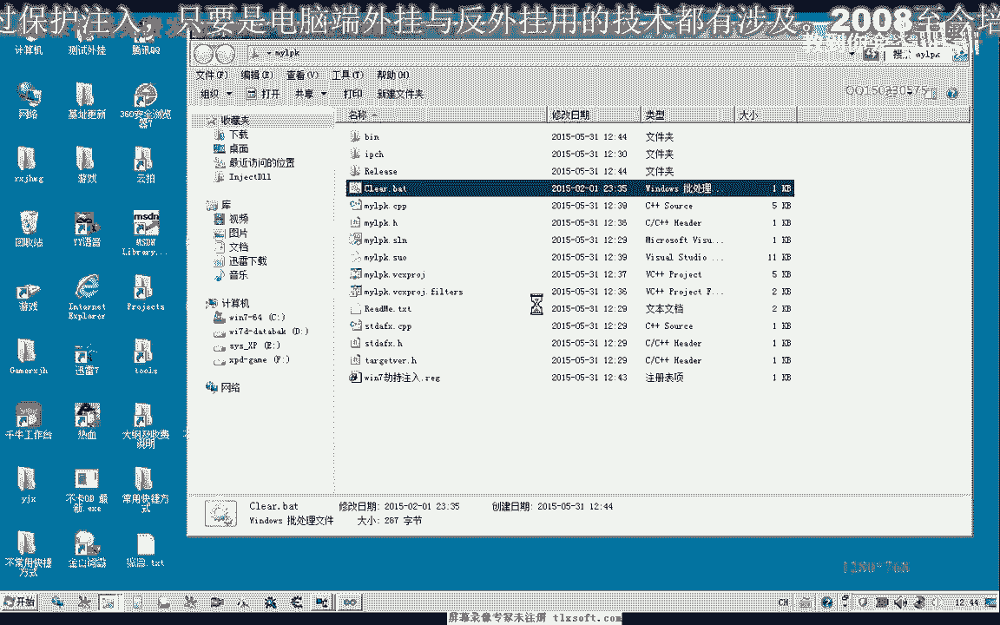

# 课程 P192：DLL劫持注入方法 - XP/Win7 64位通用 🛠️





在本节课中，我们将学习一种名为“DLL劫持注入”的技术。这种方法利用Windows系统加载动态链接库（DLL）的搜索顺序，将我们编写的DLL文件优先于系统DLL加载，从而实现代码注入。我们将以劫持 `lpk.dll` 为例，讲解其原理、实现步骤，并确保代码在XP和Win7 64位系统上通用。

## 概述

DLL劫持注入的核心原理是：当程序运行时，系统会按照特定顺序搜索并加载所需的DLL文件。如果我们将一个同名DLL放置在程序所在目录，系统会优先加载我们的DLL，而不是系统目录下的原始DLL。在我们的DLL中，我们既可以执行自定义代码，又可以通过“跳板”函数调用原始DLL的功能，确保程序正常运行。

## 劫持原理分析

上一节我们概述了DLL劫持的基本思想。本节中，我们来看看其具体的工作原理。

以游戏程序为例，当它运行时，通常会调用系统目录下的 `lpk.dll`。系统加载DLL的搜索顺序是：首先检查应用程序的当前目录。如果我们在游戏目录下放置一个名为 `lpk.dll` 的文件，系统就会加载它，而不是系统目录下的那个。这样，我们的代码就随着DLL的加载而执行了。

为了不破坏程序原有功能，我们的“假”`lpk.dll` 必须导出与原始DLL完全相同的函数。当游戏调用这些函数时，我们的DLL会将调用转发给真正的系统 `lpk.dll`。这个转发过程就是通过“跳板函数”实现的。

## 实现步骤

理解了原理后，我们开始动手实现。整个过程可以分为创建劫持DLL、编写跳板函数和注入自定义代码几个部分。

以下是创建劫持DLL项目的具体步骤：

1.  使用 Visual Studio 2010 创建一个新的“Win32项目”。
2.  在应用程序类型中选择“DLL”。
3.  将项目命名为 `my_lpk`（生成后需要重命名为 `lpk.dll`）。
4.  移除VS自动生成的 `dllmain.cpp` 文件，我们将自己编写入口函数。

## 编写核心代码

现在，我们来编写劫持DLL的核心代码。代码主要包含两部分：一是转发函数（跳板），二是我们自己的注入代码。

首先，我们需要知道原始 `lpk.dll` 导出了哪些函数。可以使用工具查看，通常 `lpk.dll` 导出函数较少，例如11个，这简化了我们的工作。

以下是一个关键跳板函数的代码示例。其核心是获取原始函数的地址并进行调用：

```cpp
// 声明原始函数的函数指针类型
typedef int (WINAPI* TrueLpkInitialize)(...);

// 跳板函数
int WINAPI LpkInitialize(...)
{
    // 1. 获取系统目录路径
    char sysPath[MAX_PATH];
    GetSystemDirectoryA(sysPath, MAX_PATH);
    strcat(sysPath, "\\lpk.dll");

    // 2. 加载真正的系统lpk.dll
    HMODULE hRealLpk = LoadLibraryA(sysPath);

    // 3. 获取真实函数的地址
    TrueLpkInitialize pfnRealLpkInitialize = (TrueLpkInitialize)GetProcAddress(hRealLpk, "LpkInitialize");

    // 4. 调用真实函数并返回结果
    return pfnRealLpkInitialize(...);
}
```

我们需要为每一个导出的函数编写这样的跳板函数。

我们自己的注入代码放在哪里呢？它应该放在DLL的入口点 `DllMain` 中。当我们的DLL被加载时，`DllMain` 函数会被调用。

以下是在 `DllMain` 中加载我们实际功能DLL的代码：

```cpp
BOOL APIENTRY DllMain(HMODULE hModule, DWORD ul_reason_for_call, LPVOID lpReserved)
{
    if (ul_reason_for_call == DLL_PROCESS_ATTACH)
    {
        // 禁用DLL_THREAD_ATTACH等通知，提升性能
        DisableThreadLibraryCalls(hModule);

        // 在这里执行注入代码，例如加载我们真正的功能DLL
        LoadLibraryA("MyRealCode.dll");
    }
    return TRUE;
}
```

## 处理Win7系统保护

在Windows XP上，以上步骤通常就足够了。但在Windows 7及更高版本系统中，由于系统保护机制，可能需要修改注册表才能成功劫持。

上一节我们完成了核心代码的编写，本节中我们来看看如何让劫持在Win7上生效。

以下是针对Win7系统的配置步骤：

1.  按下 `Win + R`，输入 `regedit` 打开注册表编辑器。
2.  导航到路径：`HKEY_LOCAL_MACHINE\SYSTEM\CurrentControlSet\Control\Session Manager\KnownDLLs`
3.  在右侧找到 `lpk` 项（如果存在）。默认情况下，系统通过此项知道 `lpk.dll` 是系统已知DLL，会直接从系统目录加载，忽略应用程序目录。
4.  为了劫持，我们需要**删除** `lpk` 这个值。这样系统就会恢复正常的DLL搜索顺序，优先查找应用程序目录。

**注意**：修改注册表有风险，请先备份。修改后可能需要重启计算机生效。



## 测试与部署


所有代码和配置完成后，就可以进行测试了。

以下是部署和测试的步骤：

1.  将编译生成的 `my_lpk.dll` 重命名为 `lpk.dll`。
2.  将 `lpk.dll` 和你的实际功能DLL（例如 `MyRealCode.dll`）一起放到目标游戏或程序的根目录下。
3.  如果目标系统是Win7/8/10，请确保已按上一节所述修改注册表。
4.  启动目标程序。使用进程查看工具（如Process Explorer）检查我们的DLL是否成功注入到目标进程中。


## 总结


本节课中我们一起学习了DLL劫持注入技术的完整流程。我们从原理入手，理解了系统加载DLL的顺序是此技术可行的关键。然后，我们逐步实现了劫持DLL的创建、跳板函数的编写以及自定义代码的注入。最后，我们还探讨了在Windows 7系统上需要处理的额外注册表配置。



这种方法的优点是通用性较强，但需要注意目标DLL的选择和系统兼容性问题。掌握这项技术有助于你更深入地理解Windows程序的运行机制。