# 课程 P193：游戏辅助控制台设计原理 🎮

在本节课中，我们将学习游戏辅助控制台的设计原理。控制台是一个可以管理多个游戏窗口的界面或进程，其核心在于实现进程间的通信。我们将探讨如何使用 `SendMessage` 和 `COPYDATASTRUCT` 结构来实现一个简单的单向通信控制台。

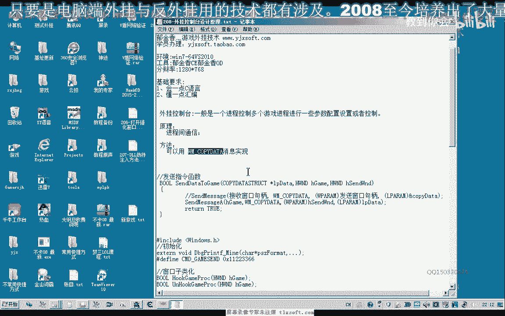

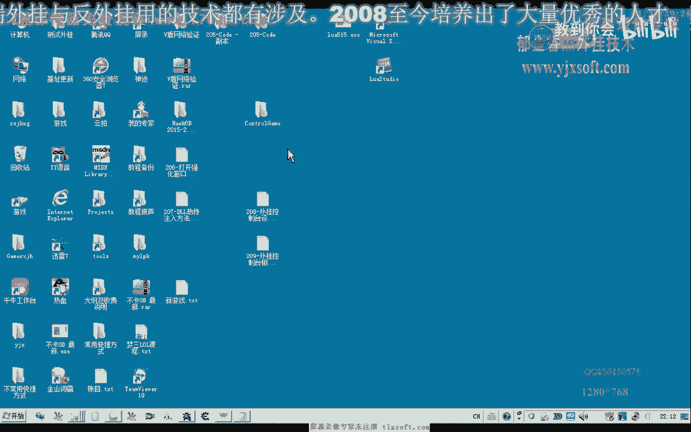

---


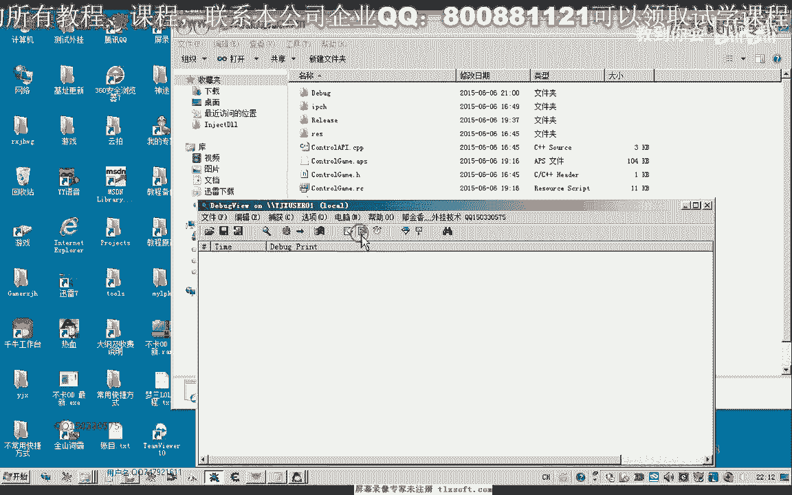

## 控制台基本原理 🔧

上一节我们介绍了控制台的概念，本节中我们来看看其核心原理。

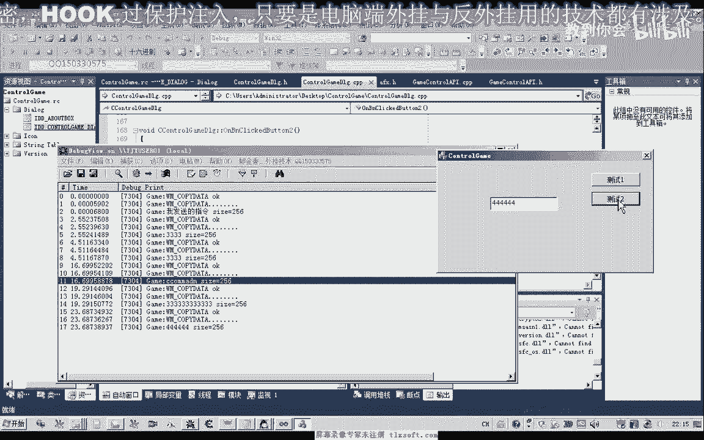

游戏辅助控制台的核心是**进程间通信**。它允许一个控制台进程向一个或多个游戏进程发送指令，从而实现批量管理，例如自动打怪或获取游戏信息。


实现进程间通信有多种方式，例如：
*   远程过程调用
*   套接字
*   管道
*   共享内存

在本教程中，我们将使用 Windows 消息机制中的 `SendMessage` 函数配合 `WM_COPYDATA` 消息来实现一个简单且有效的通信方式。

---

## 通信模型与代码结构 📡

理解了基本原理后，我们来看看具体的实现模型和代码分为哪几部分。

整个系统分为两个主要部分：
1.  **控制台端**：负责发送指令的代码。
2.  **游戏进程端**：负责接收并执行指令的代码。

以下是实现的关键步骤概述：
*   控制台端查找游戏窗口句柄。
*   控制台端封装数据并通过 `SendMessage` 发送 `WM_COPYDATA` 消息。
*   游戏进程端安装一个钩子，拦截并处理 `WM_COPYDATA` 消息。
*   游戏进程根据接收到的指令执行相应操作。

---

## 控制台端：发送指令 💻

现在，我们来详细看看控制台端如何构建和发送指令。

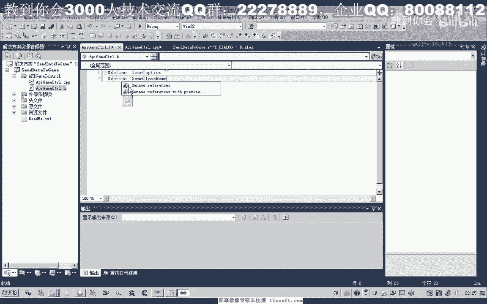

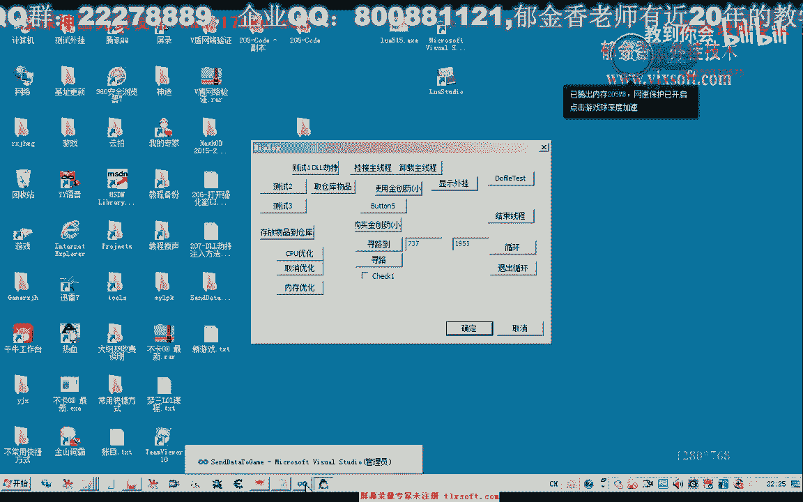

控制台端的关键是调用 `SendMessage` 函数。其函数原型如下：
```cpp
LRESULT SendMessage(
  HWND   hWnd,      // 目标窗口句柄
  UINT   Msg,       // 消息类型，此处为 WM_COPYDATA
  WPARAM wParam,    // 发送消息的窗口句柄
  LPARAM lParam     // 指向 COPYDATASTRUCT 结构的指针
);
```

其中，`COPYDATASTRUCT` 结构用于封装要传递的数据：
```cpp
typedef struct tagCOPYDATASTRUCT {
  ULONG_PTR dwData;  // 自定义数值，可用于区分不同命令
  DWORD     cbData;  // lpData 指向数据的大小
  PVOID     lpData;  // 指向任意数据结构的指针
} COPYDATASTRUCT;
```

我们可以将发送功能封装成一个简单的函数：
```cpp
// 前置声明
void SendCommandToGame(HWND hGameWnd, const char* command);

void SendCommandToGame(HWND hGameWnd, const char* command) {
    COPYDATASTRUCT cds;
    cds.dwData = 1; // 自定义命令标识
    cds.cbData = strlen(command) + 1; // 数据大小，包含字符串结束符
    cds.lpData = (void*)command; // 数据指针

    // 必须使用 SendMessage 而非 PostMessage，确保数据同步送达
    SendMessage(hGameWnd, WM_COPYDATA, (WPARAM)GetActiveWindow(), (LPARAM)&cds);
}
```

在测试程序中，我们需要先获取游戏窗口句柄，然后调用此函数：
```cpp
// 假设游戏窗口标题为“MyGameWindow”
HWND hGame = FindWindow(NULL, "MyGameWindow");
if(hGame) {
    SendCommandToGame(hGame, "START_AUTO_ATTACK");
}
```

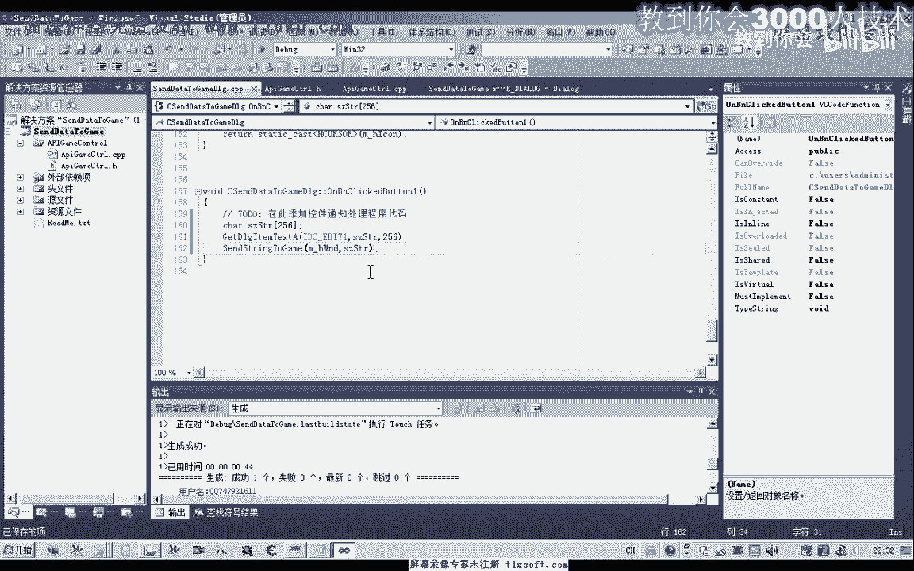

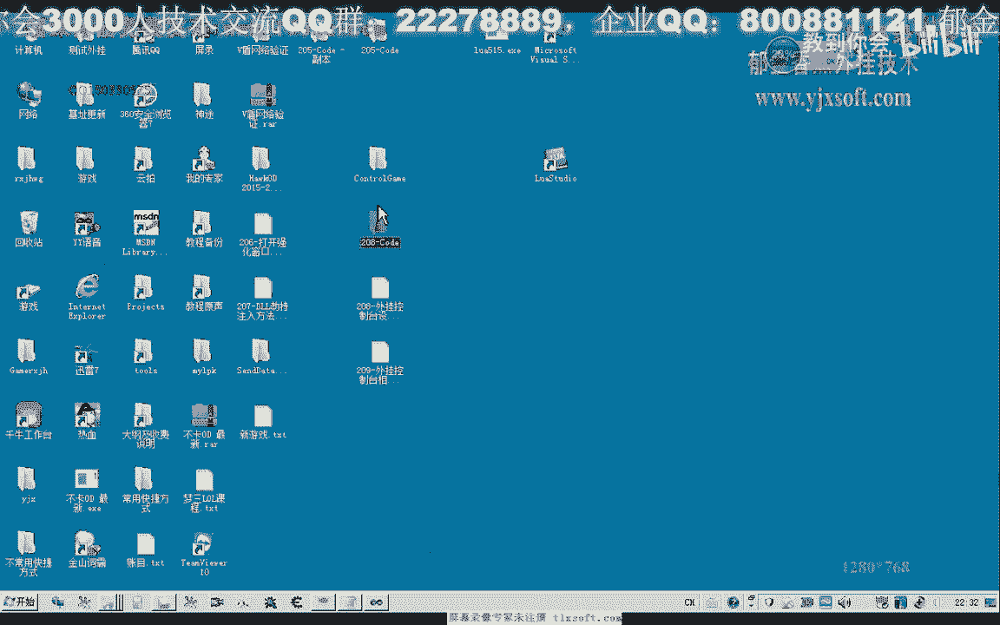

---

## 游戏进程端：接收与处理指令 🕹️

发送端完成后，我们需要在游戏进程内编写接收指令的代码。

游戏端需要安装一个窗口过程钩子来拦截 `WM_COPYDATA` 消息。以下是核心步骤：

1.  **保存原窗口过程**：获取并保存游戏窗口原有的消息处理函数地址。
2.  **安装新窗口过程**：用我们自定义的窗口过程函数替换原函数。
3.  **处理消息**：在新窗口过程中，检查是否为 `WM_COPYDATA` 消息，并进行处理。
4.  **传递其他消息**：对于非自定义消息，调用原窗口过程函数，确保游戏正常运行。

以下是自定义窗口过程函数的示例框架：
```cpp
// 自定义命令标识，需与控制台端 dwData 值匹配
#define MY_COMMAND_ID 1

// 原窗口过程指针
WNDPROC g_oldWndProc = NULL;

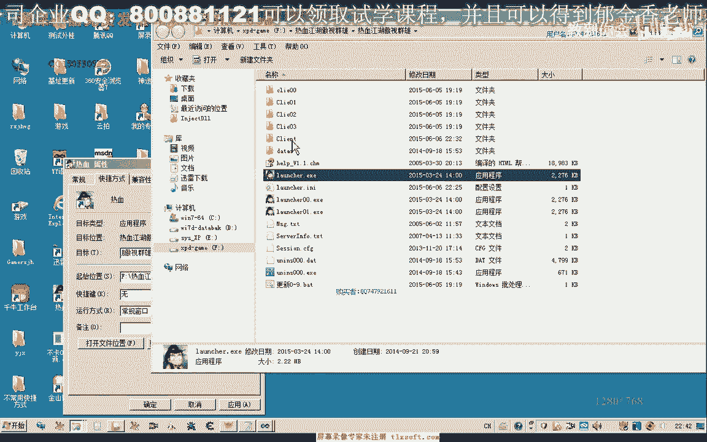

// 新的窗口过程函数
LRESULT CALLBACK NewGameWndProc(HWND hWnd, UINT uMsg, WPARAM wParam, LPARAM lParam) {
    if(uMsg == WM_COPYDATA) {
        PCOPYDATASTRUCT pCDS = (PCOPYDATASTRUCT)lParam;
        if(pCDS->dwData == MY_COMMAND_ID) {
            // 接收到我们自定义的命令
            char* command = (char*)pCDS->lpData;
            // 处理命令，例如打印或执行操作
            OutputDebugStringA(command);
            // 可以在这里添加挂机、执行脚本等逻辑
            return 0; // 已处理，直接返回
        }
    }
    // 其他消息交给原窗口过程处理
    return CallWindowProc(g_oldWndProc, hWnd, uMsg, wParam, lParam);
}

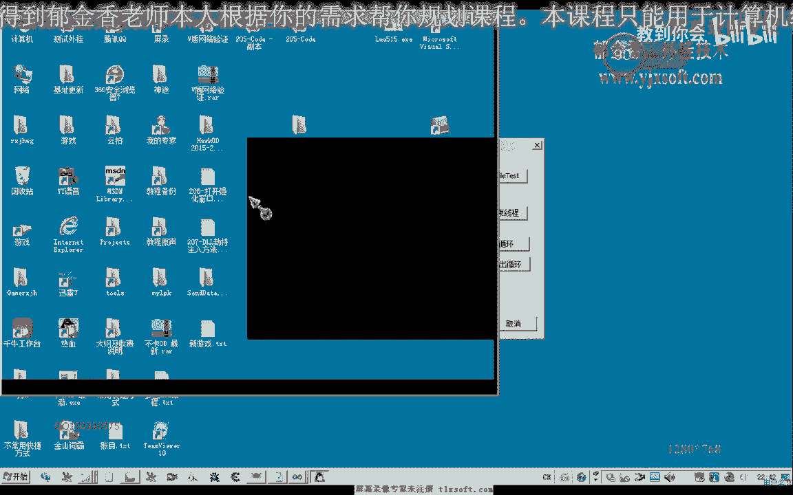

// 安装钩子的函数
void InstallHook(HWND hGameWnd) {
    if(hGameWnd && !g_oldWndProc) {
        g_oldWndProc = (WNDPROC)SetWindowLongPtr(hGameWnd, GWLP_WNDPROC, (LONG_PTR)NewGameWndProc);
    }
}

// 卸载钩子的函数（可选）
void UninstallHook(HWND hGameWnd) {
    if(hGameWnd && g_oldWndProc) {
        SetWindowLongPtr(hGameWnd, GWLP_WNDPROC, (LONG_PTR)g_oldWndProc);
        g_oldWndProc = NULL;
    }
}
```

**重要提示**：`SendMessage` 是同步调用。如果游戏端在处理 `WM_COPYDATA` 消息时发生阻塞（例如弹出一个模态对话框），控制台端的 `SendMessage` 调用也会被阻塞，直到游戏端处理完毕返回。因此，游戏端的消息处理逻辑应尽量高效。

---

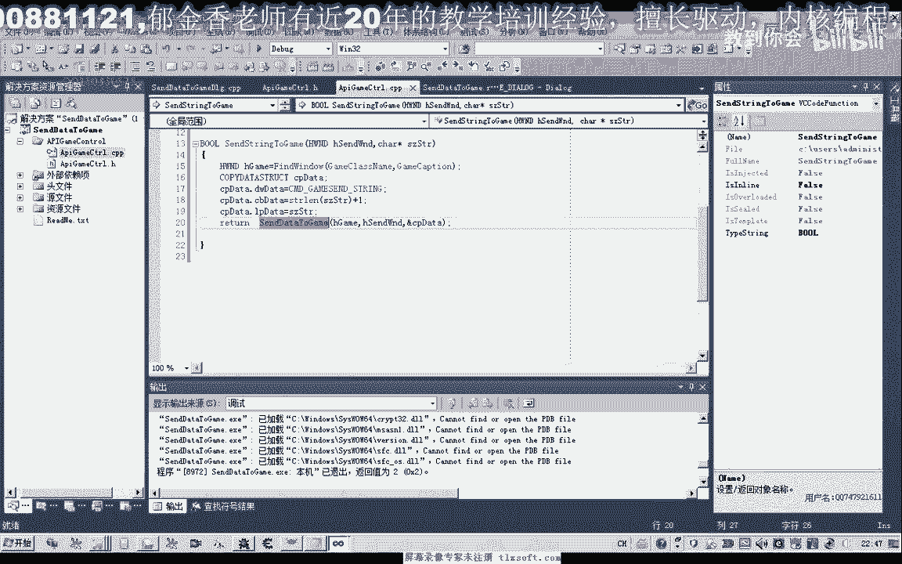

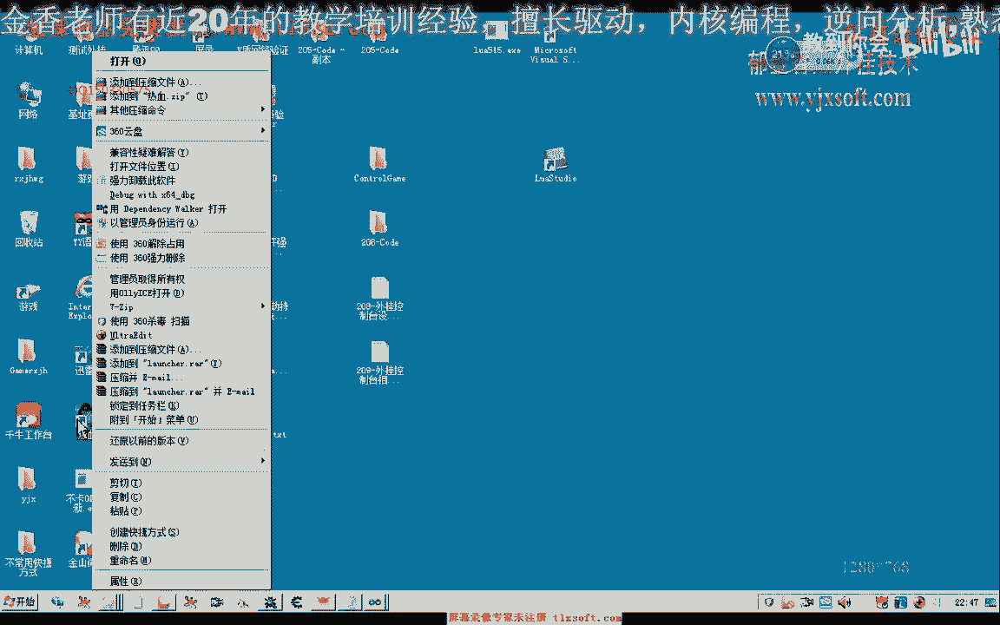


## 总结与下节预告 📚


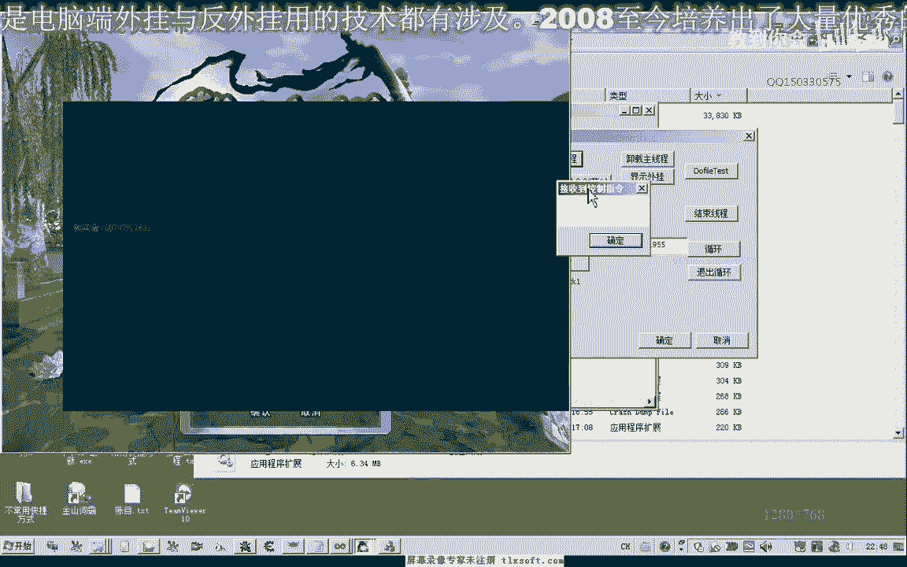

本节课中我们一起学习了游戏辅助控制台单向通信的基本原理与实现。

我们掌握了以下核心内容：
*   控制台通过**进程间通信**管理多个游戏窗口。
*   使用 **`SendMessage`** 与 **`WM_COPYDATA`** 消息实现进程间数据传递。
*   定义了 **`COPYDATASTRUCT`** 结构来封装命令和数据。
*   在游戏端通过**替换窗口过程**来拦截并处理自定义命令。
*   注意 `SendMessage` 的**同步特性**对程序响应的影响。

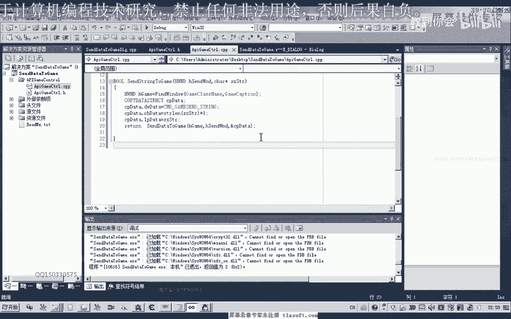

目前我们实现了从控制台到游戏进程的**单向指令发送**。在下一节课中，我们将探讨如何实现**双向通信**，即让游戏进程也能将数据（如角色血量、金币数量）回传给控制台进行显示，从而构建一个完整的交互式控制台系统。