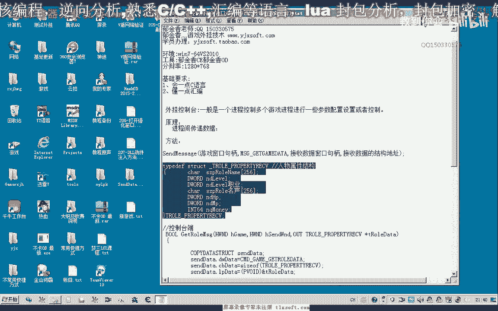
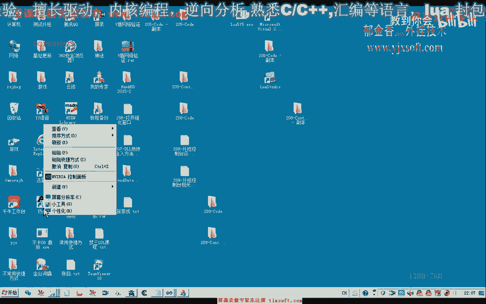
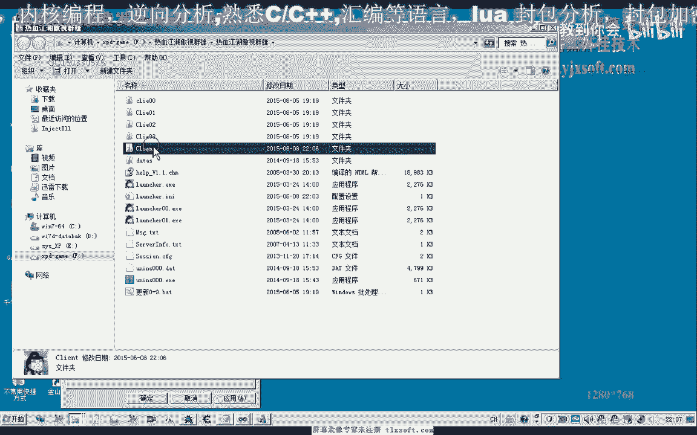
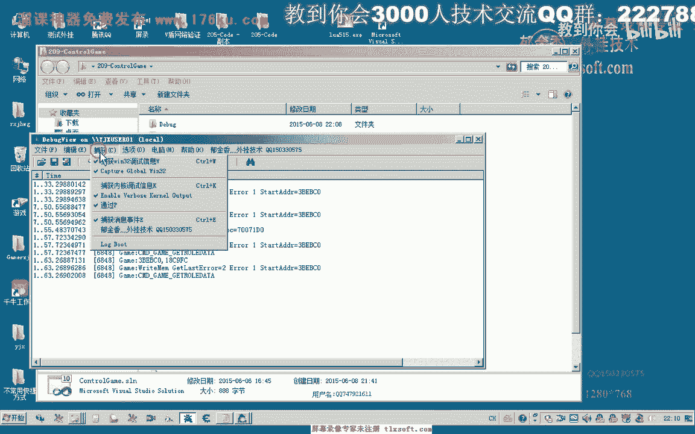
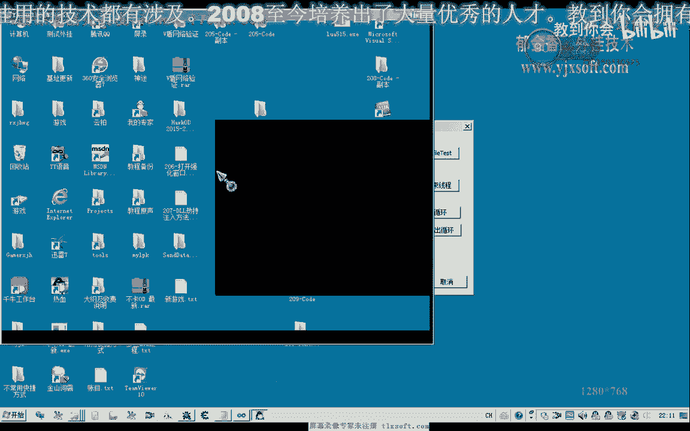
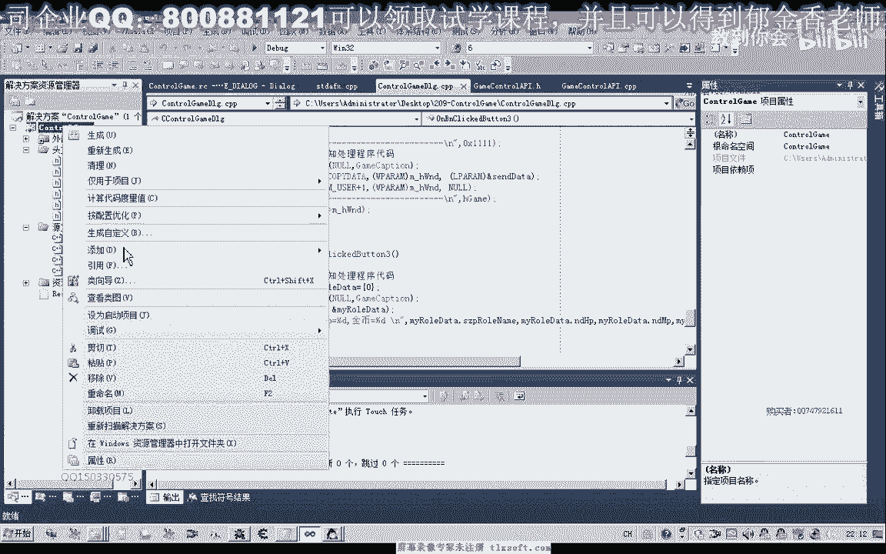
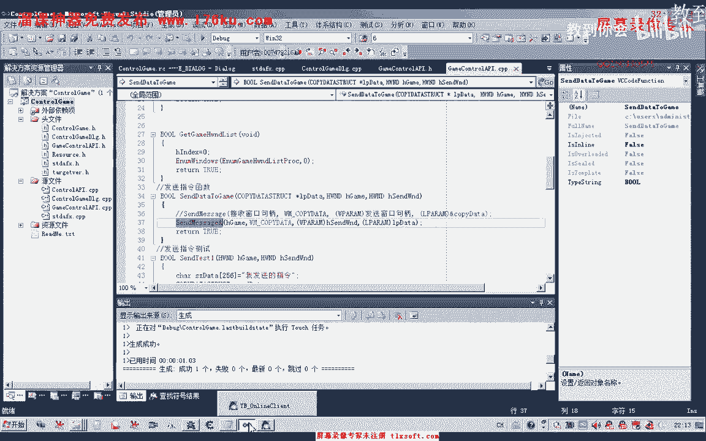
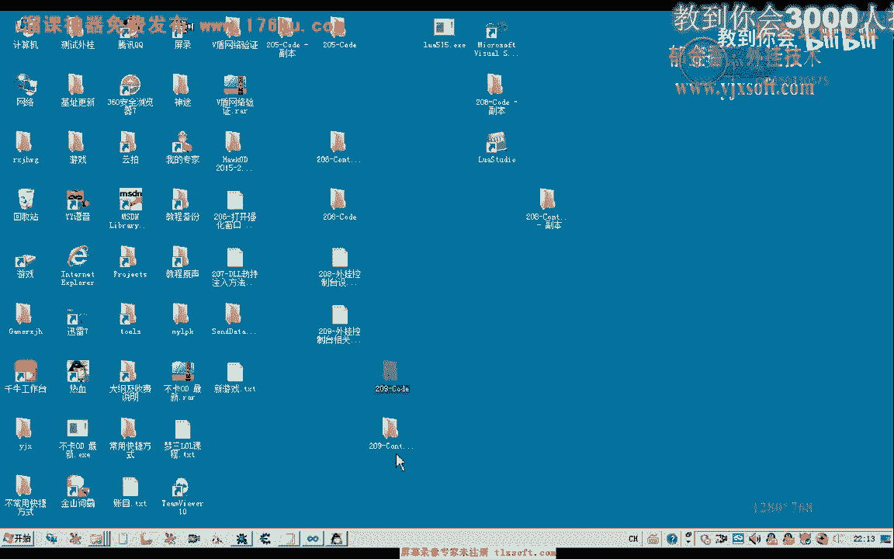
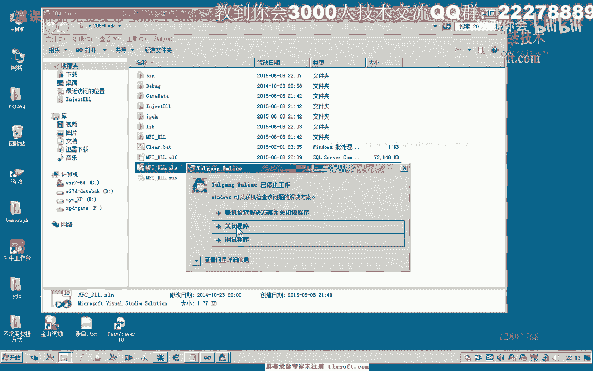

# 课程 P194：游戏与控制台双向通信接口设计 🎮🔄💻




在本节课中，我们将学习如何设计一个接口，实现游戏进程与控制台程序之间的双向通信。我们将通过发送消息的方式，从控制台向游戏进程发送指令，并获取游戏内的人物属性数据返回给控制台显示。


---


## 概述

上一节我们探讨了进程间通信的基本概念。本节中，我们来看看如何具体实现游戏进程与控制台之间的数据交换。核心思路是：控制台发送一个包含指令和内存地址的消息给游戏进程；游戏进程接收到消息后，根据指令读取游戏数据，并通过跨进程写入操作，将数据写回控制台指定的内存地址中。

## 通信流程设计

以下是实现双向通信的主要步骤：

1.  **定义通信数据结构**：首先需要定义一个结构体，用于在进程间传递人物属性信息。
2.  **控制台发送指令**：控制台程序构造指令消息，并通过 `SendMessage` 函数发送给游戏进程窗口。
3.  **游戏进程接收与处理**：注入到游戏进程的代码接收消息，解析指令，并执行读取游戏数据的操作。
4.  **数据回传**：游戏进程将读取到的数据，通过跨进程写入函数写回控制台进程的内存。
5.  **控制台显示数据**：控制台从自己的内存中读取并显示接收到的游戏数据。

## 核心代码实现

### 1. 定义数据结构

首先，我们定义一个结构体来存储要传递的人物属性信息。

```cpp
// 人物属性结构体
typedef struct _CHAR_INFO {
    char szName[32]; // 角色名
    DWORD dwHP;      // 生命值
    DWORD dwMP;      // 魔法值
    DWORD dwGold;    // 金币数
} CHAR_INFO, *PCHAR_INFO;
```

### 2. 控制台发送指令

在控制台程序中，我们使用 `SendMessage` 函数向游戏窗口发送一个自定义消息。消息中通过 `COPYDATASTRUCT` 结构传递指令类型和目标内存地址。

```cpp
// 自定义消息类型，需与游戏进程内定义一致
#define WM_GAME_COMMAND (WM_USER + 209)

// 指令类型枚举
typedef enum _CMD_TYPE {
    CMD_GET_CHAR_INFO = 1, // 获取角色信息
    // ... 可以定义其他指令
} CMD_TYPE;

// 发送获取角色信息指令的函数
void SendGetCharInfoCommand(HWND hGameWnd) {
    COPYDATASTRUCT cds = {0};
    CHAR_INFO CharInfo = {0}; // 本地结构体，用于接收回传的数据

    // 填充 COPYDATASTRUCT
    cds.dwData = CMD_GET_CHAR_INFO; // 指令类型
    cds.cbData = sizeof(PCHAR_INFO); // 传递的数据大小（这里是一个指针的大小）
    cds.lpData = &CharInfo; // 传递本地结构体的地址（指针）

    // 发送消息
    SendMessage(hGameWnd, WM_COPYDATA, (WPARAM)GetConsoleWindow(), (LPARAM)&cds);

    // 发送完成后，数据已被游戏进程写入 CharInfo 结构体
    // 可以在这里打印或处理获取到的数据
    printf("角色名: %s\n", CharInfo.szName);
    printf("生命值: %d\n", CharInfo.dwHP);
    printf("魔法值: %d\n", CharInfo.dwMP);
    printf("金币数: %d\n", CharInfo.dwGold);
}
```

**关键点**：`cds.lpData` 传递的是控制台进程中 `CharInfo` 变量的地址。游戏进程需要将这个地址视为目标地址，并将游戏数据写入这个地址。

### 3. 游戏进程接收与处理指令

注入到游戏进程的 DLL 中，需要拦截窗口消息，处理我们自定义的 `WM_COPYDATA` 消息。


```cpp
// 在游戏进程的消息处理循环中（例如钩子或窗口过程）
LRESULT CALLBACK GameWndProc(int nCode, WPARAM wParam, LPARAM lParam) {
    if (nCode == HC_ACTION) {
        CWPSTRUCT* pMsg = (CWPSTRUCT*)lParam;
        if (pMsg->message == WM_COPYDATA) {
            PCOPYDATASTRUCT pCDS = (PCOPYDATASTRUCT)(pMsg->lParam);
            
            // 判断指令类型
            switch (pCDS->dwData) {
                case CMD_GET_CHAR_INFO: {
                    // 1. 提取控制台传过来的目标地址
                    // pCDS->lpData 指向的是控制台进程中 CharInfo 结构体的地址
                    PCHAR_INFO pTargetCharInfo = *(PCHAR_INFO*)(pCDS->lpData);
                    
                    // 2. 获取游戏内真实的角色数据
                    CHAR_INFO LocalCharInfo = {0};
                    GetLocalCharacterInfo(&LocalCharInfo); // 假设这个函数能获取游戏数据
                    
                    // 3. 将游戏数据写入控制台进程的内存
                    HWND hConsoleWnd = (HWND)(pMsg->wParam); // 发送者窗口（控制台）
                    WriteProcessMemoryEx(hConsoleWnd, pTargetCharInfo, &LocalCharInfo, sizeof(CHAR_INFO));
                    
                    break;
                }
                // 处理其他指令...
            }
        }
    }
    // 调用原始的消息处理函数
    return CallNextHookEx(g_hHook, nCode, wParam, lParam);
}
```

### 4. 跨进程写入函数

游戏进程需要将数据写回控制台进程。这需要一个具有足够权限的跨进程写入函数。






```cpp
// 一个封装了跨进程写入和权限处理的函数
BOOL WriteProcessMemoryEx(HWND hTargetWnd, LPVOID lpBaseAddress, LPCVOID lpBuffer, SIZE_T nSize) {
    DWORD dwProcessId = 0;
    HANDLE hProcess = NULL;
    BOOL bResult = FALSE;
    
    // 1. 通过窗口句柄获取进程ID
    GetWindowThreadProcessId(hTargetWnd, &dwProcessId);
    if (dwProcessId == 0) return FALSE;
    
    // 2. 以足够的权限打开目标进程（控制台进程）
    hProcess = OpenProcess(PROCESS_VM_WRITE | PROCESS_VM_OPERATION, FALSE, dwProcessId);
    if (hProcess == NULL) {
        // 如果权限不足，可能需要调整进程令牌权限或关闭UAC虚拟化
        // 例如：在清单文件中设置 requestedExecutionLevel 为 requireAdministrator
        return FALSE;
    }
    
    // 3. 执行跨进程写入
    bResult = WriteProcessMemory(hProcess, lpBaseAddress, lpBuffer, nSize, NULL);
    
    // 4. 清理
    CloseHandle(hProcess);
    return bResult;
}
```


**注意**：在 Visual Studio 2010 及以后版本，如果遇到权限问题，可能需要修改项目属性，关闭 UAC 虚拟化，或在清单文件中请求管理员权限。




### 5. 控制台接收与显示

控制台在调用 `SendMessage` 后，该函数会阻塞，直到游戏进程处理完消息并返回。此时，数据已经通过 `WriteProcessMemoryEx` 写入了控制台本地 `CharInfo` 变量中。`SendGetCharInfoCommand` 函数中的打印语句即可输出结果。







## 流程总结与注意事项

本节课中我们一起学习了游戏与控制台双向通信的接口设计。整个流程可以概括为：**“发送指令-处理并回写-本地显示”**。





以下是几个关键注意事项：



*   **同步性**：`SendMessage` 是同步调用，控制台会等待游戏进程处理完毕。这确保了数据在打印前已被正确写入。
*   **地址传递**：控制台传递的是自身进程内变量的地址。游戏进程需要解析这个地址，并将其作为 `WriteProcessMemory` 的目标地址。
*   **进程权限**：游戏进程需要对控制台进程有写入内存的权限。务必处理好 `OpenProcess` 的权限问题。
*   **数据一致性**：确保两端定义的结构体完全一致，包括结构体大小和成员顺序。


通过这种方式，我们建立了一个简单的游戏外挂与控制台之间的通信桥梁，可以扩展用于传输各种游戏数据。