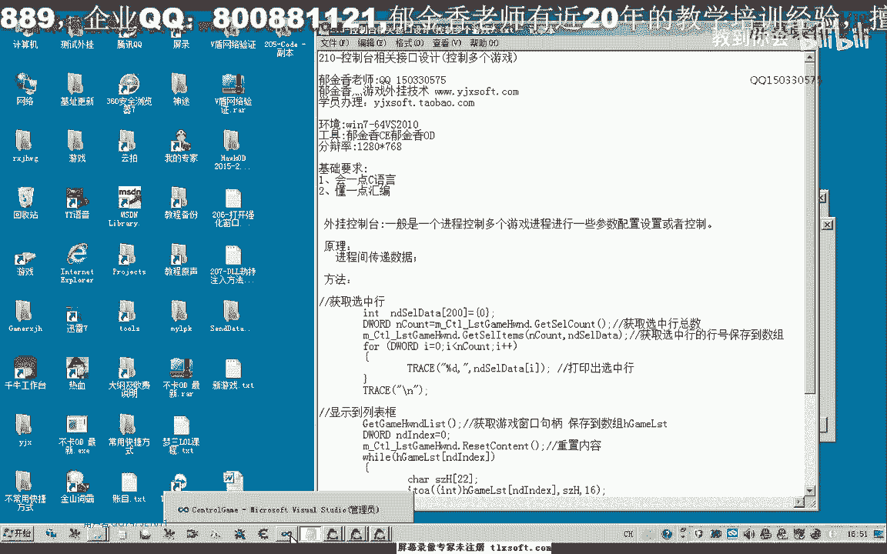
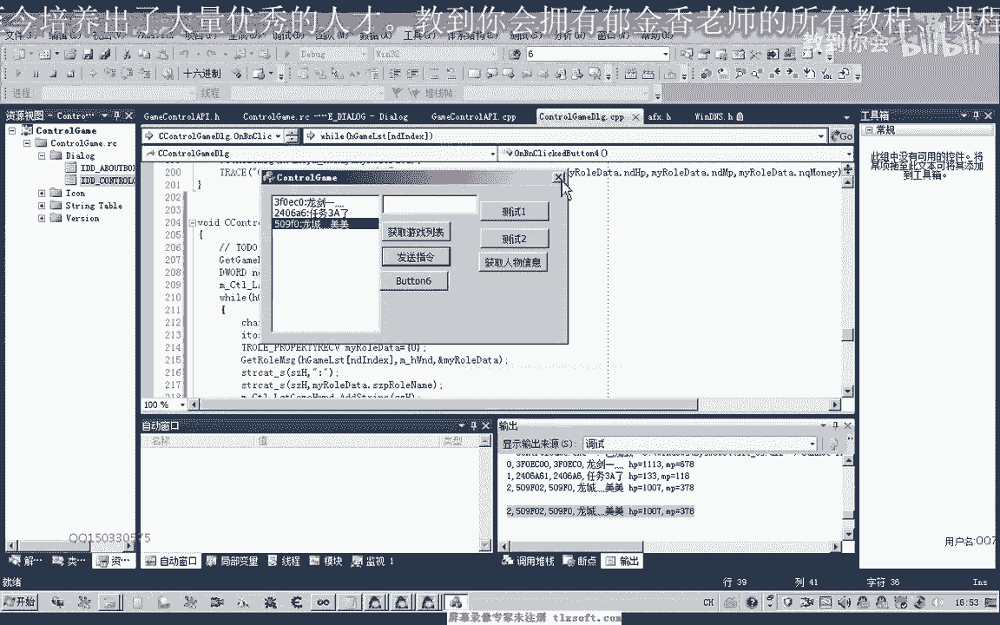
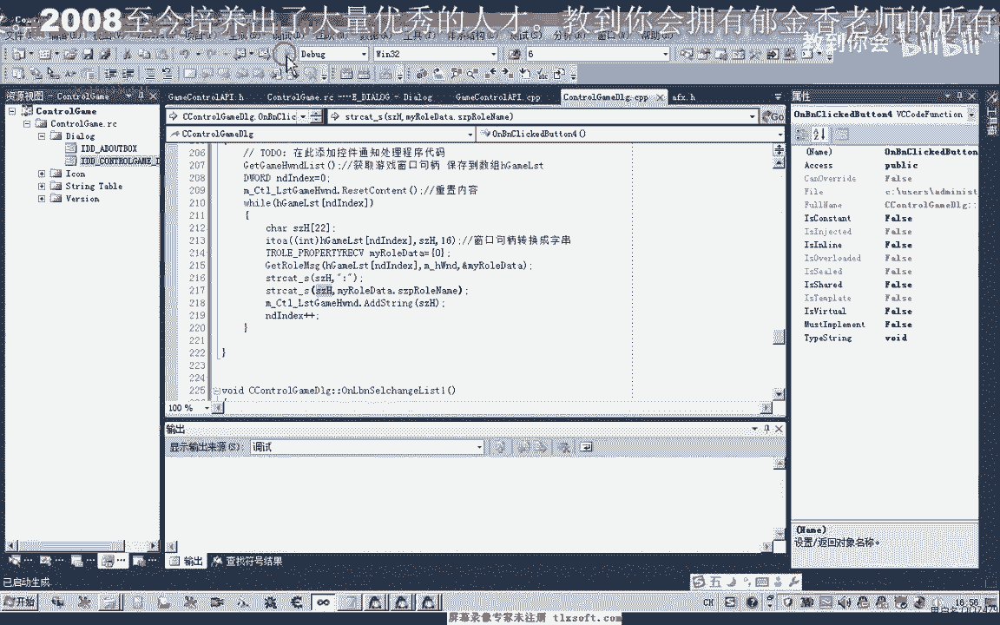
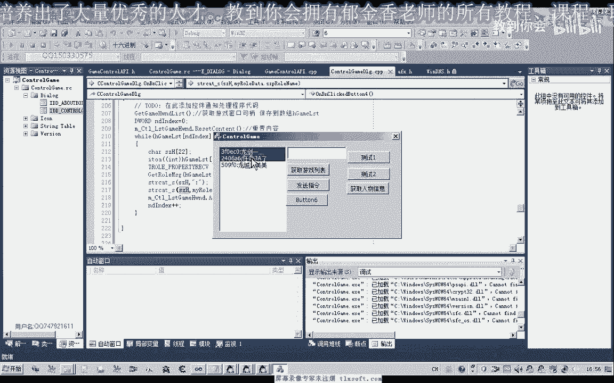
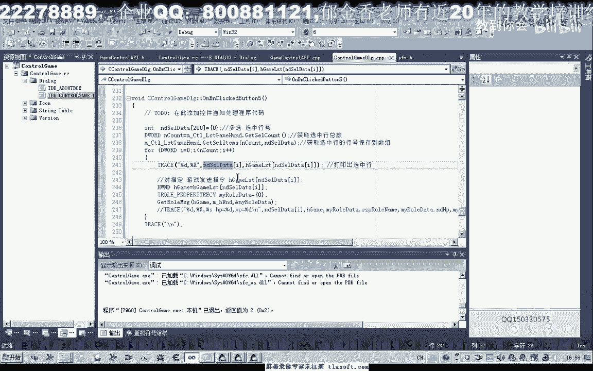
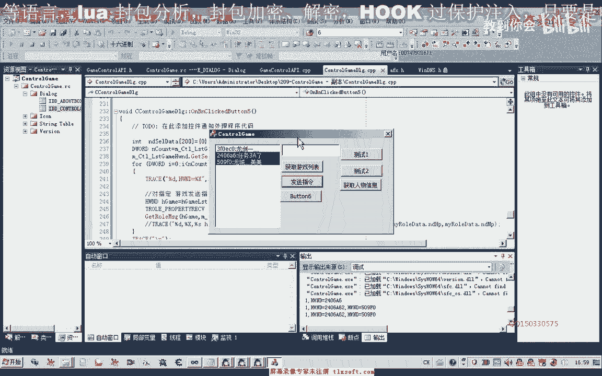
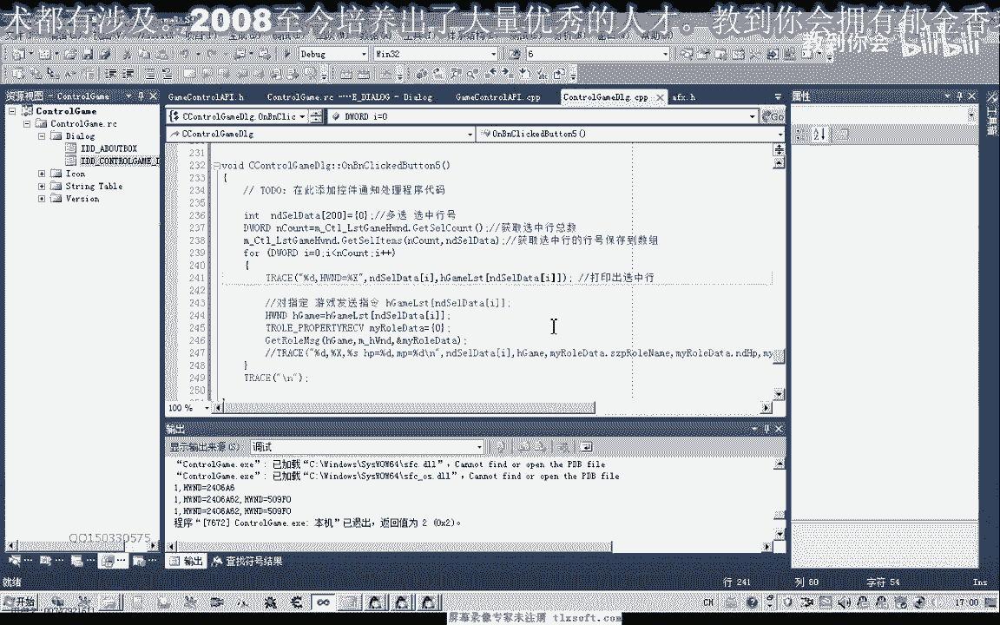
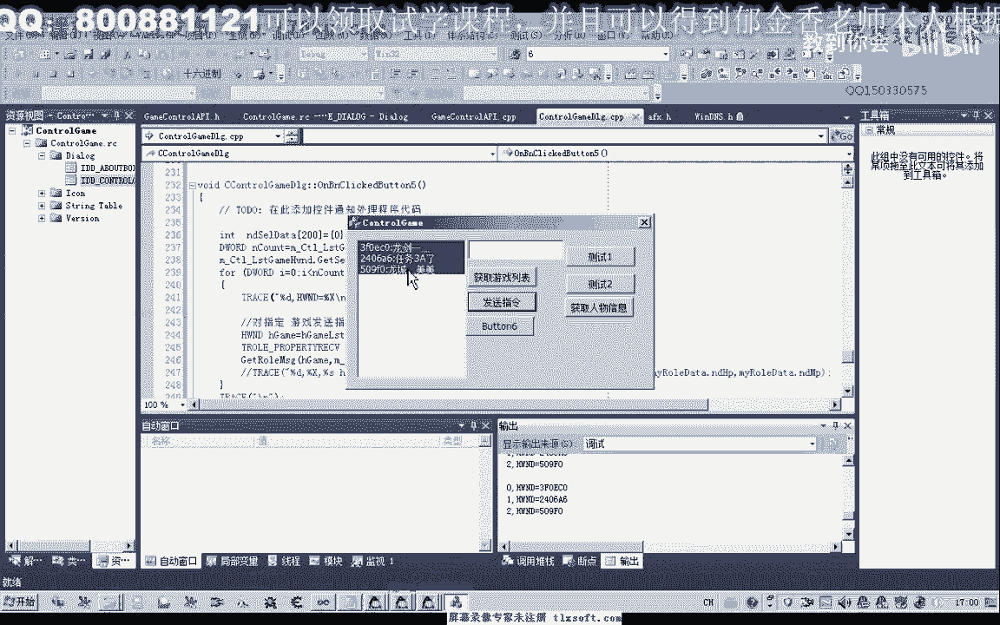
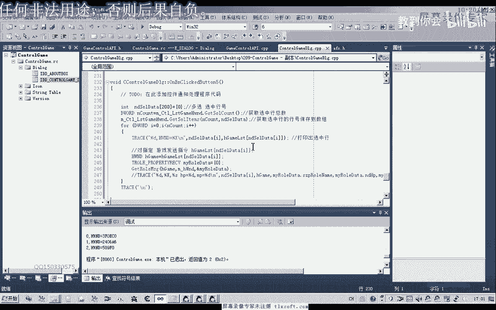

# 课程 P195：控制台控制多个游戏接口设计 🎮



在本节课中，我们将学习如何设计一个控制台程序，使其能够同时控制多个正在运行的游戏实例。我们将探讨如何获取游戏窗口列表、向特定游戏发送指令，并理解其背后的代码实现原理。

---

## 获取游戏列表 📋

上一节我们介绍了课程目标，本节中我们来看看如何获取当前正在运行的所有游戏窗口列表。



核心原理是使用Windows API函数 `EnumWindows` 来枚举所有顶层窗口，并通过回调函数进行筛选。

以下是实现获取游戏列表的关键步骤：

1.  编写一个函数，调用 `EnumWindows` 函数。
2.  在回调函数中，判断每个窗口的标题和类名，以识别出目标游戏窗口。
3.  将识别出的游戏窗口句柄存储在一个全局数组中。

这个全局数组建立了游戏窗口句柄与游戏实例之间的一一对应关系。获取句柄列表后，所有后续的指令操作都将基于这个容器中的内容进行。

```cpp
// 伪代码示例：枚举窗口并筛选
BOOL CALLBACK EnumWindowsProc(HWND hwnd, LPARAM lParam) {
    // 判断窗口标题和类名是否为我们的游戏
    if (IsTargetGameWindow(hwnd)) {
        // 将有效句柄存入全局数组
        g_gameHandles.push_back(hwnd);
    }
    return TRUE;
}

void GetGameList() {
    // 清空旧列表
    g_gameHandles.clear();
    // 开始枚举窗口
    EnumWindows(EnumWindowsProc, 0);
}
```

在初始化或需要刷新列表时（例如点击“刷新列表”按钮），会调用上述函数。它会遍历所有窗口，将有效的游戏窗口句柄更新到全局变量中。之后，程序会将这些句柄转换为字符串，并进一步获取每个游戏窗口内的人物信息（例如血量、名字），最终拼接成一个完整的字符串显示在控制台的列表控件中。

---

## 发送游戏指令 📨





上一节我们学习了如何获取游戏列表，本节中我们来看看如何向选中的游戏发送控制指令。

发送指令的核心，在于利用之前获取到的游戏窗口句柄，对选中的特定窗口进行操作。

以下是向选中游戏发送指令的实现过程：

1.  将控制台列表控件设置为支持多选模式。
2.  获取用户选中的行下标，这些下标会保存在一个整型列表中。
3.  遍历这个下标列表，根据下标从全局游戏句柄数组中取得对应的窗口句柄。
4.  向每一个获取到的窗口句柄发送预设的指令（例如，获取角色信息、执行挂机脚本等）。



```cpp
// 伪代码示例：向选中游戏发送指令
void SendCommandToSelectedGames() {
    // 获取列表控件中所有选中项的下标
    CArray<int, int> selectedIndices;
    m_listCtrl.GetSelectedItems(selectedIndices);

    // 遍历所有选中的下标
    for (int i = 0; i < selectedIndices.GetCount(); ++i) {
        int idx = selectedIndices[i];
        // 通过下标从全局句柄数组获取对应的窗口句柄
        HWND hGame = g_gameHandles[idx];
        if (IsWindow(hGame)) { // 确保窗口仍然有效
            // 向该窗口发送指令
            SendCustomCommand(hGame, COMMAND_GET_INFO);
        }
    }
}
```

通过这种方式，我们可以实现精准控制。例如，当在列表中只选中第三个游戏时，指令将只发送给第三个游戏窗口，并获取其角色信息。这为同时管理多个游戏实例（如多开挂机、批量操作）提供了基础。



---



## 总结与回顾 📝

本节课中我们一起学习了控制台程序控制多个游戏的核心设计。



我们首先介绍了如何利用 `EnumWindows` API 枚举并筛选出所有目标游戏窗口，将它们的句柄存储在全局数组中，形成控制的基础。接着，我们探讨了如何通过列表控件的多选功能，获取用户选择，并向选中的特定游戏窗口发送自定义指令，从而实现分控或群控。

整个原理围绕 **窗口句柄** 这一核心概念展开。通过维护一个实时的、有效的窗口句柄列表，并将列表与UI控件绑定，我们能够构建一个灵活的多游戏控制台。为了保持列表的准确性，在游戏窗口关闭后，需要重新调用刷新函数来更新全局数据。



通过本课的学习，你应该掌握了设计此类多实例控制接口的基本思路和关键实现步骤。