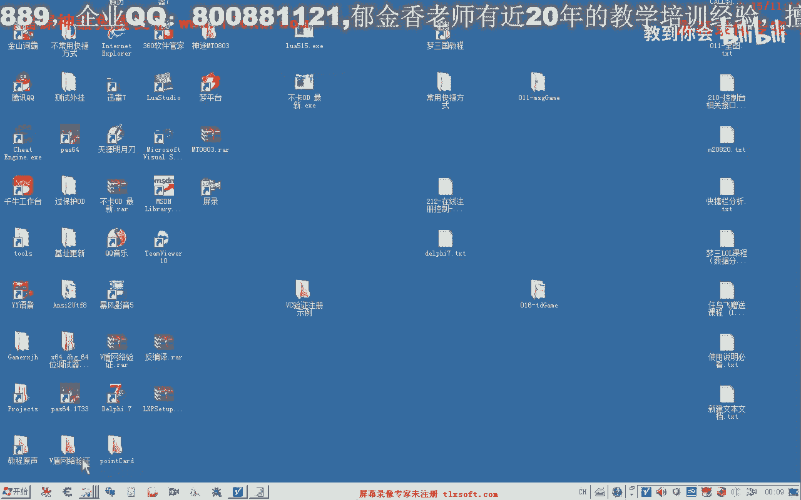
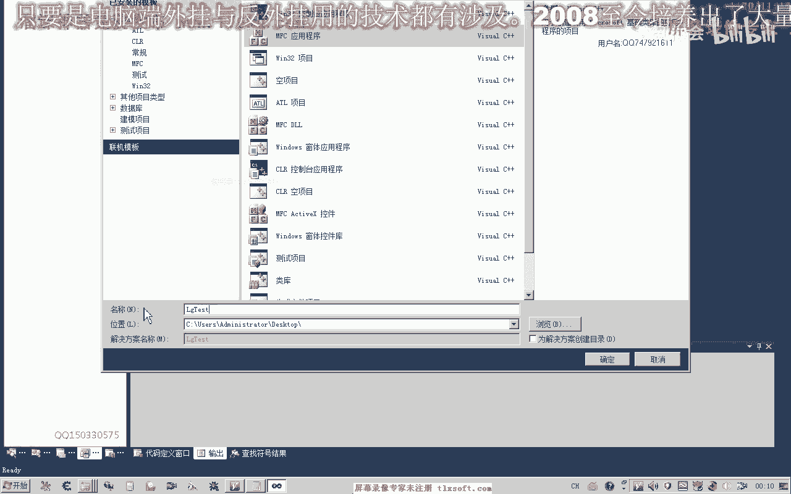
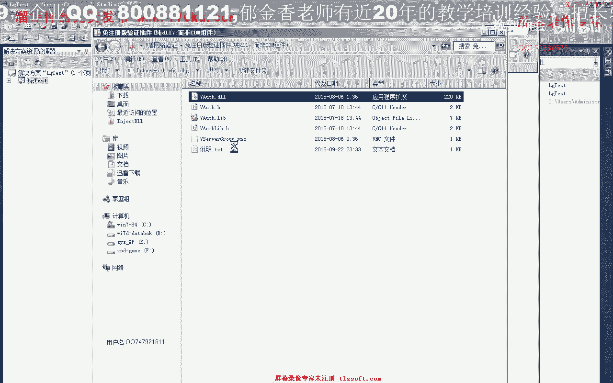
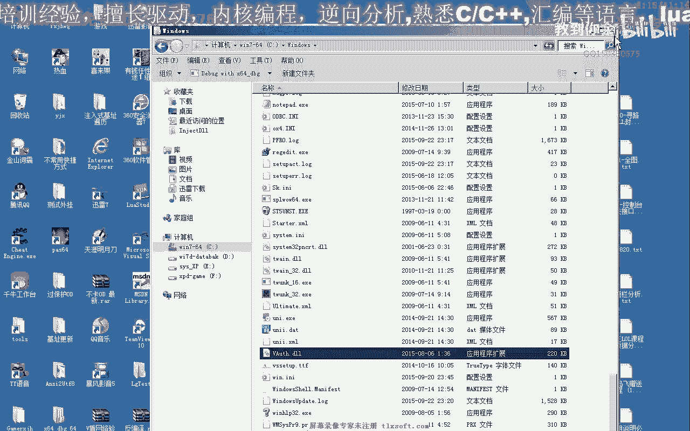

# 课程 P196：212 - 在线注册控制实例教程 🔐




在本节课中，我们将学习如何编写代码，实现一个基于动态链接库的登录验证功能。我们将从创建工程开始，逐步完成环境配置、初始化、用户验证等步骤。

---

上一节我们了解了静态库版本的基本编译。本节中，我们来看看如何使用纯动态链接库版本实现登录验证。


首先，我们需要创建一个新的工程用于测试。




创建一个新的MFC应用程序工程。在应用程序类型中，选择“基于对话框”。在“高级功能”中，确保勾选“使用Unicode库”。


接下来，在对话框资源编辑器中，添加一个静态文本控件用于显示信息，再添加一个按钮控件用于触发登录操作。

以下是界面设计完成后需要进行的步骤：

1.  保存工程。
2.  打开源代码目录。
3.  将动态链接库文件（.dll）、对应的导入库文件（.lib）以及头文件（.h）复制到该目录下。

工程配置完成后，我们需要在代码中引用这些文件。在解决方案资源管理器中，右键点击项目，选择“属性”。在“链接器”->“输入”->“附加依赖项”中，添加导入库文件（.lib）的名称。




同时，需要将动态链接库文件（.dll）复制到Windows系统目录下，或者应用程序的输出目录（即.exe文件所在目录）中。




接着，我们就可以开始编写核心代码了。首先，在对话框类的头文件中包含我们复制过来的头文件。

```cpp
#include “YourAuthLibrary.h”
```

然后，在对话框的初始化函数（如 `OnInitDialog`）中，进行认证组件的初始化。

```cpp
// 全局标识符，用于后续操作
HANDLE g_hAuth = NULL;

BOOL CYourDlg::OnInitDialog()
{
    CDialogEx::OnInitDialog();

    // 初始化认证组件
    g_hAuth = Auth_Init(“YourProductID”);
    if (g_hAuth == (HANDLE)(-1))
    {
        MessageBox(_T(“连接认证服务器失败！”), _T(“错误”), MB_ICONERROR);
        EndDialog(IDCANCEL); // 初始化失败，退出程序
        return FALSE;
    }
    else if (g_hAuth != NULL)
    {
        // 初始化成功，可以继续
        SetDlgItemText(IDC_STATIC_INFO, _T(“服务器连接成功！”));
    }

    return TRUE;
}
```

代码解析：
*   `Auth_Init` 是初始化函数，传入产品编号。
*   它返回一个句柄 `g_hAuth`，后续操作都依赖此句柄。
*   如果返回 `(HANDLE)(-1)`，表示连接服务器失败。
*   如果返回非 `NULL` 且非 `-1` 的值（通常是0），表示初始化成功。

运行程序，如果看到“服务器连接成功”的提示，说明动态库加载和初始化步骤正确。如果失败，请检查.dll文件是否已放入正确目录。

上一节我们完成了组件初始化。本节中，我们来实现具体的登录验证逻辑。

为“登录”按钮添加事件处理程序。在按钮点击事件中，调用验证函数。

```cpp
void CYourDlg::OnBnClickedButtonLogin()
{
    CString strUsername, strPassword;
    // 假设IDC_EDIT_USER和IDC_EDIT_PWD是输入用户名和密码的编辑框
    GetDlgItemText(IDC_EDIT_USER, strUsername);
    GetDlgItemText(IDC_EDIT_PWD, strPassword);

    // 调用验证函数
    int nResult = Auth_Check(g_hAuth, strUsername, strPassword);
    
    CString strMsg;
    switch (nResult)
    {
    case 0:
        strMsg = _T(“登录验证成功！”);
        break;
    case -1:
        strMsg = _T(“错误：注册码不存在或密码错误。”);
        break;
    case -2:
        strMsg = _T(“错误：账号已被禁用。”);
        break;
    case -3:
        strMsg = _T(“错误：绑定机器数量超限。”);
        break;
    case -5:
        strMsg = _T(“错误：注册码已过期。”);
        break;
    case -6:
        strMsg = _T(“错误：余额不足（天数用完）。”);
        break;
    default:
        strMsg.Format(_T(“未知错误，代码：%d”), nResult);
        break;
    }

    SetDlgItemText(IDC_STATIC_INFO, strMsg);
}
```

代码解析：
*   `Auth_Check` 是验证函数，传入初始化句柄、用户名和密码。
*   函数返回一个整数代码，表示验证结果。
*   **返回 `0` 表示验证成功**。
*   其他负数值代表不同的错误情况，如账号不存在、被禁用、过期或余额不足等。

测试时需要注意，验证所用的用户名和密码需要在服务端（用户管理界面）预先创建并设置有效天数。

以下是测试不同情况的预期结果：

*   **用户名或密码错误**：返回 `-1`，提示“注册码不存在或密码错误”。
*   **账号未充值（天数为0）**：返回 `-6`，提示“余额不足”。
*   **账号有效且信息正确**：返回 `0`，提示“登录验证成功！”。

除了登录验证，该动态库通常还提供其他功能接口，例如：
*   `Auth_Logout`：用户注销。
*   `Auth_GetRemainDays`：查询剩余天数。
*   `Auth_KickUser`：踢出在线用户。

这些功能我们将在后续课程中继续探讨。

---


本节课中我们一起学习了如何集成一个在线的注册控制模块。我们完成了从创建工程、配置环境、初始化认证组件到实现用户名密码验证的完整流程。核心在于理解初始化函数 `Auth_Init` 和验证函数 `Auth_Check` 的用法及其返回值含义。通过本实例，你可以掌握为软件添加基础在线授权验证功能的方法。