# 课程 P198：在线注册控制 - 连接检测、有效检测、修改密码、解绑与释放 🔌

在本节课中，我们将学习微正平台提供的几个核心API接口函数。这些函数主要用于管理用户与服务器的连接状态、验证有效性、修改密码、解绑设备以及在程序退出时进行资源释放。

上一节我们介绍了在线注册的基本框架，本节中我们来看看如何具体使用这些控制函数。

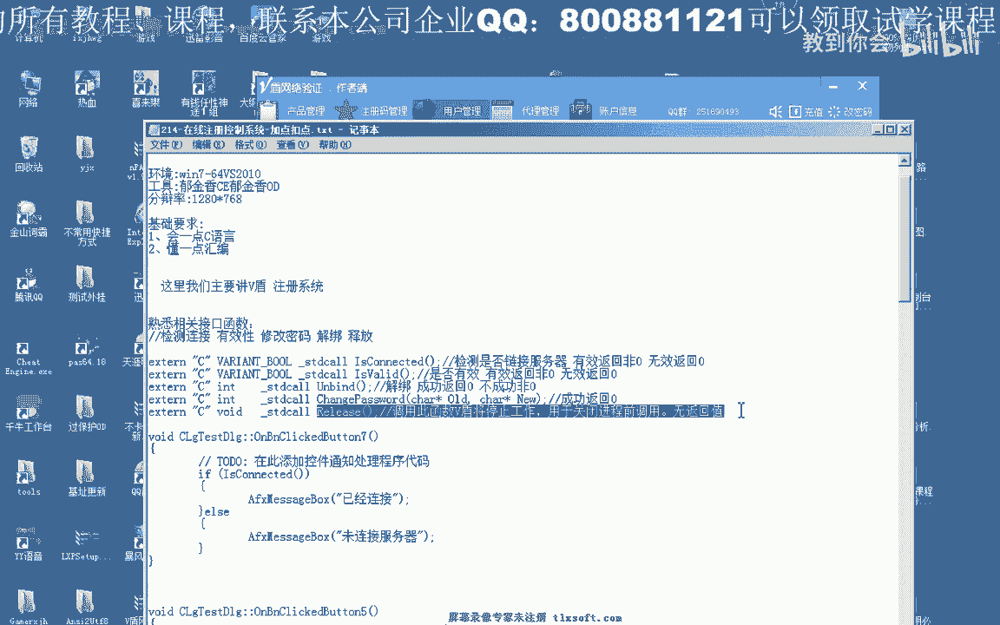

## 1. 连接检测函数


第一个函数用于检测客户端是否与微正服务器建立了有效连接。


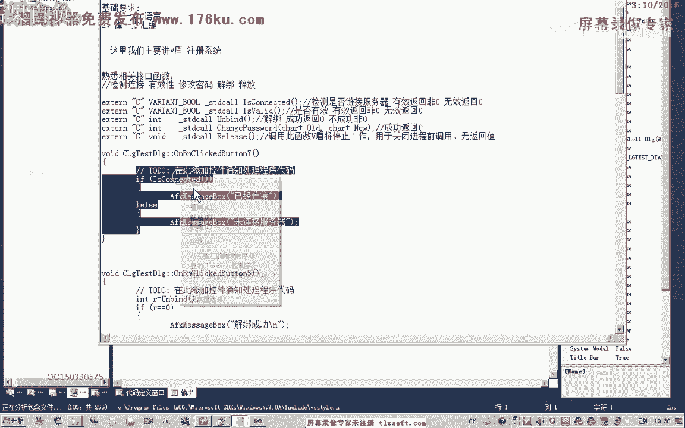

以下是该函数的使用要点：
*   函数会返回一个整数值。
*   如果已成功连接到服务器，则返回一个**非零**的**真值**。
*   如果未连接到服务器，则返回数字 **0**。

因此，在代码中可以直接使用条件语句（如 `if`）来判断返回值。

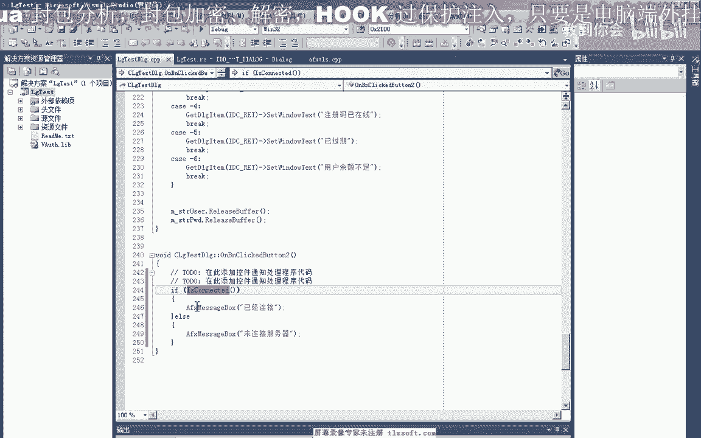

```cpp
// 假设函数名为 CheckConnection
int connStatus = CheckConnection();
if (connStatus) {
    // 已连接
} else {
    // 未连接
}
```


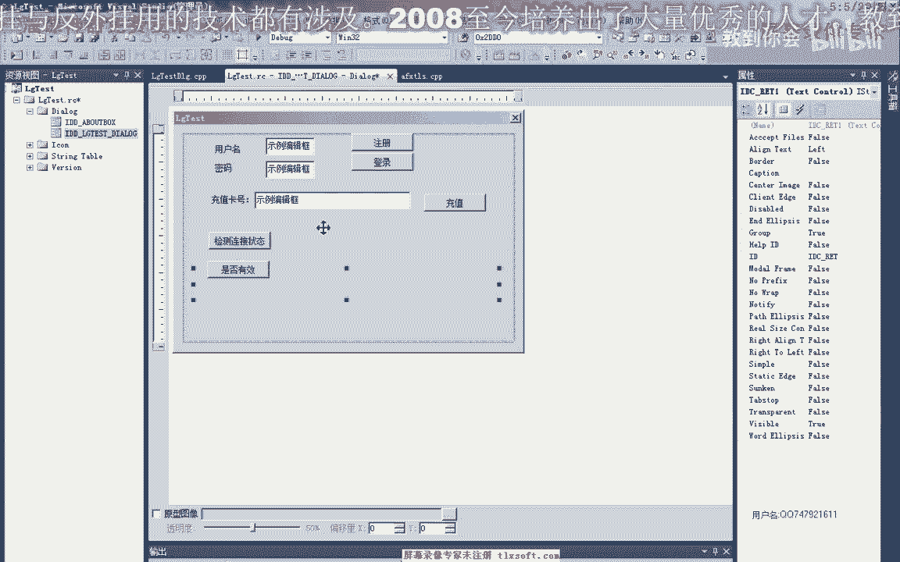

通常，在程序初始化成功后，只要网络正常，调用此函数都会返回真值，除非后续网络断开。

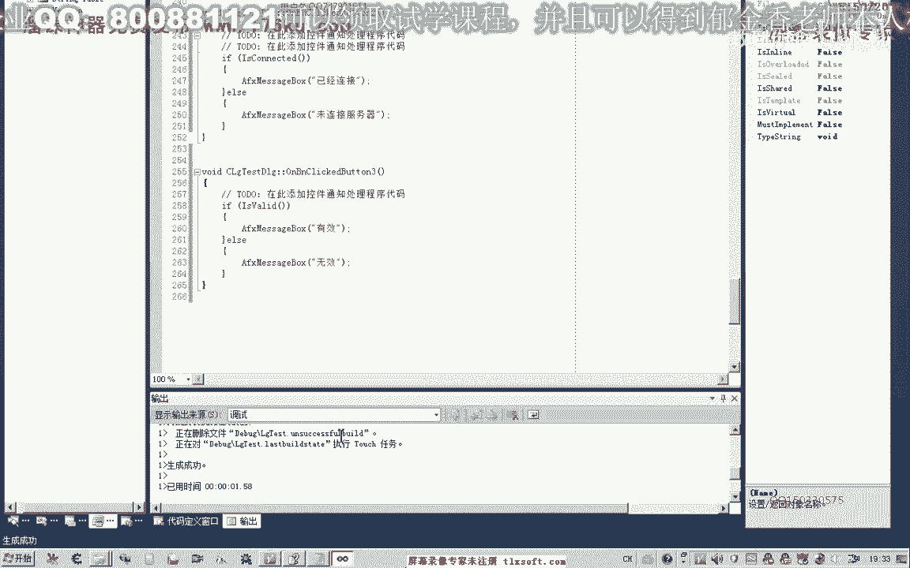

## 2. 有效检测函数


第二个函数用于检测当前用户的登录状态是否有效，即用户名和密码是否通过了验证。

以下是该函数的使用要点：
*   如果用户验证成功（即登录有效），函数返回一个**非零**的**真值**。
*   如果验证失败或登录无效，函数返回数字 **0**。

```cpp
// 假设函数名为 CheckValidation
int validStatus = CheckValidation();
if (validStatus) {
    // 用户登录有效
} else {
    // 用户登录无效或未登录
}
```


此函数需要在用户执行登录操作后调用，才能准确反映验证状态。

## 3. 解绑函数

第三个函数用于解绑当前设备。此功能仅在创建用户时设置了“绑定机器”属性（例如，限定只能绑定一台电脑）时才有效。

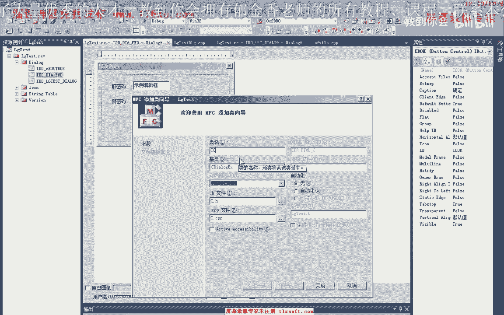


以下是该函数的使用要点：
*   调用此函数需要用户处于**有效的登录状态**。
*   函数返回值为 **0** 表示解绑成功，其他值表示失败。
*   解绑成功后，该账号就可以在其他电脑上登录使用。

```cpp
// 假设函数名为 UnbindDevice
int unbindResult = UnbindDevice();
if (unbindResult == 0) {
    // 解绑成功
} else {
    // 解绑失败
}
```

如果账号未解绑就在新设备上登录，原设备上的登录会被强制下线或无法在新设备登录。

## 4. 修改密码函数


第四个函数用于修改当前登录用户的密码，这是一个常用功能。

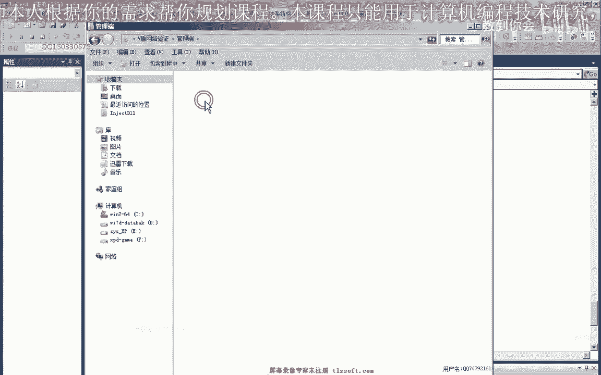


以下是该函数的使用要点：
*   调用此函数需要用户处于**有效的登录状态**。
*   函数需要两个参数：旧密码和新密码。
*   修改成功后，新密码会更新到服务器，但客户端可能需要重启或重新登录才能同步新密码数据。


在具体实现时，通常会弹出一个独立的密码修改窗口，包含两个输入框（旧密码、新密码）和确认按钮。


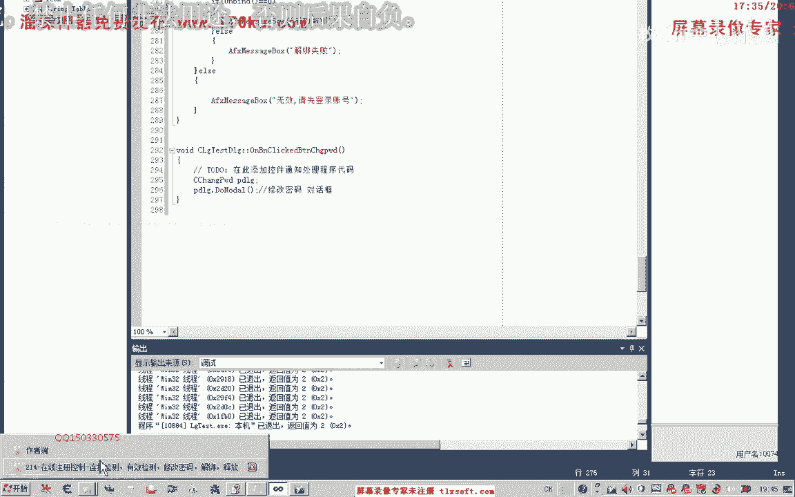

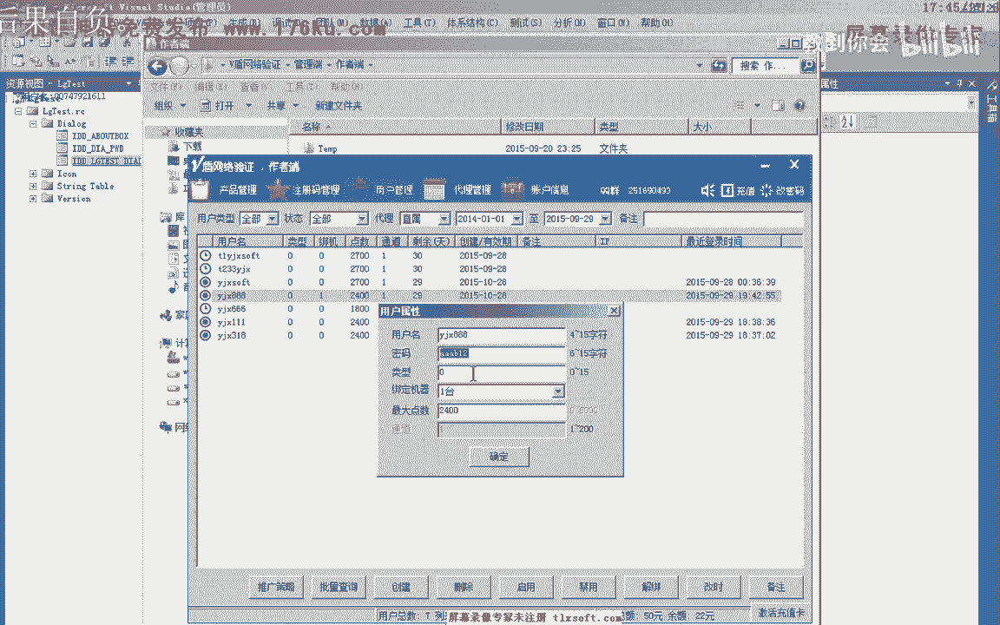

```cpp
// 假设函数名为 ChangePassword
int changeResult = ChangePassword(oldPassword, newPassword);
if (changeResult == 0) {
    // 密码修改成功
} else {
    // 密码修改失败
}
```

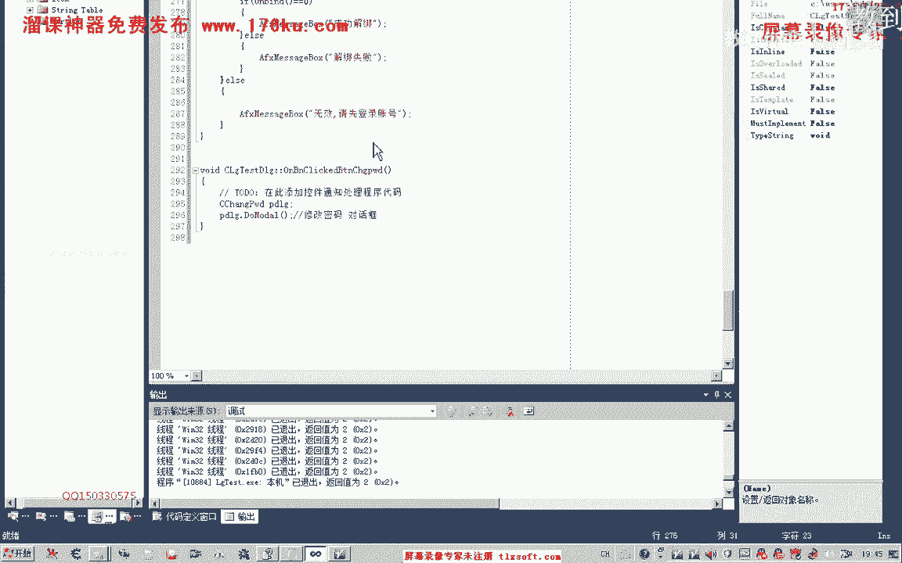

## 5. 释放函数

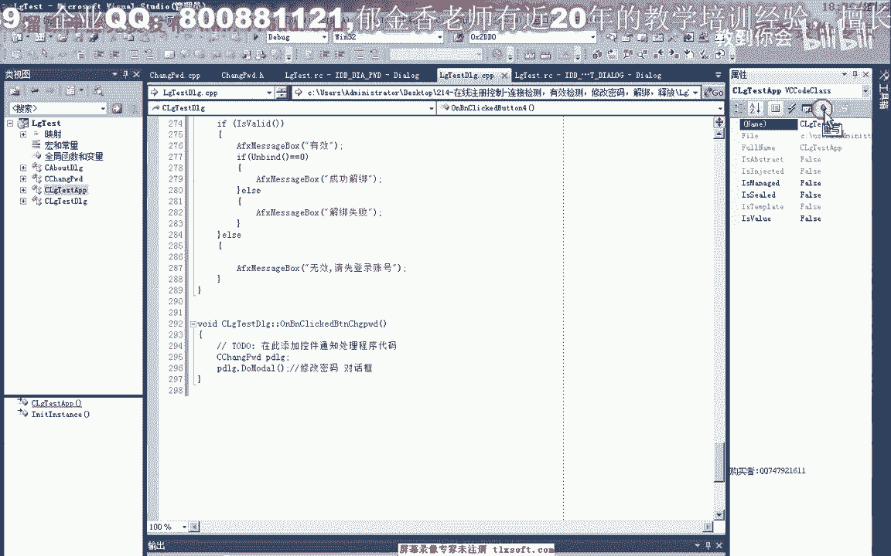

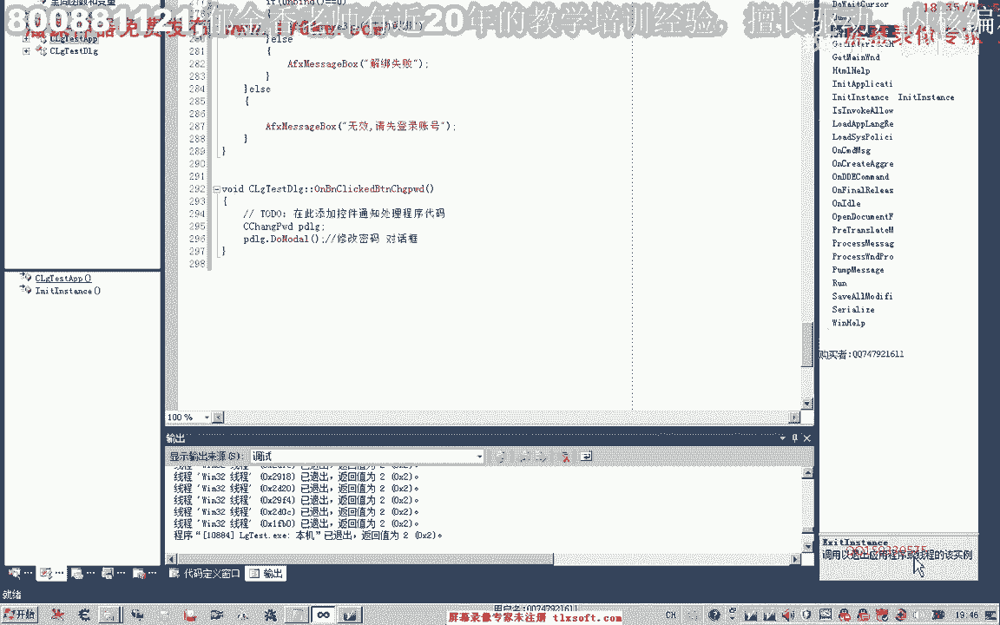

最后一个函数用于在程序退出时进行清理工作，例如停止微正服务、释放动态链接库资源等。

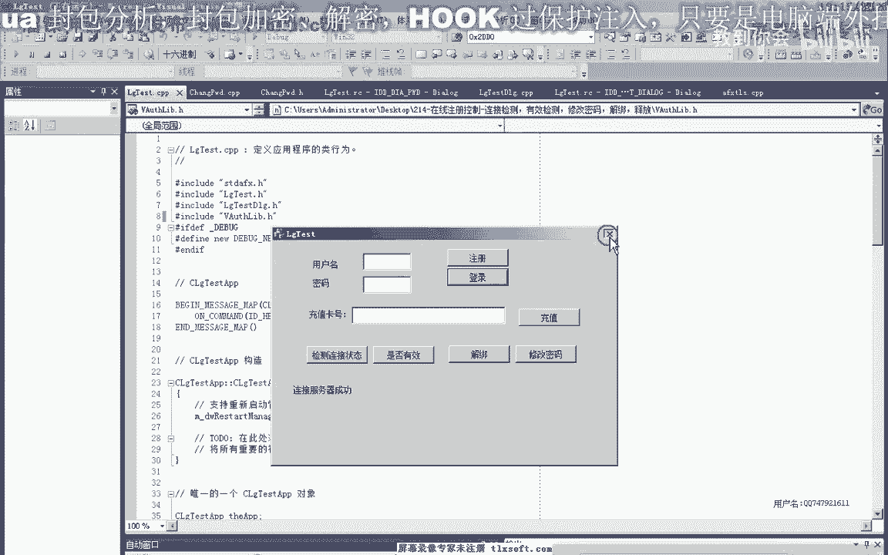

以下是该函数的使用要点：
*   通常在关闭游戏进程或退出应用程序前调用。
*   建议在应用程序类（如 `CWinApp`）的重写退出函数（如 `ExitInstance`）中添加此调用，以确保资源被正确释放。

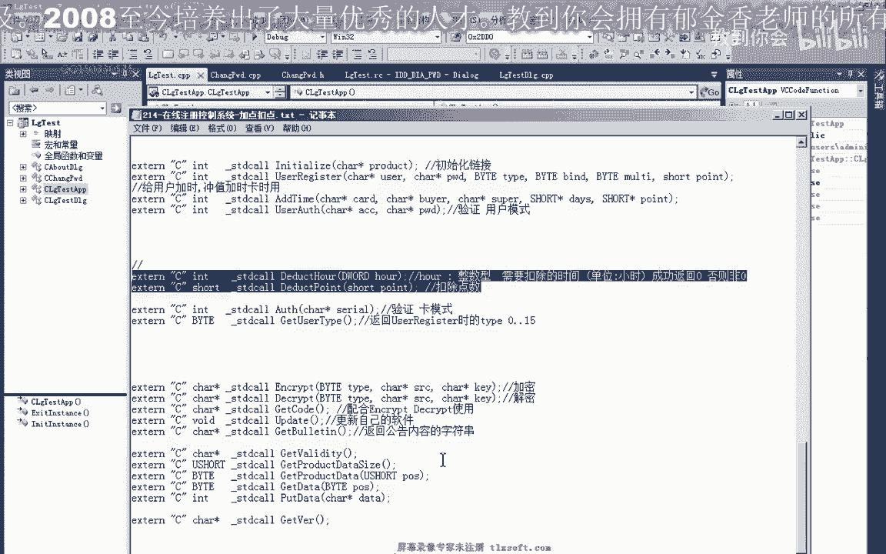

```cpp
// 假设函数名为 Cleanup
// 在程序退出函数中调用
int Cleanup();
```


本节课中我们一起学习了微正在线注册控制的五个关键API函数：连接检测、有效检测、解绑设备、修改密码和资源释放。理解并正确使用这些函数，是构建稳定、可控的软件授权系统的关键。在后续课程中，我们将探讨其他如扣除点数、时间等更高级的接口函数。