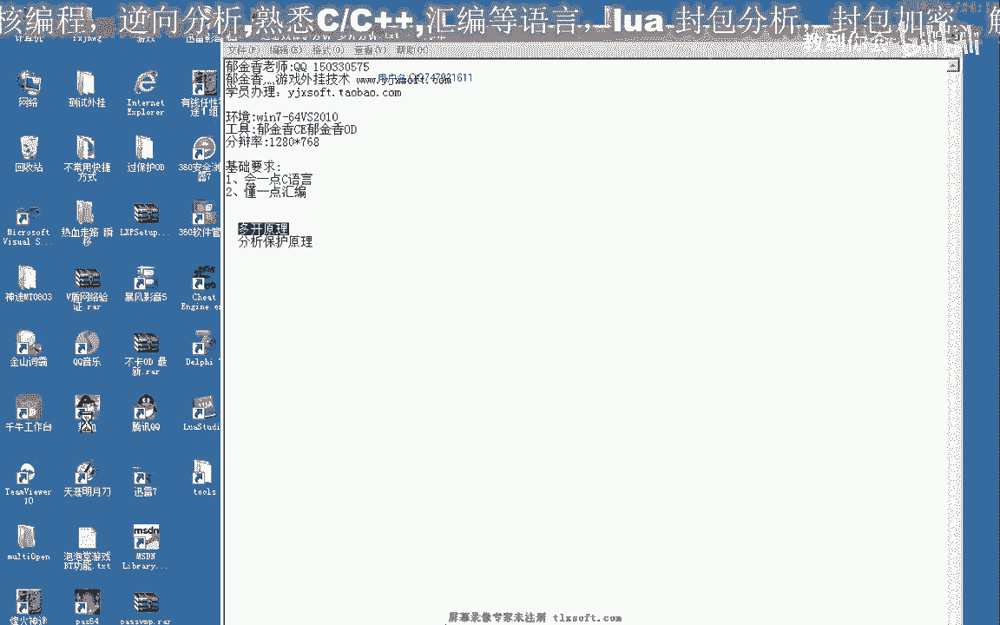

# P199：216-过游戏保护分析-多开分析_old - 教到你会 - BV1DS4y1n7qF

大家好。

那么这一节课我们继续来分析一下，热血江湖系统多开，那么之前我们也有分析多开，那么之前我们多开实现的方法是把整个，客户端的目录进行修改，把整个客户端的目录，还有我们另外修改了我们的登录器的相关代码。

那么这样来实现的话是非常的麻烦的，那么这一节课我们分析另外的一种方法，那么首先热血江湖这里面有一个动态链接库。

叫YTP，明白了，动态链接库，那么我们来看一下，用这个电话档，这边看一下，那么它的密码保护以及我们其他的一些防止，游戏多开的保护的话，都是通过动态链接库来实现的，那么在里边我们也能够看到相应的这些。

函数保护的初始化，不开始保护停止，那么这个稳稳的简历，相应的可能是我们的输入密码简历的一些，那么我们先把这几个关键的函数，先把它名字记录下来，然后我们进去看一下这几个保护的函数的原理。

那么我们现在看到的这个函数，是我们的函数，那么我们现在看到的这个函数，是我们的函数，那么我们现在看到的这个函数，是我们的函数，那么我们现在看到的这个函数，是我们的函数，那么我们现在看到的这个函数。

是我们的函数，那么我们现在看到的这个函数，是我们的函数，那么我们现在看到的这个函数，是我们的函数，那么首先我们看一下初始化，初始化这里是一个循环，那么里面是什么，初始化可能是初始化了一些变量。

但是从这里边的话，我们看不到关键的东西，可能我们去加密子，真的从里面来看的话，还有解密子，那么我们看开始保护的时候，开始保护，那么保护的话我们会到这里，那么首先它的第一个动作。

是通过我们窗口标题来查找标题，那么标题查找之后，它会做一个比较，如果他没有找到，因为标题的窗口的话，那么他就会直接执行在下面这一步，就是退出这个进程，游戏就会退出，那么所以说我们直接改标题的话。

那么改过之后的话，那么这个保护的话，他就会发现，那么就会直接退出这个游戏，那么从这里来看的话，可能是更多的时候进行判断，那么我们可以在这里下一个段落，那么我们去密，然后按下Tab键。

那么在我们按下Tab键的时候，我们发现了他调用了这个函数，就是我们输入密码，那么说明这个保护的话是对我们的，可能是对这个密码的话，还有是一个多开，这一步，好，那么我们继续往后边看。

那么如果我们找到了窗口，找到窗口之后，我们再往后边看的话，他会发一个致敬的消息，发给我们，那么这个消息具体是什么作用，我们暂时不知道，那么我们再继续往后看，那么在这里，他会设立一个Debug的标志。

这里他通过我们的窗口，或者当前的进程ID，然后我们这个ID之后，他进行一个全局的hook，应该是现成机制，现成机制，Debug，那么我们再往后边看的话，那么在这里，他也是调用的。

这个函数相当于我们看ESI，之前的这个地址，部分依然是ESI，那么他多次调用，全局hook，但是钩子的类型的话，在这里他有了改变，这里我们是09，那么这里也是09，那么09的话。

他两次安装了Debug的标志，后边这里是13，那么13的话，可能是其他的键盘，键盘钩子或者是标钩子，大家可以去查一下，然后这里是模块的地址，那么用了模块的最后这一个的话，这里是我们的，我们看。

这前面的他与这前面的不一样，那么在前面的Eax，他是我们的一个现成的ID，那么现成的ID的话，我们应该是这里获取了一个现成的ID，那么但是在这里，我们看一下，在这里，他是我们的表示为全局的钩子。

可能是一个全局的键盘，那么实际上我们之前的不卡，不卡，卡OD的相应的代码，实际上也就是对我们的，这个SETTING的，对全局的钩子进行一个HOOK，进行一个HOOK的操作，那么键盘钩子取消之后。

那么就不会了，卡我们相应的ID，那么我们再接着往下看一下，还有一些其他的代码，那么这里的话，我们他也有一个判断，那么如果出现了什么情况，就会在这里的调用，保护停止保护的一个动作，那么停止保护的话。

这也是就对我们相应的，对我们相应的钩子进行HOOK，把我们HOOK的一个操作，从这里来看的话，那么这里有很多的钩子，一个两个三个四个，然后有一个钩子，那么说明他的保护的话，全部都是通过钩子来实现的，好。

那么我们大致知道了之后，我们可以通过尝试，用调用停止保护的函数，来停止它，但是经过测试的话，直接停止的话，就也是没有作用，所以说我用了另外的方法，那么我的思路是这样的，首先我们多开我们看一下。

为了保证让方便应对的来获取，当前的当前这个人气的窗口证品，那么所以说我们在这里修改它的标题，首先我们修改它的标题，修改标题之后，我们然后对120 E-set，AFC这个地址。

对这个地址的自创人标题进行图定，那么这样的话，我们的不同的游戏之间的话，标题就是独立的，而且我们能够保证让这个环境工作，找到一个正确的一个窗口标题，那么这样的话，我们就能够实现多开。

那么实际上就是这个环境工作，来造成的这个问题，那么我们先把它记录一下，好，我们先把这个标题记录好，然后我们就把这个标题，把它记录好，然后我们就把这个标题，把它记录好，然后我们就把这个标题，把它记录好。

然后我们就把这个标题，把它记录好，然后我们就把这个标题，把它记录好，然后我们在这里的话，我们发现从这里能够看到，它是动态应用，加上ECAFC，这个地方是标题，而且这个地方它是止毒的，我们是一个省。

这个是止毒，可险的把它去掉，这样子的地方，另外还有一个地方，这个它不是我们值得保护的，那么我们暂时可以不保护，那么也可以把这个地址，记录一下，记录一下，有可能会用到，那么这个位置的话。

我们没有办法去改变它，不需要改变，那么这是一个问题，关键也就是修改这个地方，那么修改这个地方，我们还有一点，经过测试，我们发现经过编辑代码测试的话，还是需要像以前一样，那么以前我们是复制的。

整个这个目录，那么现在我们经过测试，我们发现可以不用复制，这个折扣图桩，因为折扣图桩的话比较大，那么我们可以只复制一个，就是这个YBMen文件，那么复制这个文件，新的问题又出来了。

就是说要保证你的客户端，它在你的动态链接库，要求的是不同的实例，那么比如说我们凭个例子，那么比如说，0123就是YBMen，它的一个副本，那么副本的话，我们需要的第一个程序，比如说我们在入到动态链接库。

就更是它，应该是00这一个文件，那么打开的第2个就是01，那么第3个的话就是02，那么实际上，我们比之前的原理想法不多，但是你能觉得，它就是节省了我们大量硬盘的空间，那么在这里，我也写了这样的。

写了这样的一个函数，这样的一段代码，那么我们来看一下，那么这个代码，我们下一节课，我们再来说一下怎么来编写，那么我们先来看一下它的效果，那么首先，我们把这个主频的动态链接库，放到我们的客户端下边。

那么放到这个下边之后，实际上它是通过之前的动态链接的，解析来载入的这个频情据，然后它执行的原理的话，每次它会上YB论文，这是一个hook，然后它在我们载入这个文件的时候，它会对它进行更连。

然后更连的时候，我们在加载动态链接库，加载的时候，就加载这相应的文字，那么我们现在测试一下，这个动态链接，我们测试一下，这个动态链接，它是用一个4K的显存画面，然后在4K显存画面之后。

它会对于这个显存画面，有一个更连的动态链接，这个动态链接，它会对于这个显存画面，有一个更连的动态链接，它会对于这个显存画面，有一个更连的动态链接，所以我们测试一下，我们测试一下这个显存画面。

它会对于这个显存画面，有一个更连的动态链接，所以我们测试一下，我们测试一下这个显存画面，它会对于这个显存画面，有一个更连的动态链接，所以我们测试一下，我们测试一下这个显存画面，它会对于这个显存画面。

有一个更连的动态链接，所以我们测试一下，我们测试一下这个显存画面，它会对于这个显存画面，有一个更连的动态链接，所以我们测试一下，我们测试一下这个显存画面，它会对于这个显存画面，有一个更连的动态链接。

所以我们测试一下，我们测试一下这个显存画面，它会对于这个显存画面，有一个更连的动态链接，所以我们测试一下，我们测试一下这个显存画面，它会对于这个显存画面，有一个更连的动态链接，所以我们测试一下。

我们测试一下这个显存画面，它会对于这个显存画面，有一个更连的动态链接，所以我们测试一下，我们测试一下这个显存画面，它会对于这个显存画面，有一个更连的动态链接，所以我们测试一下，我们测试一下这个显存画面。

它会对于这个显存画面，有一个更连的动态链接，所以我们测试一下，我们测试一下，测试一下这个地方，测试一下这个地方，那么实际上我们可以从这里来看到相应的标题，那么也就是我们更改之后的标题，之前的标题是这个。

所以说这一点需要重复，那么还有一个需要重复的，也就是我们需要在动态链接库，那么我们可以看到，现在它的动态链接库，就不是之前的动态链接库，而是这个一级加密的一级加密，那么我们另外还需要。

所以说就是我们动态链接库，我们记得输出这个PIN，当然这个名字的话，现在已经被我们修改，现在是，是这个，那么这个地址我们需要了，把它记出来，那么这个是我们之后要用到的，因为我们需要在注入代码的时候。

需要把这个动态链接库的名字修改成，我们匹配的一个地址，比如说后边我们就是修改，修改的这个动态链的地址，当然我们在修改之前，我们需要用API，需要布置一个它的一个背后，需要这个文件存在才可以。

那么大概的原因就是这样，那么下一节课，我们通过我们线路的这些数据，来编辑相应的代码，然后把这个地址，把它编辑成一个新的地址，然后把它转移到我们的新的地址，然后把它转移到我们的新的地址，那么我们就会看到。

这个地址的地址是一个，我们叫它是一个地址，但是我们需要用API来转移，它转移到我们的新的地址，那么我们就会看到，这个地址的地址，它转移到我们的新的地址，那么我们就会看到，这个地址的地址。

它转移到我们的新的地址，那么我们就会看到，这个地址的地址，它转移到我们的新的地址，那么我们就会看到，这个地址的地址，它转移到我们的新的地址，那么我们就会看到，这个地址的地址，它转移到我们的新的地址。

那么我们就会看到，这个地址的地址，它转移到我们的新的地址，那么我们就会看到，这个地址的地址，它转移到我们的新的地址，那么我们就会看到，这个地址的地址，它转移到我们的新的地址，那么我们就会看到。

这个地址的地址，它转移到我们的新的地址，那么我们就会看到，这个地址的地址，它转移到我们的新的地址，那么我们就会看到，这个地址的地址，它转移到我们的新的地址，那么我们就会看到，这个地址的地址。

它转移到我们的新的地址，那么实际上我们在，O2D里面进行搜索，就能够在这一块找到，这块炸进去，这块炸进去，这块炸进去，以及还有相关的电路，以及还有相关的电路，就能够在这块搜索，就能够在这块搜索。

就能够在这块搜索，就能够在这块搜索，搜索到这块炸进去，搜索到这块炸进去，搜索到这块炸进去，搜索到这块炸进去，搜索到这块炸进去，搜索到这块炸进去，搜索到这块炸进去，搜索到这块炸进去，搜索到这块炸进去。

那么这里在未修改之前的话，那么这里在未修改之前的话，应该是，应该是，应该是，左邊的「製篡幫我」海拔和繼承怎樣把這個海拔加進去，(看看為什麼現在輸出是零)，就是說要進去的話。

文案的製篡工作需要進行一些調整，那麼還有就是另外一個地方，就是需要這裡的零需要修改多一點，就是這裡的零需要修改多一點，然後進行一些修改，如果這裏的零是較好修改，那麼可以支持，那麼一台電腦的話。

最多也就可能10台或者是20台，那麼預留了255個空間的話，它是足夠的，好的，那麼這一節我們簡單的就分析到這裡，那麼我們下一節再見，(這裡又攝出了很多廢話，抱歉，不要緊)。

