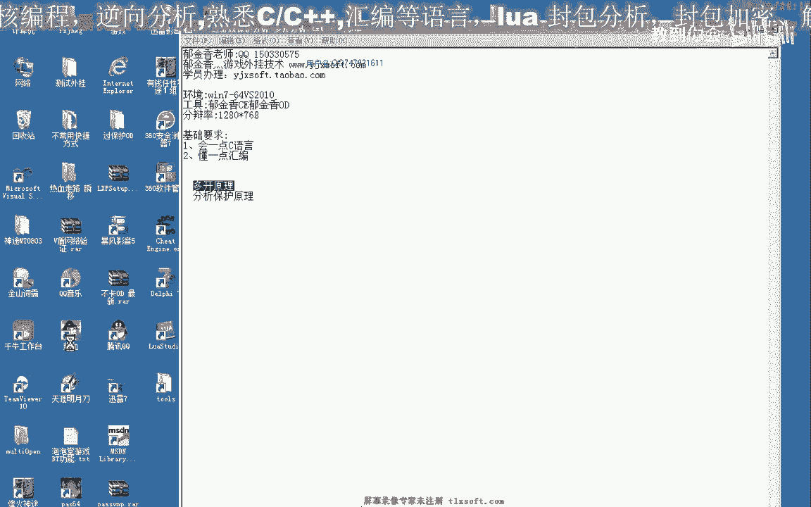

# 课程 P199：216-过游戏保护分析-多开分析 🔍



在本节课中，我们将学习如何分析并绕过《热血江湖》游戏的多开保护机制。我们将重点分析其保护动态链接库的工作原理，并探讨一种比修改整个客户端目录更简便的实现多开的方法。

## 概述 📋

上一节我们介绍了通过修改客户端目录来实现多开的方法，但该方法较为繁琐。本节中，我们将分析游戏内置的动态链接库保护机制，并寻找更高效的绕过方案。

## 保护机制分析 🛡️

《热血江湖》游戏的多开及密码保护等功能，主要通过一个名为 `YTP` 的动态链接库实现。

以下是该动态链接库中的几个关键函数：
*   `保护初始化`
*   `开始保护`
*   `停止保护`
*   `输入密码`

我们的目标是理解这些函数的原理，特别是“开始保护”函数如何阻止多开。

### “开始保护”函数原理

“开始保护”函数的第一个动作是通过**窗口标题**来查找游戏窗口。

```cpp
// 伪代码逻辑
HWND hWnd = FindWindow(NULL, “预期窗口标题”);
if (hWnd == NULL) {
    // 未找到窗口，执行退出
    ExitProcess();
} else {
    // 找到窗口，继续执行保护逻辑
    // ...
}
```

如果未找到预期的窗口标题，游戏进程将直接退出。这意味着直接修改窗口标题会导致保护生效，游戏无法运行。

找到窗口后，函数会设置一个调试标志，并通过 `SetWindowsHookEx` 函数安装多个全局钩子。

```cpp
// 安装钩子的示例
HHOOK hHook = SetWindowsHookEx(WH_DEBUG, HookProc, hMod, 0);
// 还会安装其他类型的钩子，如键盘钩子(类型可能为13)
```

游戏通过安装这些全局钩子（如调试钩子、键盘钩子）来监控和限制多开。我们之前遇到的卡OD（调试器）情况，也源于其对全局钩子的操作。

“停止保护”函数则负责卸载这些钩子。但经过测试，直接调用该函数停止保护并不可行。

## 新的多开思路 💡

既然保护机制依赖窗口标题来查找和确认“唯一”的游戏实例，我们的新思路是：让每个游戏实例拥有独立且能被保护机制正确识别的窗口标题。

具体步骤如下：

1.  **修改窗口标题**：首先修改游戏客户端的窗口标题，使其不再是固定值。
2.  **修补动态链接库**：在动态链接库中，找到存储或比较窗口标题的地址（例如 `0x120E-set` 或 `AFC` 相关地址），将其内容修改为我们为每个实例设定的独立标题。这样，每个游戏进程的保护机制都会找到“自己的”窗口，从而实现多开。

关键地址示例（需在动态链接库中定位）：
*   **标题存储/比较地址**：`0x????????` （例如原内容为“热血江湖”）
*   **修改为**：每个实例独立的标题，如“热血江湖_01”、“热血江湖_02”。

## 动态链接库的加载问题 🔄

仅仅修改内存中的标题还不够。游戏会加载 `YBMen` 这个动态链接库文件来实现保护。为了让多个实例加载不同的“副本”，我们需要：

1.  为每个游戏实例准备一个 `YBMen` 文件的副本（如 `YBMen_01.dll`, `YBMen_02.dll`）。
2.  通过代码，在游戏启动时拦截其加载动态链接库的请求，将其指向对应的副本文件。

以下是该思路的核心代码逻辑概述：

```cpp
// 伪代码：拦截LoadLibrary，重定向到副本
HMODULE WINAPI MyLoadLibrary(LPCSTR lpLibFileName) {
    if (strstr(lpLibFileName, “YBMen.dll”)) {
        // 生成或获取当前实例对应的副本文件名，例如 “YBMen_%d.dll”
        char newPath[MAX_PATH];
        sprintf(newPath, “YBMen_%d.dll”, GetCurrentInstanceId());
        // 加载副本文件
        return OriginalLoadLibrary(newPath);
    }
    return OriginalLoadLibrary(lpLibFileName);
}
```

这种方法无需复制整个庞大的客户端目录，只需管理多个小的DLL副本文件，节省了大量硬盘空间。

## 实施与测试 🧪

根据以上分析，实施多开的操作流程如下：

1.  定位动态链接库中关键的窗口标题地址。
2.  编写注入代码，在游戏运行时修改该地址的值为唯一标题。
3.  准备多个 `YBMen.dll` 的副本文件。
4.  通过钩子或补丁，将游戏对 `YBMen.dll` 的加载请求重定向到对应的副本文件。
5.  启动多个游戏客户端进行测试。

测试时，可以观察到每个游戏实例的窗口标题已变为独立名称，并且游戏能正常运行，表明多开成功。

## 总结 📝

本节课我们一起学习了《热血江湖》游戏多开保护的分析与绕过方法。

我们首先分析了其保护动态链接库的关键函数，发现它通过**窗口标题查找**和**全局钩子**来阻止多开。随后，我们提出了新的解决方案：通过**修改内存中的窗口标题**并**重定向动态链接库加载路径**，使每个游戏实例在保护机制眼中都是“唯一”的，从而实现了简便的多开。

下一节课，我们将基于本节课分析得到的关键地址和数据，动手编写具体的实现代码。