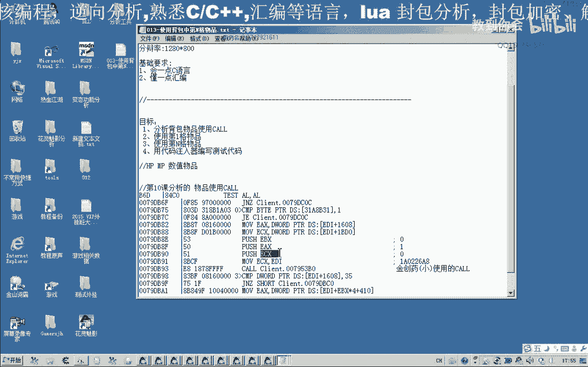
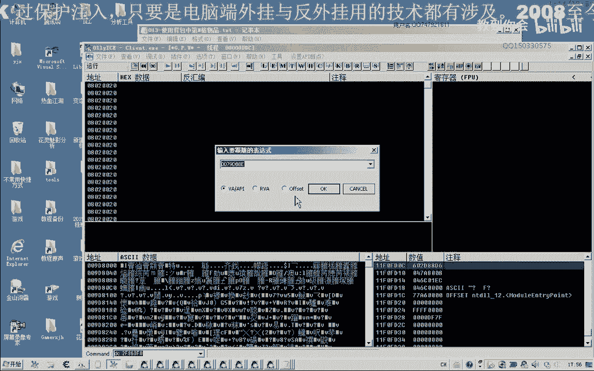

# 课程 P2-013：使用背包中指定格子的物品 📦➡️🎮

在本节课中，我们将学习如何通过逆向分析，找到并调用游戏内使用背包中任意一格物品的函数。我们将分析关键参数 `ecx` 的来源，并最终整理出一个可以指定物品格子的使用逻辑。

---



## 分析关键参数 `ecx` 的来源



上一节我们分析了使用第一个物品（金创药）的调用。本节中，我们来看看如果要使用其他格子的物品，关键参数 `ecx` 是如何确定的。

首先，我们回到 OD 中已定位到的函数代码处。


在此处下断点，然后向前追溯 `ecx` 的来源。我们发现 `ecx` 来源于 `edi`。


继续向上追溯 `edi` 的来源。这个调用封装的功能较多，范围较大。我们可以使用 CE 来辅助查找。

在 CE 中，我们观察到 `edi` 来源于上级调用的 `ecx`。我们在调用来源处下断点并查看。

当我们在游戏中右键点击不同格子的物品时，观察传入的值：

*   点击第 8 格物品时，参数值为 **7**。
*   点击第 6 格物品时，参数值为 **5**。
*   点击第 4 格物品时，参数值为 **3**。

由此可见，这个调用并非固定使用金创药。其关键参数是一个**下标索引**（从0开始），对应背包中的物品格子位置。

通过进一步分析，我们找到了直接给出该下标值的汇编指令位置。结合之前第 11 课分析的物品属性公式，我们现在可以确定使用物品的完整逻辑。

---

## 构建使用物品的函数

结合今天分析的调用和之前获得的物品属性，我们可以编写一个函数。这个函数可以根据物品名称找到其所在背包的下标，然后调用使用函数。

以下是核心逻辑的伪代码描述：

```cpp
// 假设：FindItemIndex 函数能根据物品名返回其在背包中的下标（从0开始）
// 假设：UseItemCall 是分析出的使用物品的调用函数
int itemIndex = FindItemIndex(“金创药(中)”); // 例如返回 1（第二格）
if (itemIndex != -1) {
    UseItemCall(itemIndex, 0); // 第二个参数固定为0
}
```

---

## 功能测试

现在，我们来测试这个逻辑。我们将不同的下标值传入调用。

以下是测试过程与结果：

*   传入下标 **0**（第一格，人参）：使用后，人参数量从 51 减少。
*   传入下标 **1**（第二格，金创药(小)）：使用成功，观察到变化。
*   传入下标 **2**（第三格）：使用成功。
*   传入下标 **3**（第四格）：使用成功（恢复血量）。
*   传入下标 **4**（第五格，回城卷）：使用后，角色执行回城。

测试表明，通过控制下标参数，我们可以成功使用背包中任意指定格子的物品。

---

## 下节预告与思考

本节课我们一起分析了使用指定格子物品的调用机制和关键参数。

下一节课，我们将对这个功能进行封装，编写一个完整的 C++ 函数。该函数可以接收物品名称，自动查找下标并调用使用。


大家可以提前思考如何实现 `FindItemIndex` 函数，其逻辑是：遍历背包，比对物品名，若存在则返回其下标。


---

## 总结

在本节课中，我们深入分析了游戏内使用背包物品的调用，明确了控制物品格子的关键参数是**下标索引**。我们通过测试验证了该逻辑的可行性，为下一步封装成易用的脚本函数打下了基础。


