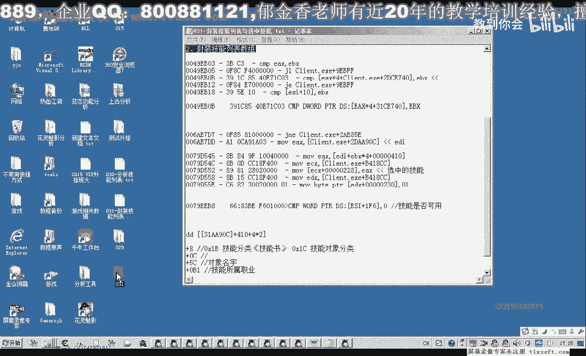

# 课程 P20：031-封装技能列表与选中技能 📚

在本节课中，我们将学习如何对游戏中的技能列表和技能对象进行代码封装。我们将通过分析内存结构，定义数据结构，并编写代码来读取和初始化技能数据，最终实现一个可用的技能列表封装模块。

---

## 一、添加技能列表基址与结构体 🏗️

上一节我们介绍了课程目标，本节中我们来看看具体的实现步骤。首先，我们需要在基址单元中添加技能列表的基址。

接着，我们在结构体单元中添加技能对象的结构体。该结构体包含以下属性：

以下是技能对象结构体的关键属性：
*   **分类**：技能的分类标识。
*   **数组下标**：该技能在所有对象数组中的索引。
*   **对象名字**：技能的名称。
*   **是否已学习**：一个布尔值，表示该技能是否已被角色学习。注意，该属性在内存中只占2个字节，初始化读取时需特别注意。

除了上述属性，我们还需要为技能对象添加一个属性，即它在技能列表内部数组中的下标。

保存结构体定义后，我们接下来需要定义相关的技能数据数组。

---

## 二、定义并初始化技能数据数组 🔢

我们定义了技能数据数组。通过分析，我们得知该数组的大小为32，每个元素的大小为`sizeof(TSkill)`。

接下来，我们需要对这个数组进行初始化。我们转到设计单元，在最后部分编写初始化代码。

初始化时，我们需要读取内存中的相关数据。以下是读取和初始化技能数据的核心步骤：

1.  **获取数组基址**：首先，我们读取技能列表数组的基地址。
    ```cpp
    // 伪代码示例：读取基址
    DWORD baseAddress = ReadMemory<DWORD>(skillListBase);
    ```
2.  **计算元素地址**：基址加上固定偏移量`0x410`后，得到技能对象数组的起始地址。我们需要将其转换为适当的指针类型。
    ```cpp
    // 伪代码示例：计算数组指针
    TSkill* skillArray = (TSkill*)(baseAddress + 0x410);
    ```
3.  **遍历并填充数据**：我们循环遍历数组（大小为32），对每个有效的技能槽位进行数据填充。
    *   **下标**：直接赋值为循环索引 `i`。
    *   **分类**：读取 `技能对象基址 + 0x08` 处的值。
    *   **数组下标**：读取 `技能对象基址 + 0x0C` 处的值。
    *   **名字**：读取 `技能对象基址 + 0x10` 处的指针（该地址直接指向字符串）。
    *   **是否可用**：读取 `技能对象基址 + 0x16` 处的 `WORD`（2字节）类型数据。**注意**：必须按2字节读取，否则会得到错误数据。

在读取过程中，我们需要进行两项关键判断，以过滤无效数据：
*   **空对象判断**：如果读取到的技能对象基址为空，则跳过当前循环。
*   **类型过滤**：技能对象的类型标识应为 `0x1C`。如果读取到的类型（位于对象基址偏移处）不等于 `0x1C`（例如是 `0x1B`），我们也跳过该对象。

在开始填充数据前，我们需要对整个技能对象数组进行初始化，例如使用 `ZeroMemory` 函数将其清零。

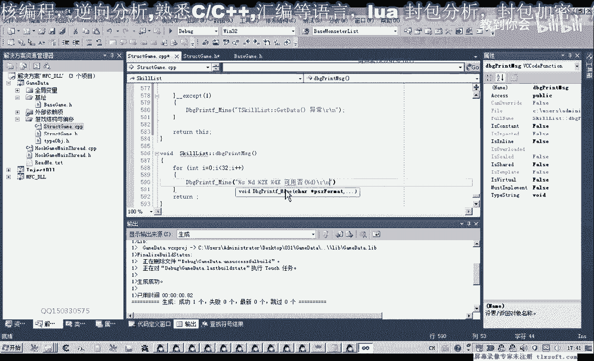

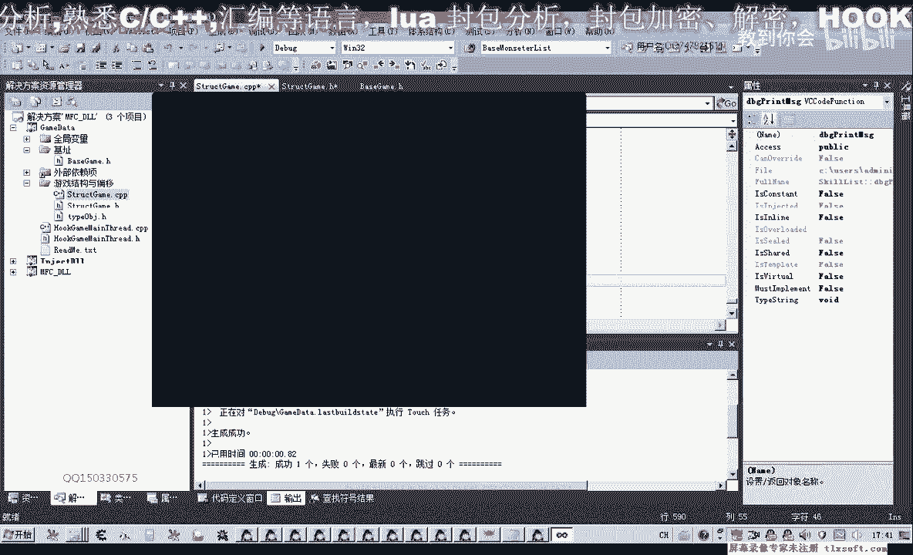

---

## 三、打印技能信息与代码优化 🖨️

初始化代码编写完成后，我们添加一段代码来打印技能信息，以便验证数据是否正确。

我们使用调试信息输出函数来打印每个技能对象的以下属性：
*   名字
*   在技能列表中的下标
*   类型
*   在所有对象数组中的ID
*   是否可用

在打印前，我们最好对调试输出系统进行一次性初始化。之后，我们可以直接使用全局变量来调用打印功能，而无需每次都指定前缀。

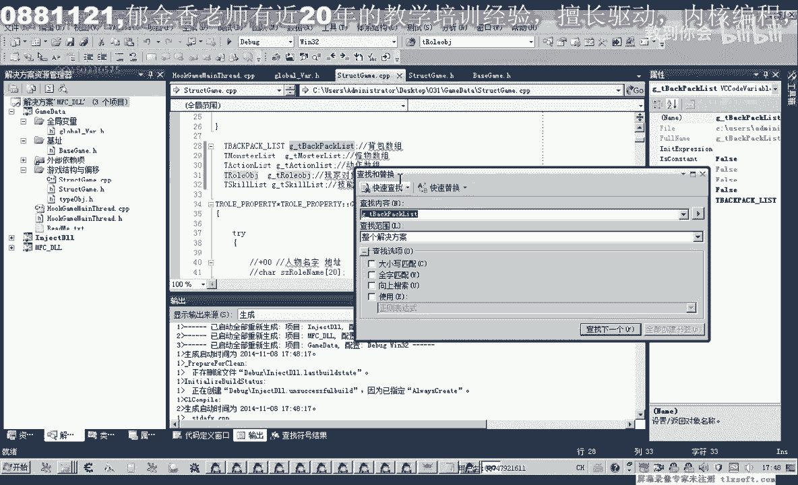

为了代码清晰和易于管理，我们将技能数据数组定义为一个全局变量，并为其添加 `g_` 前缀以符合命名规范。

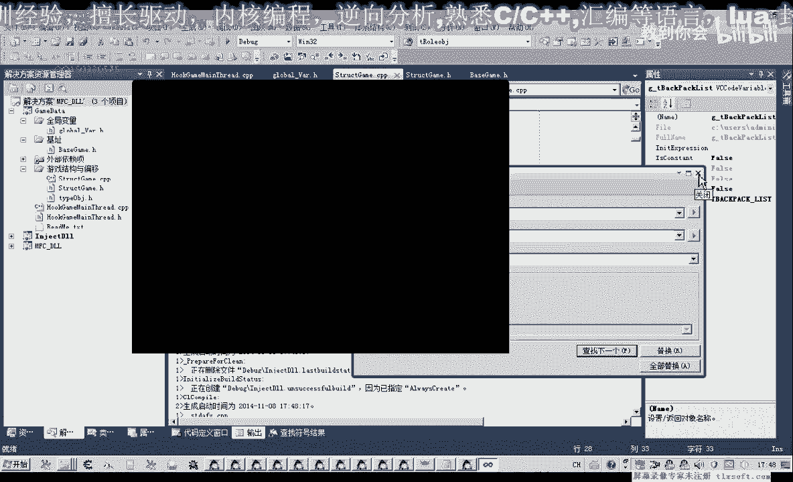

编译过程中，需要注意变量名的大小写匹配，避免因大小写不一致导致的编译错误。

---

## 四、测试与验证 ✅

我们将测试代码添加到主线程或测试单元中。在调用打印函数前，确保调试系统已初始化。

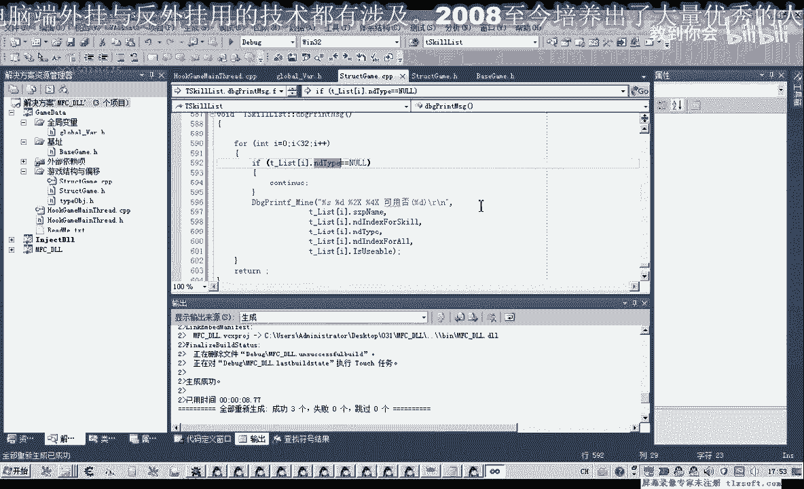

运行测试后，控制台会打印出技能信息。我们观察到，打印出的技能列表中，有些技能显示为“可用”，有些显示为“不可用”，这与游戏内的实际情况相符。同时，类型为 `0x1B` 的对象已被成功过滤掉，没有出现在列表中。

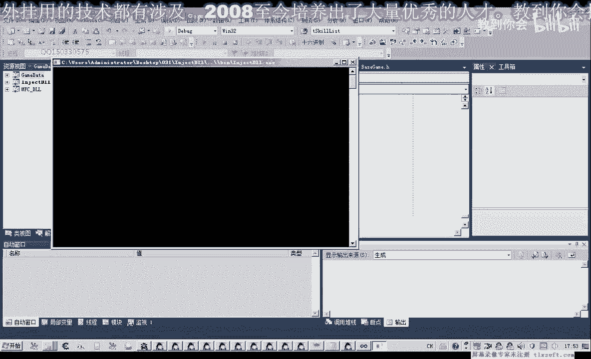

如果发现数据异常，例如所有技能都打印不出来，需要检查代码逻辑，特别是读取“类型”属性的偏移量是否正确（应为 `对象基址 + 0x08`）。

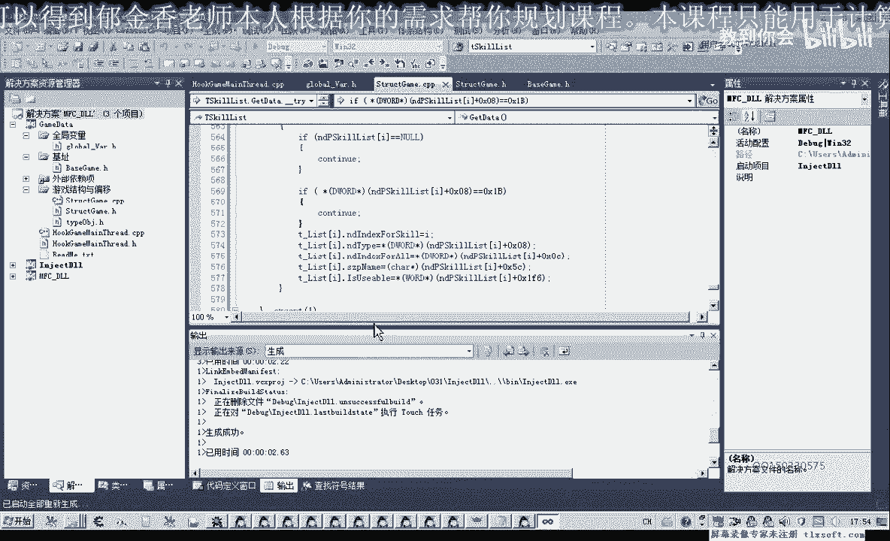

测试通过后，我们的技能列表封装就完成了。现在，我们可以通过这个封装好的模块，方便地判断哪些技能是可用的，为后续的技能调用逻辑打下基础。

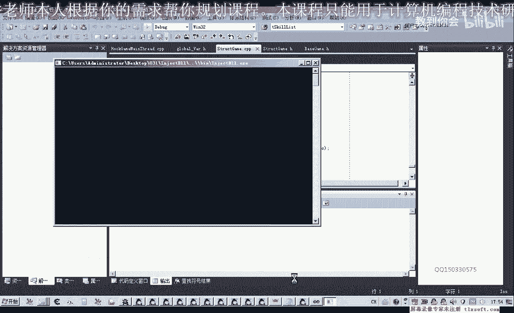

---

## 五、课程总结与作业 📝

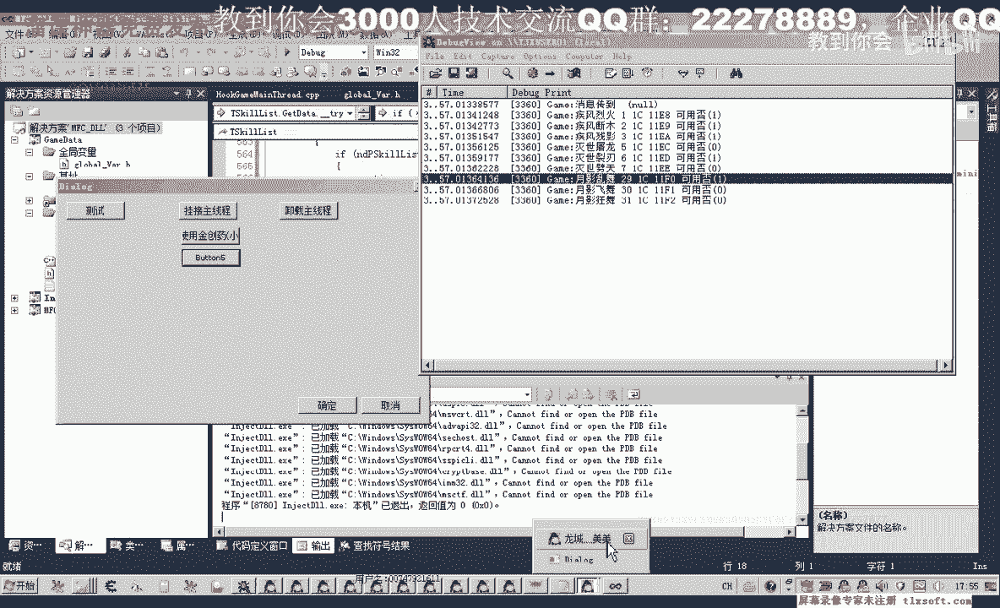

本节课中，我们一起学习了如何封装游戏的技能列表和技能对象。我们完成了从添加基址、定义结构体、读取并初始化内存数据，到打印验证的完整流程。

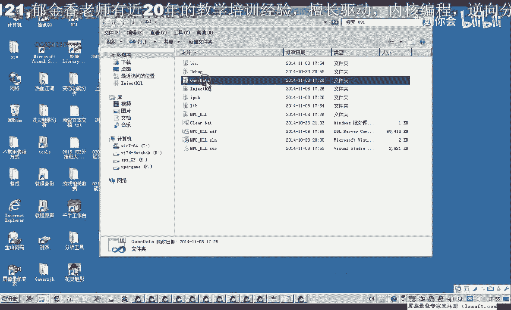

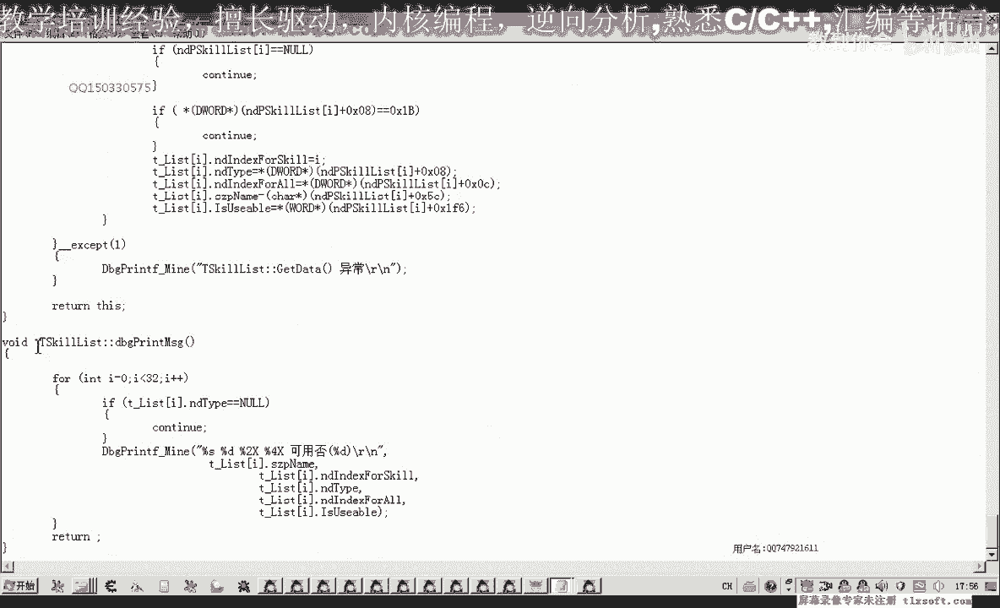

通过本次封装，我们获得了一个结构化的技能数据集合，可以轻松查询技能的各类属性和可用状态。

**本节课的作业**是：尝试分析并实现“将技能拖放到快捷栏（F1-F6）”的功能。在游戏中，技能通常需要放置在快捷栏上才能直接使用。请大家课后思考和分析，如何通过代码或内存操作，实现将技能列表中的某个技能“移动”到快捷栏指定位置的过程。这涉及到对快捷栏数据结构的分析以及可能的函数调用。

---

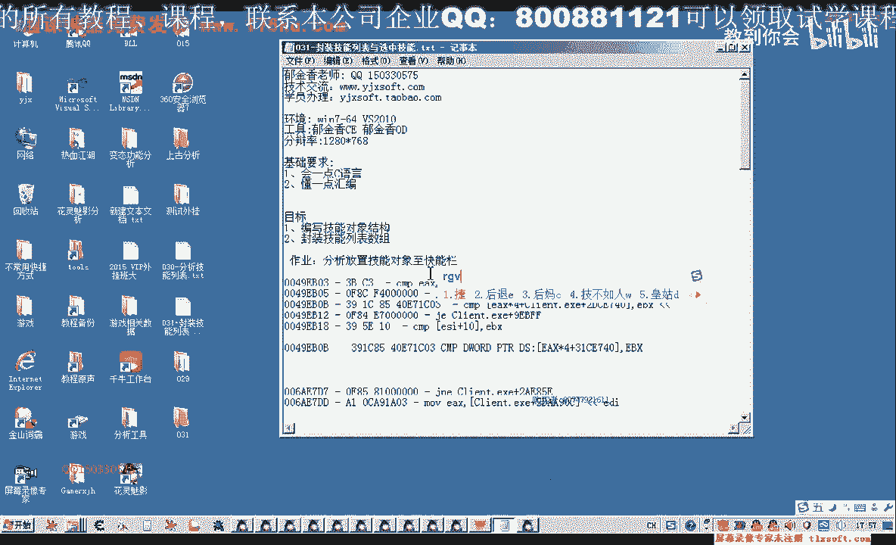

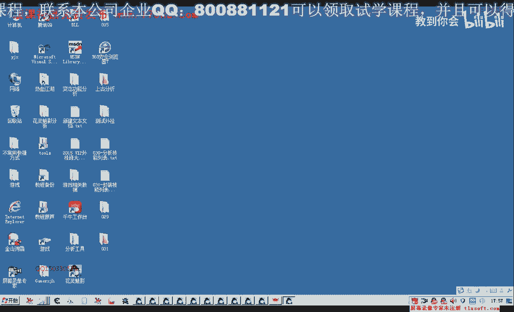

> 注意：本教程所有代码示例均为教学演示用途，旨在讲解编程思路和内存操作原理。实际应用需遵守相关软件的用户协议及法律法规。