# 课程P200：游戏多开补丁编写教程 🎮

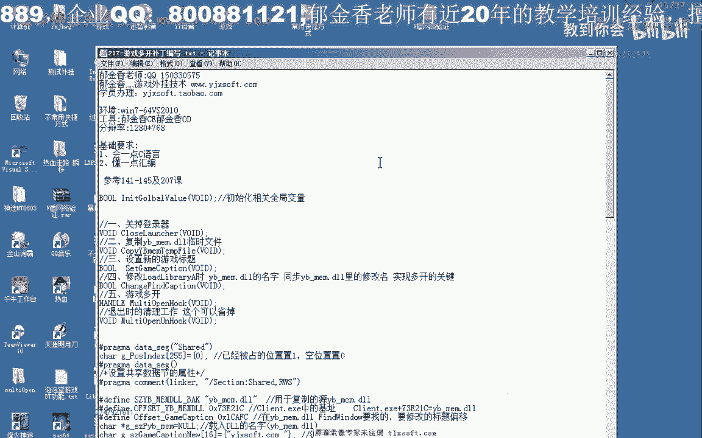


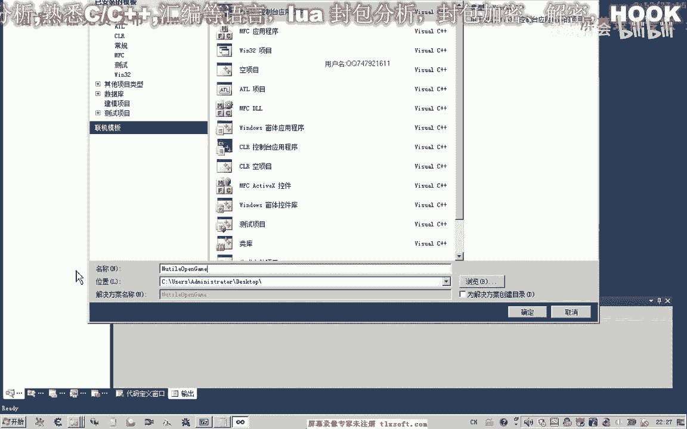

在本节课中，我们将学习如何编写一个动态链接库（DLL）补丁，以实现特定游戏的多开功能。我们将基于上一节课分析的数据，一步步编写代码，并解释其核心原理。

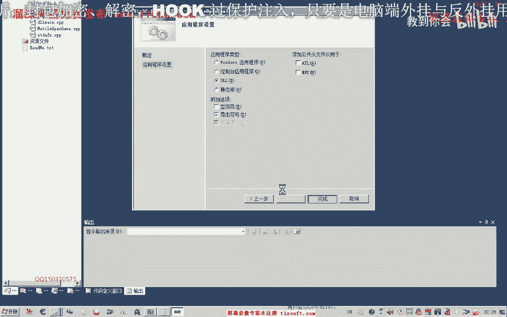

---

## 概述 📋

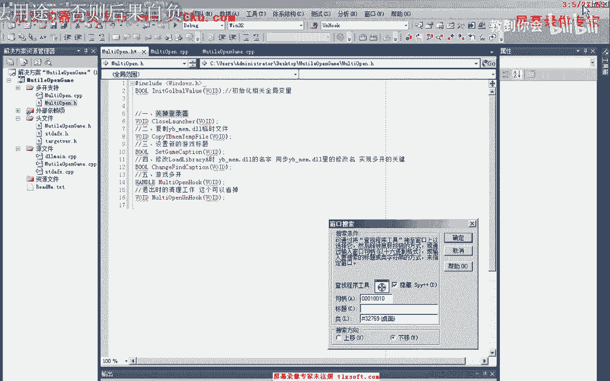

上一节课我们探讨了游戏多开的另一种原理。本节课我们将利用分析得到的数据，编写相应的代码来实现多开功能。核心步骤包括：关闭登录器、复制保护DLL、修改内存数据以及设置新窗口标题。

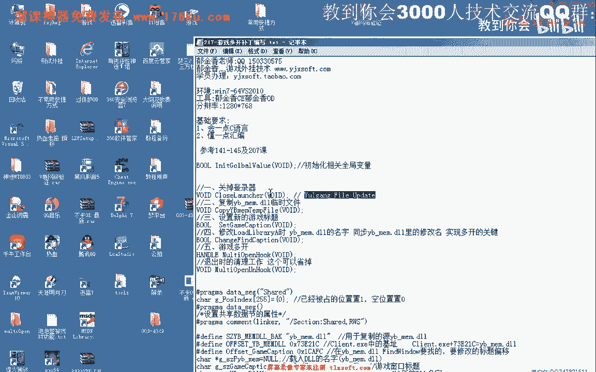

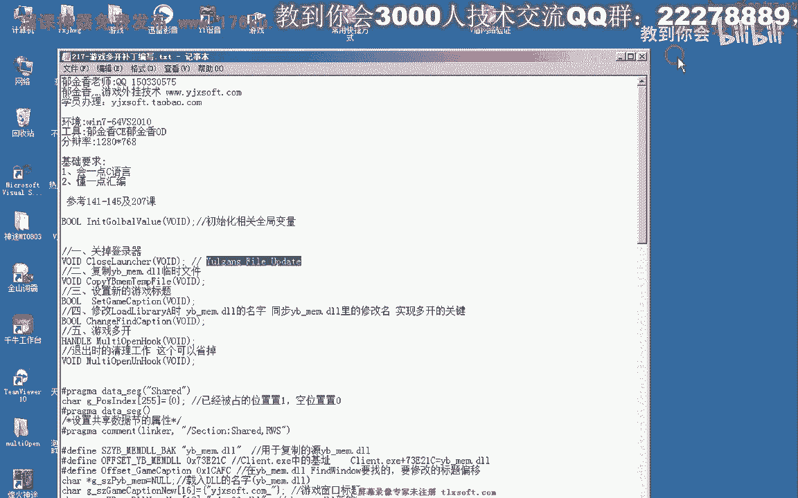

---

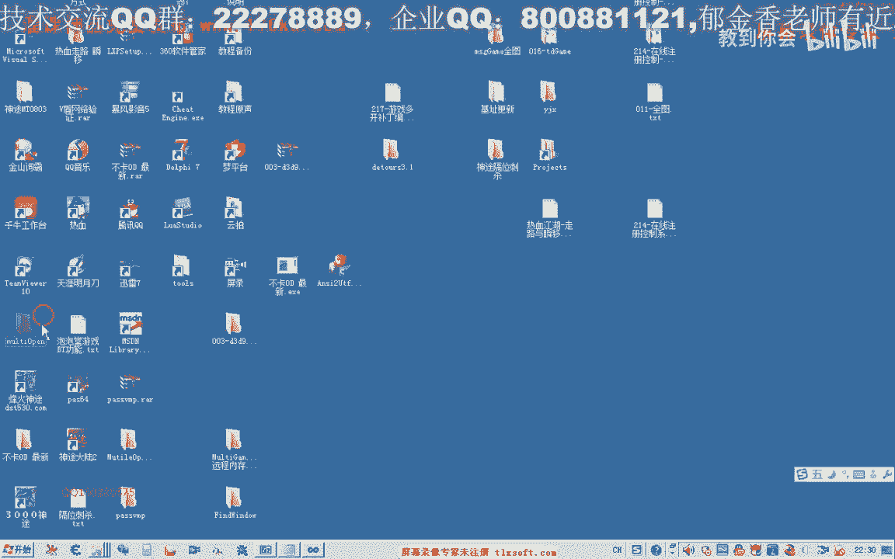

## 第一步：创建项目与基础函数 🛠️

首先，我们需要在Visual Studio 2010中创建一个动态链接库项目。选择“动态链接库”并勾选“导出符号”选项。

接下来，我们添加一个新的源文件和头文件。主要需要编写以下几个函数：

1.  关闭登录器进程的函数。
2.  复制保护DLL生成临时文件的函数。
3.  初始化全局变量和分配“座位”的函数。
4.  设置游戏新窗口标题的函数。
5.  修改内存中特定字符串地址的函数。

以下是实现这些功能的核心代码框架：

```c
// 示例：关闭登录器进程的核心逻辑
HWND hWnd = FindWindow(NULL, "登录器窗口标题");
if (hWnd) {
    DWORD pid;
    GetWindowThreadProcessId(hWnd, &pid);
    HANDLE hProcess = OpenProcess(PROCESS_TERMINATE, FALSE, pid);
    if (hProcess) {
        TerminateProcess(hProcess, 0);
        CloseHandle(hProcess);
    }
}
```

---

## 第二步：关闭登录器进程 🔒

要实现多开，必须关闭已存在的登录器，否则新的登录器无法启动。我们通过窗口标题找到登录器进程，并终止它。

以下是关闭登录器的具体步骤：

*   **查找窗口**：使用 `FindWindow` 函数，通过已知的窗口标题找到登录器窗口句柄。
*   **获取进程ID**：通过窗口句柄，使用 `GetWindowThreadProcessId` 函数获取该窗口所属的进程ID。
*   **结束进程**：使用获取到的进程ID，通过 `OpenProcess` 和 `TerminateProcess` 函数强制结束该进程。

---

## 第三步：复制与重命名保护DLL 📂

游戏客户端会加载一个特定的保护DLL（例如 `ygd.dll`）。为了实现多开，我们需要为每个游戏进程复制并重命名这个DLL，让每个进程加载不同的副本。

以下是实现此功能的关键点：

*   **复制文件**：使用 `CopyFile` 函数将原始DLL复制到一个临时位置。
*   **动态命名**：为每个进程的DLL副本生成唯一的名字（例如 `ygd01.dll`, `ygd02.dll`）。
*   **座位管理**：使用一个共享数据节（`#pragma data_seg`）来管理“座位”数组，标记哪些名字已被占用，哪些空闲，以实现名字的循环复用。

```c
// 示例：使用共享节管理“座位”
#pragma data_seg(".shared")
int seat_map[255] = {0}; // 0表示空闲，1表示占用
#pragma data_seg()
```

---

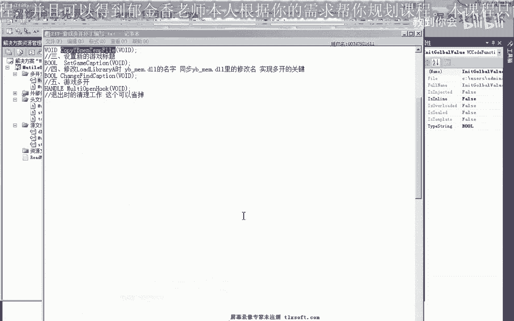

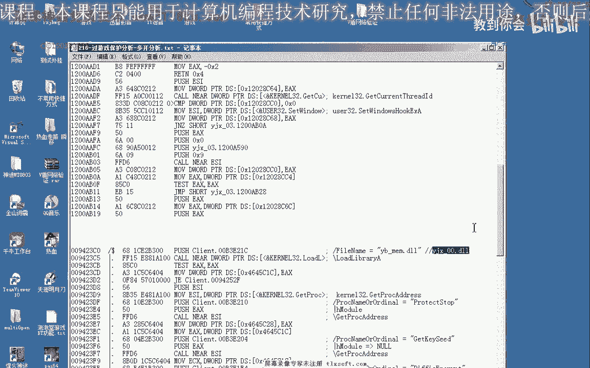

## 第四步：修改内存与窗口标题 🖊️


这是补丁的核心部分。我们需要修改游戏客户端内存中两处关键数据：

1.  **修改DLL加载路径**：找到内存中存储原始DLL名字（如`ygd.dll`）的地址，将其修改为我们新生成的唯一名字（如`郁金香01.dll`）。
2.  **修改窗口标题**：游戏保护会通过窗口标题来检测多开。我们需要将游戏窗口的标题修改为包含唯一标识的新标题（如`游戏窗口_01`），并同步更新内存中用于检测的标题字符串。

以下是修改内存地址的示例：

```c
// 示例：修改内存中的字符串
DWORD baseAddr = (DWORD)GetModuleHandle(NULL) + 0x73121C; // 基址+偏移
char newTitle[] = "游戏窗口_01";
WriteProcessMemory(GetCurrentProcess(), (LPVOID)baseAddr, newTitle, strlen(newTitle)+1, NULL);
```

**注意**：在设置新窗口标题前，可能需要一个循环来等待游戏窗口创建完成。

---

## 第五步：整合与线程执行 🧵

我们将所有步骤整合到一个主函数（例如 `StartMultiOpen`）中。为了让补丁在游戏启动时自动运行，我们需要将这个函数的执行放在一个单独的线程中，并将该线程的启动代码放在DLL的入口函数（`DllMain`）中。

```c
// 示例：在DllMain中创建线程
BOOL APIENTRY DllMain(HMODULE hModule, DWORD ul_reason_for_call, LPVOID lpReserved) {
    if (ul_reason_for_call == DLL_PROCESS_ATTACH) {
        CreateThread(NULL, 0, (LPTHREAD_START_ROUTINE)StartMultiOpen, NULL, 0, NULL);
    }
    return TRUE;
}
```

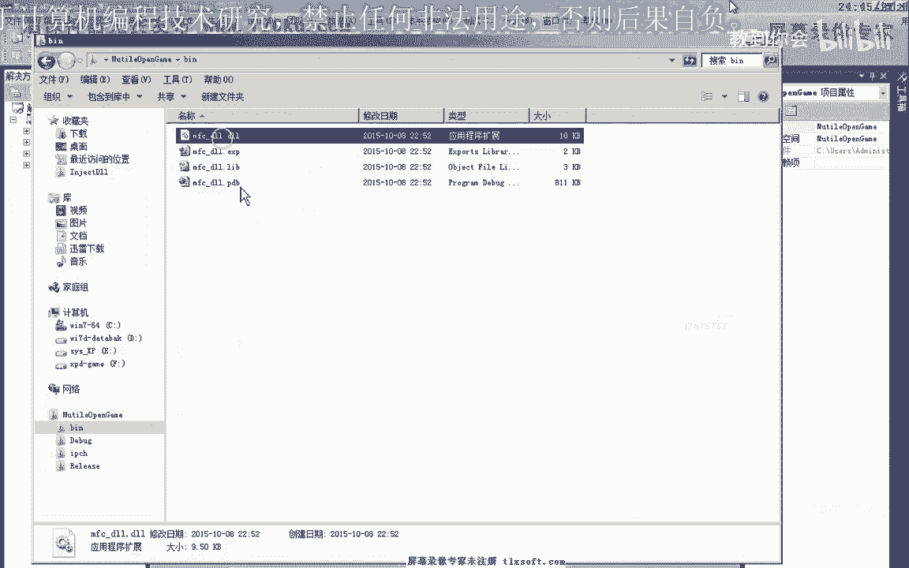

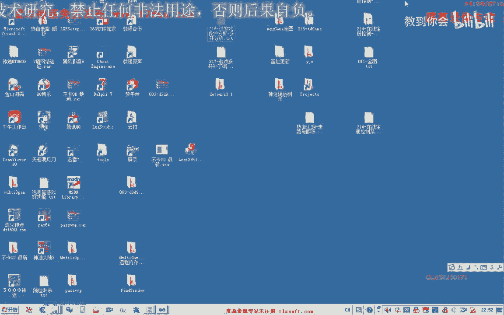

---

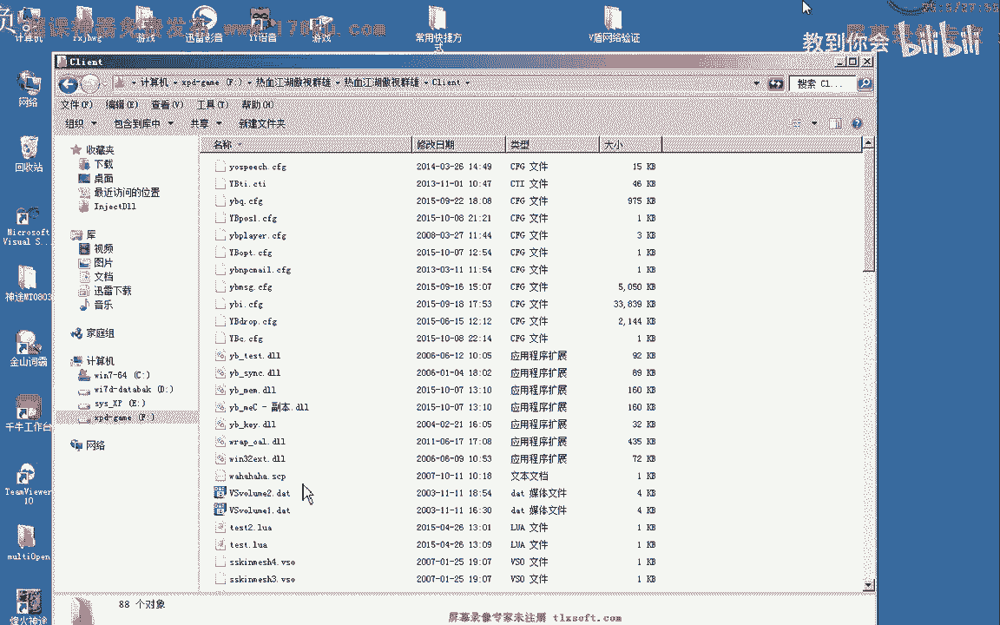

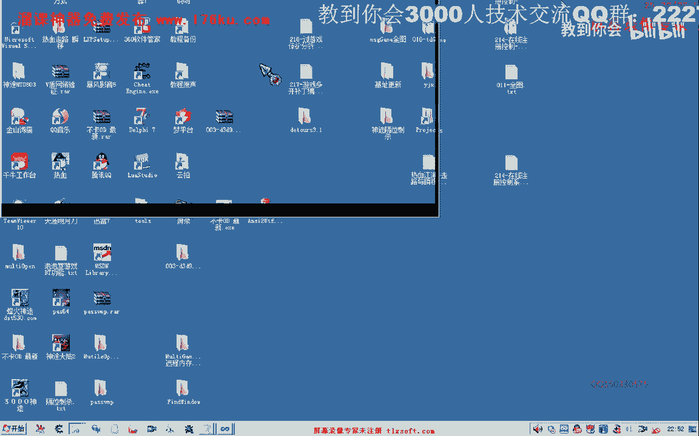

## 总结 📝

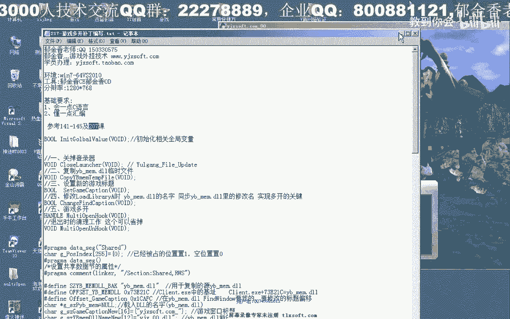

本节课我们一起学习了编写游戏多开补丁的完整流程：

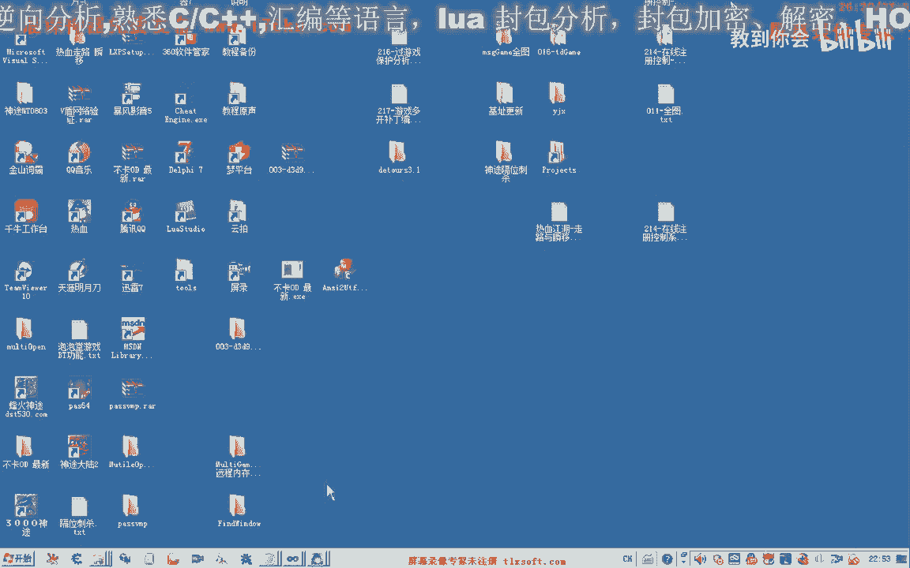

1.  **分析原理**：理解了通过修改DLL加载路径和窗口标题来绕过单实例检测的原理。
2.  **关闭登录器**：终止已存在的登录器进程，为新实例腾出空间。
3.  **复制DLL**：为每个游戏进程创建唯一的保护DLL副本。
4.  **修改内存**：动态修改游戏内存中的关键字符串，包括DLL名和窗口标题。
5.  **整合执行**：将所有功能集成到DLL中，并通过独立线程在游戏启动时自动执行。

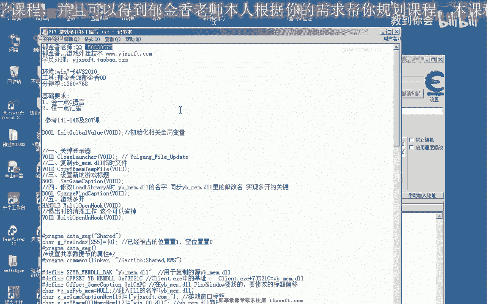

通过实现这些步骤，我们成功制作了一个可以让游戏客户端多开的补丁程序。掌握这些知识有助于深入理解Windows进程、内存管理和DLL注入等技术。