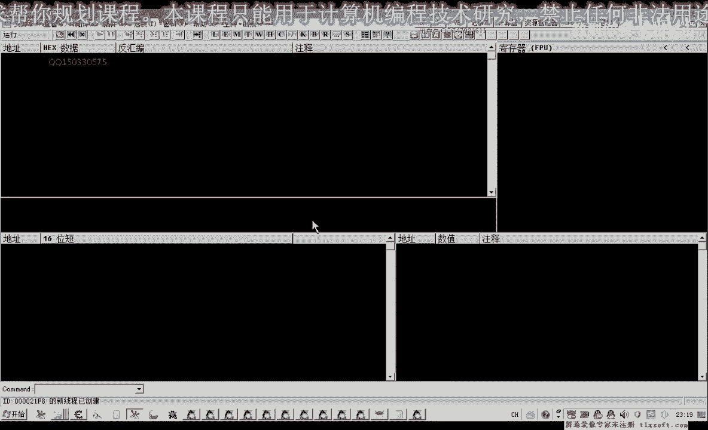
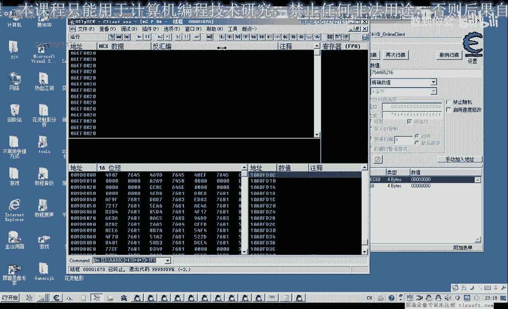
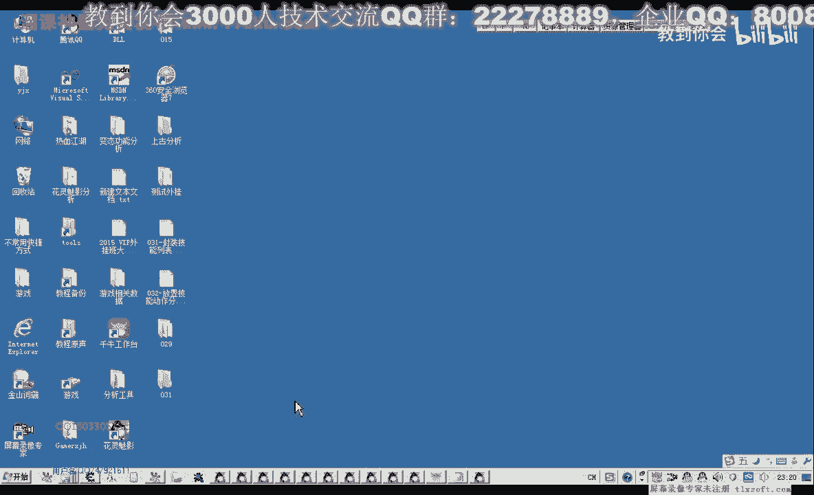
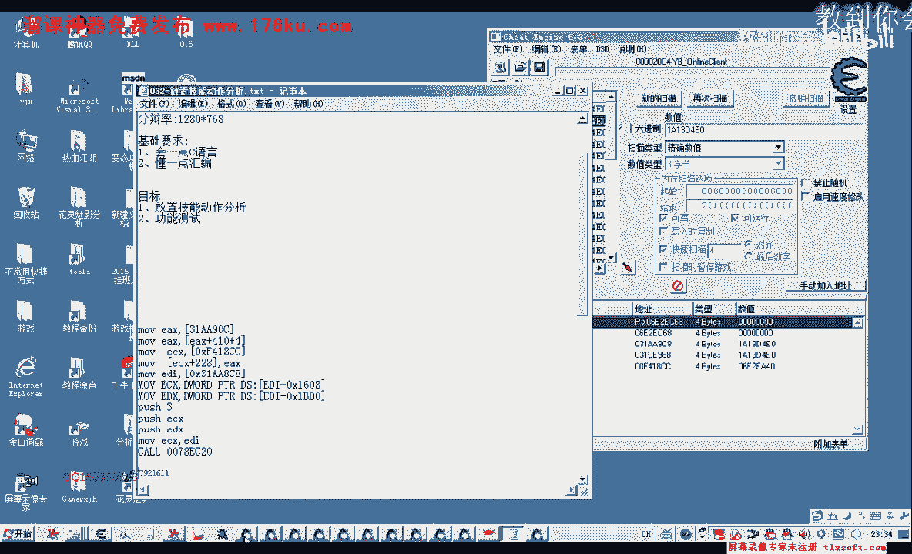

# P21：032-放置技能动作分析 - 教到你会 - BV1DS4y1n7qF

大家好，我是郁金香老师，那么前面呢我给大家留了一个作业啊，也就是把这个技能栏既能放置到我们的下面的这个快捷栏里边啊，那么今天呢我们就来分析嗯这个相应的库以及相关的数据，那么前面呢我们分析的分析的时候呢。

分析了一个技能数组，还有一个也就是选中的技能啊，显示的那个技能对象啊，有这一段数据，那么先我们打开c1 ，那么既然我们是要选中的啊，这个对象呢他会写到这个下面的快捷栏里边呢。

那么我们就从这个选中的对象来入手，那么首先呢我们把这个选中的对象读出来，那么这里添加一个指针，那么它的偏移呢是228，那么我们加上这个228的偏移，当然我们需要添加到游戏里面，那这里我们重新添加纸张。

二八我们添加一下，那现在我们选中了一个对象，这里面就是对象的数值，那么如果我们放入到这个地方呢，它这里会清零啊，会清零，那么也就是说他在在执行完这个扩之后呢，它会向这个地方呢做一个轻盈的动作。

那么我们就找一下他是什么时候对待新的零，他肯定是把这个数据用完了之后呢，再来做这个轻微的这个动作啊，那么我们先把前面的这个地址记下来，是6121380这个地方，那么先我们先选中一个技能对象。

那么这里呢他将写入我们的技能地址，那么然后呢我们再看一下什么地啊，改写了这个地址，附加调试器好，然后我们在这里呢按一下，那么我们发现呢写入这个地方的呢就是这一个地址，那么我们把这个地址复制出来。

把它记录下来，那么应该在这个库的前面，他在前边啊，前面的可能性就大，在它的前面的可能就是就有一个放置，这个技能是快捷栏的代码，那么这个代码呢可能是一个扩啊，也可能就是一句代码。

就是一个像我们之前的这样写，就一个对象直接把这个对象写到这里来，那么我们来看一下他写入的，或者我们可以分析一下他写入的这个对象，是不是刚才我们选择的这个对象，那么我们可以用这个为例哈。

那我们看一下这个对象的值是不是我们刚才选中的这个对象的值，那么现在这个技能栏的数据呢，现在是我们零零收一下，数十名，没有放东西，那么我们放上去之后呢，它是应该是一个极大的一个数值，比这个数值还要大。

或者说它就是我们刚才选中的这个对象的这个数字，你搜一下有没有这样一个数字，啊这里我们应该是一个精确的数值，那么在我们收精确数值的时候呢，我们发现呢这里他写入的呢并搜嗯搜不到这个对象啊，搜不到这个对象。

那么我们重新再来选中一下，选中的是这个对象c0 ，那么无望，这里放放下去嗯，他一共有四个地方，那么我们看是不是往这个地方写一个设定，如果是这样的话就简单了，我们直接就往这个地址来写入我们这个对象就可以。

但是我们把这个移开，我们看一下有没有变化，那么移开之后呢，这里没有变成零的啊，那么说明的话刚才这个地方的话，他写出的肯定就是我们这个对象，因为这里呢它已经变成零了啊，已经变成了平好的。

那么我们直接用其他的办法来进行分析，也就是刚才的我们看这个清零的这个地方，然后往周围来找，那么我们先把调试器切在掉。

打开我们的o d。

好那么打开之后呢，我们转到刚才的这个地址，清零的啊，这个地址，再传一次，那么既然他在这里清零了，说明的话，那么很大的可能就是我们放置技能的啊，动作呢已经完成了，已经完成。

那么可能就是在前面的这一段代码里面完成的完成的，那么也可能说是在上一层里面来完成的，也就是说在这个库的上面，它还有一个空，那么在这里呢我们看到了有一些代码啊，呃就来查一下字典是什么意思。

那么有时候我们这些这里面的这些调试信息呢，对我们也有用，或者是自创，啊就是落下，就是我们放下啊，相应的，播放，那么也就是说这里面有一个放置动作，那么他这里他说的这里是放置错误啊。

啊拖动什么放置什么错误啊，这的一些信息，那么我们证明的话，从这些字串来看的话，我们应该是找到了这个库的内部，那么我们在这里下一个段f，那我们再来执行一次，碰瓷呢放到f一上面。

那么我们返回到它的上一层去看一下，执行到返回，那么会到这个位置，那么一般来说的话，我们这里呢它是一个数组，那么数组的话它也会从01234键给它编号，那么我们看一下这周围的这些库，还有没有指定的这个下标。

那么比如说我们放在这个，它的下标应该是零，放在这个它的下标应该是一，放在第三格，它的下标应该是二倍，那么我们选择一个这个的话，我们放在这里呢，它下边应该是四，那我们看一下，那么寄存器里边也有两个四啊。

这里也有两个四，这两张可，那么我们再执行一下啊，我们换一个位置看它有没有变动，那么放在f8 上面的，它下边应该是七，那么这个时候呢一bx的自然是七，一bx恰好是在这里啊，这里呢可能是我们快捷栏数的。

或者说我们就叫做技能栏，这样子技能栏数据下降表示放置到某一格上面去了，然后我们再跑一下，再换一个对象，再看一下，那么如果我们放在f3 第二格上面，那第三个啊，它的下标是二。

那么这里如果我们把这里是压榨的这个参数，我们改这里如果是把它改为西红，看有什么变化，那么我们发现呢它放在f8 上面的这个对象，比如说这个对象我们放在f7 上面，第六个，那如果我们把这里这个六改为零。

我们试一下，这时候我们发现它放到了这个技能栏数组的第一格上面，那么所以说这个扣的话可能就是我们的呃放置技能栏数组的一个扣，那么这个库里面呢它有一个信息，还有一个信息呢就是我们选中了这个技能啊。

我们要有一个前提，要先选中这个技能，应该才能够啊才能够执行这个空，那我们来看一下其他的一个参数，在这里我们跟他下一个段，放在第二个，这个时候1b x为二，一cx为低，啊x d，那么dx呢我们看一下。

这里是，那我们看这两个数值是否会变化，但是呢它也有一个机子来源于这两个数值，那么或者说我们找一下它的相应的机制，找一下这个e d i它的来源来源于什么地方，我们看一下现在bi的数据是这个数值。

那么我们用c一来搜一下，那么它有两个机子承包了这个数据，那我们看看我们来看一下究竟是哪一个啊，我来改一下三幺，那么我们可以在里面直接下一个断点，用hi下访问断点，那么访问断点之后呢，它马上就断下来。

这里呢有一个88的一个机子，那么这里呢这个应该就是，因为这里面找到的是常亮的话，就是我们的基础好，先让他跑起来，那么另外我们一个我们看一下它是否没有截止，这里改一下3141，先去。

那么另外一个呢我们看它也会断下来，但是呢他来11a3 来源于我们的31c e740 ，那么这个的话我们知道3141740的话，它里面所有的对象都放在里面，包括我们今天的这些对象呢，他也放到了这个领域啊。

所以说这个我们不管他啊，然后我们把相应的按键断笔消掉，那么现在我们分析的数据的话，我们按减号退回，那么分析到了这里，那么这两个参数的来源也有了，一个是来源于腰六啊，零八也就是这个机子我们把它复制出来。

那，么这个机子呢加上168，那我们看一下另外一个呢是，腰臂地，那我们来看一下这两个数字，对这个是d啊，这个是四点，那么我们可以直接就用这个机子，那么参数我们这个呢就是参数二。

那我等于0x那么下面这个呢是我们的参数，一，那么这个是你那个四，四楼的参数与参数二，参数三，那么参数三呢，这里就是我们数组的下标，那么既然知道了，我们来，那么还有一个e d i，e d i呢。

刚才我们也查出来了，e d i就是等于这个变量，第二个，那么然后再调用我们可以用代码代码注入器啊，先进行一下测试，有一家人，然后呢我们把这两句给它复制下来，啊然后再做写复习我们的下标。

然后再push e4 x push 1 t x，然后这部e4 x一等于一加，最后呢往后，拖这个地址。

好的，那么它有一个前提，有一个前提就是我们先要选中一个技能，那么比如说我们把这个选中的技能放置到f7 上面，也就是第六个，我们来试一下，那么注入到游戏里面，那我们看一下它就放置到了第七个上面去了。

那么如果我们要把这个对象放置到第六个，那么这里就是那么也放置到相应的这个上面情况，但如果我们不选中对象，我们注入的时候看一下啊，它就没有反应，因为它自动的会去判断这个地址，过去判断这个28这个地址。

看这个地址，如果他没有选中，能心无人零的话，他可能就不会执行这个扣啊，如果就这样叠加的话，他就会啊不会去执行相应的里面的真正的这个内容，那么所以说这里呢我们还有一个前提，那么配合我们前边的代码的话。

我们还可以这样写，那么前面呢我们有一个技能列表啊，是319c90 c n90 c，那么这两个地址我们看它也是a组的，实际上一个是312848904元，应该都会有。

那么我们也可以直接从这里面取一个对象出来，比如说我们取对象二啊，我们可以这样写，就是那么取出来，然后加上410，或者是我们move直接意识点数组的方式来写，那么ex加上我们的四乘，以一个相应的一个下标。

是神隐，我们就取第一个取出来，取到ex里面来，然后我们再往这个地址里面进行写入啊，这像28，那么28这个呢我们看一下是多少，啊不知出了，那么是f41844 ，我们直接用哪个卡数据，自己。

好那么我们直接这里呢，我们就可以这样写，就v c x，那么再往里面行，就是把我们之前的ex在往里面写ec x加上28，然后写入ex，那么这个ex的话是它的下标是一，也就是这一个对象啊。

往我们指定的选中对象里面写入，然后我们放置到哪一格呢，这里我们第三个是空的，那么我们放置到第三个试一下，看有没有写错啊，我们再来检查一遍我们的代码，那么首先呢这里呢我们先。

地址还有一个我们要加一个410，我们都要加这里，我们还要加一个410，它的地址再加上你的400，那么我们再看一下这里面的对象，取出来往外八这个地方起，它的机制是应该是正确的啊，我们再来试一下。

那么这里呢这种写法可能不行啊，那么我们直接这样写，加四，那么这个时候呢我们发现啊他就放置到这里进去了，那么再来执行一遍看一下，那么如果我们要把它放到f放到第三个，第四个，那么那也可以啊。

那么直接用代码就可以实现了，这样好了，那么下一节课呢我们再把它封装成c加加的代码来实现，嗯，那么这节课呢我们就先分析到这里，下节课我们再见，然后我们把相应的代码呢我们备份出来。

那么这节课呢也给大家留一个作业啊，那么就是把我们下面的这段代码呢，把它封装成一个函数，嗯那么碰撞是什么函数呢，比如说就是啊我们的，放心啊，里面呢我们就是技能名啵啵啵啵。

然后呢下面呢是我们技能栏的一个下标，那么写成这样的一种类型，如果写成路是这样的一个形式啊，那么只要执行这个函数哈，后面我们放放技能名，相应的下标，那么相应的这个技能呢它就可以了，放到我们下面的技能呢。

比如说这个疾风烈火啊，那么我们要放置的话，我们直接就可以调用这个函数，嗯然后我们放置到某一格就可以这样写，第一个或者是放手到第二个，那么我们一般甚至可以把它定义成红，嗯，比如说f一放置到这里面。

什么都可以，当然前面我们就定一个红就行了，就翻，啊啊好的，那么今天呢我们就讲到这里。

