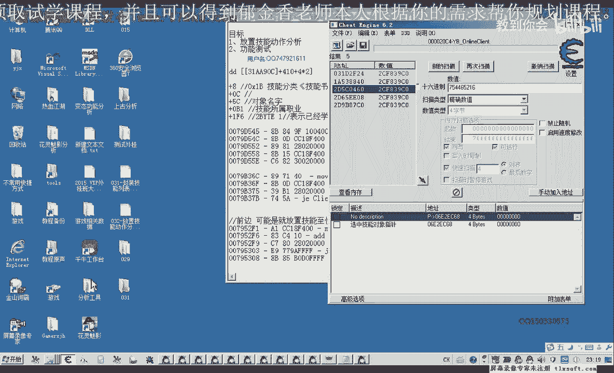
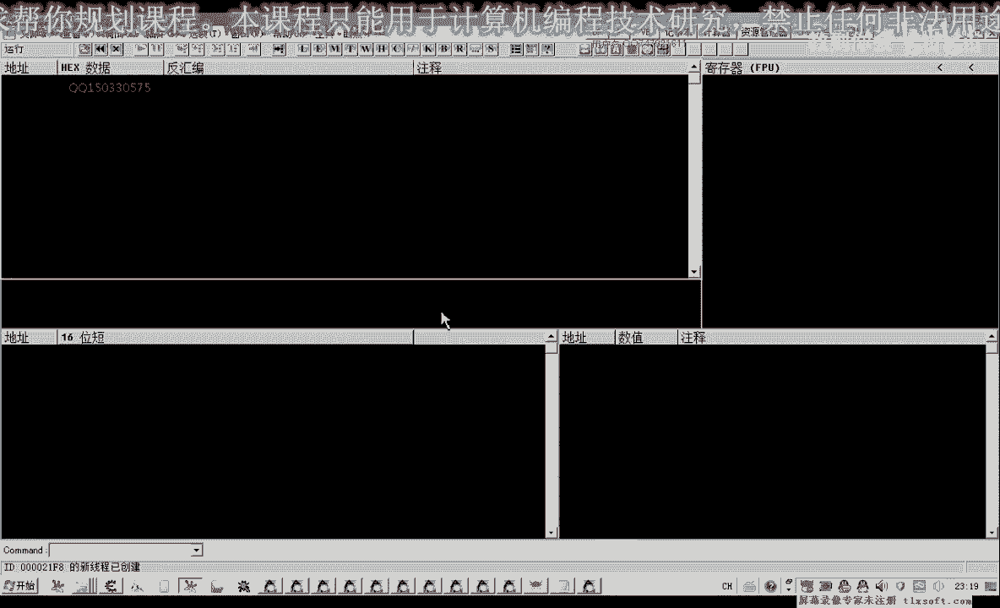
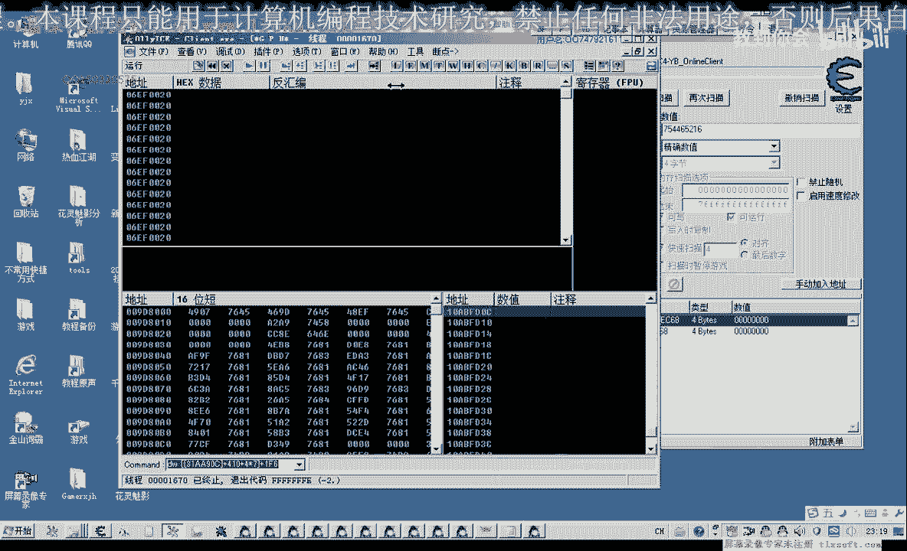
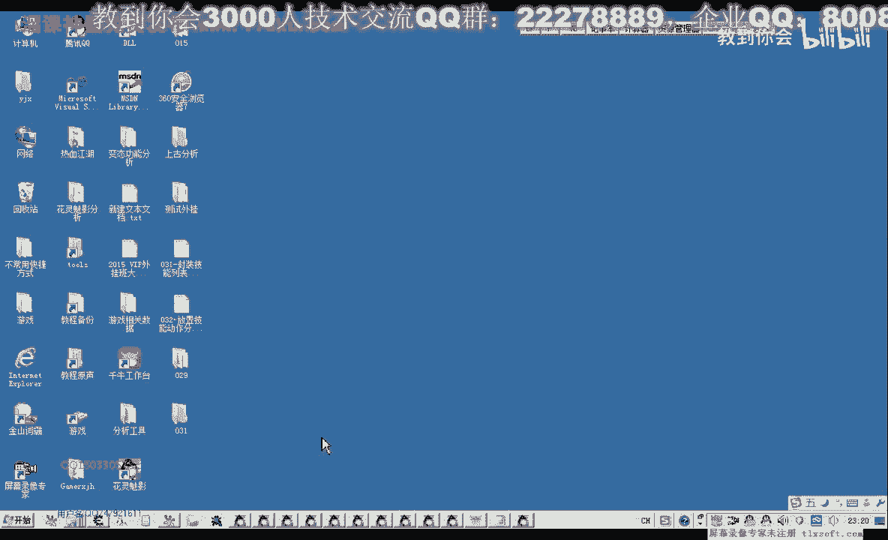
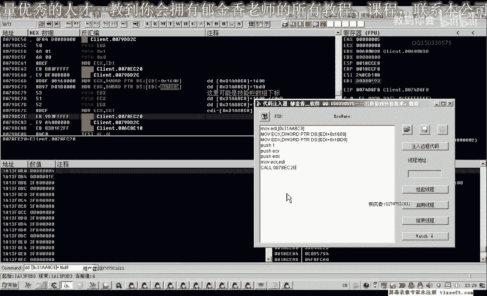
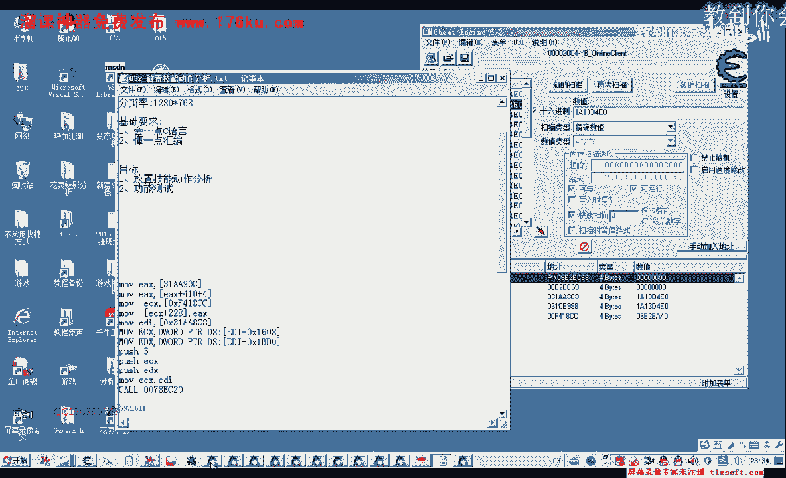
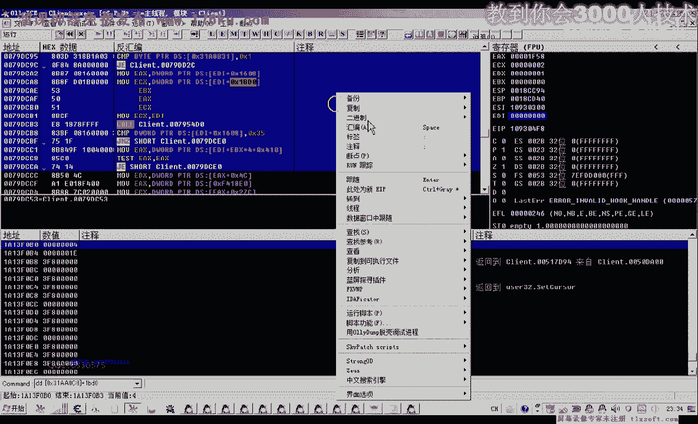
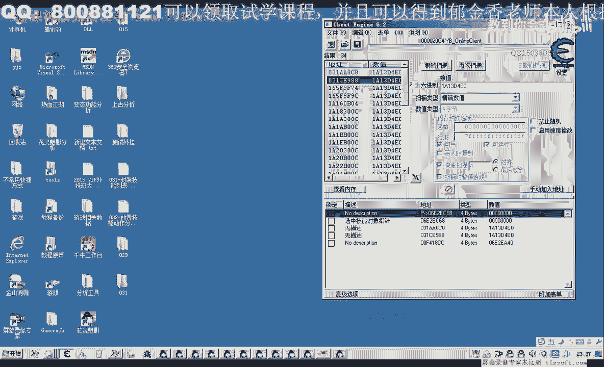

# 课程 P21：032 - 放置技能动作分析 🎮

在本节课中，我们将学习如何通过逆向分析，找到将选中的技能对象放置到游戏快捷栏（技能栏）中的关键代码和逻辑。我们将从选中的技能对象入手，逐步分析其写入快捷栏数组的过程，并最终通过代码注入实现自动化放置。

---

## 概述

前面的课程中，我们分析了一个技能数组和一个用于显示选中技能的对象数据。本节课的目标是分析如何将选中的技能对象写入到游戏下方的快捷栏中。我们将通过调试工具定位关键的内存写入操作，分析相关函数的参数，并最终用代码实现技能放置功能。

---

## 从选中对象入手

上一节我们介绍了技能数组和选中对象的数据结构。本节中，我们来看看如何从选中的技能对象开始分析。

既然我们的目标是将选中的对象写入快捷栏，那么首先需要读取当前选中的对象。通过分析，我们得知选中对象的地址偏移是 `0x228`。

我们使用工具（如CE）添加一个指针，指向该偏移地址，以读取选中对象的数值。

```cpp
// 假设基址为 BaseAddress
DWORD selectedSkill = *(DWORD*)(BaseAddress + 0x228);
```

当我们尝试将技能放入快捷栏时，这个选中对象的地址会被使用，然后该地址的数据会被清零。这表明，在执行完某个操作（函数调用）后，程序会对这个地址执行清零动作。

---

## 定位清零操作

为了找到放置技能的关键代码，我们需要先找到是什么指令对选中对象的地址进行了清零。



我们记下选中对象的地址（例如 `0x6121380`），然后使用调试器附加游戏进程，设置内存写入断点。当我们执行放置技能操作时，调试器会中断在写入该地址的指令处。





通过分析，我们发现执行写入的指令地址是 `0xXXXXXX`（具体地址需在动态调试中获取）。这个地址很可能就在执行放置技能功能的函数内部，或者在其附近。

---

## 分析关键函数



我们使用OD（OllyDbg）转到清零操作发生的地址。既然程序在这里清零，说明放置技能的动作很可能已经在此前完成。因此，我们需要向上回溯代码，寻找执行放置操作的函数。

在回溯过程中，我们注意到一些调试信息字符串，例如“放置错误”、“拖动放置”等。这些字符串提示我们可能已经进入了负责处理技能放置的函数内部。

我们在疑似函数入口处设置断点，然后再次执行放置技能操作。当断点触发后，我们单步执行并观察寄存器和堆栈的变化。

---

## 确定函数参数

通过多次在不同技能栏格子放置技能，我们观察到一个规律：寄存器 `EBX` 的值与技能栏格子的下标（从0开始）一致。例如，放在第一格时 `EBX=0`，放在第七格时 `EBX=6`。

这强烈表明，`EBX` 是传递给该函数的一个参数，用于指定技能放置的目标格子索引。

此外，我们还发现另外两个重要的参数：
1.  一个参数来源于一个固定的基址加上偏移 `0x168`。
2.  另一个参数来源于另一个固定的基址。

我们可以将这些参数整理如下：

```cpp
// 假设分析得到的基址
DWORD base1 = 0xXXXXXXX; // 来源一
DWORD base2 = 0xYYYYYYY; // 来源二

// 函数参数可能类似这样：
DWORD param1 = *(DWORD*)(base1 + 0x168);
DWORD param2 = *(DWORD*)(base2);
int targetSlotIndex = ebxValue; // 目标格子下标
```

同时，`EDI` 寄存器的值也被证实是选中技能对象的地址。

---

## 代码注入测试

在明确了关键函数地址和参数后，我们可以尝试使用代码注入器进行测试。

以下是使用汇编代码调用该函数的示例：

```assembly
; 设置参数
MOV ECX, [param1] ; 参数一
MOV EDX, [param2] ; 参数二
MOV EBX, [targetSlotIndex] ; 参数三：目标格子下标
MOV EDI, [selectedSkillAddr] ; 选中技能对象的地址

; 调用放置技能的函数
PUSH EBX
PUSH EDX
PUSH ECX
CALL 0xAddressOfTheFunction ; 替换为实际的函数地址
ADD ESP, 0xC ; 平衡堆栈
```

测试前，需要确保已选中一个技能对象。注入代码后，观察技能是否被成功放置到指定的快捷栏格子中。

---

## 实现自动化放置



通过上述分析，我们可以绕过“选中”这一步，直接从技能列表中获取技能对象并放置。

假设技能列表的基址是 `0x319C90C`，它是一个数组。我们可以通过下标直接获取技能对象。

```cpp
DWORD skillListBase = 0x319C90C;
int skillIndex = 1; // 想获取的技能在列表中的索引
DWORD skillObject = *(DWORD*)(skillListBase + 0x410 + skillIndex * 4);
```

然后，我们将这个对象地址写入到“选中对象”的地址（`基址+0x228`），再调用我们之前分析的放置函数。

```cpp
// 写入选中对象
*(DWORD*)(BaseAddress + 0x228) = skillObject;

// 然后调用放置函数（参数需提前准备好）
// ... 调用汇编代码或封装成的函数 ...
```

经过测试，这种方法可以成功将指定列表中的技能直接放置到快捷栏的指定格子。

---

## 封装与作业

本节课我们一起学习了定位和分析放置技能功能的全过程。下一节课，我们将把这个过程封装成更易用的C++代码。

以下是本节课的作业：

请将我们分析的放置逻辑封装成一个函数。函数原型可以参考以下格式：

```cpp
bool PlaceSkillToSlot(const char* skillName, int slotIndex);
```

或者





```cpp
bool PlaceSkillToSlot(int skillListIndex, int slotIndex);
```

函数功能是：将指定的技能（通过技能名或技能列表索引）放置到快捷栏的指定下标格子中。例如，调用 `PlaceSkillToSlot("疾风烈火", 0)` 将把“疾风烈火”技能放到快捷栏第一格。

---

## 总结

在本节课中，我们通过逆向分析，完成了以下内容：
1.  从选中技能对象的内存地址入手。
2.  利用调试器定位了清零操作和关键的技能放置函数。
3.  分析了该函数所需的参数，包括目标格子下标和两个来源固定的数据。
4.  通过代码注入测试验证了分析结果。
5.  提出了绕过选中步骤、直接从技能列表放置技能的自动化方案。
6.  布置了将逻辑封装成函数的作业，为后续的代码集成做准备。



通过这一系列步骤，我们掌握了在游戏中自动化管理技能栏的基本方法。下节课我们将实现代码封装，敬请期待。