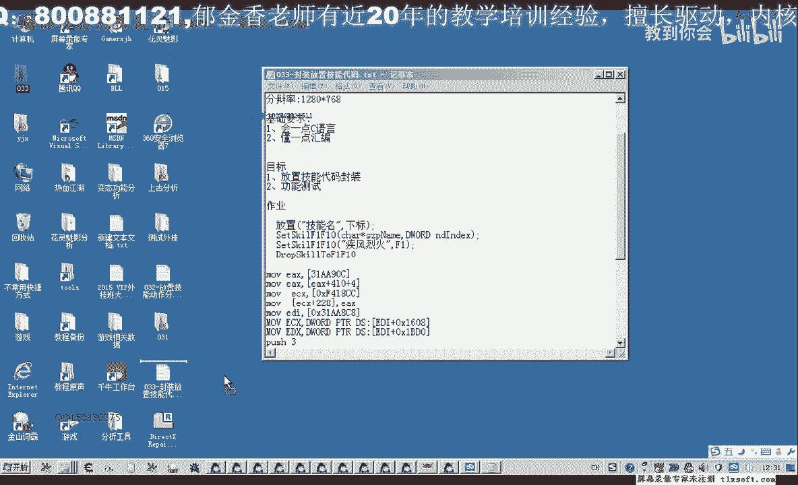
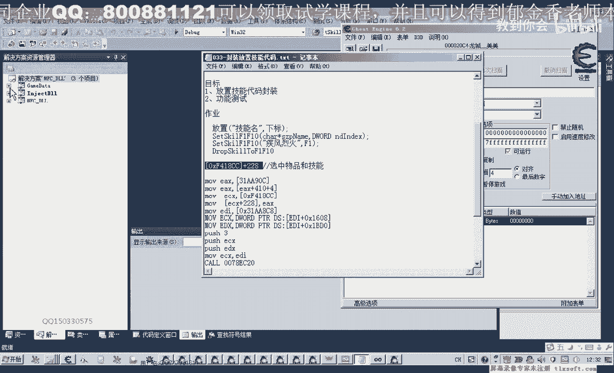

# 课程 P22：033-封装放置技能代码 🧩




在本节课中，我们将学习如何将上一节课分析的放置技能功能，封装成可复用的C语言代码。我们将创建一个函数，能够根据技能名称，将指定的技能对象放置到游戏界面的技能快捷栏（F1-F10）中。



---

上一节我们分析了放置技能的功能逻辑，本节中我们来看看如何将这些逻辑转化为结构化的代码。

首先，我们需要添加一个新的基址。这个基址用于处理选中技能对象。经过测试，我们发现该基址不仅在选中技能时有效，在选中背包中的物品或装备时也会被写入对象地址。因此，它并非技能专属，而是用于处理选中的物品或技能对象。它不能用于选中玩家自身或怪物（选中怪物使用数组下标，而物品和技能使用对象地址）。

以下是添加基址的步骤：
1.  展开基址单元。
2.  添加用于选中物品/技能的基址。

接下来，我们开始编写功能代码。我们将上节课分析的汇编代码转化为C语言函数。

这个函数应该放置在技能列表相关的结构单元中。我们计划将其放在技能对象处理模块（F1-F10区域）。

函数需要两个参数：
*   **技能名称**：用于查找对应的技能对象。
*   **放置下标**：指定将技能放置到F1-F10中的哪一个格子（例如，0代表F1，1代表F2，依此类推）。

函数的核心逻辑如下：
1.  **查找技能对象**：根据传入的技能名称，遍历技能列表，找到匹配的技能对象。
2.  **写入选中地址**：将找到的技能对象地址，写入到特定的偏移地址（`基址 + 0x288`）中，以完成“选中”操作。
3.  **调用放置功能**：模拟调用游戏内部的放置功能，将选中的技能放置到指定的快捷栏格子里。

在实现查找时，为了更方便地获取技能对象，我们在技能对象结构体中添加了一个新属性，用于直接返回其对象指针，避免了通过下标计算的复杂性。

以下是代码实现的关键部分（伪代码/注释形式）：

```c
// 函数：放置技能到快捷栏
// 参数：skillName - 技能名称， index - 快捷栏下标（0-9）
BOOL PlaceSkillToHotbar(const char* skillName, int index) {
    // 1. 初始化技能列表指针
    SkillList* pList = GetSkillListBase();
    if (!pList) return FALSE;

    // 2. 遍历技能列表，查找名称匹配的技能
    SkillObject* pTargetSkill = NULL;
    for (int i = 0; i < pList->count; ++i) {
        SkillObject* pSkill = pList->skills[i];
        if (!pSkill || !pSkill->id) continue; // 跳过无效项
        if (strcmp(pSkill->name, skillName) == 0) {
            pTargetSkill = pSkill;
            break;
        }
    }

    // 3. 如果未找到技能，返回失败
    if (!pTargetSkill) {
        LogDebug("未找到技能：%s", skillName);
        return FALSE;
    }

    // 4. 将技能对象地址写入“选中”基址（基址 + 0x288）
    DWORD selectAddr = GetSelectObjectBase() + 0x288;
    *(DWORD*)selectAddr = (DWORD)pTargetSkill;

    // 5. 内联汇编：调用游戏内部的放置功能
    __asm {
        mov edi, pTargetSkill      // 将技能对象放入edi
        mov ecx, index             // 将放置下标放入ecx
        push ecx                   // 参数压栈
        call [放置功能Call地址]     // 调用放置功能
    }

    // 6. 返回成功
    LogDebug("成功放置技能【%s】到位置F%d", skillName, index + 1);
    return TRUE;
}
```

在编写过程中，需要注意以下几点：
*   **汇编调用**：调用游戏功能需要使用内联汇编，并确保参数正确传递（如将下标放入`ecx`寄存器并压栈）。
*   **错误处理**：在遍历列表时，必须跳过无效（为空）的技能项，否则可能导致访问异常。
*   **字符串比较**：比较技能名称时需要使用`strcmp`等函数，并确保字符串以空字符结尾。

代码编写完成后，我们进行测试。例如，调用 `PlaceSkillToHotbar("疾风残影", 2)` 将“疾风残影”放置到第三个技能格（F3）。

首次测试出现了异常，原因是遍历技能列表时未过滤空对象。添加空值判断后，问题解决。

后续测试成功将“疾风残影”、“疾风烈火”等技能放置到了指定的快捷栏位置，验证了封装代码的功能正确性。

---

本节课中我们一起学习了如何封装放置技能的代码。我们实现了一个函数，能够根据技能名称查找对象，并通过写入内存和调用游戏内部函数的方式，将技能成功放置到快捷栏。这个过程涉及了基址操作、内存读写、汇编调用和基本的错误处理。


下节课，我们将继续分析F1-F10技能快捷栏的其他功能，以及技能的使用（攻击）功能。请大家可以提前尝试分析技能使用的相关调用。