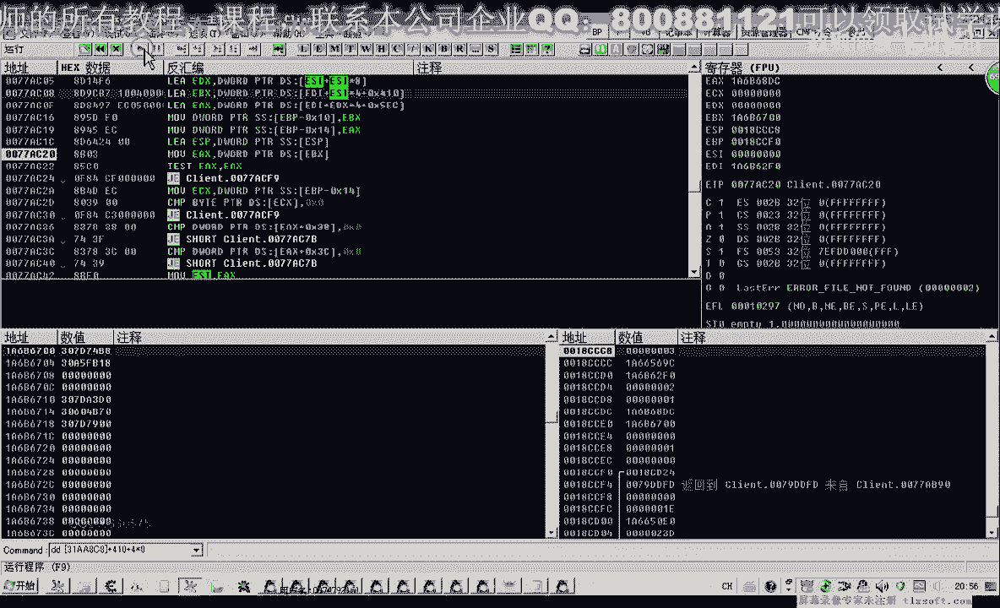
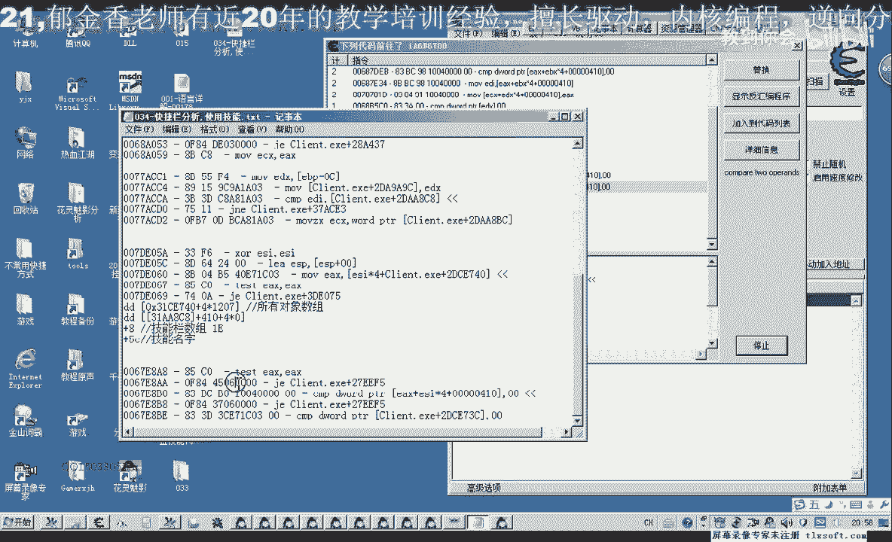
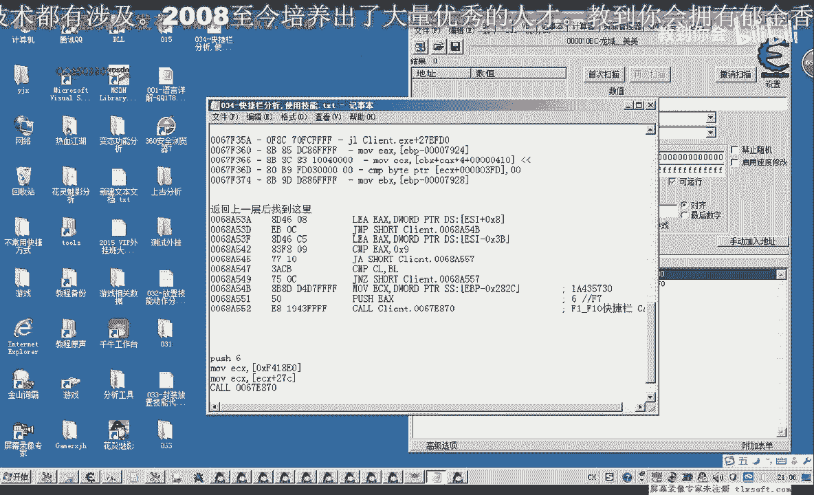
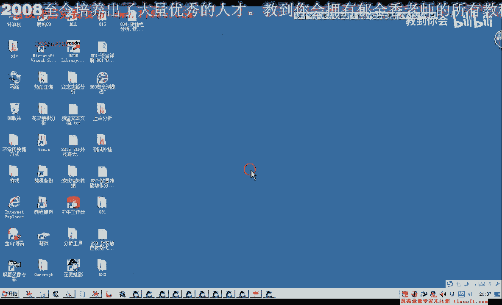

# 逆向教程 P23：034-快捷栏分析与技能调用 🎮

在本节课中，我们将学习如何分析游戏快捷栏的数据结构，并最终定位到调用技能的关键代码。整个过程将涉及内存扫描、数据结构分析、断点调试与代码注入等逆向工程基础技术。

## 概述：快捷栏数据结构分析

上一节我们介绍了游戏数据查找的基本思路。本节中，我们来看看游戏快捷栏的数据是如何组织的。游戏技能需要放置在快捷栏上，通过点击鼠标右键或按下F1-F10功能键来调用。因此，使用技能时，程序必定会访问快捷栏中对应“格子”的数据。这些数据很可能是一个数组，类似于背包或技能数组。

以下是分析快捷栏数据的基本步骤：

1.  **寻找F1格子数据**：使用CE（Cheat Engine）附加游戏进程，搜索F1格子中“物品对象”的地址。通过反复“放入物品”和“移开物品”操作，配合“变动的数值”与“未变动的数值”扫描，可以逐步缩小地址范围。
2.  **分析数据结构**：找到的地址值通常是一个指针（以`0x`开头的十六进制数）。对其下“访问该地址的代码”断点，可以找到读取该数据的代码片段。
3.  **定位数组基址**：在访问代码中，通常会看到一个基址加偏移的寻址模式，例如 `[模块基址+固定偏移+索引*4]`。其中的`模块基址+固定偏移`就是快捷栏数组的基址。
4.  **验证数据结构**：使用调试器查看该基址开始的内存，确认其是否为存放着一系列指针的数组，每个指针指向一个技能或物品对象。

通过以上步骤，我们找到了快捷栏数组的基址。接下来，我们需要了解数组中每个元素（即对象指针）所指向的数据结构。

## 技能对象结构解析


在找到快捷栏数组后，我们查看其内容。前几个元素存放着技能对象的地址。


以下是技能对象的关键属性偏移：

*   **对象名称偏移**：通过尝试，我们发现技能名称存储在对象指针指向地址再偏移 `+0x50` 的位置。
*   **对象类型标识**：在对象指针指向地址偏移 `+0xC` 的位置，可能存放着标识对象类型的值（例如，技能、物品等）。

快捷栏不仅可以存放技能，也可以存放背包中的物品。我们通过修改并查看不同下标对应的内存数据，验证了数组寻址公式的正确性：`数组基址 + 下标 * 4` 存放着对象指针。

## 定位技能调用函数 🎯

上一节我们分析了快捷栏的数据存储方式，本节中我们来看看游戏是如何调用这些技能的。我们的目标是找到按下快捷键（如F1）时，最终执行技能效果的函数。

以下是定位关键调用函数的步骤：



1.  **对技能对象下访问断点**：在调试器中，对快捷栏中某个技能对象的地址下“内存访问断点”。
2.  **触发断点**：返回游戏，按下该技能对应的快捷键（如F1）。由于游戏界面绘制也会读取技能数据，断点可能会频繁触发。我们需要关注在按下快捷键**瞬间**新出现的、且只执行一次的访问指令。
3.  **分析关键代码区域**：记录下这些关键的访问指令地址。它们很可能位于技能调用逻辑的附近。
4.  **回溯调用栈**：在这些关键地址上下断点，再次触发技能。当断点命中后，查看调用栈，返回到上层函数。这个上层函数很可能就是处理快捷键输入并准备调用技能的函数。
5.  **验证函数功能**：分析该函数的参数（通常传入快捷栏的下标，如F1对应0，F2对应1等）和上下文。通过编写简单的注入代码调用该函数，并观察游戏内技能是否被成功释放，来验证其正确性。

通过此方法，我们定位到了一个核心调用函数（CALL）。该函数需要一个基址（ECX寄存器）和一个下标参数（快捷键索引），其作用就是执行快捷栏中对应位置的技能或物品。

## 代码封装与调用示例



我们找到了技能调用的关键函数。在实际应用中，我们需要通过代码来调用它。

以下是调用该函数的代码逻辑示例：

```cpp
// 假设：
// g_QuickBarBase 是快捷栏数组的基址，通过逆向分析得到。
// g_SkillUseCall 是技能调用函数的地址。
// index 是要使用的快捷栏格子下标（0-9对应F1-F10）。


// 1. 获取技能对象指针
DWORD skillObjectPtr = *(DWORD*)(g_QuickBarBase + index * 4);


// 2. 检查格子是否为空
if (skillObjectPtr == 0) {
    return; // 格子为空，无法使用
}


// 3. 准备调用（__stdcall 调用约定示例）
__asm {
    mov ecx, g_QuickBarBase // 设置ECX为基址
    push index             // 按下标参数
    call g_SkillUseCall    // 调用技能使用函数
}
```

**注意**：`g_QuickBarBase`（即ECX的值）和`g_SkillUseCall`（函数地址）需要通过逆向分析动态获取，因为它们在每次游戏更新后可能会变化。此外，调用前务必确保目标格子有有效的技能或物品。

## 总结与下节预告

本节课中我们一起学习了如何从零开始分析游戏的快捷栏系统。

1.  **数据结构分析**：我们通过CE扫描和调试，确定了快捷栏是一个存放对象指针的数组，并找到了其基址。
2.  **对象属性解析**：我们探索了技能对象内部的部分属性，如名称和类型标识的存储位置。
3.  **关键函数定位**：通过内存断点和调用栈回溯，我们成功定位到了执行技能调用的核心函数。
4.  **调用原理实现**：我们了解了该函数的调用方式，并给出了模拟调用的代码框架。


通过本课，你掌握了分析游戏内列表型数据、定位关键功能函数的基本流程。下一节课，我们将以此为基础，对技能相关的操作进行更系统的代码封装，并探讨如何扩展更多自动化功能。





我们下节课再见。