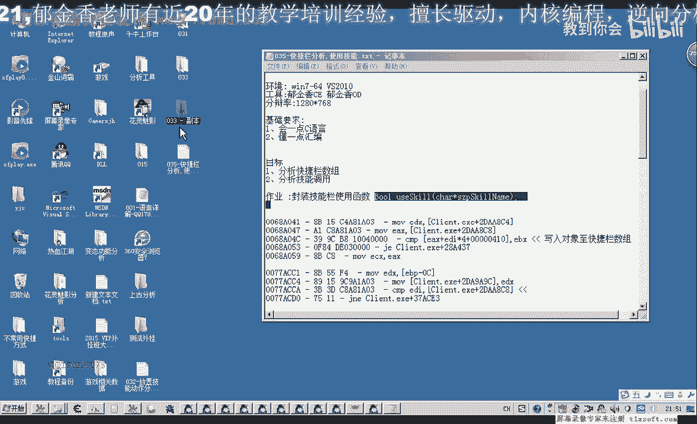
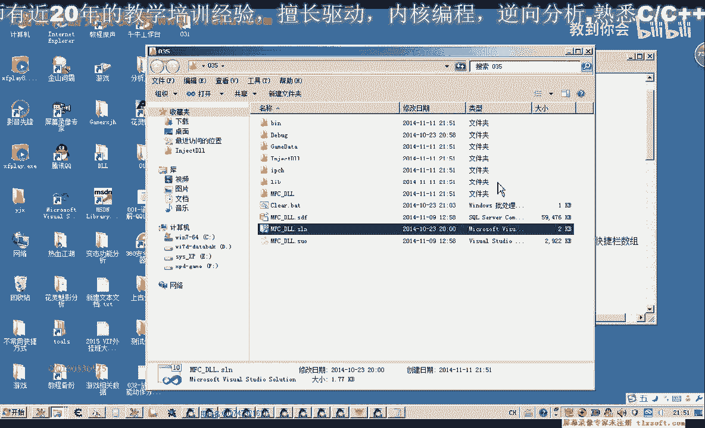
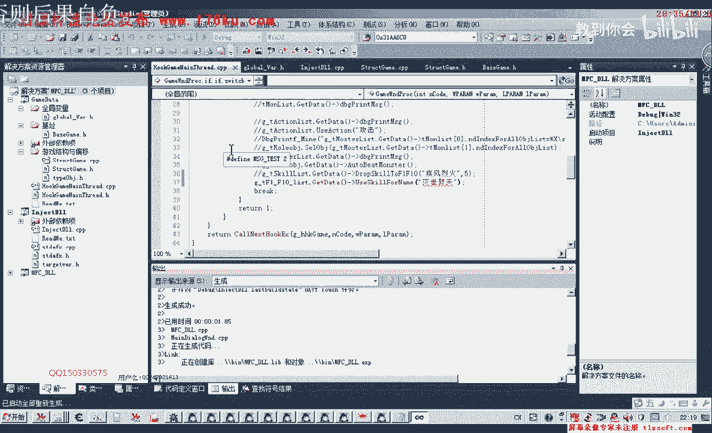
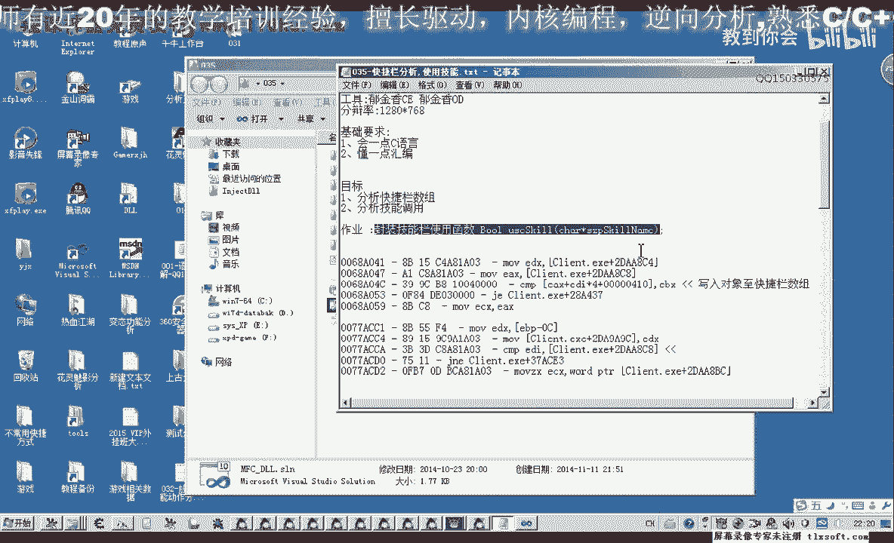

# 课程 P24：035 - 快捷栏分析与技能使用封装 🛠️



在本节课中，我们将学习如何整理并封装上一节课中分析的技能使用代码。我们将创建一个函数来管理快捷栏技能，并实现通过技能名称来调用技能的功能。



---

## 回顾与准备

上一节我们分析了技能的使用机制。本节中，我们将在此基础上进行代码整理和函数封装。

我们打开第33课的代码作为基础。


在此代码基础上，我们进行修改。


首先，我们需要添加快捷栏的相关机制。这包括快捷栏数据数组（F1到F10）和放置技能所需的参数。

以下是放置技能参数的代码片段，它实际上就是我们今天要操作的技能数组。

```cpp
// 放置技能参数（技能数组）
// 代码位置...
```

我们可以直接使用这个参数，并为其取一个更合适的名字。然后，在更新基础数据时，更新这个地址。

此外，我们还需要添加技能调用的代码（快捷栏调用函数）。我们将其添加在合适的位置。

添加完成后，我们检查并添加一个 `ecx` 参数，其偏移地址为 `0xF41810`。这里需要一个偏移计算公式，我们将其一并加入。

完成这些准备工作后，我们就可以开始封装函数了。

---

## 封装快捷栏数据读取函数

首先，我们封装一个函数来读取和处理快捷栏数据。

上一节课中，我们只是将技能放置到了F1到F4的快捷栏上。现在，我们需要完整地封装整个快捷栏（F1到F10）的数据。

快捷栏数组的大小是10。我们还需要定义一个技能栏对象结构体，其中包含对我们有用的属性：**技能名**和**技能类型**。

以下是定义技能栏对象和初始化数组的步骤：

1.  获取基础数据地址。
2.  加上数组的起始偏移 `0x4100`。
3.  循环遍历数组（索引0到9），读取每个技能栏的数据。
4.  判断读取的值是否为空。如果为空，则跳过；如果不为空，则继续读取技能名和类型。
5.  将读取到的数据赋值给我们定义的技能栏对象列表。

在复制数据前，需要进行指针类型转换和空值判断。为了方便管理，最好将常用的偏移地址集中管理在一个单元中。

初始化完成后，我们使用 `memset` 对数组进行清零初始化，并定义好相应的数据类型。

---

## 封装使用技能的函数

接下来，我们封装一个通过技能名称来使用技能的函数。

这个函数需要根据传入的技能名，在快捷栏数组中查找对应的下标，因为调用技能的功能函数需要下标作为参数。

查找下标的逻辑可以集成在这个函数内部。步骤如下：

1.  遍历快捷栏技能数组。
2.  将数组中每个技能的名字与传入的参数进行比较。
3.  如果找到相同的名字，则记录其下标。

找到下标后，就可以调用上一节课中分析的技能调用功能。该功能调用涉及以下操作：

*   将下标值放入 `eax` 寄存器。
*   设置 `ecx` 和 `edx` 参数。
*   加上特定的偏移值（例如 `0x227C` 和 `0x374`）。
*   最后进行函数调用 `call`。

为了代码健壮性，在调用核心功能时，应该添加异常处理。如果发生异常，则直接返回失败。

函数封装完成后，我们进行编译。

---

## 测试与调试

生成成功后，我们需要将代码注入游戏进行测试。

在测试单元中，我们添加相应的测试代码。例如，获取技能对象，然后调用 `UseSkillByName` 函数，并传入技能名“疾风烈火”。

首次测试可能不成功。我们需要通过调试信息来排查问题。可能的原因包括：

*   技能名拼写错误（例如“疾风烈火”写成了“疾风灭火”）。
*   数组中存在空数据，导致比较时出错或引发异常。
*   代码没有正确执行到目标函数。

解决方法是在关键位置添加调试输出信息，并确保对数组中的空元素进行了判断和跳过处理。

修正所有问题后，重新编译并注入测试。此时，选中一个怪物，然后调用技能，应该可以成功释放“疾风烈火”。

我们可以再测试另一个技能，如“裂石劈天”，以确保函数的通用性。

---

## 课后作业与完善

本节课留下一个作业：完善 `UseSkillByName` 函数。



当前函数假设要使用的技能已经存在于快捷栏上。但如果技能不在快捷栏上，函数就会失败。

作业要求是：当在快捷栏中找不到传入的技能名，但该技能确实可用时，如何编写代码自动将该技能放置到一个空的快捷栏格子上，然后再调用它？

思路提示：
1.  遍历快捷栏，找到第一个为空的格子。
2.  调用之前已实现的“放置技能到快捷栏”函数，将目标技能放入该空位。
3.  放置成功后，再调用技能使用函数。

这样，`UseSkillByName` 函数就更加完善和实用了。




---

## 总结

本节课中，我们一起学习了以下内容：
1.  回顾并准备了技能使用的代码基础。
2.  封装了读取快捷栏数据的函数，定义了技能栏对象结构。
3.  封装了通过技能名称使用技能的 `UseSkillByName` 函数，包括查找下标和调用核心功能。
4.  进行了代码的测试、调试与问题修复。
5.  提出了进一步完善函数的作业，使其能够处理技能不在快捷栏上的情况。


通过本课的学习，你应该掌握了如何组织代码、封装功能模块，并处理简单的游戏逻辑。