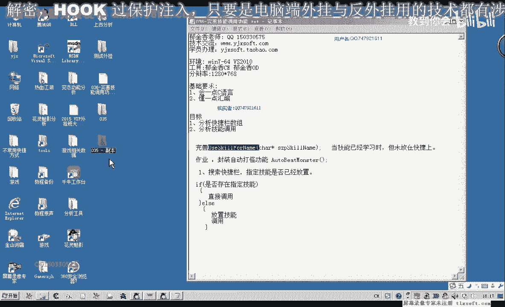
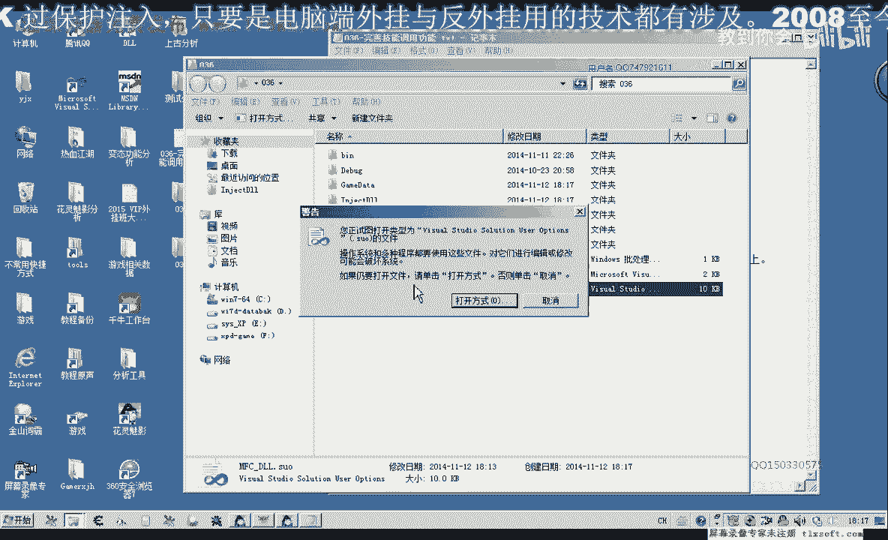
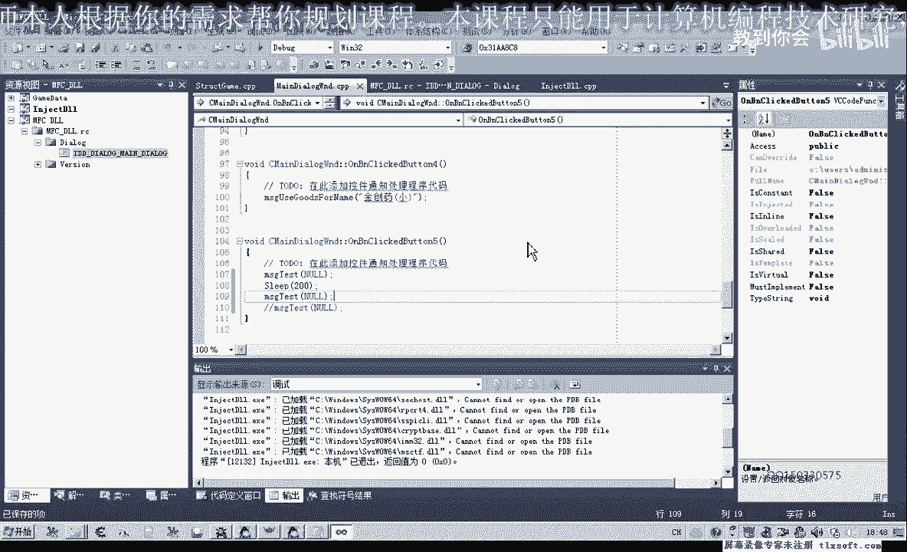

# P25：036-完善技能调用功能 - 教到你会 - BV1DS4y1n7qF

大家好，我是京翔老師，那麼在上一期的時候，來留了一個作業給大家，就是要完善使用技能的這個函數，那麼當時的情況的話，也就是說這個技能，要需要在技能列表裏面存在，我們才能夠標案這個技能。

但是如果是有的時候上面的技能不存在的話，我們需要另外編寫一段代碼，先把它移植到我們的跨界欄上面，但是本身放置技能到某一格這個函數，我們已經把它封裝好了，但是我們需要加的判斷。

就是要判斷這上面是否存在技能，那麼在放置的時候，那麼新的技能究竟該放在某一格，是放在第一格還是第二格，那麼如果它是有已經定格有技能的話，那麼我們是要放在第二個，也就是說要找空的位置，那麼好的。

我們打開第35課的代碼，然後我們的機制單元。

再把它添加一下，在一起，可能是清理垃圾文件的時候，把相應的配置文件給清理掉，再把它添加進去，然後我們就把這個文件放到第35課，然後我們就把這個文件放到第35課，然後我們就把這個文件放到第35課。

然後我們就把這個文件放到第35課，然後我們就把這個文件放到第35課，然後我們就把這個文件放到第35課，然後我們就把這個文件放到第35課，然後我們就把這個文件放到第35課。

然後我們就把這個文件放到第35課，然後我們就把這個文件放到第35課，然後我們就把這個文件放到第35課，然後我們就把這個文件放到第35課，然後我們就把這個文件放到第35課。

然後我們就把這個文件放到第35課，然後我們就把這個文件放到第35課，然後我們就把這個文件放到第35課，然後我們就把這個文件放到第35課，然後我們就把這個文件放到第35課。

然後我們就把這個文件放到第35課，然後我們就把這個文件放到第35課，然後我們就把這個文件放到第35課，然後我們就把這個文件放到第35課，然後我們就把這個文件放到第35課。

然後我們就把這個文件放到第35課，然後我們就把這個文件放到第35課，然後我們就把這個文件放到第35課，然後我們就把這個文件放到第35課，然後我們就把這個文件放到第35課。

然後我們就把這個文件放到第35課，然後我們就把這個文件放到第35課，然後我們就把這個文件放到第35課，然後我們就把這個文件放到第35課，然後我們就把這個文件放到第35課。

然後我們就把這個文件放到第35課，然後我們就把這個文件放到第35課，然後我們就把這個文件放到第35課，然後我們就把這個文件放到第35課，然後我們就把這個文件放到第35課。

然後我們就把這個文件放到第35課，然後我們就把這個文件放到第35課，然後我們就把這個文件放到第35課，然後我們就把這個文件放到第35課，然後我們就把這個文件放到第35課。

然後我們就把這個文件放到第35課，然後我們就把這個文件放到第35課，然後我們就把這個文件放到第35課，然後我們就把這個文件放到第35課，然後我們就把這個文件放到第35課。

然後我們就把這個文件放到第35課，然後我們就把這個文件放到第35課，然後我們就把這個文件放到第35課，然後我們就把這個文件放到第35課，然後我們就把這個文件放到第35課。

然後我們就把這個文件放到第35課，然後我們就把這個文件放到第35課，然後我們就把這個文件放到第35課，然後我們就把這個文件放到第35課，然後我們就把這個文件放到第35課。

然後我們就把這個文件放到第35課，然後我們就把這個文件放到第35課，然後我們就把這個文件放到第35課，然後我們就把這個文件放到第35課，然後我們就把這個文件放到第35課。

然後我們就把這個文件放到第35課，然後我們就把這個文件放到第35課，然後我們就把這個文件放到第35課，然後我們就把這個文件放到第35課，然後我們就把這個文件放到第35課。

然後我們就把這個文件放到第35課，所以說我們要用整形來表示，所以說我們要用整形來表示，不能用我們的DWORD，DWORD是無符號數，不帶複數的，不帶複數的，然後我們移到最後，(音樂)，(音樂)。

(音樂)，(音樂)，嗯嗯嗯嗯嗯嗯，(Ping Pong)，嗯，听起来很平凡，跳舞的时候觉得融洞的，不过舞蹈也不算很平淡。这种舞蹈 lovers是一个很好的朋友。另外，跳舞的舞蹈组也会给大家带来的。

(音乐)，(音乐)，(音乐)，(音乐)，(音乐)，(音乐)，(音乐)，(音乐)，(音乐)，(音乐)，(音乐)，(音乐)，(音乐)，(音乐)，(音乐)，(音乐)，(音乐)，(音乐)，(音乐)，(音乐)。

(音乐)，(音乐)，(音乐)，(音乐)，(音乐)，(音乐)，(音乐)，(音乐)，(音乐)，(音乐)，(音乐)，(音乐)，(音乐)，(音乐)，(音乐)，(音乐)，(音乐)，(音乐)，(音乐)，(音乐)。

(音乐)，(音乐)，(音乐)，(音乐)，(音乐)，(音乐)，(音乐)，(音乐)，(音乐)，(音乐)，(音乐)，(音乐)，(音乐)，(音乐)，(音乐)，(音乐)，(音乐)，(音乐)，(音乐)。

那么放置技能的话是另外一个结构里面的，是技能结构里面的，(音乐)，(音乐)，这个F10 E到F10，然后呢是一个技能名，但是这个时候呢我们，之前的话它是放置的是一个技能名，放置到这里，这个技能栏上面。

但我们现在所要的是放置技能名，后面还有一个下标，对了这里有一个下标，我们就是这个查询它的，这个空位置的一个下标，这个空位置的一个下标，我们把它放置进去就好了，(音乐)，好那么这里写好之后。

那么还有另外一种情况，另外一种情况呢，就是呢它等于-1，-1也就是说整个这个技能栏上面，都放置满了这个技能，那么这个时候呢我们直接打印一段调试信息，(音乐)，那么放置这段调试信息之后呢。

然后呢我们把Fast这个函数，就是说使用这个技能的话就没有调用成功，那么我们再编一下，(音乐)，然后我们再转到我们的这个游戏主线层里面，看一下测试单元，使用烈士披天，那我们看一下烈士披天的话。

如果没有在上面，在上面的是其他几个技能，那么我们做一下相应的一个测试，(音乐)，(音乐)，打开我们的调试信息，查看器查看器看有没有错误，那么注入进去之后，我们先挂接主线层，然后呢。

然后我们选中一个怪物进行一个测试，但是这个时候我们看啊，放置了这个烈士披天，但是它并没有掉落这个技能，那么说明的话还是有点问题，是有点问题，我们再测试一下，(音乐)，那么重新我们把这个代码需要看一下。

使用技能分类，那么这里来放置到技能栏，那么放置之后我们并没有使用这个技能，那么所以说在这里放置之后，我们还是要调用一下，(音乐)，或者在这个二十就不要了，这里让它始终都要执行到这一行。

那么这里在放置技能之后，我们这个Ni Index也需要进行一个复制，复制为我们的Ni取得的这个下标，取得的这个下标词，然后呢，再执行到我们在后边，它始终就会掉落这个技能，(音乐)，好的。

那么我们再次编译一下，(音乐)，那么这里它掉落之后还需要看一下，它有没有成功，如果是没有成功的话，也需要它有可能就是说在掉落的时候不成功，这里出现了异常，那么也可以加上一个判断，也可以不加，好的。

那么先测试一下，(音乐)，挂接主线材，然后我们选中一个怪物，(音乐)，这个时候来测试PK不存在，然后我们，它也是要第二次才可以执行，(音乐)，那么再来看一下我们的代码，(音乐)，那么这里可能是两个动作。

一个是放置，一个是使用技能，那么它这两个动作之间，应该是需要一个，需要一段时间来发送到我们服务器上面，有可能是这样，那么我们再重新编一下，这个逻辑上它是没有错过的，那么可能就是一个主线材的一个占用。

那么在这里它放置了技能之后，它会向服务器有可能要发送一个什么信息，也可能，那么它要等到服务器处理之后，要过个几秒钟的时间，或者是一小段时间，才能够使用这个技能，那么也可能是我们刚才的代码。

还没有重新编译，我们再重新测试一下，这里我们打印一下调试信息，放置技能，我们再来看一下这个逻辑，这里找到一个空位，放置技能，我们要看它放置成功率，好，我帮你弄一个，嗯，嗯，嗯，嗯，嗯，嗯，嗯，嗯，嗯。

嗯，嗯，嗯，好 那麽我們再重新把它編譯一下，嗯，你是要第二下好像才可以，那麽聽一下，他只是放著了，你在技能這個動作，沒有攻擊我們的怪物，第二下來才攻擊，如果是這樣的話，我們可以嘗試，那麽先放置技能。

然後再等待一段時間，這個就不能夠放在主線層裏面寫，要放在主線層之外，這兩個我們要分開寫，那麽我們可以把這個功能分開的話，就是，看，move scale，關鍵，那麽我們就是先放置技能，然後或者這樣。

我們看一下，按鈕，這裏，我們寫兩個，另外一個MSG，TEST，再發送一個信息，發送兩次，那麽也可以，那麽也可以實現剛才的一個功能，那麽這裏需要一個Sleep，一段時間，那麽再發送這個消息就可以了。

那麽解決這種情況，那就相當於第一次調動了，這個時候，因為它服務器的信息還沒有反饋過來，那麽調用這裏的話，實際上當時的話，這個技能應該是還沒有放進去的，沒有真正的放置成功，那麽所以說要第二次調用的時候。

它才會成功，那麽這個時候我們看它就可以了，實際上我們可以把調用技能和前面的兩塊分開寫，但是我們就下一節課的時候，後面我們再進行一下修改，我們只要知道這個原因就行了，那麼原因也就是說在這裏，它放置了技能。

我們這個代碼執行的時候，它沒有等待的時間，實際上它沒有完全的放置在上面，那麽所以說在後面，它可能是不成功，那麽所以說要第二次才可能，我們再來看一下這個服務器，然後等於-1，執行完了之後，這裏有個返回。

這個是不會執行的，那麽應該是執行到這裏的第一次，我們還可以加一個調試信息在這裏，調用技能，再測試一下，看是什麽原因，那麽再把我們這邊的改一下，然後我們再輸入，畫質處現場，那麽我們發現的話。

這個時候掛接主現場的話，它這裏並沒有我們相應的消息，消息傳過來，我們再選擇，這次好像可以了，移除去了，我們再測試一下，這段消息，它始終沒有打印，打印我們執行的那一段消息，整擴的，畫質處現場，然後呢。

這次成功了，那我們來看一下，把這個Sleep去掉，看看，然後我們再退回來，那麽這個調試信息的話，它應該是要打印，但是為什麽沒有打印，那麽我們再重新編輯，再看一下，再調整，把這個移開，調用，使用了。

這個技能二已經切換到我們相應的位置了，但是它也是要第二次調用才成功，那麽看一下，加上剛才那個Sleep，是不是剛才的Sleep的原因，這次的Sleep，畫質處現場，然後我們一起看，選中一個怪物，測試。

這個時候還是沒有動作，那麽說明的話，這個技能要調用成功的話，它可能還是要服務器，它有檢測，這個數據，放在這個技能欄上面的數據，你要先傳到服務器上面，所以說這裡它需要等待一段時間，所以說這個需要調用兩次。

但是我們可以了，這裡的話可以把它分開寫，那麽具體怎麽寫，我們到下一節，在晚上這個代碼，那麽這節我們就到這裏，那麽這個結果臨時的解決辦法，我們就是在這裏調用兩次，就可以，調用兩次，好的。

那麽我們下節課再見，謝謝。

請不吝點贊訂閱轉發打賞支持明鏡與點點欄目。