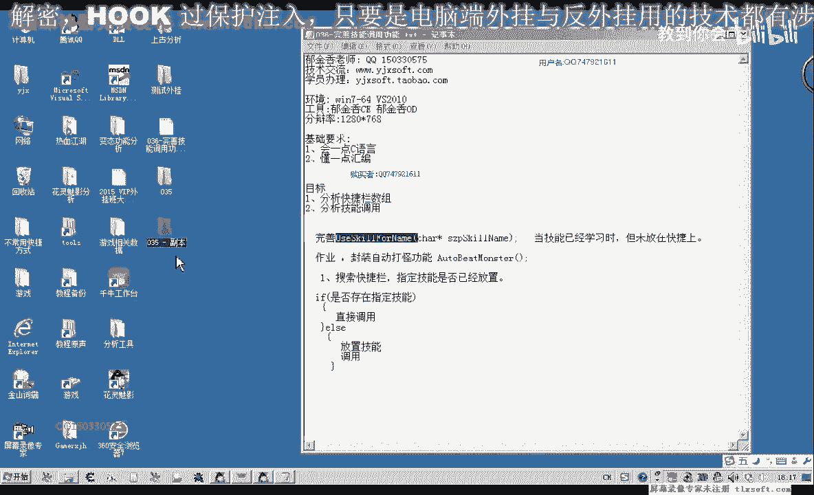
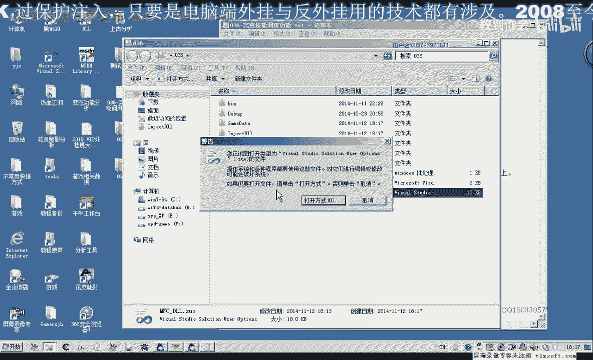

# 课程 P25：036 - 完善技能调用功能 🛠️



在本节课中，我们将学习如何完善一个游戏中的技能调用功能。核心任务是修改代码，使得当技能不在快捷栏时，能自动将其放置到空位后再使用。



## 概述

上一节我们介绍了技能调用的基础逻辑。本节中，我们来看看如何完善它，主要解决技能不在快捷栏时需要先放置技能的问题。

## 回顾与问题分析

在上一期课程中，我们留下了一个作业：完善使用技能的`函数`。当时的情况是，技能需要存在于技能列表中才能被成功调用。

如果技能不存在于当前快捷栏，我们需要额外编写一段代码，先将该技能移植到快捷栏上。虽然将技能放置到指定格子的函数已经封装好，但我们需要增加判断逻辑。

需要判断快捷栏上是否存在该技能。在放置新技能时，我们需要决定将其放在哪一格：是第一格还是第二格？如果某一格已有技能，我们应将其放在第二个空位，即需要寻找空位置。

## 代码修改步骤

我们打开第35课的代码，并在机制单元中进行修改。


以下是修改代码的核心步骤：

1.  **添加配置文件**：由于清理垃圾文件时可能删除了配置文件，需要重新添加。
2.  **修改放置技能逻辑**：在放置技能的函数中，需要传入一个下标参数，用于指示将技能放置在快捷栏的哪个空位。
    *   核心概念是**寻找空位**。代码逻辑是遍历快捷栏，找到第一个为空的格子索引。
    *   关键代码示意：
        ```cpp
        int findEmptySlot() {
            for (int i = 0; i < slotCount; i++) {
                if (skillSlot[i] == EMPTY) {
                    return i; // 返回空位的索引
                }
            }
            return -1; // 没有空位，返回-1
        }
        ```
3.  **处理技能栏已满的情况**：如果`findEmptySlot`函数返回`-1`，表示技能栏已满。此时应打印调试信息，并标记技能使用失败。
4.  **整合到技能调用函数**：在调用技能的主函数中，先检查技能是否已在快捷栏。如果不在，则调用`findEmptySlot`获取空位索引，然后调用放置技能的函数。之后，再执行使用技能的操作。

## 测试与发现的问题

按照上述步骤修改代码后，我们进行测试。使用技能“烈焰披天”，该技能初始并不在快捷栏上。

测试发现，技能被放置到了快捷栏，但并没有立即对怪物生效，需要第二次调用技能时才会成功攻击怪物。

## 问题分析与临时解决方案

分析表明，问题可能出在**时序**上。客户端将技能放置到快捷栏的操作需要发送到服务器端处理，这个过程需要一定时间。如果放置后立即调用技能，服务器可能尚未更新状态，导致调用失败。

以下是临时的解决方案：

1.  **连续调用两次**：在代码中，放置技能后，立即再次发送使用技能的消息。这相当于手动补偿了服务器处理的延迟。
2.  **添加短暂延迟**：在放置技能和使用技能之间，插入一个短暂的等待（例如使用`Sleep`函数）。这给了服务器处理时间。
    *   关键代码示意：
        ```cpp
        placeSkillToSlot(skillName, emptySlotIndex); // 放置技能
        Sleep(100); // 等待100毫秒
        useSkill(skillName); // 使用技能
        ```

## 总结

本节课中，我们一起学习了如何完善技能调用功能。

1.  我们**回顾了问题**：需要处理技能不在快捷栏的情况。
2.  我们**修改了代码**：增加了寻找快捷栏空位并放置技能的逻辑。
3.  我们**进行了测试**并**发现了新问题**：由于服务器-客户端通信延迟，放置技能后立即使用可能会失败。
4.  我们**分析了原因**并给出了**临时解决方案**：通过连续调用两次或添加短暂延迟来确保技能使用成功。

这个临时方案揭示了客户端与服务器同步的重要性。在下一节课中，我们将探讨如何更优雅地处理这种异步操作，例如将放置技能和使用技能拆分为两个独立的、可定时触发的操作单元。


