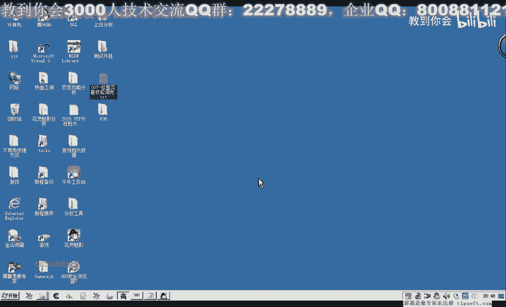
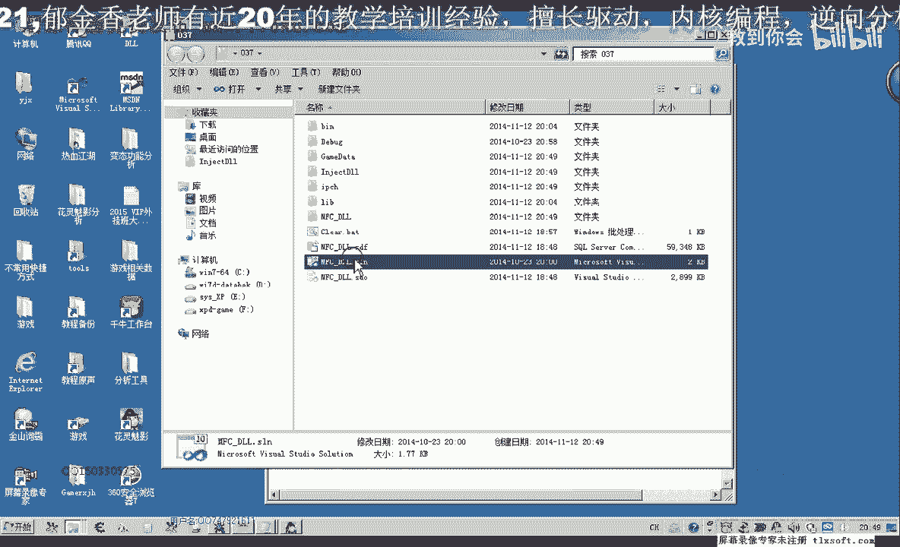
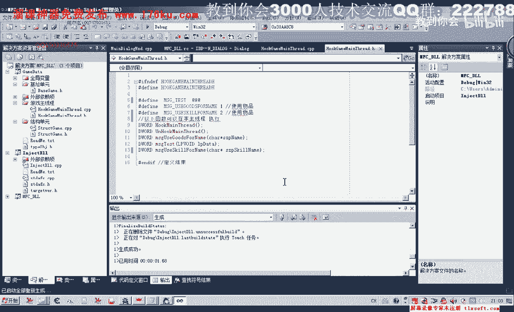
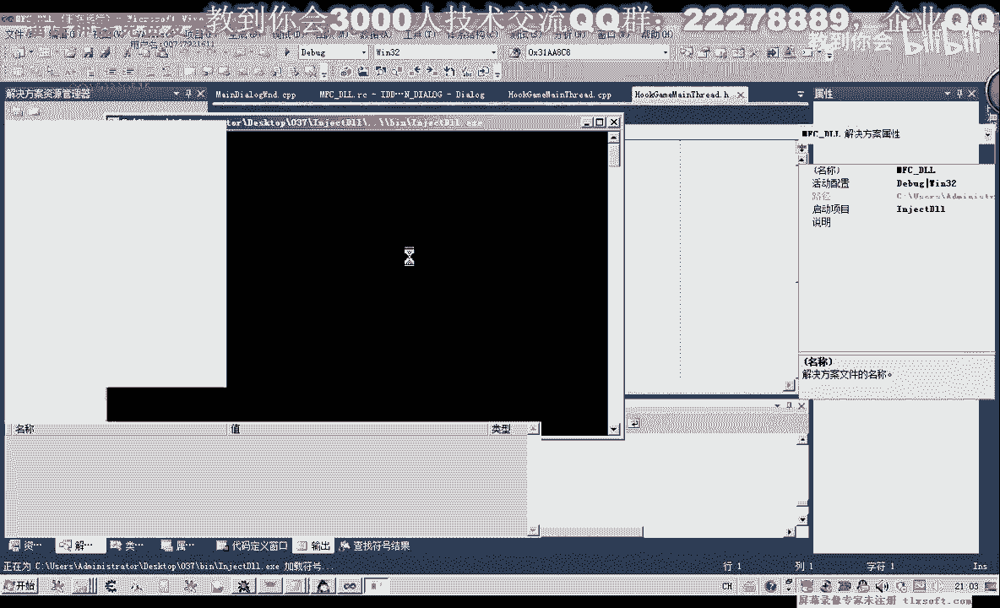
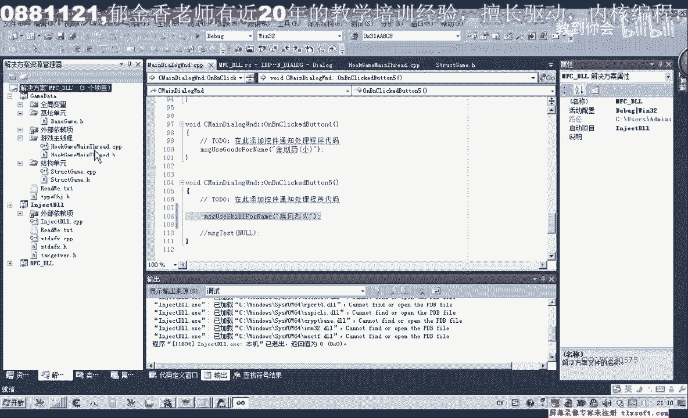
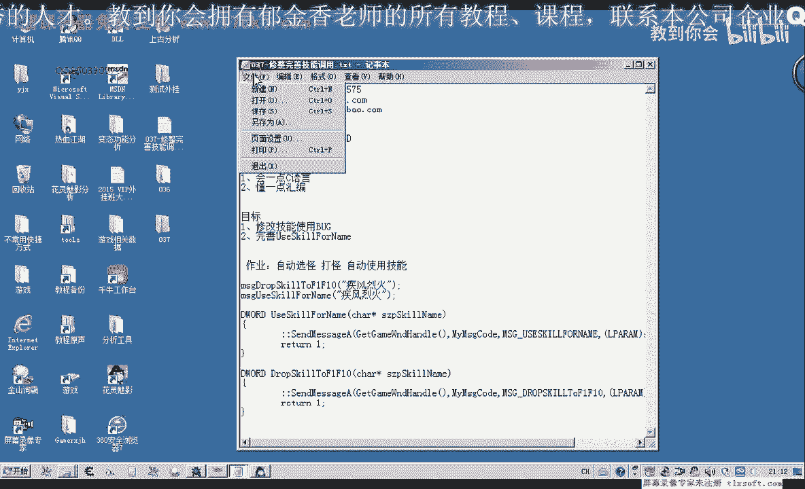
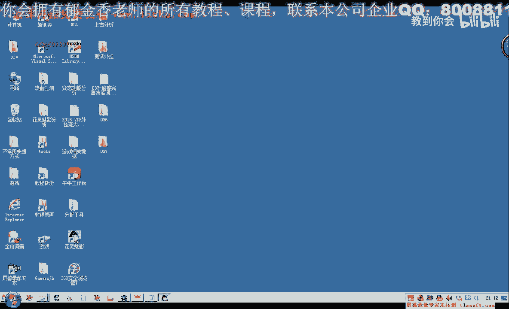

# P26：037-修整完善技能调用 - 教到你会 - BV1DS4y1n7qF

大家好。

我是郁金香老師，前面一刻我們在調用技能的時候出了一些問題，那麼這幾個我們就解決這些問題，主要我們先打開第36個的代碼，那麼首先我們先修改一下。

放置技能的這個函數，那麼找到我們的技能結構，技能列表，那麼我們在另外給它寫一個函數，同名的，因為前面一個函數，我們在放置技能的時候，我們需要指定一個下標，那麼這個函數，我們就讓它自動的找空位置，然後放。

然後如果是指定的對象已經在我們的技能欄上，比如說放置面試內任，它檢測到已經在快捷能上面存在，那麼就不用再放置了，就直接去返回，那麼所以說我們在這裏需要修改一些代碼，那麼一到代碼單元，一到最後。

那麼我們要做的第一個，就是檢測技能是否在快捷欄上已經存在，那麼如果已經存在的話，那麼就直接就返回空就行，那麼這個我們可以通過F1快捷欄，它裏面提供了一個相關的一個函數。

getting-text-for-name來檢測，那麼指定的技能是否存在，那麼在這裏我們定義一個變量，我們做一個判斷，那麼如果N1它等於-1，那麼我們就，如果它等於-1的話，我們才繼續後面操作。

但如果它已經大於等於0，不等於-1的話，也就是大於等於0，那麼大於等於0的話，說明它返回的是一個下標，那麼返回的如果是下標表示它存在，那麼存在的話，我們就不用放置了，它已經放置在快捷欄上面。

那麼另外一種情況，我們才需要找空位置，放置進去，然後我們就將就前面的變量用，然後我們需要調用機，我們需要一個空的位置，返回的一個下標，那麼如果空的下標也沒有找到的話，那麼就證明我們這個技能欄。

它已經佔用滿了，佔用滿了，並且不存在，如果這個還是等於-1的話，還是沒有獲取到正確的座標的話，那麼我們就打印出調試信息，快捷欄，已經滿了，那麼快捷欄滿的情況，你可以做自己的處理。

或者我們強制的放到第一個，擠佔其他的技能的位置，或者我們就不做處理，直接我們就返回一個BUS，就直接就返回，那麼如果獲取的座標，它不等於-1，是一個正常的座標，那麼我們再調用另外一個存在的函數。

它帶了下標的函數，我們直接調用就行，然後再返回，或者是直接它本身的返回值也是過日子，或者我們直接就返回前面函數的一個結果，也可以這樣寫，或者這樣寫，可能要清晰一些，好的那麼我們再編一下。

那麼這個地方在上一期看還有一個BUG，那麼這裡如果我們已經找到了，就應該退出這個循環，這樣算法的話更優一些，當然如果不退出來，它也不會出錯，因為後面的名字它都不相等，但這裡加上一個Break。

這樣我們可以少佔一些CPU的時間，可以少幾站一些CPU時間，這是放置技能這一塊，我們再檢查一下，那麼邏輯上我們看還有沒有錯，代碼已經沒有錯，放置我們的技能，然後這是獲取我們的下標，好。

那麼這個函數我們修改完了之後，我們還需要修改另外一個函數，技能使用的，這個那麼技能使用的，我們因為放置技能的，在這個我們已經寫的很簡單，那麼在這裡我們就把它也簡化一下。

那麼我們就不需要這些檢測的這些功能，直接就使用這個技能就行，GPU-X4-Link，然後我們檢測，看檢測到，檢測到的話，我們就把它寫好下標，那麼在後面的這一段，我們就可以不要了。

這樣我們把它弄得簡單一些，我們再測試一下，好，嗯，这次我们修改代码之后，它好像可以实现了，这里没有放相应的这个技能，那么说明我们上一节的代码就只有这些错误，但是最好的话我们是把它分开写，可能要好一些。

使用的时候，再测试一下，把相应的技能，你看，说明相关的放置在技能栏上的数据，它应该是没有发送到我们服务器上面，我们再看一下代码，这样使用它已经可以了，那么说明我们上一节看到一些猜想是错误的。

那么这个过程暂时就这样封装，那么我们在封装好了之后，我们把它添加到我们的现成的单元，也封装一个类似的函数，那么前面我们有一个使用物品的，那么这里也有一个使用技能的，加上一个。

那么我们参照前面的代码修改就行，这个把它提前把它的改一下，使用技能，那么这个函数改了之后，我们也在主现成单元来给它添加相应的代码，添加在测试代码的前面，这样我们可能好发逻辑。

然后我们在这里后面的代码复制一下，跟前面比较相似，我们复制前面的这一段代码，那么复制了之后，这里我们也把我们技能里面的指针给它传进去，这个消息的类型，我们要修改技能的相关消息，修改之后。

我们需要在前面的开始语句里面加上我们的消息处理，那么这里实际上我们就是调用相关的技能使用，这里到底，那么这里我们也是按照前面的方式，参数给它转换一下，好，那么下次要调用的话，我们就直接可以调用。

Message，User，Skill，Wallet，那么这样我们这个函数的话，那么这些下边的所有函数，我们都可以在非主线程里面，以下可以在非主线程，那么这里我们再改一下相应的一个测试。

上一期看我们这里是它加了两次，所以才可以，那么我们再来测试一下，如果这里它只调用一次的话，那么可不可以，我们先做一下测试，这个动态链接库没有卸载掉，我们再重新卸载一次，(音樂)，(音樂)，(音樂)。

這裡編譯失敗了，這裡我們不需要參數，這個數值機我們已經使用過了，這裡我們需要另外使用一個數值，我們再測試一下。

掛機到主現場。

然後我們選出一個怪物，依然是可以執行的，說明我們上一次所說的那種情況，這個數據要發到服務器，實際上它放置這個技能的話，應該是不會傳到服務器，或者是這個技能已經在上面放著，我們再把它脫掉，再看一下。

把它脫開之後好像是不行了，這個是老麻，那麼我們還是要按兩次，那麼這種的話，我們還是需要把它分開寫來解決，我們再來看一下，移到相應的技能使用這個單元，這個單元實際上可以不改。

那麼我們要改的就是需要把它寫成兩個，叫客來執行，或者這一段我們把它去掉，那麼如果它是等於負一的情況的話，我們直接就放著或者是打印一段調試信息，那麼這裡就只有一個放置的機制了，這個機制是可以不改的。

我們只要把它設定成一個新的機制，然後我們就把這個機制設定成一個新的機制，然後我們就可以在這個機制裡面，把它設定成一個新的機制，然後我們就把它設定成一個新的機制，然後我們就把它設定成一個新的機制。

然後我們就可以把它設定成一個新的機制，那麼我們就把它設定成一個新的機制，那麼這裡就只有一個放置技能的動作，那麼如果它不存在的話，我們就去拖動相關的技能，放置在技能欄上面，我們把它分開來執行。

那麼所以說這裡我們需要另外寫一個放置的一個函數，寫到我們的這個主線成這裡，那麼剛才只是一個使用技能，我們還需要另外一個函數，要放置技能的，這個，那麼這裡寫了這個函數之後，我們移到主線成。

在SCP和客主線成的單元，然後來添加我們相應的函數，把上面這一段補製一下，那麼只是這裡的消息類型，我們還需要另外建一個消息的類型，那麼放置我們的技能，那麼這裡消息的類型，我們需要變動一下。

那麼再切換到我們的相應的消息處理，那麼在這裡我們再教用真正的放置技能的函數，那麼再把上面的這一段補製一下，那麼在編輯，那麼在我們主線成這個單元，我們就有兩個函數了，一個是放置，一個是我們使用技能。

那麼這兩個函數，我們再傳到測試單元這裡來調用就可以了，我們就調用其風6號，這個，讓它先放置技能，然後我們再使用技能，這個時候應該就可以了，那麼我們再輸入到遊戲裏面，先把相應的技能先把它移開。

然後再選中一個怪物，然後掛機到主線上，然後執行，那麼這個時候第一次它就可以了，把它放到上邊，並且可以執行，然後移開，這個時候我們就只需要了一次，這樣調用就可以了，當然如果我們要把它封裝成一個函數的話。

我們就需要了把這兩段代碼寫到，寫到一個庫裏面就可以了，那麼我們也可以把它這樣寫，如果是要寫成一個的話，你就把這一段放置的代碼，我們添加到這後面的相應的一個單元，這是我們放置技能，這是使用技能。

那麼我們可以把它添加到這個單元，它會自動的檢測，如果存在的話，它不會放置，不會存在的話，它就會放置一個，那麼這樣我們只需要放心的使用我們的技能，就可以了，那麼就不需要兩次的調用，好的，我們再編一下。

他們在選擇一個怪物，然後來掛接到主線程，執行，這樣就可以了，好的，那麼也就是說我們在有的代碼，我們該封裝在主線程裏面，那麼有的代碼，我們不能夠寫在主線程裏面，這裏，那麼這段代碼它就沒有包含在主線程。

那麼哪些代碼它會在主線程裏面執行，那麼只有我們通過消息發送到這個Case。

那麼這個單元裏面的代碼，它才是掛接在我們的主線程上面來執行，這個跟WMDPIO，這裏面的所有Case單元的，它才會在主線程裏面執行，所以說我們一定要把它區分開，最好我們就是說，單獨的功能。

我們都在主線程之外，給它封裝一個函數，然後把消息投遞到主線程，這樣來執行的話，比較安全一些，不容易出問題，好的，那麼今天這節課我們就講到這裏，那麼我們下一節課，大致的可能就要完成我們怪物的選中。

自動打怪的相關功能，那麼上一節我本來也跟大家做了，那麼如果做好沒有做好的，再繼續完成一下，就是自動選怪打怪的時候，來使用技能，那麼把這些代碼自己做一下，自動選怪打怪，自動使用技能，好了。

那麼我們下一節課再見。

