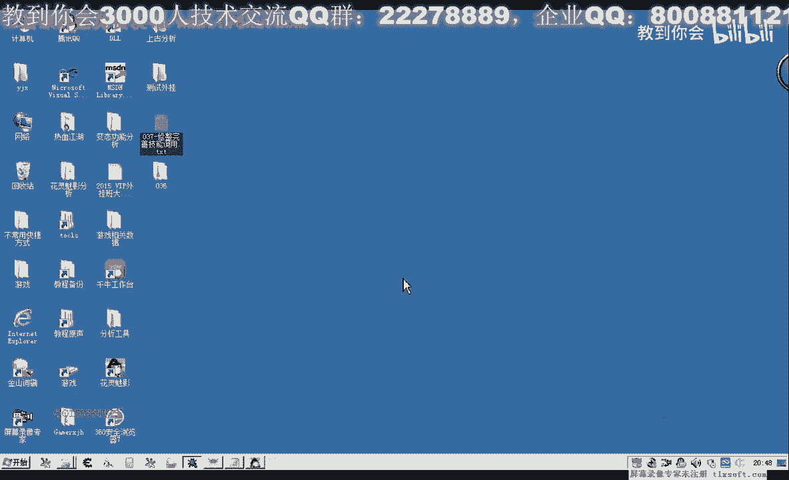
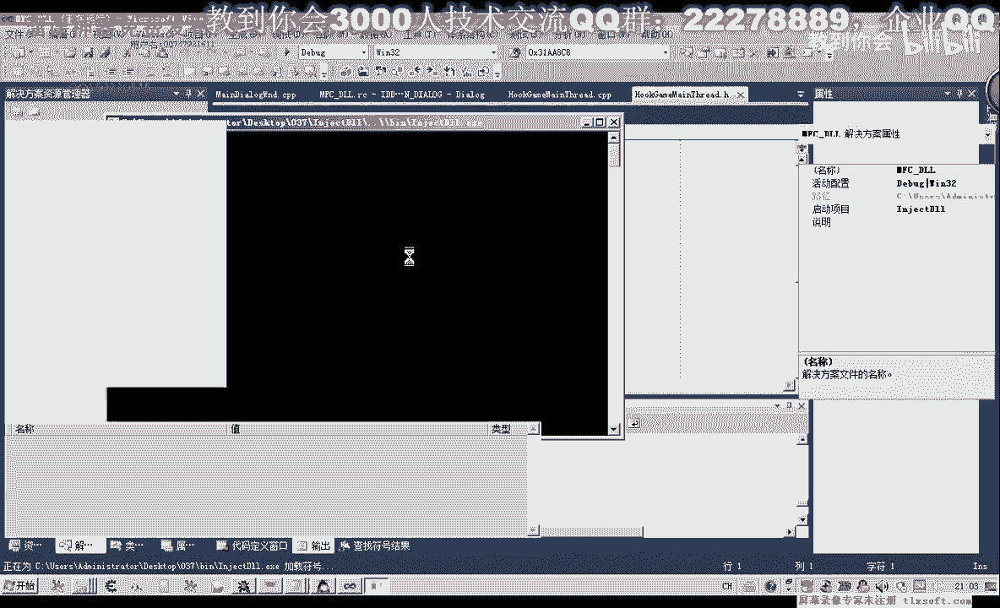
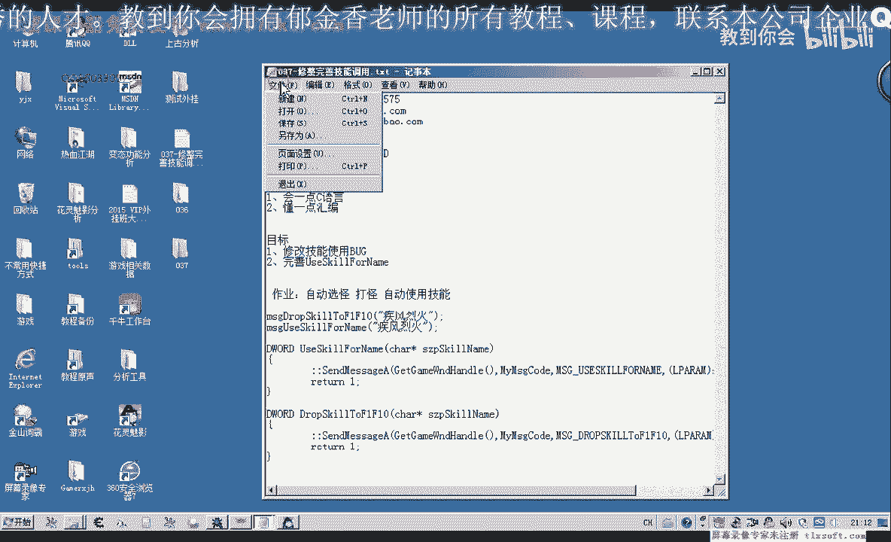
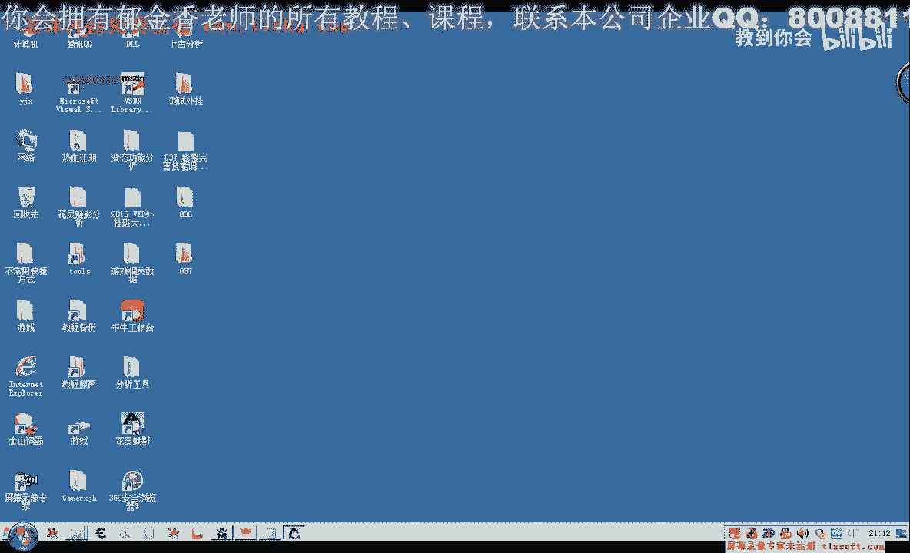

# 课程 P26：037 - 修整完善技能调用 🛠️




在本节课中，我们将学习如何修复和优化游戏技能调用的代码。我们将解决上一节课中遇到的技能放置和使用问题，并通过重构代码使其更健壮、更易于使用。


---

## 概述

上一节我们介绍了技能调用的基本方法，但在测试时遇到了一些问题。本节中，我们将通过修改代码来解决这些问题，核心目标是实现一个能自动检测技能栏状态、智能放置并使用技能的函数。

---

## 修改放置技能函数

首先，我们需要修改放置技能的代码。之前的函数需要手动指定技能栏下标，现在我们要创建一个同名的新函数，让它能自动寻找空位并放置技能。

以下是修改后的函数逻辑：

1.  **检测技能是否已存在**：如果技能已经在快捷栏上，则无需再次放置。
2.  **寻找空位**：如果技能不存在，则寻找一个空位置。
3.  **处理栏位已满**：如果没有空位，则进行相应处理（如提示或强制放置）。

我们使用 `GetIndexForName` 函数来检测技能是否存在。如果返回 `-1`，表示不存在；如果返回大于等于 `0` 的数值，则表示该技能已存在，其返回值就是技能在栏位中的下标。

```pascal
function PlaceSkillAuto(SkillName: string): Boolean;
var
  ExistingIndex, EmptyIndex: Integer;
begin
  // 1. 检测技能是否已存在于快捷栏
  ExistingIndex := F1Hotbar.GetIndexForName(SkillName);
  if ExistingIndex >= 0 then
  begin
    // 技能已存在，直接返回
    Result := False;
    Exit;
  end;

  // 2. 寻找空位置
  EmptyIndex := FindEmptySlotInHotbar();
  if EmptyIndex = -1 then
  begin
    // 快捷栏已满，打印调试信息或进行其他处理
    DebugPrint('快捷栏已满');
    Result := False;
    Exit;
  end;

  // 3. 调用带下标参数的放置函数
  Result := PlaceSkillAtIndex(SkillName, EmptyIndex);
end;
```

在循环查找技能时，一旦找到匹配项，建议使用 `Break` 语句退出循环，这样可以优化性能，减少不必要的CPU时间占用。

---

## 简化技能使用函数

上一节我们介绍了技能调用的基本流程，本节中我们来看看如何简化技能使用的代码。

修改完放置函数后，技能使用函数也可以相应简化。我们不再需要复杂的检测逻辑，直接调用技能即可。

以下是简化后的技能使用函数示例：

```pascal
procedure UseSkillSimple(SkillName: string);
var
  SkillIndex: Integer;
begin
  SkillIndex := F1Hotbar.GetIndexForName(SkillName);
  if SkillIndex <> -1 then
  begin
    // 直接使用指定下标的技能
    UseSkillByIndex(SkillIndex);
  end;
end;
```

这样，代码逻辑变得更加清晰和直接。

---

## 封装线程安全函数


为了保证代码在多线程环境下的安全性，我们需要将技能操作封装到主线程中执行。以下是具体步骤：



1.  **创建消息类型**：定义两种消息类型，分别用于“放置技能”和“使用技能”。
2.  **封装调用函数**：创建两个函数（如 `PostPlaceSkill` 和 `PostUseSkill`），它们负责将相应的消息投递到主线程的消息队列。
3.  **主线程消息处理**：在主线程的 `WndProc` 或消息循环中，处理这些自定义消息，并调用真正的技能放置或使用函数。

以下是投递使用技能消息的函数示例：

```pascal
procedure PostUseSkillToMainThread(SkillName: string);
var
  Msg: TCustomMessage;
begin
  Msg.MsgType := MSG_USE_SKILL;
  Msg.Data := SkillName;
  PostMessage(MainWindowHandle, WM_USER_MESSAGE, 0, LPARAM(@Msg));
end;
```

通过这种方式，无论你在哪个线程调用 `PostUseSkillToMainThread`，实际的技能使用代码都会在主线程中安全执行。

---

## 整合与测试

我们将修改后的放置函数和使用函数整合起来。为了确保技能一定能被使用，我们可以创建一个整合函数：

```pascal
function EnsureAndUseSkill(SkillName: string): Boolean;
begin
  // 尝试放置技能（内部会检测是否已存在）
  PlaceSkillAuto(SkillName);
  // 使用技能
  UseSkillSimple(SkillName);
  Result := True;
end;
```

现在进行测试：
1.  将技能从快捷栏拖走。
2.  选中一个怪物。
3.  调用一次 `EnsureAndUseSkill` 函数。
4.  观察技能是否被自动放置到快捷栏并成功释放。

经过测试，现在只需要调用一次，即可完成技能的放置和使用，解决了之前需要调用两次的问题。

---

## 核心要点总结

本节课中我们一起学习了如何完善技能调用系统，以下是核心要点：


*   **自动检测与放置**：通过 `GetIndexForName` 函数智能判断技能状态，并自动寻找空位放置。
*   **代码简化**：优化了技能使用逻辑，使其更直接。
*   **线程安全**：通过消息投递机制，确保所有涉及游戏UI的操作都在主线程中执行，这是避免许多潜在问题的关键。公式表示为：**游戏UI操作 ⊆ 主线程**。
*   **函数整合**：创建了 `EnsureAndUseSkill` 这样的高层函数，为后续的自动打怪脚本提供了方便、安全的接口。

区分代码执行环境非常重要：只有通过消息机制投递到主线程消息循环（如 `WndProc` 中的 `case` 分支）的代码，才会在主线程中执行。将功能封装成函数，再通过消息调用，是最佳实践。

---



## 下节预告



在下一节课中，我们将利用本节课封装好的技能调用函数，结合之前学习的选怪功能，实现完整的自动选怪、自动打怪流程。请大家提前尝试将选怪逻辑与技能调用结合起来，我们下节课再见！👋