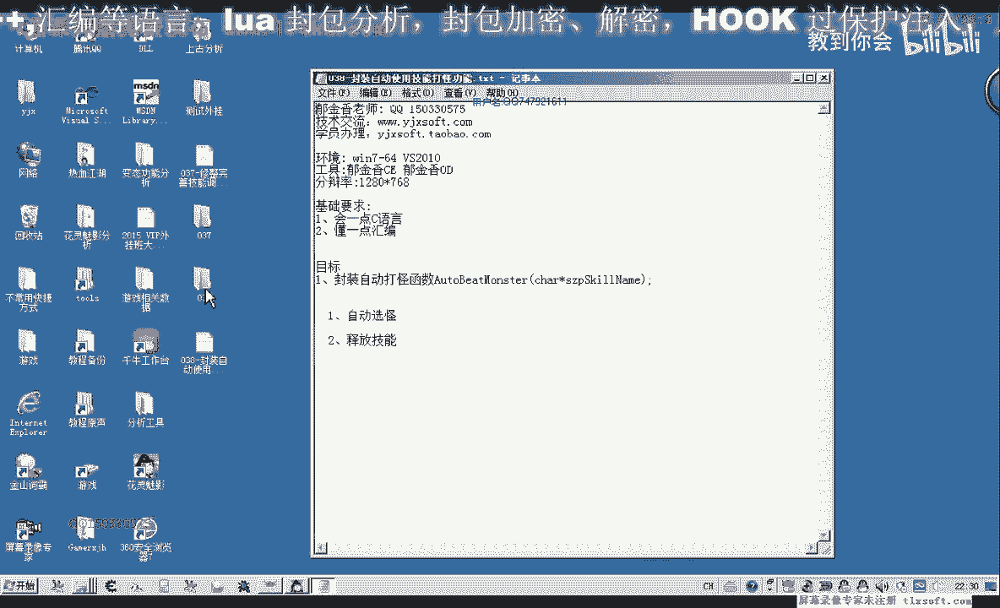
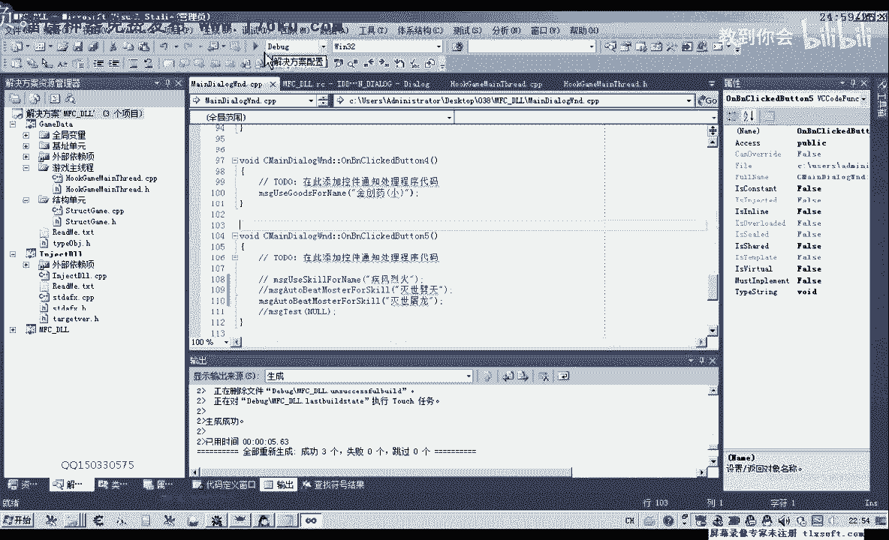

# 课程 P27：038 - 封装自动使用技能打怪功能 🎮




在本节课中，我们将学习如何修改已有的自动打怪功能，使其能够自动使用指定的技能攻击怪物。我们将基于上一节课的代码，通过添加参数和逻辑判断来实现这一功能。

---

上一节我们介绍了基础的自动打怪功能，它仅使用了普通攻击动作。本节中，我们来看看如何将其升级为能够使用特定技能进行攻击。

首先，我们需要在玩家角色相关的结构单元中找到已有的自动打怪函数。这个函数目前没有参数，仅执行普通攻击动作。

为了使其能够使用技能，我们将在该函数后面创建一个新的函数，并为其添加一个参数，用于接收要使用的技能名称。

以下是修改步骤：

1.  复制原有的自动打怪函数代码。
2.  在新函数中，将原来的普通攻击动作替换为使用指定技能的动作。
3.  考虑到技能可能未被放置在快捷栏上，我们需要在使用技能前，先调用放置该技能的函数。

以下是核心代码修改的逻辑：

```cpp
// 伪代码示例：新的自动打怪函数
void AutoAttackWithSkill(const char* skillName) {
    // 1. 尝试将技能放置到快捷栏
    bool isSkillPlaced = PlaceSkillToBar(skillName);
    
    // 2. 根据放置结果决定后续操作
    if (isSkillPlaced) {
        // 技能放置成功，使用该技能攻击
        UseSkill(skillName);
    } else {
        // 技能放置失败，回退到使用普通攻击
        NormalAttack();
    }
}
```

接下来，我们需要在主线程单元中调用这个新函数，并在消息处理线程中响应相应的指令。

以下是消息处理流程：

1.  定义一个消息类型，用于触发“自动打怪使用技能”的操作。
2.  在消息处理函数中，解析出传递过来的技能名称参数。
3.  调用我们新封装的 `AutoAttackWithSkill` 函数。



在测试过程中，我们发现如果技能未修炼，即使能放置到快捷栏也无法使用。当前的代码逻辑对此情况处理不足，它仍会显示“使用技能”，但实际并未生效。

本节课中我们一起学习了如何封装一个能自动使用技能打怪的函数。我们通过添加技能参数、前置放置技能检查以及完善失败处理逻辑（回退到普攻），构建了功能的核心框架。目前代码已能处理技能放置与使用的基本流程，但对于“技能未修炼”等特殊情况，还需要后续课程进一步优化处理逻辑。