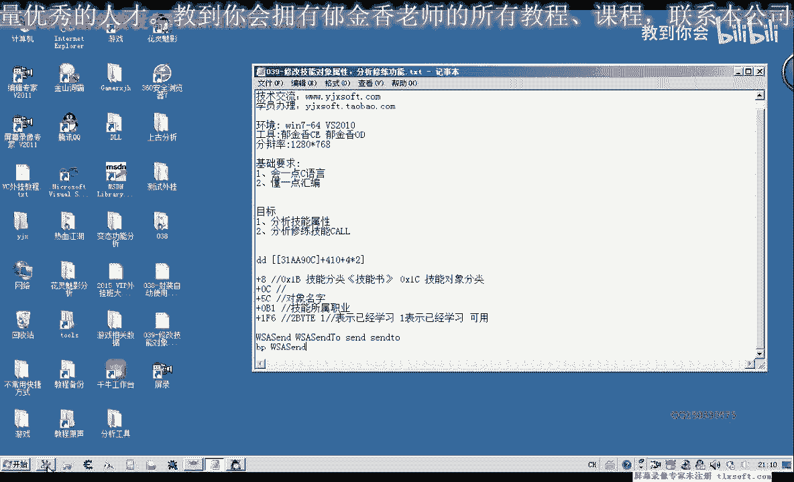
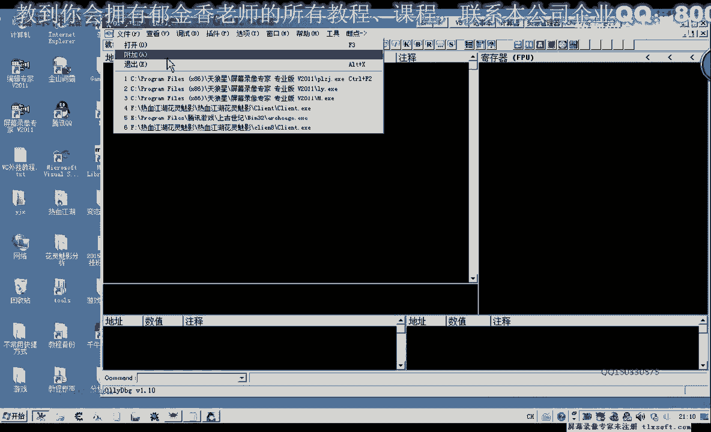
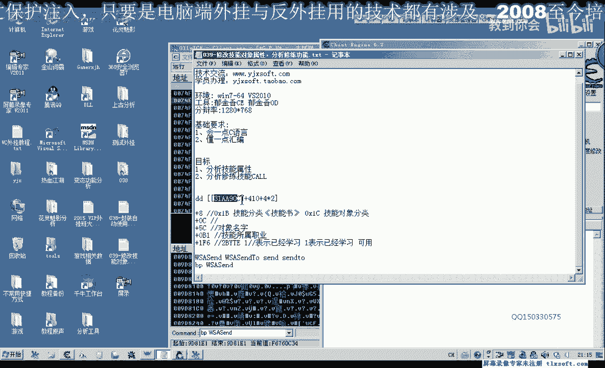
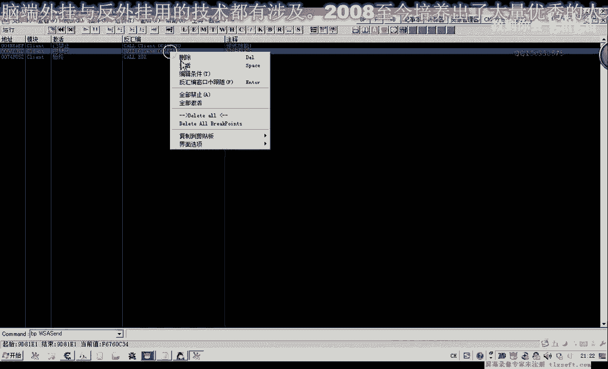

# 课程 P28：039 - 修改技能对象属性与分析修炼功能 🛠️

在本节课中，我们将学习如何通过分析游戏封包和内存数据，来修改技能对象的属性，并实现技能的自动修炼功能。我们将从基础的内存偏移分析开始，逐步定位到关键的调用函数。

## 概述

在前面的课程中，我们分析了技能的使用功能。但该功能仍有改进空间。例如，某些技能（如“劣势陀螺”）虽然满足了学习条件，但因未“修炼”而无法放置在技能栏上。本节课，我们将分析“修炼”功能的实现逻辑。通过判断技能学习条件是否满足，并调用相关函数，可以实现技能的自动修炼。

修炼技能的数据会发送到服务器，因此我们可以从封包入手进行回溯分析。发包函数通常有几种，本游戏使用的是第一种。我们将为其设置断点来截取封包，并通过封包回溯找到修炼技能的关键代码位置。



## 分析过程



首先，我们打开调试工具并附加到游戏进程。


附加成功后，我们在发包函数处下一个断点，然后切换回游戏并点击“修炼”按钮。


程序会在断点处中断。我们取消断点，然后执行“运行到返回”操作。

在这里可以看到程序调用了发包函数。通常需要向上返回两到三层才能找到真正的功能调用（CALL）。我们在这一层标注为“修炼技能1”，这可能是修炼技能的相关调用。

我们在此处下断点，再次执行“运行到返回”。在返回后的位置也有一个CALL，我们同样下断点。重复此过程，在更上一层的返回位置再下一个断点。

然后让程序运行起来。我们发现其中一个断点会被反复触发，即使只点击了一次“修炼”。这说明该处可能处于循环中，是修炼功能核心逻辑的可能性较小。



其他三个调用位置的可能性更大。由于当前没有更多技能可供测试，我们需要逐一分析。当我们没有可修炼技能时点击按钮，某个位置也会中断，但其可能性相对较小。

## 修改技能属性以触发修炼

在之前的分析中，我们曾发现一个属性（偏移 `EF6`）用于表示技能是否已学习。通过修改这个属性，可以尝试让“修炼”按钮重新出现。


该属性涉及两个偏移量：基址偏移 `410` 加上技能索引（例如第一个技能是 `414`），以及属性偏移 `EF6`（两字节）。我们需要同时修改这两个位置的数据。

以下是修改第一个技能属性的示例代码结构：
```cpp
// 假设 baseAddress 是技能对象基址
*(WORD*)(baseAddress + 0x414 + 0xEF6) = 0; // 将“已学习”状态改为0
```

修改后返回游戏查看，此时“修炼”按钮应该会重新出现。点击该按钮，让程序在我们怀疑的CALL处中断，以便分析其参数。

## 分析调用参数

中断后，我们观察寄存器的值。通常 `EAX` 或 `ECX` 会包含可变参数。例如，`EAX` 的值可能是 `0x0D`，而 `ECX` 的值可能来源于 `[ESI+0x24C]`。

我们需要记录下这些参数值。例如：
*   参数1: `0x18A4CC`
*   参数2: `0x1870`
*   参数3: `0x319F`

`EAX` 可能是一个数据缓冲区的首地址，其大小可能超过 `0x13E` 字节。

为了更好地区分参数，我们可以修改其他技能的属性进行测试。例如，将技能2（偏移 `418`）和技能3（偏移 `41C`）的“已学习”状态也改为0，然后分别触发它们的修炼，观察 `EAX` 等参数的变化规律。

测试第一个CALL时，我们发现 `EAX` 的值按 `0x01`, `0x13`, `0x14` 等序列变化，这可能代表技能在服务器上的ID或某种下标。

## 尝试调用修炼函数

基于以上分析，我们可以尝试编写代码来调用这个修炼函数。其调用形式可能类似于：
```cpp
// 伪代码示例
push 0;            // 参数3
push eax_value;    // 参数2 (如 0x0D, 0x13)
push 0x3F4;        // 参数1 (可能是一个固定标识)
mov edx, [ecx];    // ECX来源于某个固定地址
call edx+4;        // 调用函数
```

我们将 `EAX` 的值（如 `0x0D`）和 `ECX` 的来源地址填入代码，然后注入游戏进行测试。如果调用成功，游戏中的技能1应该会被修炼。

用同样的方法修改参数，也可以尝试修炼技能2。

但这个调用方式存在一个麻烦：需要找到 `ECX` 的来源地址，并且不清楚它如何与具体的技能（如“接红灭火”、“接红断目”）关联起来。它们之间应该存在某种映射关系。

## 分析其他候选函数

我们还需要分析另外两个中断的CALL位置，通过对比，找出哪个调用逻辑更简洁、更易于使用。




这三个可能的位置都可以进行深入分析，以确定最终的解决方案。

## 总结

本节课中，我们一起学习了如何通过内存修改触发技能修炼按钮，并通过封包回溯找到了疑似修炼技能的功能调用。我们分析了该调用的参数，并尝试编写了调用代码。目前面临的主要挑战是如何建立调用参数与具体技能之间的稳定关联。课后，请大家将本节课分析的函数参数作为练习，进一步梳理其规律。我们下期再见。