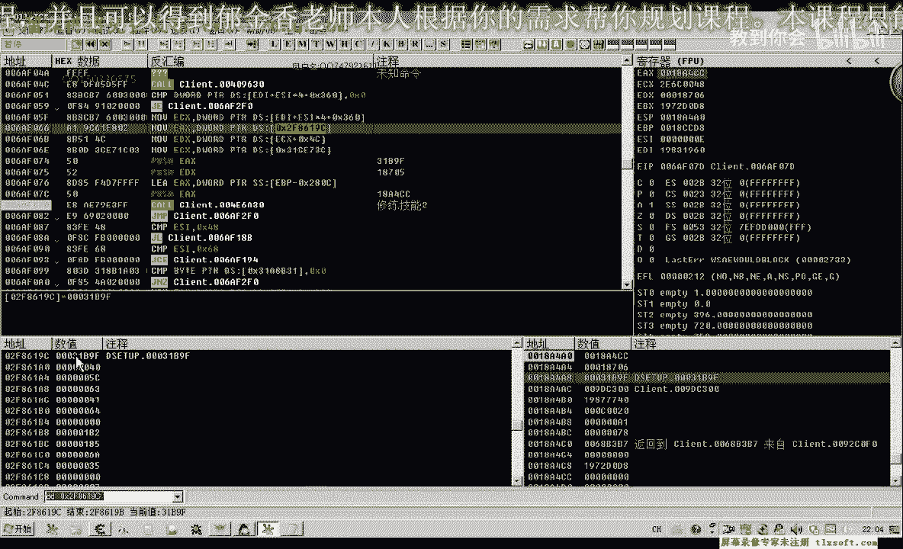
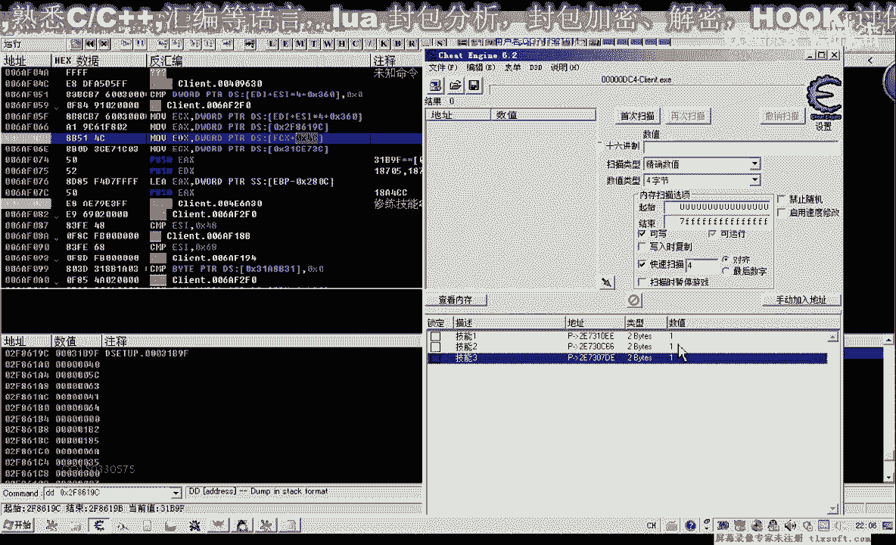
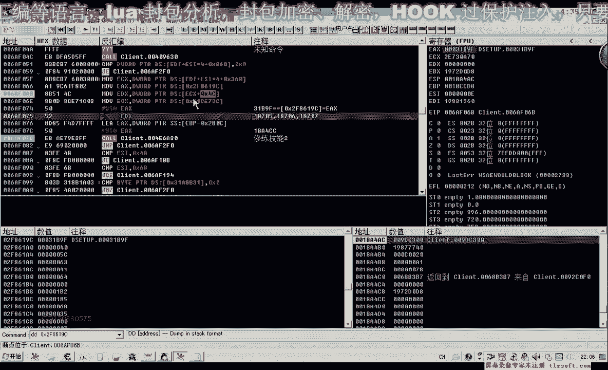
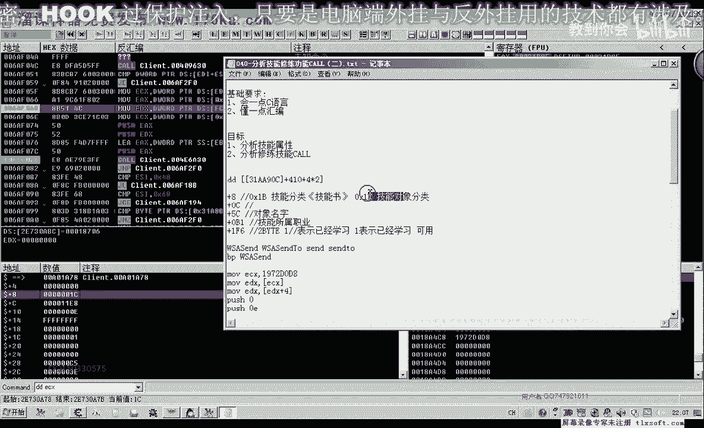
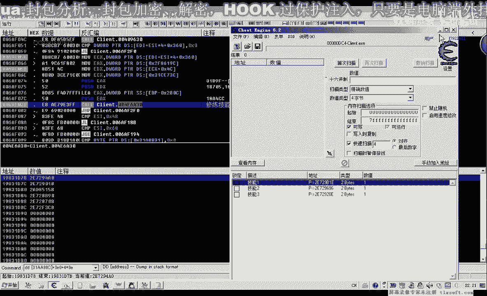
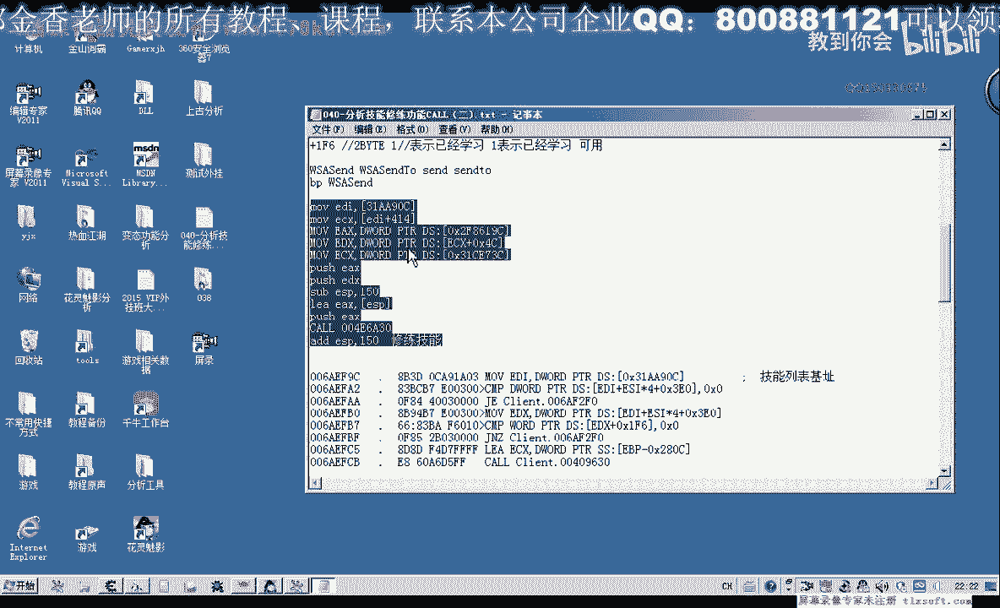

# 逆向分析课程 P29：040-分析技能修炼功能CALL（二）🔍


在本节课中，我们将继续分析游戏中的技能修炼功能。上一节我们分析了第一个相关的CALL，但其参数与技能对象的关联性不强，使用起来较为复杂。本节我们将分析后续两个CALL，目标是找到参数更简单、与技能对象直接关联的理想调用方法。


---


## 分析第二个技能修炼CALL

我们打开调试工具，定位到第二个技能修炼功能的位置并下断点。




禁用其他断点后，我们修改技能并点击“修炼”，观察传入的参数。




以下是传入的参数分析：
*   **第一个参数 (eax)**：值为 `0x31B9F`。更换不同技能测试后，该值不变，证明它是一个**固定常量**，直接来源于代码中的某个地址。
*   **第二个参数 (edx)**：由两个数字组成（例如 `18706` 和 `7005706`）。前一个数字较小，后一个数字很大，推测后者可能是**服务器ID**。
*   **第三个参数**：是一个缓冲区的地址。





接下来，我们重点分析第二个参数 `edx` 的来源。


再次下断点并跟踪，发现 `ecx` 寄存器指向一个技能对象。查看该对象的内存，可以找到技能名称（如“疾风断木”），从而确认了对象身份。


通过分析，我们得到第二个参数的构成公式：
```
edx = [技能对象基址 + 0x5C] + [技能对象基址 + 0x4C]
```
其中 `[技能对象基址 + 0x4C]` 存储的就是我们推测的**服务器ID**。

---

## 分析缓冲区与技能列表

现在分析第三个参数——缓冲区。跟踪到CALL内部，查看其对缓冲区的操作。


观察代码发现，函数内部会使用缓冲区进行数据打包并最终发包。通过检查代码中访问缓冲区的最大偏移量（如 `0x142`），我们可以确定缓冲区所需的最小大小。为了保险起见，我们可以分配稍大一些的空间，例如 `0x150` 字节。

在分析过程中，我们还发现了一个关键的**技能对象数组**。


该数组的基址为 `0x31A90C`。通过下标（例如 `esi`）可以从中取出具体的技能对象。这与我们之前熟悉的另一个技能列表（基址 `0x410`）指向的是同一组数据，只是**起始偏移和下标计算方式不同**。

验证公式如下：
```
对象地址 = 0x31A90C + (下标 * 0x10)
```
通过计算可以证实，从这个数组取出的对象与从 `0x410` 列表取出的对象地址相同。

---

## 编写调用代码

基于以上分析，我们可以编写调用这个理想CALL的代码。

以下是核心代码逻辑：
```cpp
// 假设：skill_obj 是当前技能对象的基址
DWORD server_id = *(DWORD*)(skill_obj + 0x4C);
DWORD unknown_val = *(DWORD*)(skill_obj + 0x5C);

// 分配缓冲区
char buffer[0x150] = {0};

// 准备参数并调用CALL
__asm {
    push eax                // 缓冲区地址
    mov edx, server_id
    add edx, unknown_val    // 第二个参数
    mov eax, 0x31B9F        // 第一个参数，固定常量
    call 0xXXXXXXXX         // 技能修炼CALL的地址
    add esp, 4              // 平衡堆栈
}
```
**代码说明**：
1.  第一个参数是固定值。
2.  第二个参数通过技能对象偏移计算得出。
3.  第三个参数是一个足够大的缓冲区。
4.  调用后需要平衡堆栈。

---

## 本节总结

本节课我们一起深入分析了第二个技能修炼功能CALL。

我们成功解析了其三个参数：
1.  一个来源于代码的**固定常量**。
2.  一个通过**技能对象基址**偏移计算得出的值，其中包含了服务器ID。
3.  一个用于数据打包的**缓冲区**。



更重要的是，我们发现此CALL通过一个全局技能列表与技能对象直接关联，使得调用逻辑非常清晰。与上一课找到的CALL相比，此CALL更可能是**直接执行修炼逻辑**的底层功能，而上一个CALL可能更接近**点击按钮**的响应事件。两者都能实现技能修炼，但本节的CALL参数结构更优，更易于编程调用。



下一节课，我们将对此功能进行具体的代码封装和实践。