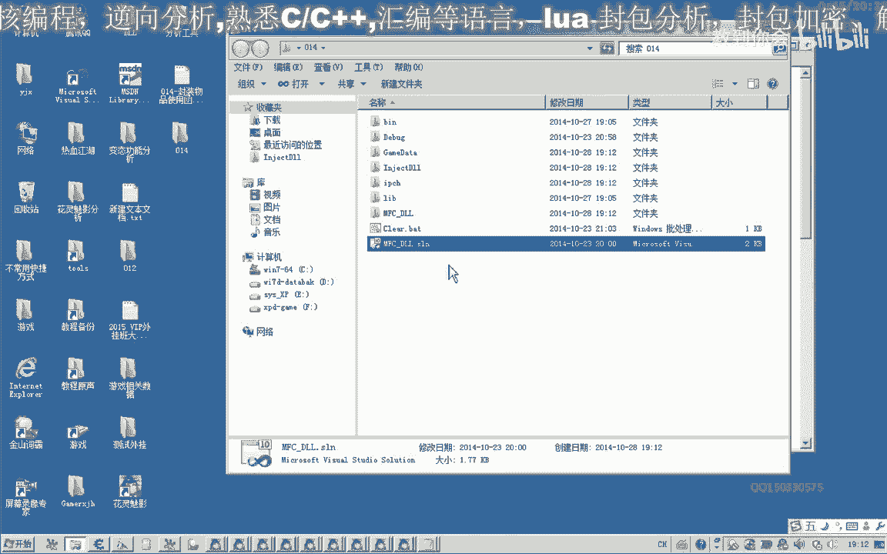
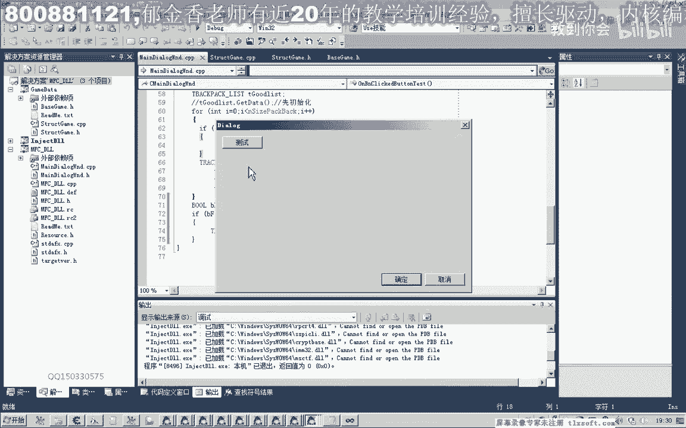
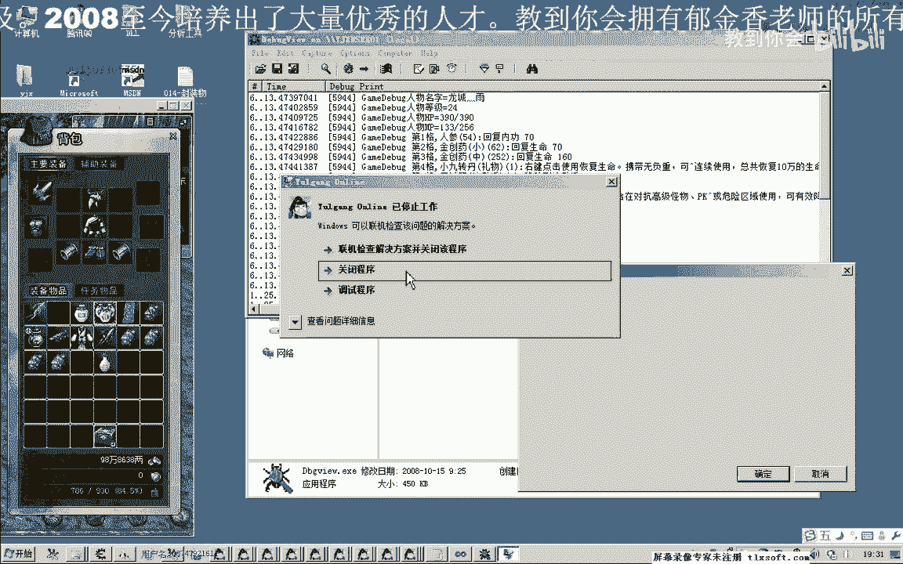
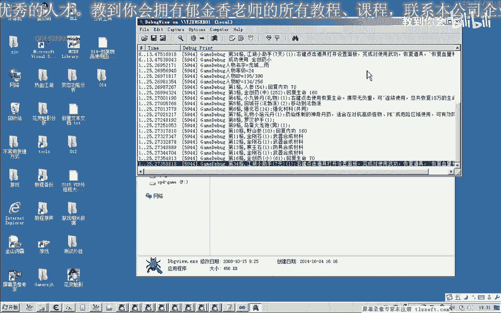

# 课程 P3：014 - 封装背包物品使用函数 📦➡️🎮



在本节课中，我们将学习如何封装一个用于使用游戏背包内物品的函数。我们将从通过物品下标直接使用的函数开始，逐步封装一个更便捷的、通过物品名称来使用物品的函数。课程将涵盖函数封装、异常处理、背包数据遍历与查询等核心概念。

---

## 一、课程准备与基础函数封装

上一节我们介绍了游戏功能调用的基本方法，本节中我们来看看如何封装一个稳定的物品使用函数。

首先，打开第12课的代码作为基础。我们需要添加两个关键的游戏调用机制（Call）：
1.  使用背包内指定下标格子的物品。
2.  获取背包数据。

我们将第一个功能封装为一个成员函数，放在与背包相关的结构体中。这样可以使代码结构更清晰。

在对应的CPP代码单元中，我们实现这个函数。为了代码的健壮性，我们使用 `try-catch` 块来处理可能出现的异常（例如游戏更新导致调用地址失效）。

以下是该函数的实现框架：
```cpp
bool UseItemByIndex(int index) {
    __try {
        // 汇编代码块：将下标存入寄存器，并调用游戏的使用物品Call
        __asm {
            mov eax, index
            push eax
            mov eax, [背包使用Call地址]
            call eax
            // ... 其他汇编指令
        }
        return true; // 执行成功
    }
    __except(EXCEPTION_EXECUTE_HANDLER) {
        OutputDebugString("UseItemByIndex函数出现异常");
        return false; // 执行失败
    }
}
```
这个函数直接通过物品在背包中的位置（下标）来使用它。但直接使用下标并不方便，因为我们通常不知道某个物品具体在哪一格。

---

## 二、封装按名称查询物品的函数

为了能通过物品名称来使用，我们需要先知道这个物品在背包中的位置。因此，我们需要封装另一个函数，用于根据名称查询物品的下标。

思路是遍历整个背包数组，将每一格物品的名称与我们传入的目标名称进行比较。

以下是查询函数的实现步骤：
1.  初始化背包结构，确保能获取到最新的背包数据。
2.  使用一个 `for` 循环遍历所有背包格子（例如0到35格）。
3.  在循环中，使用字符串比较函数（如 `strcmp`）判断当前格子物品名是否与目标名相同。
4.  如果找到相同名称，立即返回当前下标 `i`。
5.  如果遍历结束仍未找到，则返回 `-1` 表示物品不存在。

核心查询逻辑的伪代码如下：
```cpp
int FindItemIndexByName(const char* targetName) {
    // 初始化并获取背包数据
    Backpack bp;
    InitBackpack(&bp);

    for(int i = 0; i < BACKPACK_SIZE; i++) {
        if(strcmp(bp.itemList[i].name, targetName) == 0) {
            return i; // 找到物品，返回其下标
        }
    }
    return -1; // 未找到物品
}
```
这个函数为我们提供了通过名称定位物品的能力。

---

## 三、整合：封装按名称使用物品的函数

现在，我们结合前两个函数，封装最终的目标函数：**通过物品名称直接使用它**。

这个函数的逻辑非常清晰：
1.  调用 `FindItemIndexByName` 函数，根据传入的名称查询物品下标。
2.  判断返回值。如果为 `-1`，说明背包中没有此物品，函数直接返回 `false`。
3.  如果返回值是有效的下标（0到35之间），则调用 `UseItemByIndex` 函数，并传入该下标，从而使用物品。

以下是整合后的函数：
```cpp
bool UseItemByName(const char* itemName) {
    int index = FindItemIndexByName(itemName);
    if(index == -1) {
        return false; // 物品不存在，使用失败
    }
    return UseItemByIndex(index); // 物品存在，使用它
}
```
通过这样的封装，我们只需要知道物品名称（如“金创药”），就可以方便地使用它，无需关心其具体位置。

---

## 四、功能测试与问题发现

我们将代码注入游戏进行测试。调用 `UseItemByName("金创药")`，观察游戏内金创药的数量是否减少，并查看调试输出信息。



测试发现，函数功能本身是正常的，可以成功使用物品。但是，当背包中物品位置变动后再次调用，游戏程序偶尔会发生崩溃。

这个问题并非函数逻辑错误。其根源在于我们的代码运行在独立的线程中，与游戏主线程同时操作同一块内存数据（背包数据），从而引发了多线程访问冲突。

---





## 五、总结与下节预告


本节课中我们一起学习了：
1.  封装了通过下标使用背包物品的基础函数 `UseItemByIndex`，并加入了异常处理以增强稳定性。
2.  封装了通过名称查询背包物品下标的辅助函数 `FindItemIndexByName`，其核心是遍历与字符串比较。
3.  整合以上两者，封装出最终的目标函数 `UseItemByName`，实现了通过物品名称直接使用的便捷功能。
4.  通过测试发现了多线程环境下的数据访问冲突问题。


目前函数逻辑已完备，但存在线程安全问题。在下一节课中，我们将通过修改代码注入方式（例如使用钩子技术将动态链接库注入到游戏主线程），来解决多线程冲突问题，使我们的物品使用功能完全稳定可靠。