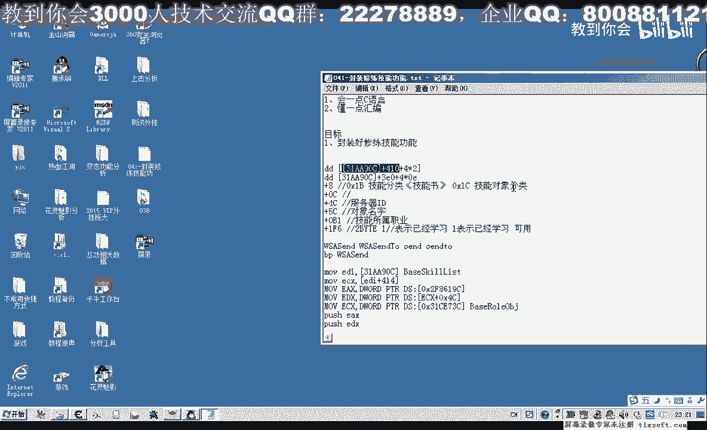
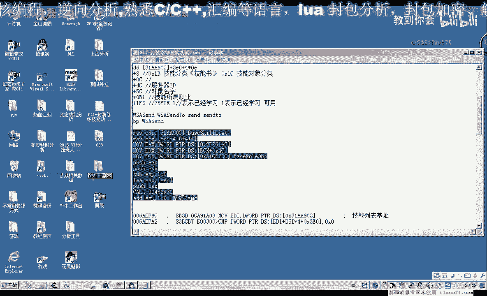
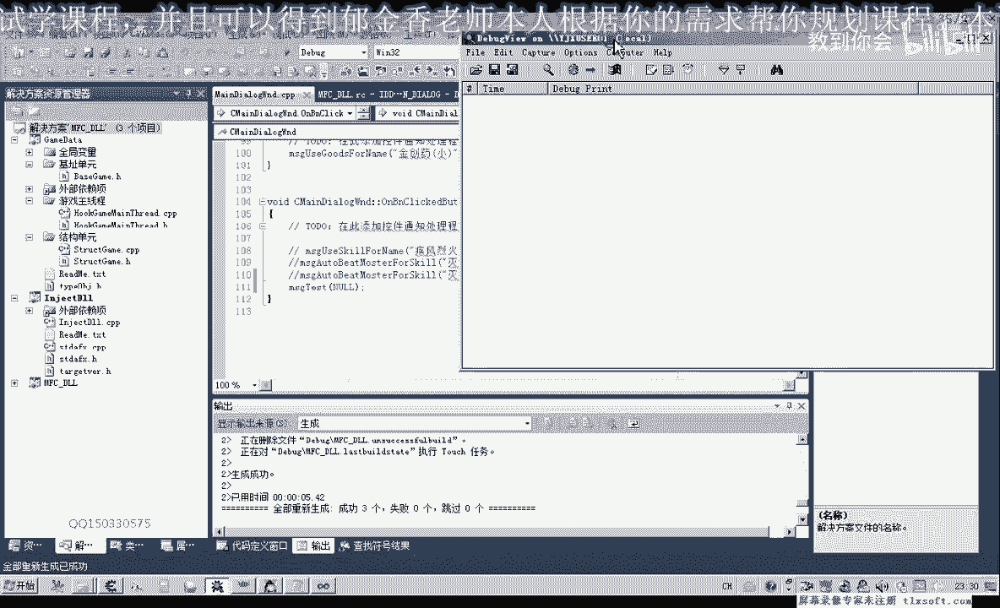
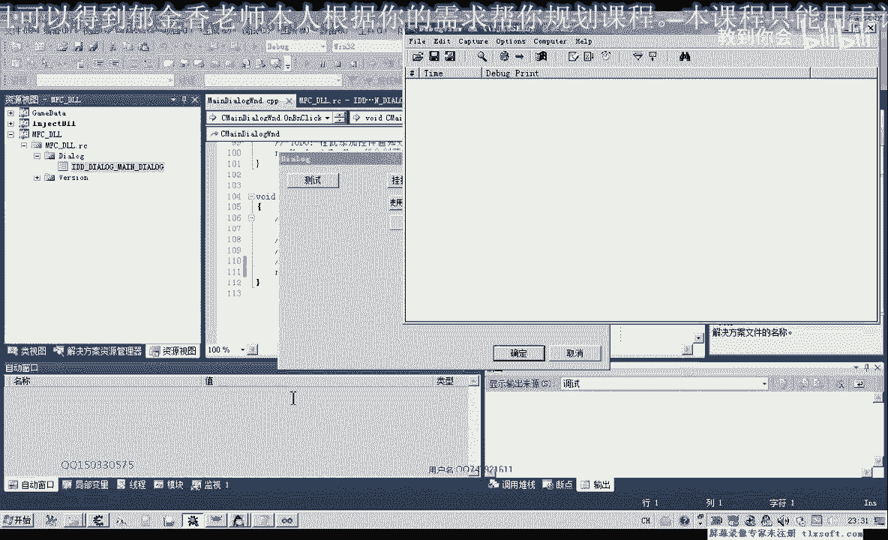
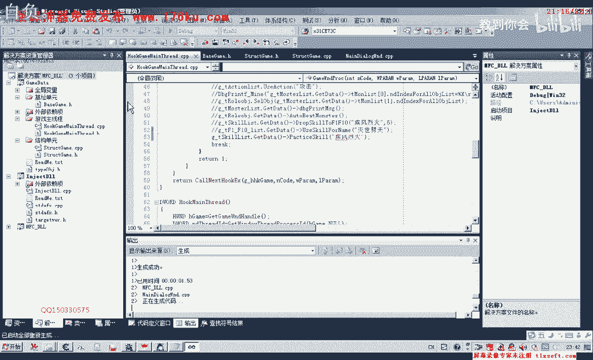
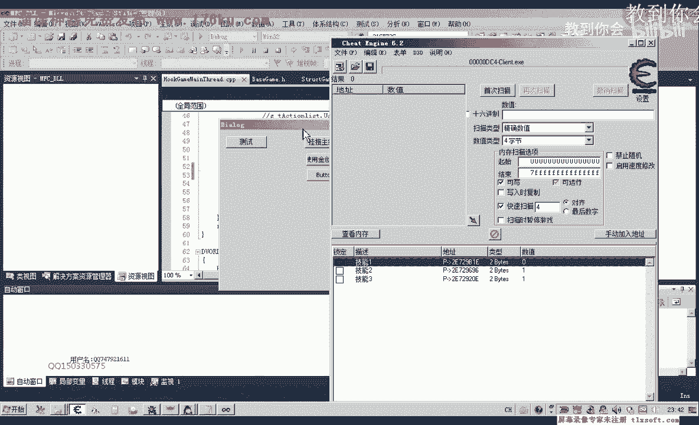
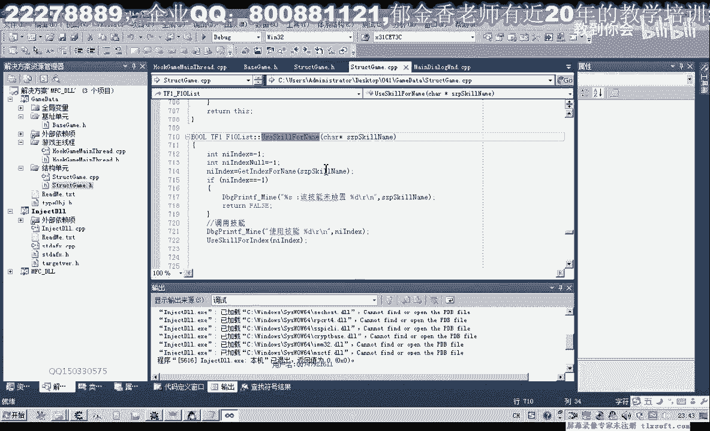

# P30：041-封装修练技能功能 - 教到你会 - BV1DS4y1n7qF

大家好，我是俞星相老师，那么上一节课我们分析了修炼技能的功能课。

那么这节课我们对它进行一个封装，那么封装我们上一节课也写了一个相关的代码，那么在这里实际上你就是传入了它的一个下标，相当于是410+4，是1I，当时的代码输入器它不支持这种写法，没有这样写。

那么实际上它是这样的，那么下标在这里，那么所以说我们先封装一个下标，用下标来传递参数的code，那么打开第38课的代码，那么先展开我们的机子单元。

添加相关的机子，那么第一个312A90C实际上就是我们的，技能密表机子，我们已经添加过，那么我们需要添加一下，还有一个也就是我们的技能库，修炼技能库，那么我们把它放置在技能密表的后边，修炼技能。

那么第二个是它的一个参数技能库，那么这个EX作为它第一个亚占的一个参数，那么我们把它写上，这里已经加了Nexus的权权，那么这两个添加好了之后，我们看还有没有其他的机子，那么在后边还有个3173C。

那么3173C实际上我们已经添加过了，在这个地方就是角色对象自己，所以说这里我们需要继续添加，好的，那么我们接下来转到结构单元，那么因为对象它需要骗你，我们的技能列表，所以说我们把它封装在技能列表里。

这个应该是一个无符号前行的下边，然后我们复制一下这段代码，到代码的尾部，然后我们再复制一下这个代码的尾部，然后我们再复制一下这个代码，那么我们先做异常的一个处理，那么如果出现异常，我们就打印条是信息。

好，那么我们再进行把上面这段我们测试，成功的代码进行一下复制，那么这里我们要加上我们的汇编代码，要注意一点，这里是代码输入器里面的，它默认是16进制的，这里不是，所以说这里我们需要修改一下，央伍文件。

那么还有这个地方，我们先把它需要放到这个计程器里，比如说ex，开始，然后我们再call，ex就可以了，那么在前面这个地方我们需要来替换成，我们的角色，机制角色对象，那么这个地方我们也给它加了一个。

相应的第一个参数，Bicycle，第一个要在哪一个参数，ex，那么edx还有一个edx来源于ex，那么这个ex我们先要取出对象，那么这里是0x410，那么这前面我们需要给它加上一个相应的前缀，dwy。

那么我们把后面的前缀来复制一下，然后里面我们就是技能列表的基地值，Bicycle，那么我们先编译一下，这里它也要求是一个常量表达器，是什么传进来的下标，那么下标的话它是一个变量。

那么我们需要先放在这个继承器里面才可以，编译是通过的，那么我们先使用一下这样写可不可以，等会我们测试就知道了，那么我们再展开我们的主线程单元测试这里，那么它的下标我们选二表示第二个技能，训练这个技能。

那么我们设置一下，启动一下，打开它的属性设置一下，那么这里我们设置一个，还有一个地方我们需要添加测试代码，在这里，把前面的输出掉，打开我们的调试信息查看器。

然后输入挂接主线。

然后我们测试，这个时候我们发现使用了技能，它打印出来一段调试信息，但是没有成功，我们再来看一下我们的代码，它打印的是这一段信息，说明是出现了异常，出现了异常，这里它没有加异常，那么在异常的话。

极有可能是出现在这个地方，当时我们说了要把它放在一个继承器里面，才可以这样行，那么我们先把偏移跟它加上，addex410，先在前面的把偏移跟它加上，后面我们直接就加上ex就可以了，然后我们再来编译一下。

我们再次放到ediex，那么再注入一下，挂接主线，然后使用，那么这个时候还是报异常，我们看一下在什么地方出现异常，再对比一下我们的代码，90c312a90c，那么取出来，加上410，还有一个4*i。

下标，这个下标我们需要做一个审讨，它需要先审议4，那么再去了，我们应该这样子，输入ex华号，ex14，加上410，再编译一下，这个时候它还是报异常，那么我们先把前面这一段我们就不用，会编写。

因为这种写法的话容易令它出错，那么我们可以先把机子提取出来，那么读出来之后，我们再加上一下410，那么这是它的相当于机地址，那么在后面，我们再把它取出来，那么我们加上它的一个下标，那么这样转换之后。

前面这里，我们就不需要，直接这样转换，然后取它的一个下标处置，然后取出来之后，我们直接写到ex，直接写到ex就可以了，那么再编译一下，这个时候消息传过去了，修炼成功，OK，那么可能这一句来。

大家看起来可能比较复杂，那么也可以把它写简单一点，这一句，那么写简单一点的话，我们可以另外定义一个，那么这里我们就需要再强制的把它转换一段，然后就相当于把它转换一段，转换一段之后。

这里我们就可以直接这样写，这前面这一段就不要了，就直接是一个下标访问的方式，这样写的话可能容易理解一些，这里应该是真，这里插一个冒号。

好。

那么我们再做一次测试，OK，那么这个名字我们带下标的修炼技能，我们测试好了之后，接下来我们就把它这个函数来进行一下重载，另外定义一个函数来，以它的名字做一个参数，然后再移到它的5度。

那么这里我们需要一个1%，表示失败了，那么后面我们再重载函数，那么最后我们先需要获取下标的这个值，那么我们需要片名，这是数据的大小，当然为了方便管理了，我们可以把这个大小可以把它在极此片名这个单元。

在这个结构单元里面把它定义成一个红，那么这里直接使用这个红就行，包括前面我们用到的相关的这个数据大小，这里我们都用红的形式，以后我们就需要修改一个地方，当然这些片名的话。

如果有时间的都可以自己把它定义在极此片名单元，把它定义成红的形式，好，那么我们再转到最后进行片名的时候，我们就需要做一个比较，那么这个给我们相应的下标，然后还取出它的名字，然后我们做比较。

如果是相等的话，它返回只能是0，那么就看它是否等于0，那么等于0的话，我们下标就出来了，在前面我们需要定一个变量，那么成下标，不至于i，然后break，那么找到下标之后，我们直接来后边我们就调用代查。

代下标的参数，得技能修炼，这样就可以了，但是要明白，这个库不是旋回的在调用，这个库而是调用的存在的，前面的库存的是它的下标进去，那么这样就可以了，那么前面这里还需要注意一点，那么这个地方。

它不能够传一个空子进去，不然的话可能会引起异常，那么所以说在这里，我们还需要进行一个判断，判断它的名字是否会空，也就是指定的，是否有对象，那么如果为一个空字串的话，我们就继续下一次的循环。

或者加上一个异常处理，应该都可以，那么这个时候我们主线程单位，这里我们就需要改变，那么这里我们改成，截封列轨，那么截封列轨是第一个，那么我们要修炼它的话，我们改一下第一个设置，再进行一下相应的测试。

对了，我们还没有编辑，需要先编译一下，好的。

挂接主线程，然后我们再修炼，OK了，这个时候，那么我们就通过名字都可以修炼相应的技能，好的，那么这一节课我们就讲到这里，那么我们下一节课，再继续，再见，那么这里也留一个助理给大家。

那么我们不是有一个技能使用的，那么我们自动，Use Cleverly，那么这里面我们自动加上，自动修炼的语句。

那么自己把它加进去就行了，应该很简单，自己加一下，好的，那么我们下一节课再见，謝謝大家。