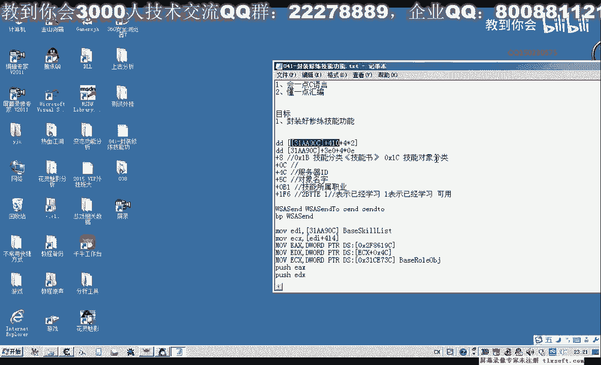
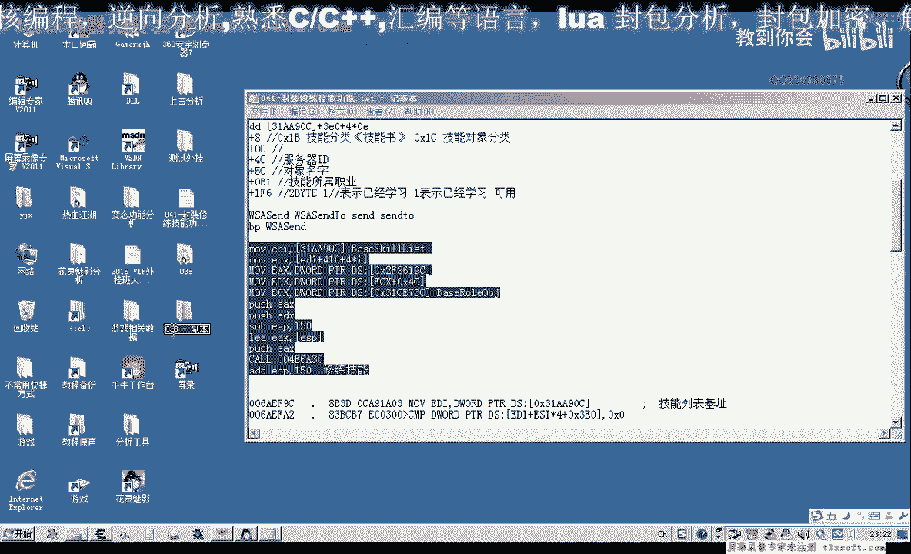
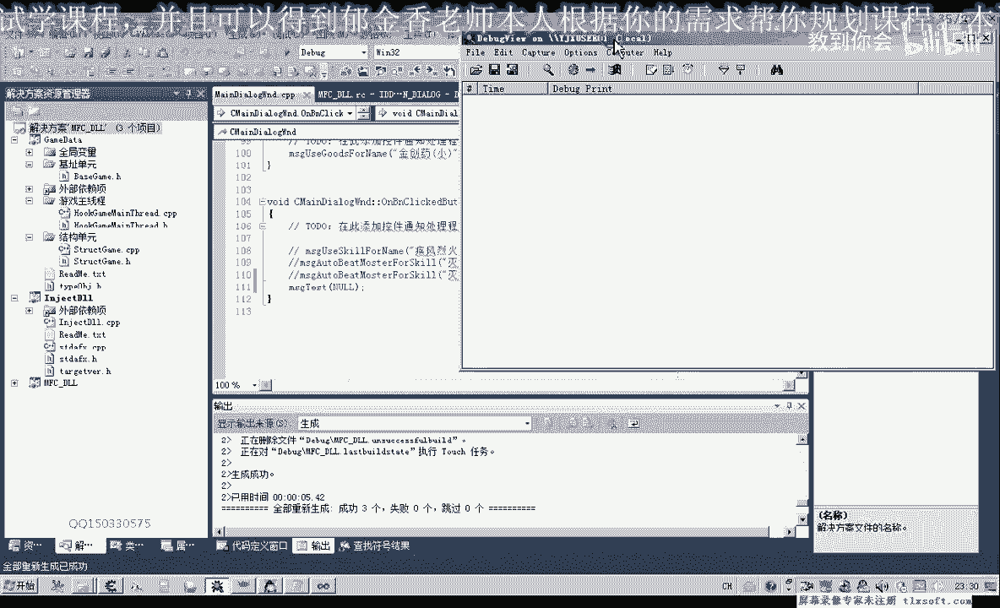
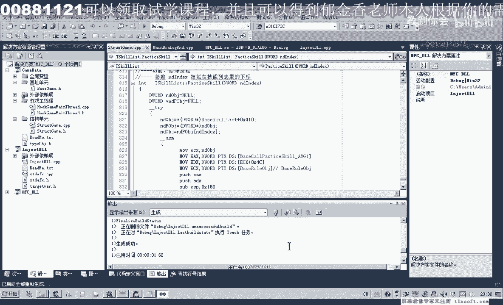
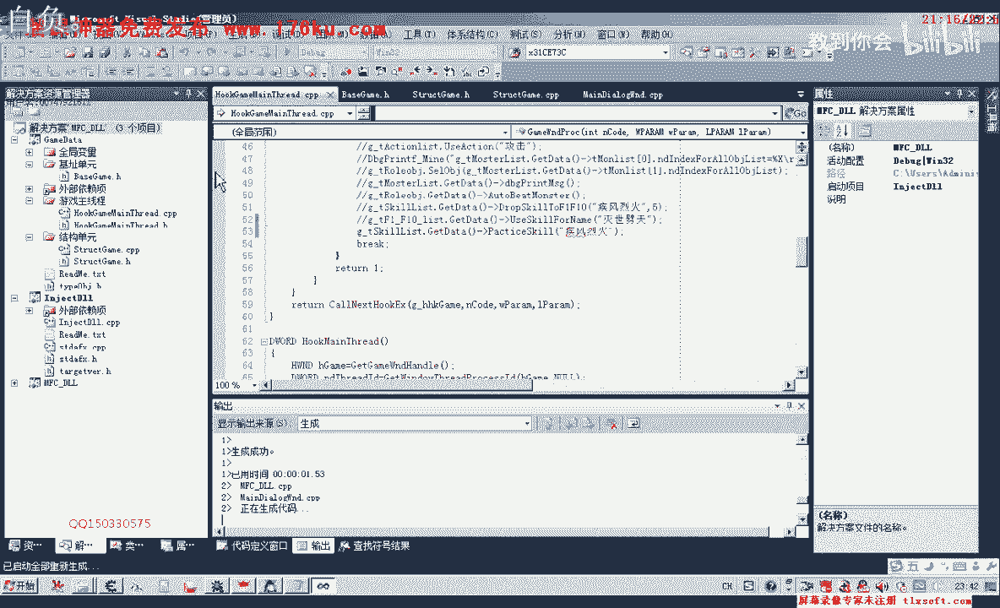
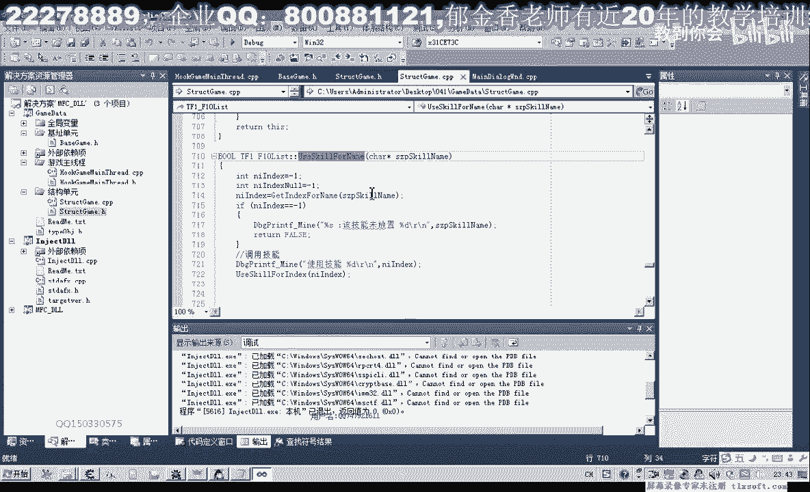

# 课程 P30：041-封装修炼技能功能 🛠️

在本节课中，我们将学习如何将上一节课分析的“修炼技能”功能进行代码封装。我们将创建一个更通用、更易用的函数，使其既能通过技能下标调用，也能通过技能名称调用。

---



## 概述

上一节课我们分析了修炼技能的功能逻辑。本节中，我们将对该功能进行封装，使其成为一个可复用的函数。核心在于处理技能列表的基址、偏移量计算以及参数传递。

## 封装步骤

### 1. 添加相关基址

首先，我们需要在基址单元中添加修炼功能所需的基址。

以下是需要添加的基址：

*   **技能列表基址**：`0x312A90C`（已添加）。
*   **修炼技能库基址**：我们将其放置在技能列表基址之后。
*   **参数技能库基址**：其第一个参数（`ecx`）来源于此。
*   **角色对象基址**：`0x3173C`（已添加）。

添加完成后，我们转到结构单元进行下一步。

### 2. 在结构单元中封装

由于操作对象是角色的技能列表，我们将函数封装在技能列表结构体中。首先，我们复制相关代码到尾部，并添加异常处理机制。

**代码示例（异常处理）**：
```cpp
try {
    // 功能代码
} catch (...) {
    // 打印调试信息
    OutputDebugString("修炼技能时出现异常！");
}
```

### 3. 编写并修改汇编代码



接下来，我们将测试成功的代码逻辑转化为汇编代码。这里需要注意，代码注入器默认使用十六进制，但我们的偏移量计算需要调整。


**核心公式**：
目标地址 = 技能列表基址 + 0x410 + (技能下标 * 4)

最初的尝试是直接将计算写入汇编，但这可能导致编译错误，因为下标是变量。

**初始有问题的写法**：
```assembly
mov eax, [技能列表基址]
add eax, 0x410
add eax, [下标]*4  ; 这种写法在汇编中不直接支持
mov ecx, [eax]
```

### 4. 修正汇编逻辑

为了解决变量问题，我们需要先将基址和偏移量加载到寄存器中，再进行计算。

**修正后的汇编逻辑**：
1.  将技能列表基址读入寄存器（如 `eax`）。
2.  加上固定偏移 `0x410`，得到技能库起始地址。
3.  将下标值乘以4（因为每个技能指针占4字节），加到地址上。
4.  最终从计算出的地址中取出技能对象指针，作为参数调用修炼函数。

**修正后的代码思路**：
```cpp
DWORD skillListBase = *(DWORD*)0x312A90C; // 读取基址
DWORD skillSlotAddr = skillListBase + 0x410 + (index * 4); // 计算目标地址
DWORD skillObj = *(DWORD*)skillSlotAddr; // 取出技能对象
// 调用修炼函数，传入 skillObj 等参数
```

### 5. 功能测试与调试

我们通过主线程单元进行测试。设置技能下标为2（表示第二个技能），启动游戏并挂接主线程，查看调试信息。

首次测试出现了异常，调试信息显示问题出在地址计算部分。经过检查，发现是下标参与计算时的汇编指令写法有误。我们调整了计算顺序和寄存器使用方式，最终成功完成了修炼功能。




### 6. 函数重载：支持技能名称

为了使函数更易用，我们重载一个以技能名称为参数的函数。

**实现逻辑**：
1.  遍历技能列表。
2.  将每个技能的名称与目标名称进行比较。
3.  如果找到匹配项，则获取其下标。
4.  调用之前封装好的、以下标为参数的修炼函数。

**需要注意**：在比较前，需要判断技能名称字符串是否有效（非空），以避免访问异常。

**代码示例（查找技能下标）**：
```cpp
int foundIndex = -1;
for (int i = 0; i < SKILL_COUNT; i++) { // SKILL_COUNT 应定义为常量
    char* skillName = GetSkillName(i);
    if (skillName == nullptr) continue; // 跳过空名称
    if (strcmp(skillName, targetName) == 0) {
        foundIndex = i;
        break;
    }
}
if (foundIndex != -1) {
    TrainSkillByIndex(foundIndex); // 调用下标修炼函数
}
```

### 7. 最终测试

我们将主线程中的测试调用改为使用技能名称（例如“截风列轨”）。编译代码后，挂接主线程并测试，功能成功执行。

## 总结

本节课中我们一起学习了如何封装“修炼技能”功能：
1.  **分析并添加了必要的内存基址**。
2.  **编写了以下标为参数的修炼函数**，重点解决了汇编层级的地址计算问题。
3.  **通过函数重载**，实现了以技能名称为参数的调用方式，提升了易用性。
4.  **加入了异常处理和空值判断**，使代码更加健壮。

通过封装，我们将复杂的底层操作隐藏起来，提供了一个简洁的接口供其他功能调用。



---


## 课后练习

我们已有一个自动使用技能的函数 `UseSkill`。请尝试在其中加入自动修炼技能的语句，实现使用后自动修炼的功能。这个练习可以帮助你理解如何将不同的功能模块组合起来。



---

我们下节课再见！