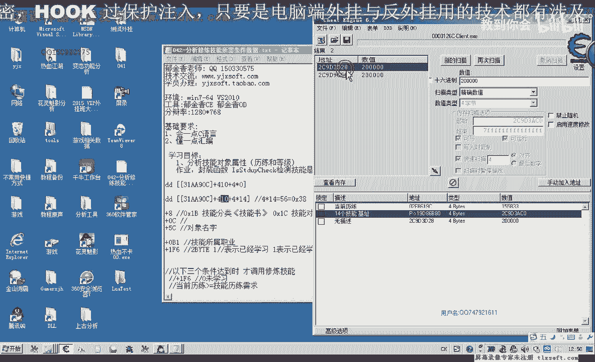
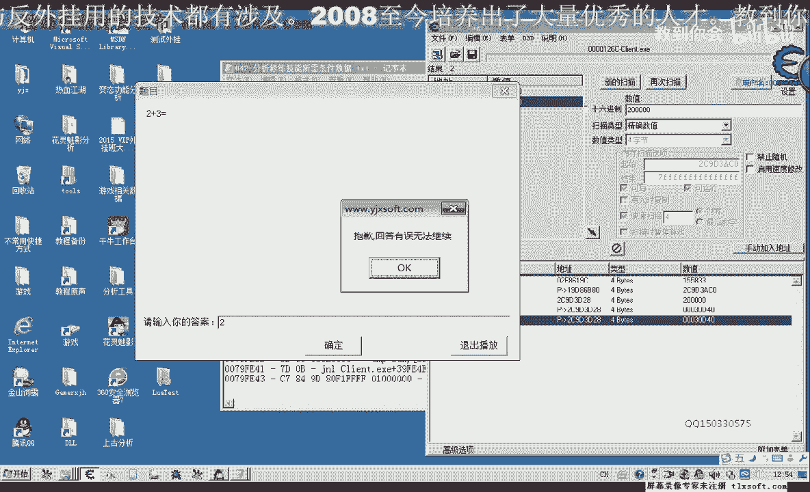
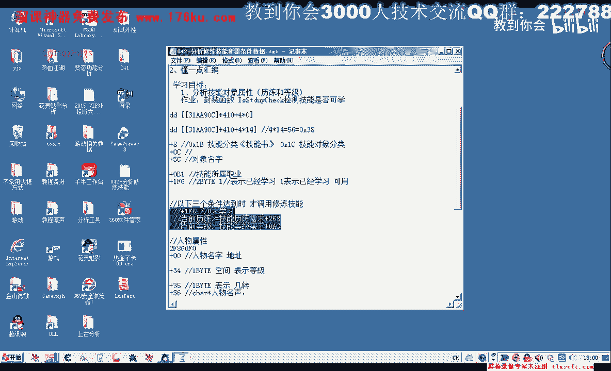

# 课程 P31：042 - 分析修炼技能所需条件数据 📊

在本节课中，我们将学习如何分析并获取判断技能是否可修炼的必要数据。具体来说，我们将找到并理解游戏角色当前的历练值、等级，以及特定技能所需的历练和等级条件。这些数据是后续编写技能修炼判断功能的基础。

---

在上一节课中，我们编写并封装了修炼技能的功能，但该功能尚不完善。例如，对于“神龙破甲”技能，即使条件不满足（如力量不足或等级不够），程序也会尝试修炼，这可能导致向服务器发送非法数据而被判定为使用外挂。因此，我们必须加入条件判断逻辑。

要进行判断，我们需要获取两类数据：
1.  角色当前的历练值和等级。
2.  目标技能所需的历练值和等级。

本节我们将重点分析如何找到并获取这些数据。

---

### 分析当前历练值与技能需求历练

首先，我们来分析角色当前的历练值。根据之前课程（第8课）的分析，我们知道角色属性有一个基地址。

1.  **查找当前历练地址**
    *   在游戏中查看当前历练值为 `1555833`。
    *   通过内存搜索该数值，可以找到一个绿色的基地址，例如 `f8619c`。
    *   回顾第8课，我们曾分析过角色属性的基地址为 `2f860f0`。计算差值 `f8619c - 2f860f0 = ac`。
    *   因此，**当前历练值的偏移量是 `ac`**。其地址计算公式为：
        **`人物属性基地址 + ac`**

2.  **查找技能需求历练地址**
    *   技能需求历练（例如200000）是技能对象的一个属性。
    *   首先找到目标技能的基地址。例如，“神龙破甲”是技能数组中的第14个技能（下标为13）。通过计算 `技能数组基地址 + 下标*4` 可以得到该技能对象的地址。
    *   以该技能对象地址为起点，搜索其需求历练值 `200000`（十六进制 `0x30D40`）。
    *   通过访问测试，可以找到正确的偏移量。在本例中，**技能需求历练的偏移量是 `268`**。
    *   因此，获取某个技能需求历练的公式为：
        **`技能对象地址 + 268`**

---

### 分析当前等级与技能需求等级

接下来，我们分析等级相关的数据。

1.  **查找技能需求等级地址**
    *   技能需求等级（例如74级）同样是技能对象的属性。
    *   在已找到的技能对象地址附近，搜索数值 `74`。
    *   通过对比不同技能（如第13个和第14个技能）的需求等级，可以验证偏移量的正确性。在本例中，**技能需求等级的偏移量是 `ac`**。
    *   因此，获取某个技能需求等级的公式为：
        **`技能对象地址 + ac`**

2.  **查找当前角色等级地址**
    *   角色当前等级的数据在第8课中已经分析过。它是一个单字节数据。
    *   其地址有固定的偏移，例如 `人物属性基地址 + 0x20`（具体偏移需根据实际分析确定）。

---

### 数据总结与下节预告

本节课我们成功分析了四项关键数据的存储位置与偏移量：

*   **当前历练值**：`人物属性基地址 + ac`
*   **技能需求历练**：`技能对象地址 + 268`
*   **技能需求等级**：`技能对象地址 + ac`
*   **当前角色等级**：`人物属性基地址 + 固定偏移（如0x20）`

在下一节课中，我们将利用这些分析结果，编写代码来读取这些数据，并封装成一个用于判断指定技能是否可学习的函数。

---

### 课后作业 📝

请大家根据本节课分析出的偏移量，尝试构思并编写一个函数 `bool CanSkillBeLearned(int skillIndex)`。该函数的功能是判断指定下标的技能当前是否可以学习（即判断当前历练和等级是否均达到技能要求）。

---

本节课中，我们一起学习了如何通过CE工具分析并定位游戏内存中关于技能修炼条件的关键数据，包括历练和等级的当前值与需求值。掌握这些数据的获取方法是实现自动化逻辑判断的重要一步。我们下节课再见！