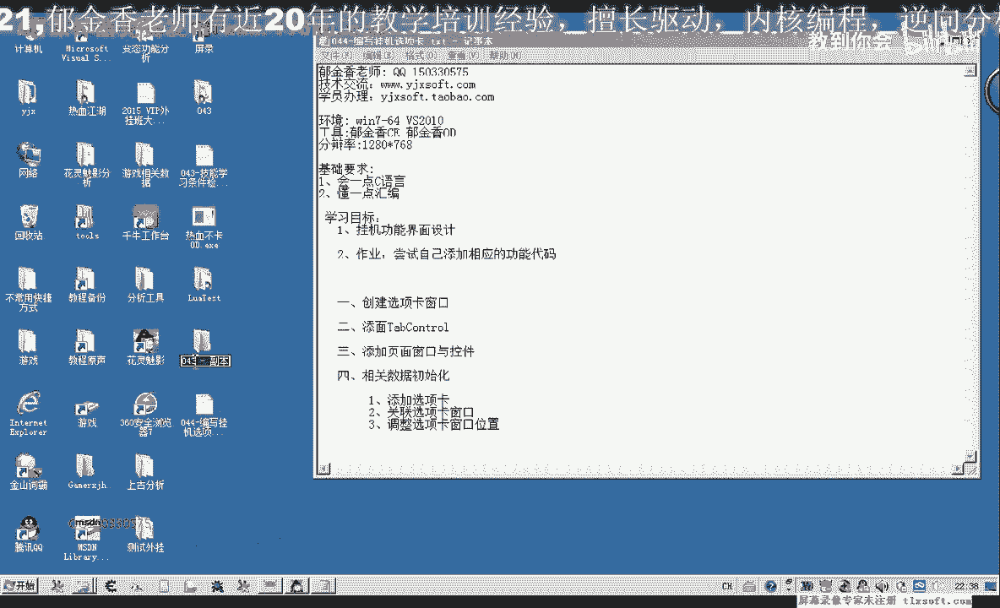
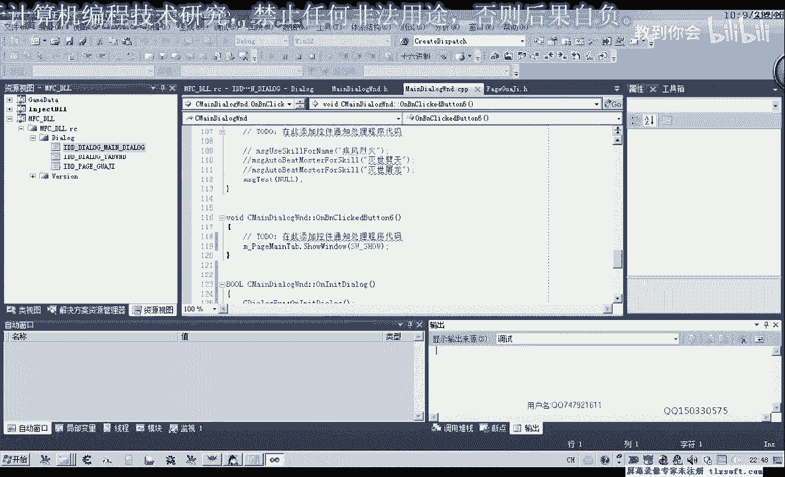
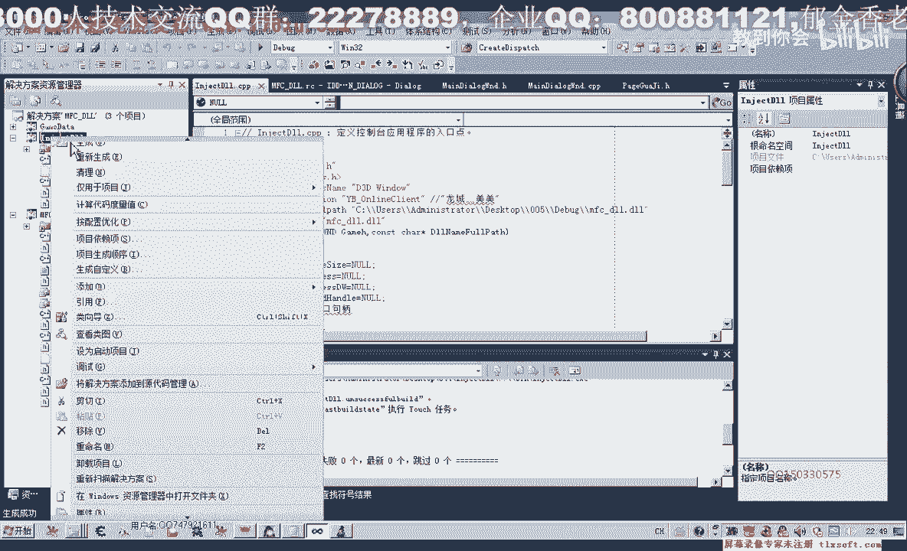
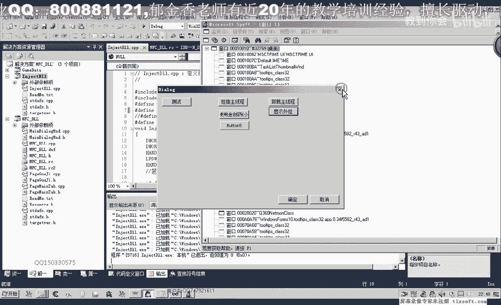
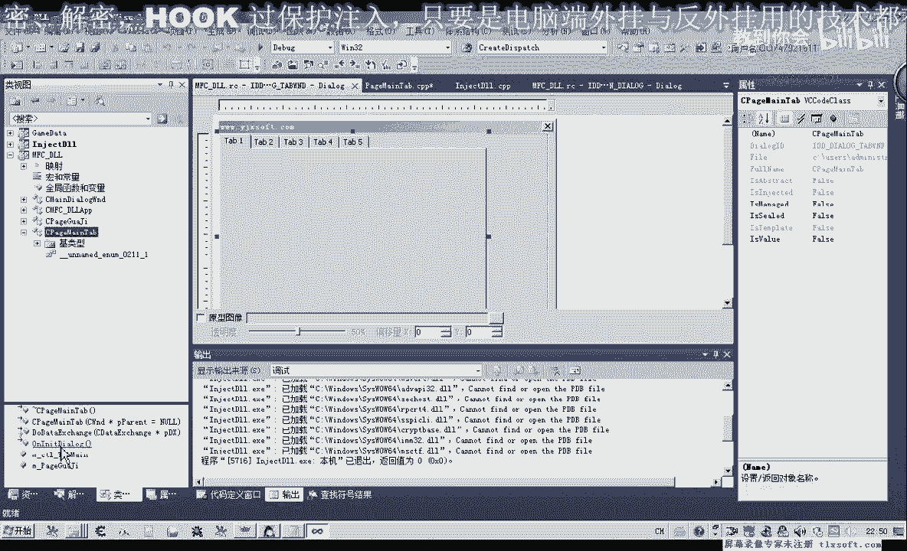
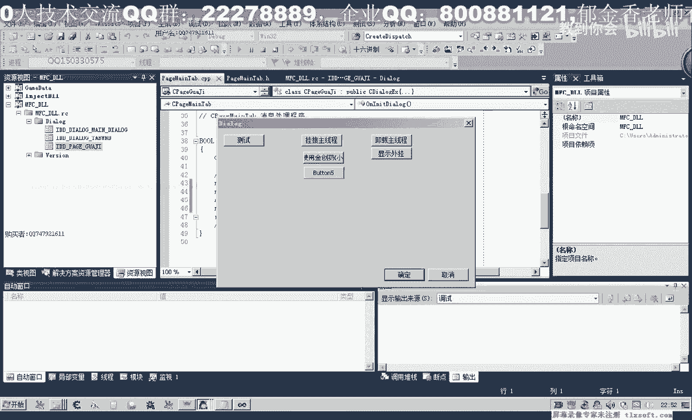
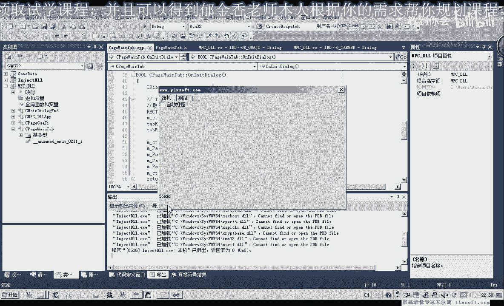
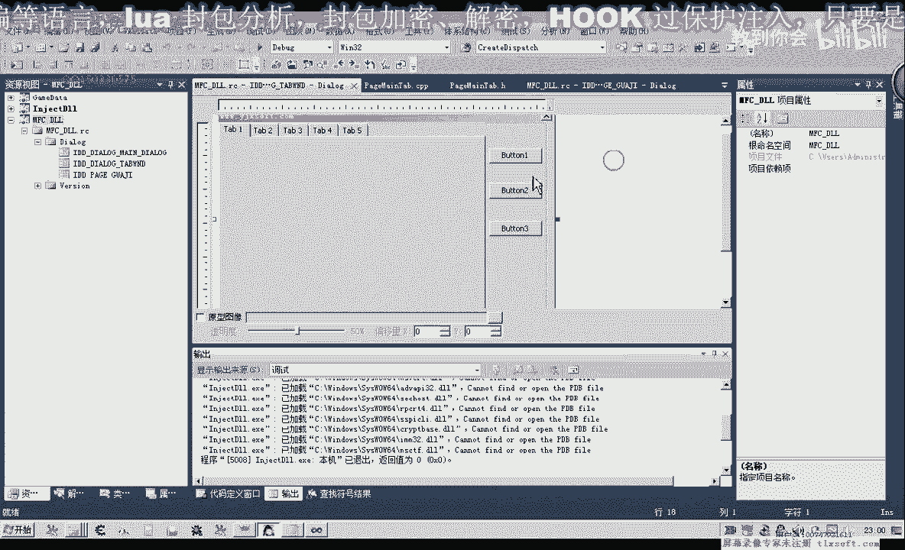

# 课程 P33：044-编写挂机选项卡 🎮



在本节课中，我们将学习如何为之前分析的功能添加一个用户界面，核心是使用选项卡控件来组织不同的功能页面。我们将创建一个包含“挂机”选项卡的窗口，并学习如何将对话框页面与选项卡控件关联起来。


---

## 界面设计基础 🖼️

上一节我们介绍了数据分析，本节中我们来看看如何为这些功能设计界面。首先，打开第43课的代码项目。

切换到资源视图，添加一个新的对话框资源。在制作外挂程序时，最常用的是 `Tab Control`（选项卡控件）。它便于管理多个功能页面，每个选项卡可以关联一个独立的对话框窗口。

添加控件后，修改其ID以增强代码可读性。例如，将ID改为 `IDC_TAB_MAIN`。同时，可以修改控件的标题和样式以符合需求。

## 创建挂机功能页面 ⚙️

为了关联选项卡，我们需要为每个功能创建独立的对话框页面。首先，创建一个用于“挂机”功能的对话框。

将该对话框的 `Border` 属性设置为 `None`，使其作为子页面嵌入。然后，在对话框上添加所需的控件，例如“自动挂机”复选框或按钮。为了辅助布局，可以在底部添加一个静态文本控件，并调整整个对话框的大小。

接下来，需要为此对话框创建一个对应的MFC类。以下是创建类的代码示例：

```cpp
class CPageHangup : public CDialogEx
{
    DECLARE_DYNAMIC(CPageHangup)
public:
    CPageHangup(CWnd* pParent = nullptr);
    virtual ~CPageHangup();
    // 对话框数据
    #ifdef AFX_DESIGN_TIME
    enum { IDD = IDD_PAGE_HANGUP };
    #endif
protected:
    virtual void DoDataExchange(CDataExchange* pDX);
    DECLARE_MESSAGE_MAP()
};
```

创建类后，将对话框的ID修改为 `IDD_PAGE_HANGUP`，并在资源视图中将此类与对话框关联。


## 关联选项卡与页面 🔗



现在，我们需要在主窗口的选项卡控件中显示刚创建的页面。首先，在主对话框类（例如 `CMainTabWindow`）中，为选项卡控件添加一个控件变量。



```cpp
CTabCtrl m_TabCtrl;
```



然后，重写主对话框的 `OnInitDialog` 函数。在此函数中，初始化选项卡控件，添加选项卡项。



以下是初始化并添加选项卡的代码：

```cpp
BOOL CMainTabWindow::OnInitDialog()
{
    CDialogEx::OnInitDialog();
    // 添加选项卡
    m_TabCtrl.InsertItem(0, _T("挂机"));
    m_TabCtrl.InsertItem(1, _T("测试"));
    // ... 其他初始化代码
    return TRUE;
}
```


接下来，需要将“挂机”页面嵌入到第一个选项卡中。在 `CPageHangup` 类的初始化函数中，创建窗口并设置其父窗口为选项卡控件。

```cpp
BOOL CPageHangup::OnInitDialog()
{
    CDialogEx::OnInitDialog();
    // 创建窗口，非模态显示
    Create(IDD_PAGE_HANGUP, GetParent());
    // 设置窗口位置（后续调整）
    return TRUE;
}
```

## 调整页面位置与显示 🧭




初始创建的页面位置可能不正确。我们需要计算选项卡控件客户区的位置，并将页面窗口移动到这个区域内。

在主对话框的初始化函数中，添加位置计算的代码：

```cpp
// 获取选项卡控件的位置
CRect rectTab;
m_TabCtrl.GetClientRect(&rectTab);
// 调整矩形，排除选项卡按钮区域
rectTab.top += 20; // 假设按钮高度为20
rectTab.left += 2;
rectTab.right -= 2;
rectTab.bottom -= 2;
// 移动挂机页面窗口
m_pageHangup.MoveWindow(&rectTab);
```

通过上述调整，页面将正确地显示在选项卡内容区域。可以微调 `top`, `left`, `right`, `bottom` 的偏移值以获得最佳的视觉效果。

## 处理选项卡切换事件 🔄

为了使页面能响应选项卡的切换，需要处理选项卡控件的 `TCN_SELCHANGE` 通知消息。

以下是处理切换事件的步骤：

1.  为选项卡控件添加事件处理函数。
2.  在函数中，获取当前选中的选项卡索引。
3.  根据索引显示或隐藏相应的页面。

```cpp
void CMainTabWindow::OnTcnSelchangeTabMain(NMHDR *pNMHDR, LRESULT *pResult)
{
    int nSelectedTab = m_TabCtrl.GetCurSel();
    switch(nSelectedTab)
    {
        case 0: // “挂机”选项卡
            m_pageHangup.ShowWindow(SW_SHOW);
            // 隐藏其他页面...
            break;
        case 1: // “测试”选项卡
            // 显示测试页面，隐藏其他...
            break;
    }
    *pResult = 0;
}
```



## 测试与预览 👁️

编译并运行程序，点击“显示外挂”按钮。现在应该能看到一个包含“挂机”和“测试”两个选项卡的窗口。点击“挂机”选项卡，其关联的页面会正确显示在内容区域。


如果页面位置或大小仍有问题，返回调整 `MoveWindow` 函数中的矩形参数即可。

---



本节课中我们一起学习了如何使用MFC的选项卡控件来组织界面。我们创建了资源、对话框类，并将它们关联起来，最终实现了一个可切换的挂机功能界面。下一节课，我们将为此界面添加具体的功能代码，例如“开始挂机”、“停止挂机”等按钮的逻辑。