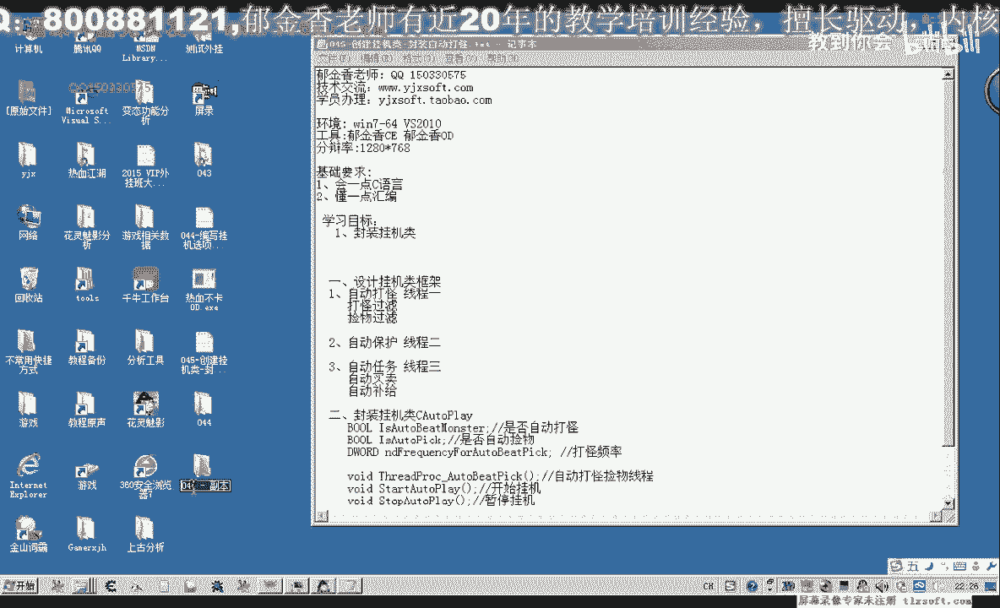
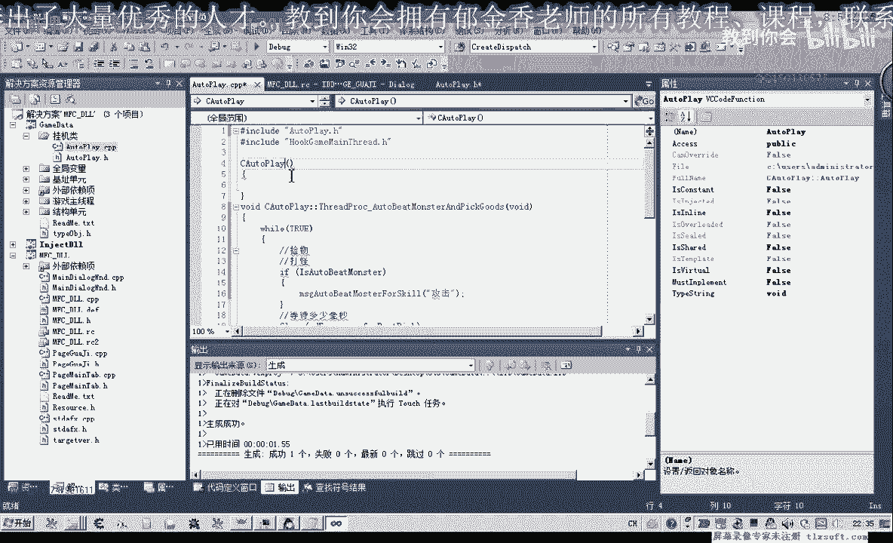
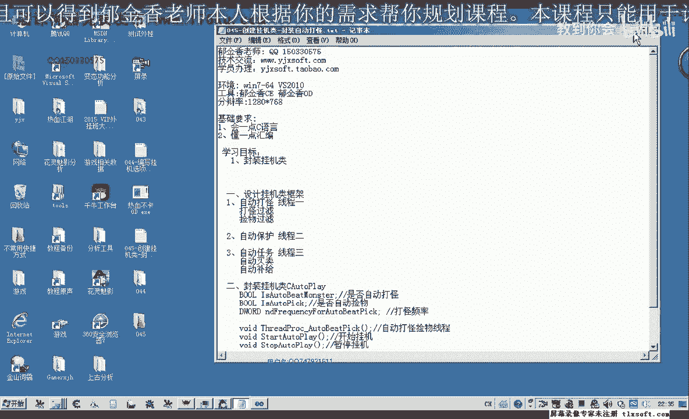
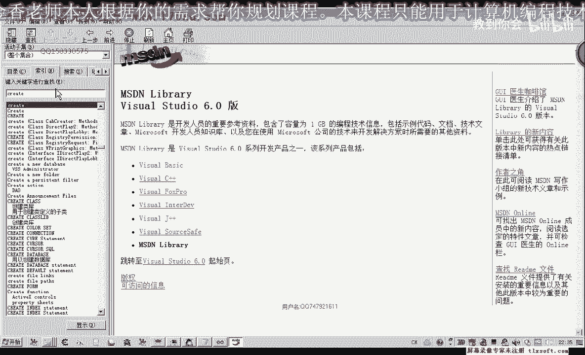
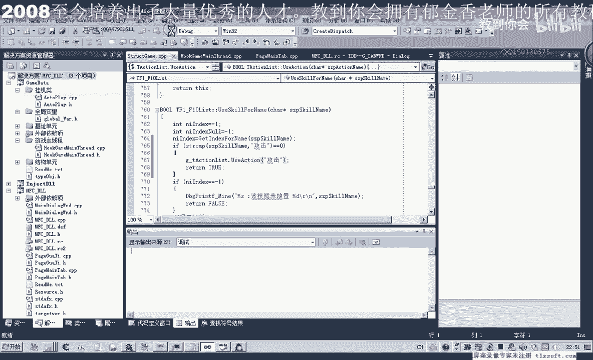
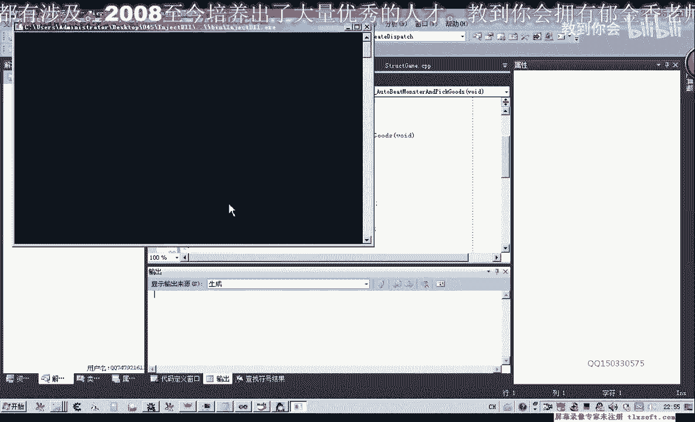

# P34：045-创建挂机类-封装自动打怪 - 教到你会 - BV1DS4y1n7qF

大家好，我是郁吉星老师，那么我们在之前的课程里面简单的设计了一下挂机的界面，那么这节课我们主要来封装一个挂机的类，那么我们先打开第44个的代码。

打开之后我们转到我们的资源，转到我们的选项卡窗口，那么我们设置为利用设置，改一下它相应的ID，那么第二个我们设置为开始挂机，那么第三个我们设置为停止挂机，好那么这三个功能我们先在类里面进行封装。

封装好了之后，然后我们在这里进行调用就可以了，那么切换到我们的根得体单元，添加筛选器，挂机对，然后我们添加一个C++的类，那么添加完成之后会出现两个文件，把它移到相应的单元，然后转到图文件。

进行代码的编写，然后定一个类关键字，然后C++WaterCreator，那么类里面我们要实现三个功能，一个是相当于是应用设置，第二个是我们的开始挂机，第三个是停止挂机，那么它有一些参数。

它应用的设置的话，这里我们直接把它写成一个Public参数的形式，那么第一个我们就是试图自动打怪，那么这个参数我们是通过资源窗口的自动打怪的复选框给它传进来，等一会，那么第二个也就是我们的开始挂机。

开始挂机了，我们要用现成，那么要用现成的话，我们先给它定一个回调函数，那么自动挂机的开始挂机的自动打怪，以我们的自动节目，我们全部把它写在一个现成里面，那么现成的回调函数写好了之后。

我们还需要另外写一个函数来启动现成，那么首先我们在相应的现成的回调函数，我们先把它实现，那么转到我们的cpp单元，对了，这里用到了布尔类型，这个是需要包含我们的Windows档文件。

然后再转到我们的cpp单元，首先包含类的档文件，那么前面我们要进行一个左右移动的限定，那么在里面的话，回调函数里面，我们就需要反复的执行一个动作，就是打怪和剪幕这两个动作，一个是剪幕的，我们暂时不实现。

跟它预留一个位置，那么这里就是我们的打怪，那么打怪它又需要来根据一个判断来实现，如果自动打怪这个条件成立的话，我们就直接调用message，WaterBtMonsterHostKill。

那么这里我们传一个技能，连进去，攻击，那么大致就是这样的一个设计，当然要调用这个单元，我们也需要包含主线程的档文件，Word主线程的档文件，好，那么我们先编译一下，看有错误没有，暂时没有错误。

那么这里执行完了之后，我们还需要让这个线程，让它休息一段时间，那么比如说休息一秒钟，1000毫秒，但是这个最好我们也把它设置成一个参数，这样我们到时候方便调整，那么在Public单元。

我们再跟它添加一个，Url的一个变量，调整它的一个频率，打怪的一个频率，好，那么我们这样好了之后，那么这样好了之后，我们就直接在回调函数里面，直接用相应的参数，那么我们执行一次，我们让它等待多少毫秒。

那么再进行下一次攻击，好，那么回调函数建好了之后，我们可以来实现挂机的单元，这个才是我们的开始挂机，那么这个是我们挂机的回调函数，自动挂机的功能，我们就是创建一个线程，在线程里面。

我们就把回调函数进行一个加载，让它来循环执行回调函数，当然创建线程我们可以放在单元，但是最好是把它放在，Vue的一个初始化函数，它的构造函数里面，这样更好一些，我们添加一个同龄的构造函数。

那么这里边我们进行初始化，那么在这里我们就创建一个相关的一个线程。

那么第一个安全属性，我们为空，那么第二个对战的大小，我们也让它系统自动管理传数字，那么第三个就是我们的回调函数，那么就是我们的回调函数，那么就传这个函数的地址传进去，那么第4个，我们有相应的参数。

不需要传相应的数字进来，那么第4个，我们这里就创建了一个属性，我们可以看一下相应的MSDN的一个说明。

那么倒数第二个参数。

我们可以在创建的时候来挂起这个线程，用这个标志，也就是说创建这个线程之后，来先不执行，用其他的函数来恢复，好，那么这里我们先创建这个线程，那么这个线程我们创建之后，它返回有一个ID。

那么在这里我们在内存源里面再添加一个变量，用来创建的线程的ID，那么我们再转到相应的单元，对它进行一个初始化复制，那么我们就取得了自动打怪的，自动解雇的线程的ID，创建的线程的剧品。

那么这个剧品获得了之后，我们在这里可以用另外的一个函数来开始执行我们的线程，它这里也有了用入门set，它的一个参数就是这个线程的一个剧品，那么我们在这里就来进行对它进行一个调用，恢复线程执行。

因为它在创建的时候的话，这个线程它只是创建好了，没有让它跑起来，然后我们在这个地方恢复线程开始挂机，然后我们再编译一下，这个时候它会提示我们Rate线程的函数，它不能够进行转换，不能够作为一个回调函数。

那么在这里我们首先要用一个指针来强制的转换，但是这样转换之后，它编译的话同样不能够通过的，那么我们需要怎么来通过，那么首先我们转到我们的头文件，把回调函数加一个前缀，静态成员把它设置为，然后我们再转换。

再编译，但是这个时候它又说，因为我们的回调函数，它是一个静态的成员函数的话，那么它就不能够对非静态的成员进行调用，所以说我们一个解决办法，也是把相关的静态成员函数里面引用到的这些变量。

也把它定义成静态的，好，那么我们在这边，这样我们就能够通过，然后我们再保存一下，那么我们还需要设计一个函数用来停止挂机，这个是stop，那么我们把上面复制一下，这里改为stop，然后这里我们最后的时候。

退出的时候，我们这里我们再次挂起线程就可以，挂起线程，它就是暂时让它不运行线程，那么最后我们程序退出的时候，我们也需要做一个相应的清理工作，那么我们在这里给它添加一个，对的析构函数。

然后再复制一下相应的代码，然后在这里做一些清理的工作，那么我们在退出的时候的话，这个线程它还是在运行的，所以说我们需要对它进行一个结束，那么强制的结束线程结束之后，我们的动态链接库才能够安全的退出。

用telemeter来强制的结束，最后一个结束的参数标志，要退出的一个代码，这里给它传1就可以，任意数值实际上都是可以的，那么我们这样设计的话，大致的功能就设计好了，一个是开始挂机，一个是停止挂机。

然后我们需要把它添加到我们的，全局变量的单元里面，所以waterplay在这里添加一个，首先我们在cpp单元这里进行一个变量，全局的，然后再转到全局变量单元包含我们的，头文件，加上套出说明。

然后我们再编译一下，那么这个时候我们再到支援，选项卡单元，然后应用设置这里，我们就对全局变量进行操作，包含相应的全局变量单元，那么应用设置我们先，那么对变量来进行一个复制，那么变量数值的来源。

它是来源于挂机单元的自动打怪，那么所以说在这里的话，我们还需要来为空间来管理一个变量，点一下完成，那么点完成之后，我们在应用设置这里，首先我们需要对挂机的单元进行一个更新。

把我们窗口的数据更新到我们的变量里，那么更新之后，我们再把它的数字传到我们的内底，好，再让我们的伺服器自动打怪的标志就传到我们的内里，那么我们再进行一下编译，这个时候它会提示静态的我们的成员变量。

它无法解析，当然如果我们这个时候，如果是把它设置为非静态的话，它应该就能够这里就能够复制了，但是我们另外的这里它也有冲突，因为我们的毁掉函数这里的话，它需要使用静态的成员函数。

那么这里我们可以通过另外的方式来解决，我们在这里我们取消静态的成员，然后但是我们这里它不会报错了，但是我们的对成员函数，静态成员函数里边这里的访问它也会报错，所以说这里它是有冲突的，那么冲突的话。

刚才我们不是进了一个全局的变量，我们可以用全局变量来进行相应的取值，这样能够解决我们的一个冲突，好的，然后我们再转到我们的选项卡单元，那么这里我们进行了相应的应用设置，把数据更新到了我们的Root里面。

然后这里开始挂机，我们也是调用的内存一个函数来实现，Start Waterplay，然后这里停止挂机的话，就是Stop Waterplay就可以，那么我们来看一下逻辑上还有没有错。

然后开始挂机转到我们的线材这里来执行，开始攻击，那么攻击的操作的话，技能里面它们是我们的动作才有一个攻击，那么所以说我们还需要修改一个相应的，主线程的一个函数，属性成单元，然后我们在自动打怪这个地方。

它传进来的参数的话，就是我们的攻击，但是我们去骗你的时候，我们在设计这个函数的时候，它去骗你使用技能的时候会找不到，会找不到技能名，因为它是属于我们动作技能里面，所以说在自动打怪里面调用技能这里。

我们需要再进行一些修改，那么使用技能这里，如果我们发现它传入的这个名字是攻击的话，那么我们就去调用动作，而不调用技能，那么在这里我们再做一个判断，那么如果这个攻击这个字串相等的话，返回值就是0。

那么在这里我们就调用GX，然后在这里调用相应的，攻击也就是调用，或者就是这个变类调用我们的攻击动作，或者这样写的话可能还要容易理解一些，然后调用它之后我们直接就返回，调用成功就行，好的。

那么我们再重新申请一下，然后我们可以输入到游戏里面进行一下测试，那么打开我们的调试器，调试信息查看器，那么首先挂机主线程显示外挂选中自动打怪，利用设置。

然后开始挂机，然后我们看一下游戏里面的动作，这个时候已经，它反复的这里显示了攻击，但是这个时候游戏已经断开了，测试不了，那么我们重启一下游戏，那么开启游戏之后。

我们再注入一下我们的代码。

挂机主线程显示外挂，自动打怪，应用设置，开始挂机，那么我们看一下游戏里面。

这个时候它就会自动的去打怪了，但是它只是用的普攻，没有使用我们的技能，好，那么我们退出我们的外挂，退出之后，我们可以了，攻击这里我们还可以，加上一个相应的参数，也就是攻击的一个类型，在这里可以给它加上。

ModemPlay，然后这里我们可以加上，Char，Serge，Skill，Rate，那么这里我们的技能名，我们可以了，跟它做一下相应的一个设置，那么也可以做一个参数，然后这里就传技能的名字进去。

当然这个是我们在后期，我们再进行一个相应的设计，那么这些，我们这里来直接就跟它传，相应的数值，再做一下相应的测试，比如说这个逆天杀星，我们来看一下，好的，那么我们重新再编译一下，那么在这里的话。

我们时间的间隔，我们还没有进行一个设置，它刚才我们调试信息里面的话，它闪的非常的快，因为我们这里的话没有进行一个相应的初始化，那么我们在这里的没有初始化的话，可能它的指的数值是0。

那么所以说我们在这前面给它进行一个相应的初始化，打过建构，那么我们跟它初始化为1000毫秒，那么它每过1000毫秒之后才去调用一次技能，那么这些参数最后我们都可以把它添加到，我们的挂机的界面上面。

打过的间隔，还有我们的技能的名字，那么我们都可以在窗口上面进行设置，好，那么那是我们下一节课的一个内容，今天我们就到这里就OK了，然后我们应用设置开始挂机，看一下相应的，该技能未放置，逆向，我们写错了。

应该是逆天，看得醒，逆天，记住这里要先挂接我们的主线程。

然后再显示外挂。

然后在应用设置，开始挂机，那么这个时候应该在自动打怪了，好的，那么我们这几个的测试就到这里，那么我们点停止挂机之后，它将不再去打怪物，按开始挂机之后，它就不断的去自动打怪，好，那么我们退出我们的外挂。

下一节跟我们再见，拜拜。