# 课程 P34：045-创建挂机类-封装自动打怪 🎮

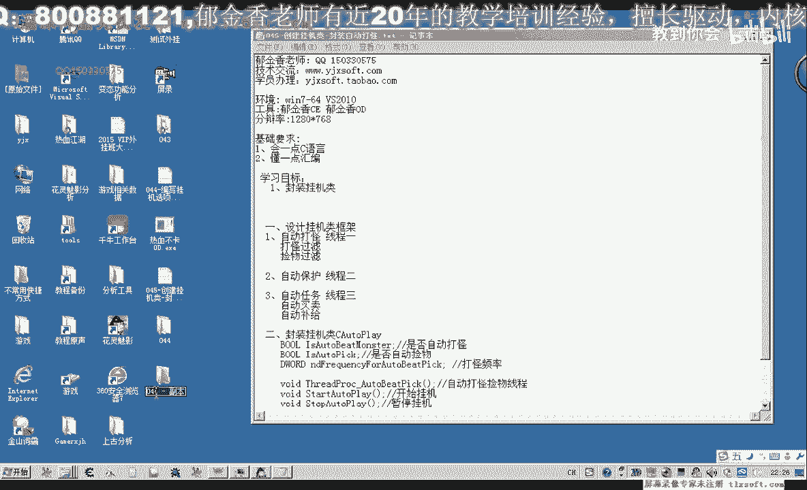

在本节课中，我们将学习如何封装一个用于自动打怪的挂机类。我们将从界面设计过渡到核心逻辑的代码实现，包括创建线程、设置打怪频率以及处理用户交互。

---

## 概述 📋

上一节我们设计了挂机功能的界面。本节我们将封装一个C++类来实现自动打怪的核心逻辑。这个类将包含应用设置、开始挂机和停止挂机三个主要功能。

## 创建挂机类

首先，我们需要创建一个C++类来管理挂机功能。

1.  在项目中添加一个名为 `CWaterCreator` 的C++类。
2.  在头文件中定义类的三个公共成员函数：
    *   `ApplySettings`: 应用用户设置。
    *   `StartWaterPlay`: 开始自动挂机。
    *   `StopWaterPlay`: 停止自动挂机。

以下是类的初步结构：
```cpp
class CWaterCreator {
public:
    void ApplySettings(bool bAutoFight);
    void StartWaterPlay();
    void StopWaterPlay();
private:
    // 后续添加私有成员
};
```

## 实现自动打怪线程

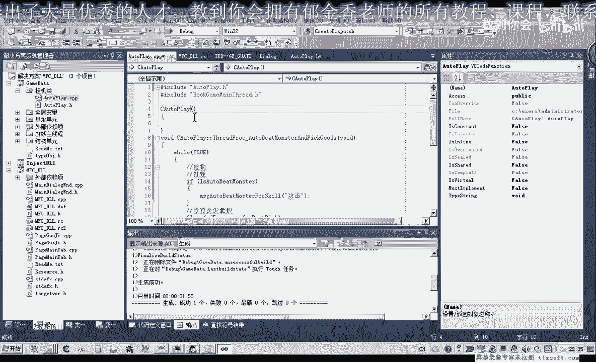

自动打怪需要在后台持续运行，因此我们使用一个独立的线程来实现。

上一节我们定义了类的框架，本节中我们来看看如何实现线程内的打怪逻辑。

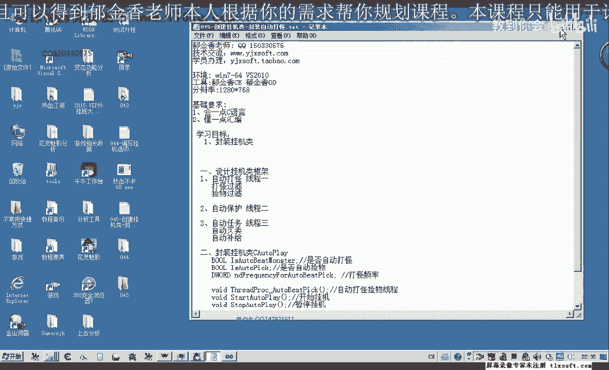

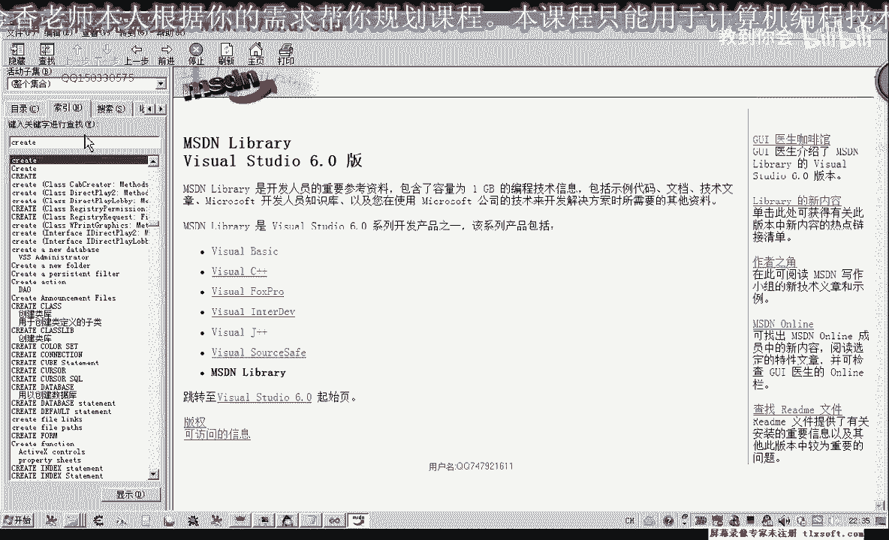

### 定义线程回调函数

我们需要一个函数作为线程的入口点，在其中循环执行打怪动作。

1.  在类中定义一个静态成员函数作为线程回调。静态函数是创建Windows线程所必需的。
2.  在回调函数中，我们需要循环判断“自动打怪”条件是否成立。
3.  如果条件成立，则调用攻击函数。
4.  每次攻击后，让线程休眠一段时间以控制攻击频率。

以下是线程回调函数的核心逻辑：
```cpp
static DWORD WINAPI AutoFightThread(LPVOID lpParam) {
    while (true) {
        if (g_bAutoFight) { // g_bAutoFight 是一个全局变量，表示是否开启自动打怪
            // 调用攻击函数，例如使用“攻击”动作或特定技能
            UseSkill("攻击");
        }
        Sleep(g_nFightInterval); // g_nFightInterval 是攻击间隔，单位毫秒
    }
    return 0;
}
```
**注意**：由于线程回调函数必须是静态的，它无法直接访问类的非静态成员变量。一个常见的解决方案是使用全局变量或在创建线程时传入`this`指针。本教程后续采用了全局变量的方式。

### 启动与停止线程

定义了回调函数后，我们需要在合适的时机创建和操控这个线程。

以下是管理线程生命周期的关键步骤：

*   **创建线程**：在类的构造函数中，使用 `CreateThread` API创建线程，并使其处于挂起状态。
    ```cpp
    m_hThread = CreateThread(NULL, 0, AutoFightThread, NULL, CREATE_SUSPENDED, &m_dwThreadId);
    ```
*   **开始挂机**：在 `StartWaterPlay` 函数中，使用 `ResumeThread` API恢复线程执行。
    ```cpp
    ResumeThread(m_hThread);
    ```
*   **停止挂机**：在 `StopWaterPlay` 函数中，使用 `SuspendThread` API挂起线程。
    ```cpp
    SuspendThread(m_hThread);
    ```
*   **清理资源**：在类的析构函数中，使用 `TerminateThread` API强制结束线程，确保程序能安全退出。
    ```cpp
    TerminateThread(m_hThread, 1);
    ```

## 连接用户界面与逻辑

现在，我们已经封装好了挂机类。接下来需要将图形界面上的操作与这个类的功能连接起来。

上一节我们实现了后台线程，本节我们将其与前端界面控件绑定。

以下是界面控件的事件处理逻辑：

1.  **“应用设置”按钮**：将界面复选框（是否自动打怪）的值，更新到全局变量 `g_bAutoFight` 中。
2.  **“开始挂机”按钮**：调用全局挂机类实例的 `StartWaterPlay()` 方法。
3.  **“停止挂机”按钮**：调用全局挂机类实例的 `StopWaterPlay()` 方法。

关键代码示例如下：
```cpp
// 应用设置按钮点击事件
void OnBtnApplySettings() {
    // 从界面控件获取值
    g_bAutoFight = IsDlgButtonChecked(IDC_CHECK_AUTO_FIGHT);
}

// 开始挂机按钮点击事件
void OnBtnStart() {
    g_pWaterCreator->StartWaterPlay(); // g_pWaterCreator 是全局的挂机类实例
}

// 停止挂机按钮点击事件
void OnBtnStop() {
    g_pWaterCreator->StopWaterPlay();
}
```

## 完善攻击功能

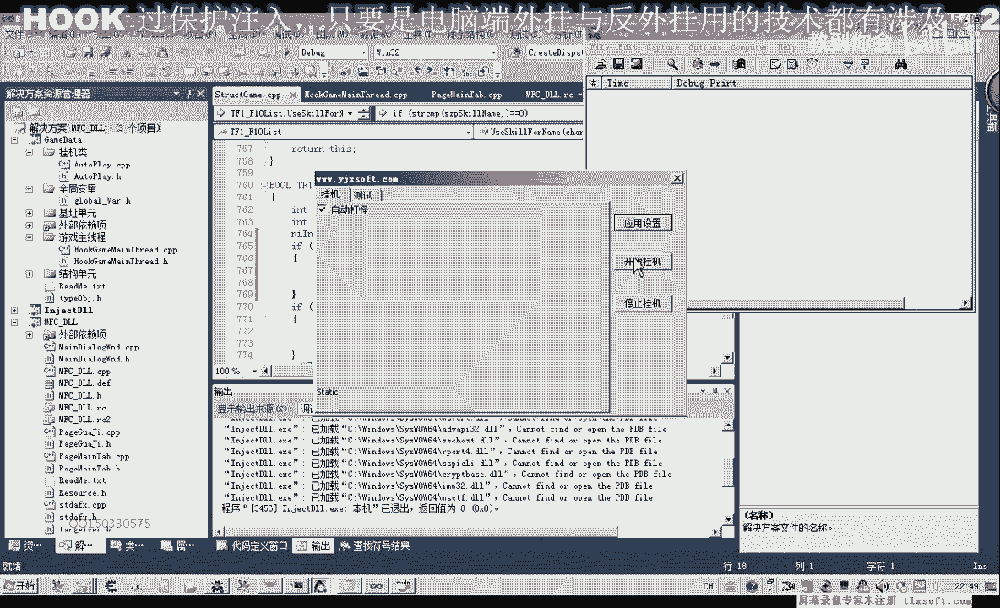

在测试中，我们发现直接调用技能函数可能无法处理普通攻击，因为“攻击”通常属于动作而非技能列表。

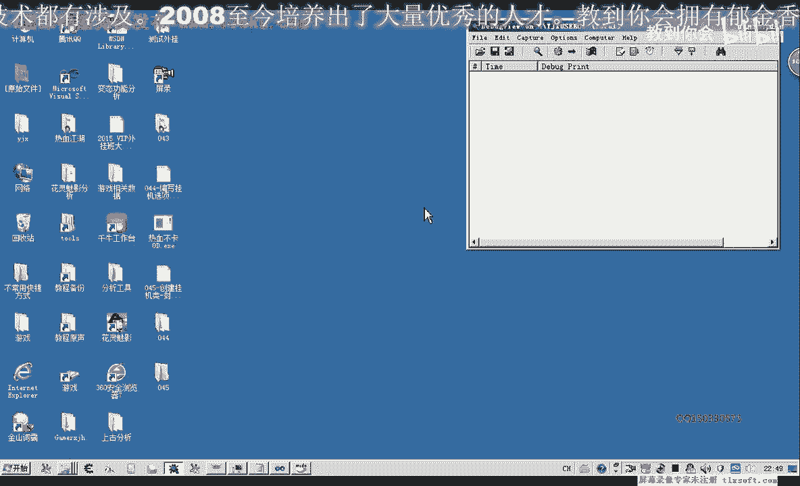

因此，我们需要修改技能调用函数，使其能区分“攻击”动作和技能。在攻击函数内部添加一个判断：如果传入的技能名是“攻击”，则改为调用角色执行攻击动作的函数；否则，按正常流程使用技能。

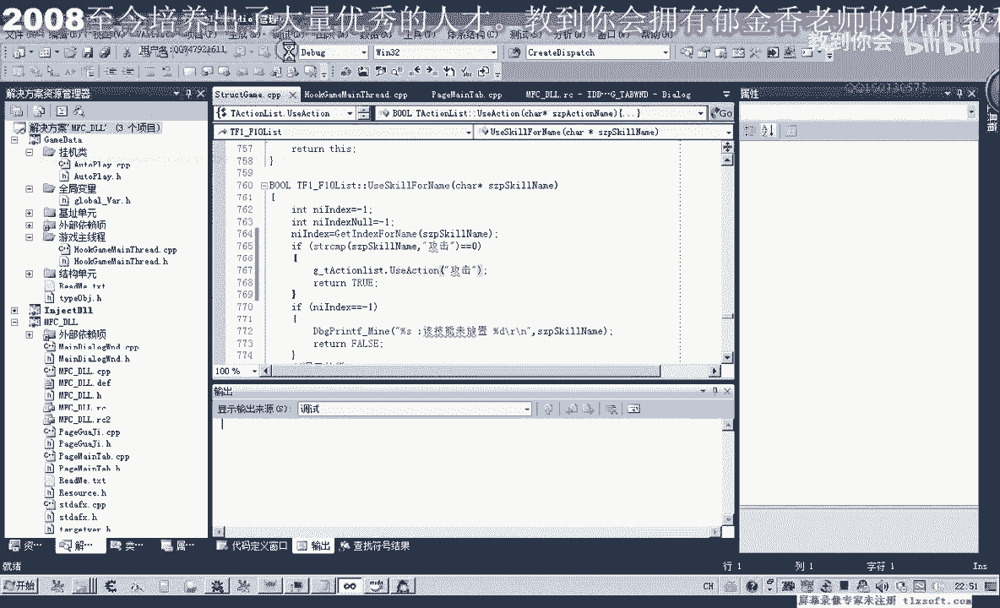

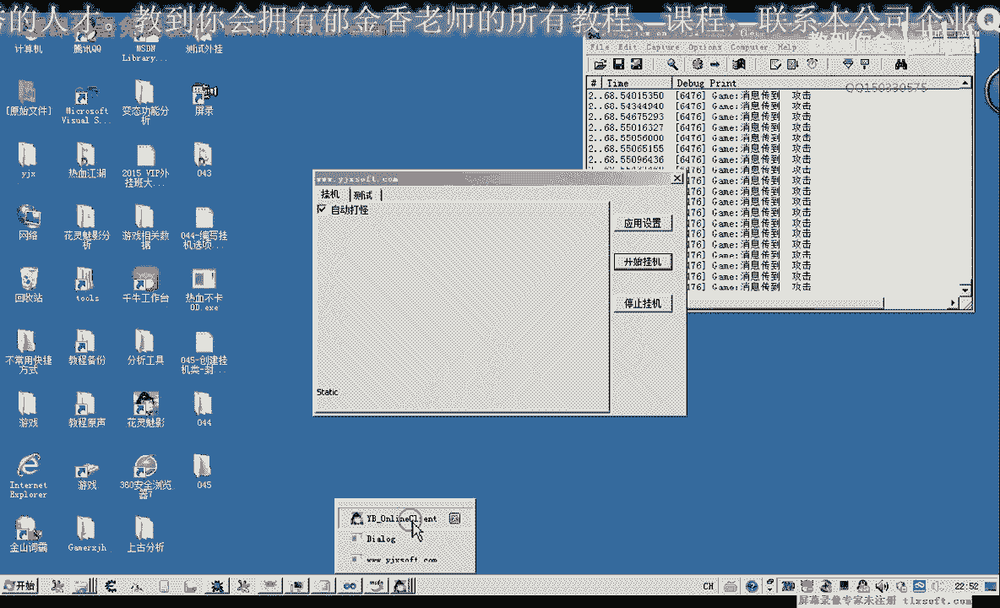

修改后的攻击逻辑伪代码如下：
```cpp
int UseSkill(char* szSkillName) {
    if (strcmp(szSkillName, "攻击") == 0) {
        // 调用执行普通攻击的函数
        CharacterAttack();
        return 1; // 表示成功
    } else {
        // 原有使用技能的代码
        return CastSpell(szSkillName);
    }
}
```

## 测试与优化 🧪

完成编码后，进行测试是必不可少的环节。

1.  编译并注入外挂到游戏。
2.  在挂机界面勾选“自动打怪”，点击“应用设置”。
3.  点击“开始挂机”，观察游戏角色是否开始自动攻击附近的怪物。
4.  点击“停止挂机”，观察攻击是否停止。
5.  测试时注意调整 `g_nFightInterval`（攻击间隔）变量，例如设置为1000（毫秒），使攻击频率合理。

如果攻击过快导致游戏断开，请检查循环中Sleep函数的参数是否有效。确保在类的构造函数中对攻击间隔等变量进行了合理的初始化。

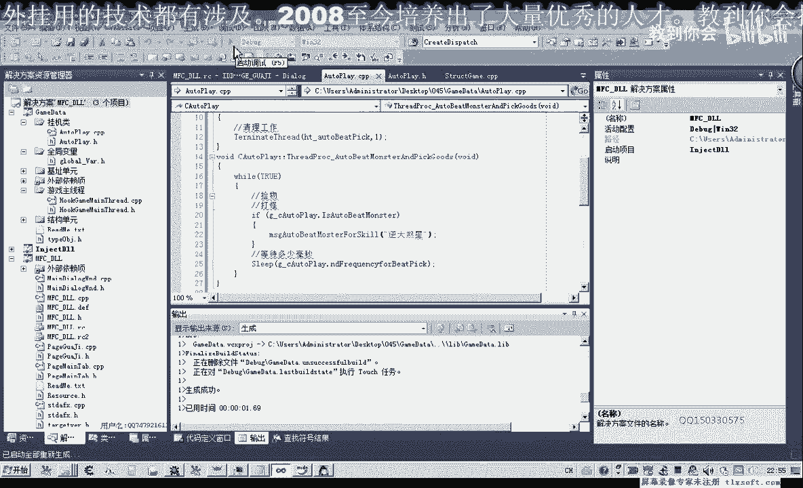

## 总结 🎯

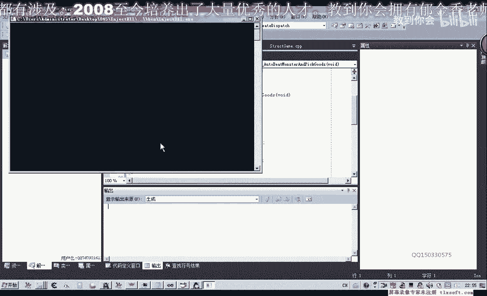

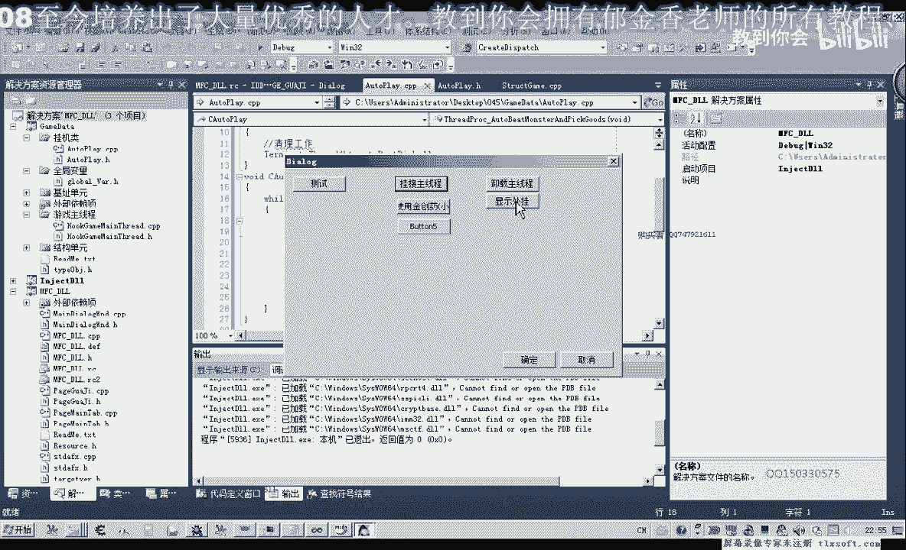

本节课中我们一起学习了如何封装一个自动打怪的挂机类。我们从创建C++类开始，实现了用于后台持续打怪的线程，包括线程的创建、执行、挂起和销毁。接着，我们将类的功能与用户界面控件相连接，使得点击按钮可以控制挂机行为。最后，我们完善了攻击逻辑以兼容普通攻击，并进行了功能测试。

通过本课，你掌握了将特定游戏功能模块化封装的基本方法，以及使用多线程实现后台持续任务的核心流程。在后续课程中，我们可以在此基础上为挂机功能添加更多可配置选项，如技能选择、打怪间隔设置等。