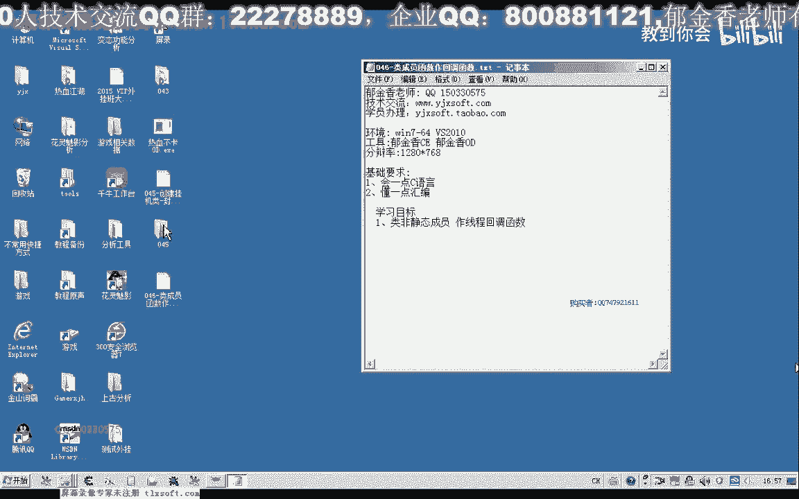
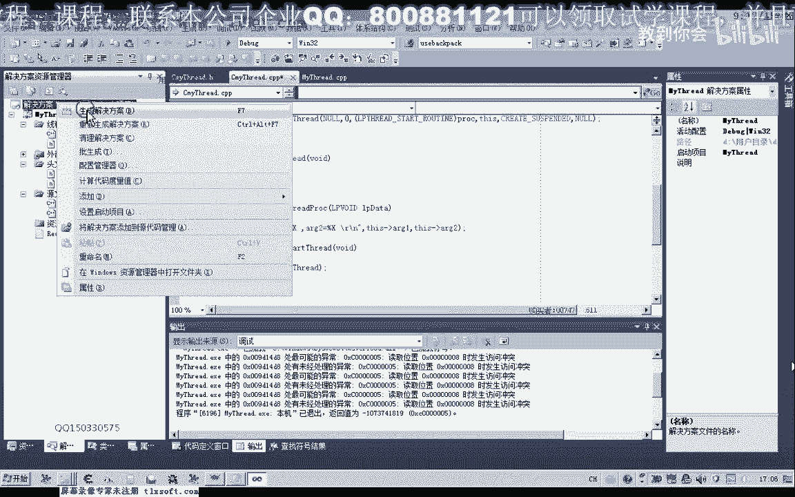
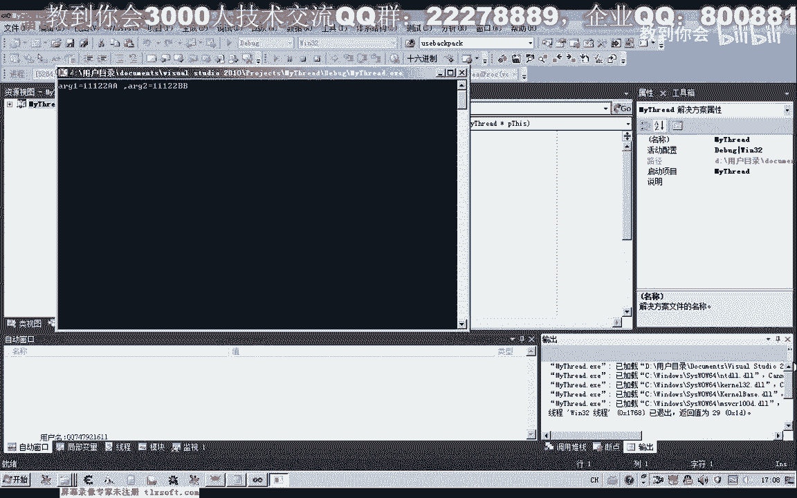
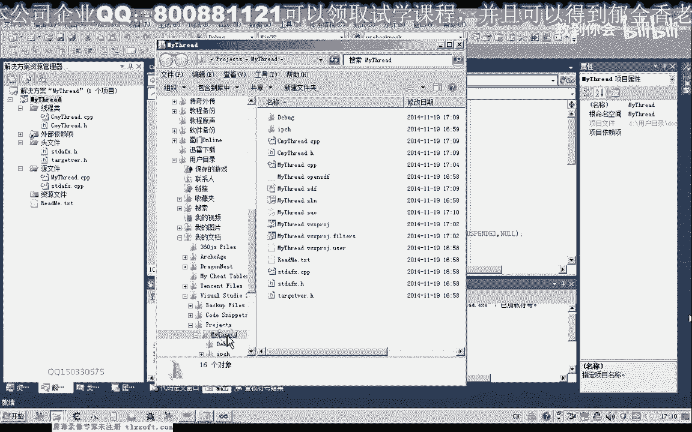
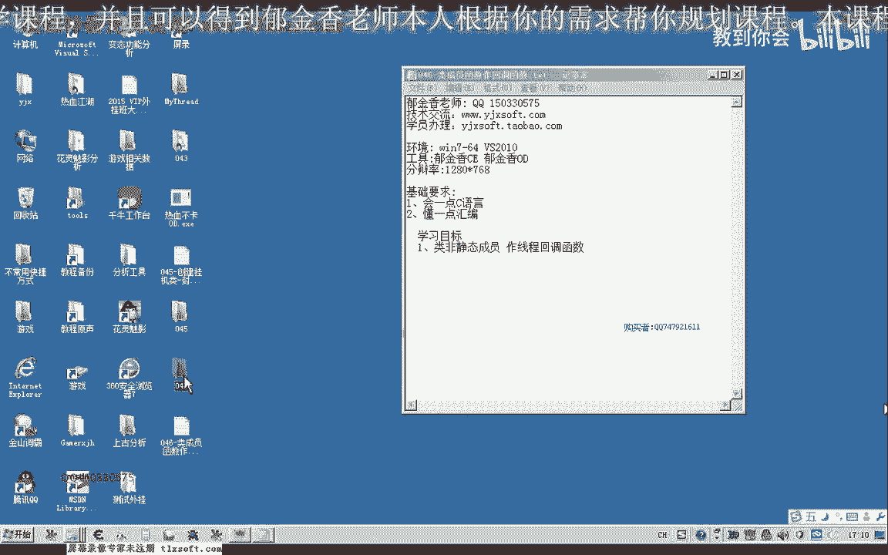

# P35：046-类成员函数作回调函数 - 教到你会 - BV1DS4y1n7qF

大家好，我是郁金香老师，那么在第45课的时候。

我们封装了一个挂机的类，在WaterPlay挂机类里面，我们有一个回调函数，这个回调函数，我们是用静态关键字来修饰的，那么所以说我们这些类里面的成员，函数的，这些类里面的成员变量的话。

我们在回调函数里边的话不能够直接的访问，那么我们当时是建了一个全局的变量来访问的，但是用了全局的变量的话，我们就相当于突破了绿的一个封装，这样的话使用的话也不是很好，那么这几个我们来探讨一下。

使用非静态的成员函数。

来作为一个我们现成的回调函数，那么新建一个项目来测试一下。

然后我们添加一个类，添加一个现成的路，那么创建了这两个文件之后，我们把它移到目录下边，然后我们也是仿造上一节课的代码来输行，首先包含我们的windows的文件，创建一个剧本来保存我们的现成剧本。

这两个变量，我们成员变量我们用来传递参数，然后再创建一个现成的回调函数，另外我们用一个函数来恢复现成，好的，那么写好了之后，我们在内成员的一个购物册函数里面进行一个初始化。

那么首先我们对这两个成员内成员变量进行一个初始化，然后在这里我们再创建一个现成，后面的参数我们全部创为0，抛空就行，那么只需要一个现成的回调函数就行，那么后面的参数我们暂时不忙传递，那么回调函数里边。

我们应该又做一些什么的，添加相关的一个代码，我们做几个简单的数据的打印，准备好你准备好，(遊戲畫面)，(遊戲畫面)，(遊戲畫面)，(遊戲畫面)，這個時候我們進行一下編譯。

這個時候我們就發現了我們非靜態的成員函數，它就通不過一個編譯，那麼這裡我們需要建立一個變量，用幾句匯編代碼來逃避編譯器的檢測，(遊戲畫面)，首先我們把這個綠成員函數的地址通過匯編把它讀出來。

那麼編譯器它不會檢查匯編代碼，然後我們再把匯編的地址把它讀到我們的變量裏面去，(遊戲畫面)，然後我們用變量來做一個強制類型的轉換，(遊戲畫面)，那麼這個時候它就可以通過我們的編譯了。

那麼通過編譯之後的話，理論上我們就可以了用它來傳遞我們的參數，但是我們來進行一下相應的測試，這個時候包含我們的同文件，(遊戲畫面)，然後我們創建一個綠的實例對象，(遊戲畫面)。

然後我們開啓相關的一個線索，(遊戲畫面)，用一個getty charm來讓打印出信息之後，在這裏停一下，方便我們查看一個信息，(遊戲畫面)，對了還有一個study set。

我們只在同文件裏面做了一個說明，還沒有編寫一個具體的代碼，(遊戲畫面)，那麼在這裏我們恢復創建了一個線程，那麼要恢復創建的線程的話，我們到第二個參數了，這裏我們就要創建之後把線程掛起，(遊戲畫面)。

那麼我們在編譯運行一下，那麼這個時候我們發現它會報錯，為什麼會報錯呢，因為這個res指針它不能夠獲取，因為res指針的話，它是作為一個參數，保存在我們ECX裏面，這樣傳進去，(遊戲畫面)。

那麼這裏我們停止調試，因為我們這裏是回調函數，它傳進去的參數來這裏為空，所以說在我們回調函數裏面的話，它用的res指針，這裏相當於是我們通過res指針來訪問的參數，那麼這個前綴只是我們平時省略掉了。

但是這個時候的話，res指針它沒有經過一個相應的初始化，那麼所以說我們要解決的話，我們要怎麼解決，首先我們要在這個地方，我們要傳入我們的res指針，但是即使傳入了指針的話，由於我們的回調函數。

它的一個參數的傳遞方式，與我們這裏的回調函數的一個傳遞方式不一樣，那麼在這裏我們的現成的回調函數，它要求的是std code的一種傳遞方式，而我們這個地方它參數傳遞的方式是res code。

那麼res code也就是用ecx來傳遞的我們的res指針，所以說我們這樣編譯的話。

它同樣的還是會失敗，我們看一下，同樣的會失敗，那麼實際上它這個時候res指針傳到了我們的LPDirty裏面去了，那麼我們也可以解決，這個時候我們停止調試。

那麼在這裏的話，我們只需要添加一句，在回調函數裏面，只需要把LPDirty複製給我們的res指針就行了，或者我們把這裏的路徑給它改一下，就改成semicolon set，pgs，這樣改也可以。

當然在這裏的話，我們也可以直接的使用pgs的指針也可以，那麼可以這樣的使用，但是這裏的話，我們就需要改它的前面的一個說明，然後我們運行。

那麼這個時候我們就能夠正常的接受我們的參數，可以正常的使用。

當然還有另外的方式也可以，那麼如果我們在這裏，我們不改變，它的話，我們也可以用另外的方式，用之前的一個參數的方式，那麼在這裏，我們也可以這樣寫，那麼在這裏的話，我們可以怎麼寫呢。

那麼我們不要這個前句的話，不要前句了，我們寫要方便一些，我們可以把這個res，指針給它重新的進行一個複製，electric，這樣的一個複製就行，但是這裏，首先我們要有一個類型的轉換，那麼轉換之後。

這樣編譯器主要是編譯通不過，這個時候編譯器，它不能夠進行這樣的一個複製，那麼我們也可以用一句彙編指令，來逃避一個編譯器的檢查，那麼這樣的話，我們就可以了，不加這個前句，直接的像正常的成員函數這樣來調用。

然後我們再來看一下答案的一個結果。

那麼這個時候輸出的數字的話，也是正確的。

也是正確，好的，那麼這裏的試煉成功了，接下來我們就可以改一下，我們上一節課的這個代碼。

那麼我們打開第45課的代碼，對我們上一節課的代碼來進行一些修改。

那麼移到掛機率的這個單元，在這裏，首先我們去掉靜態的關鍵字，但是這個時候我們編譯的話可能就要出問題，那麼這裏無法轉換，那麼首先我們要逃避相關的一個檢測，這裏我們另外的建一個變量。

那麼這樣我們就能夠逃避一個編譯系的檢測，那麼這樣我們編譯通過了，但是還有一個參數的一個傳遞，那麼這裏我們傳ZESS指針進去，那麼這裏ZESS指針傳進去之後，在我們回調函數裏面，我們還要接收這個數字。

但是這個回調函數我們還需要給它進行一個復原，這裏我們需要接受一個參數，然後移到頭文件裏面進行一個詳細的修改，那麼修改了之後，在進入循環之前，我們也要把ZESS指針進行一個重新的複製，mov_ex。mp。

對，而後面的ZESS指針，要複製為我們的繼承金ex，然後再重新編譯，那麼在後面的我們全局變量的依賴，我們就可以把它取消掉了，然後再編譯，好的，那麼測試的工作就留成一個座列，大家下去測試一下。

那麼我們這節課我們就到這裏，下節課我們再見。

