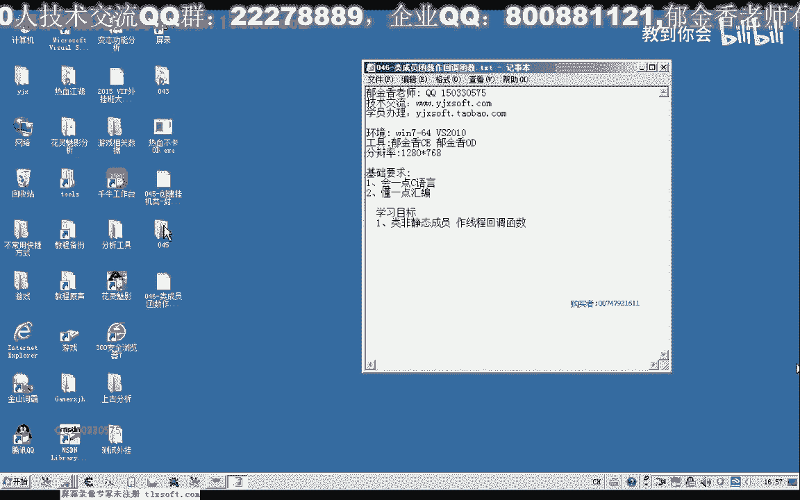

# 课程 P35：046 - 使用类成员函数作为回调函数 🧩

在本节课中，我们将学习如何将类的非静态成员函数用作线程的回调函数。上一节我们介绍了使用静态成员函数作为回调的局限性，本节我们将探讨如何突破这一限制，实现更符合面向对象封装特性的回调机制。

---

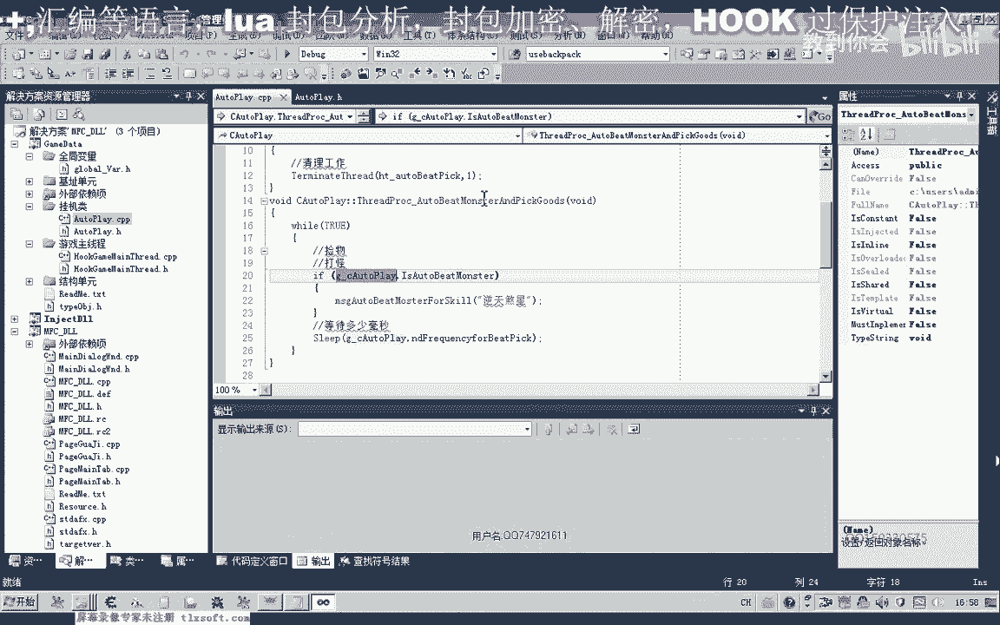

## 背景与问题回顾

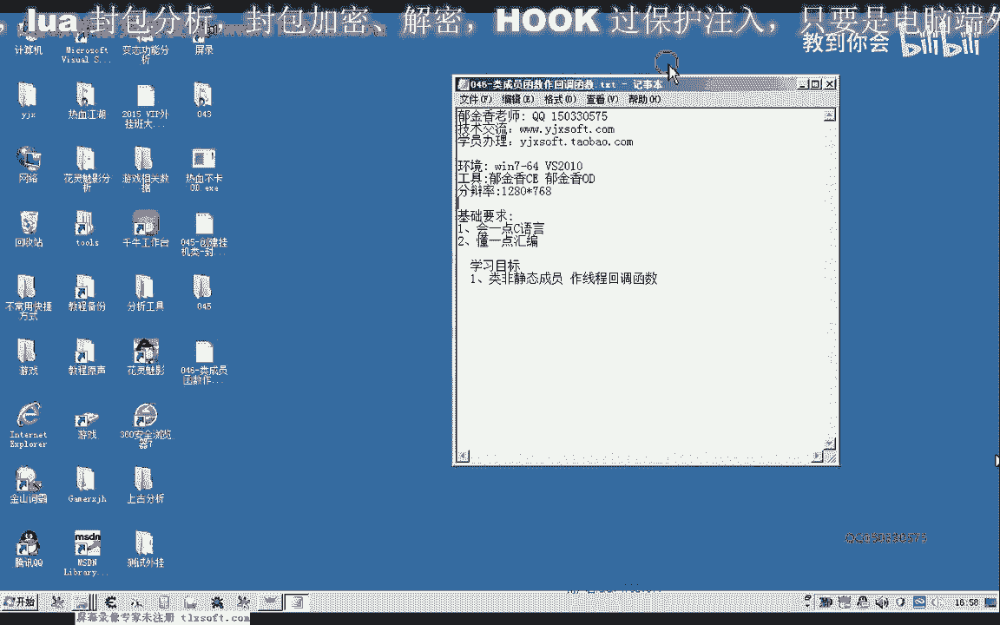

在第45课中，我们封装了一个挂机类 `WaterPlay`。其中的回调函数使用了 `static` 关键字修饰。由于静态成员函数不能直接访问类的非静态成员变量，我们当时创建了一个全局变量来访问这些数据。这种方法破坏了类的封装性，使用起来并不理想。

## 核心目标：使用非静态成员函数

本节课的目标是探讨如何使用类的**非静态成员函数**作为线程的回调函数。我们将通过新建一个项目来测试这一方案。

## 项目搭建与初始代码

首先，我们新建一个项目，并添加一个类（例如 `MyThread`）。创建好头文件和源文件后，我们将其移动到项目目录下。

初始代码仿照上一课的结构编写：

1.  包含必要的头文件 `windows.h`。
2.  在类中声明用于保存线程句柄的成员变量 `m_hThread`。
3.  声明两个成员变量（例如 `m_param1`, `m_param2`）用于传递参数。
4.  声明一个非静态的线程回调函数 `ThreadProc`。
5.  声明一个用于启动线程的成员函数 `StartThread`。

在类的构造函数中，我们对成员变量进行初始化。在 `StartThread` 函数中，我们调用 `CreateThread` API 创建线程。目前，我们先不传递参数，仅指定回调函数。

回调函数 `ThreadProc` 内部我们先编写简单的代码，例如打印一些信息。

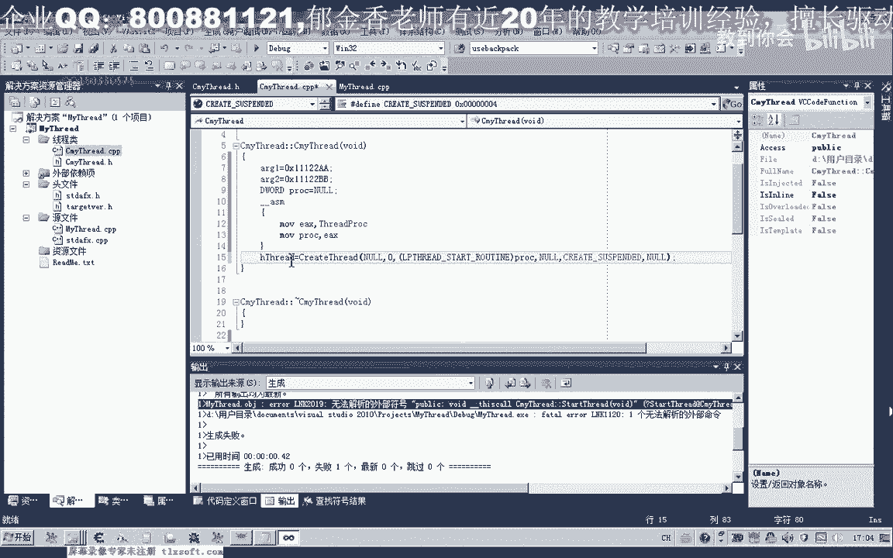

```cpp
// 示例代码框架
class MyThread {
private:
    HANDLE m_hThread;
    int m_param1;
    int m_param2;
    DWORD WINAPI ThreadProc(LPVOID lpParameter); // 非静态成员函数
public:
    MyThread();
    void StartThread();
};
```

## 遇到的编译问题与解决方案

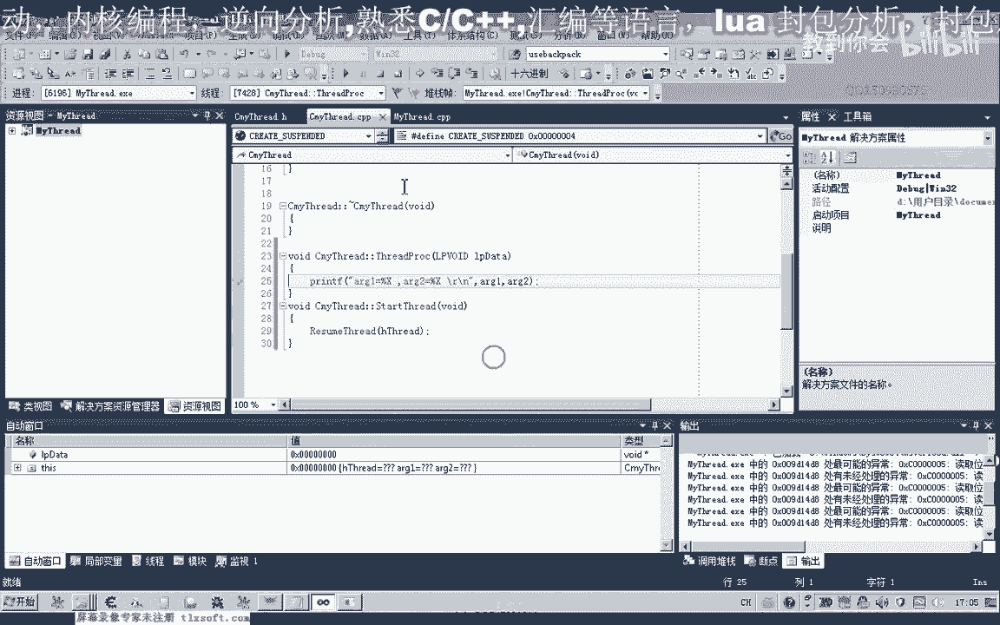

当我们尝试编译时，编译器会报错。这是因为 `CreateThread` 期望的回调函数遵循 `__stdcall` 调用约定，并且是普通的函数指针。而非静态成员函数拥有一个隐藏的 `this` 指针参数，其调用约定通常是 `__thiscall`，两者不兼容。

为了通过编译器的检查，我们需要使用一点技巧。我们可以通过内联汇编代码，先将成员函数的地址读取出来，编译器不会检查汇编代码。然后，我们将这个地址赋值给一个变量，再对该变量进行强制类型转换，转换为 `LPTHREAD_START_ROUTINE` 类型。

```cpp
// 在 StartThread 函数中
LPTHREAD_START_ROUTINE pFunc;
__asm {
    mov eax, offset MyThread::ThreadProc // 获取成员函数地址
    mov pFunc, eax
}
m_hThread = CreateThread(NULL, 0, (LPTHREAD_START_ROUTINE)pFunc, NULL, 0, NULL);
```

## 参数传递与 `this` 指针处理

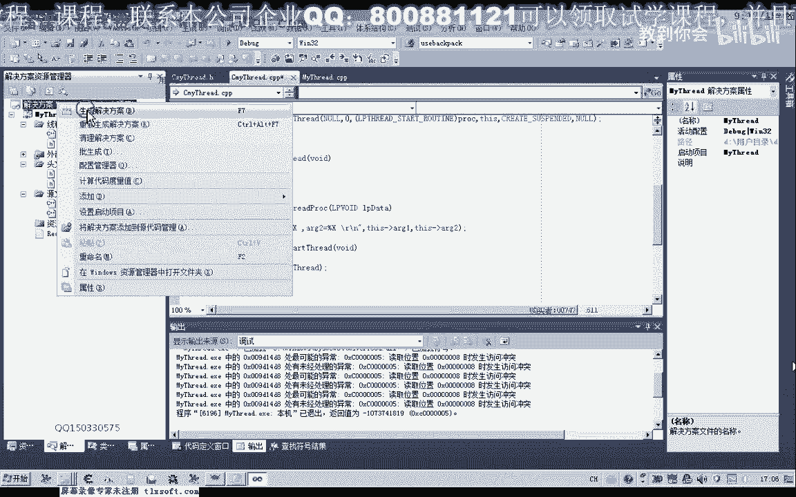

编译通过后，理论上可以运行，但我们需要传递参数。我们计划将 `this` 指针作为参数传递给回调函数。

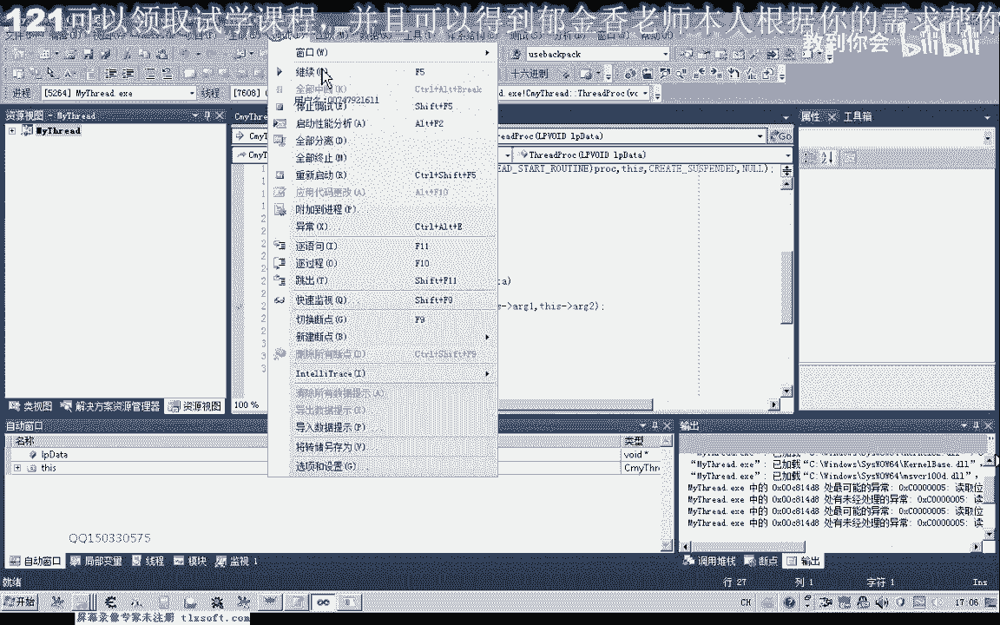

```cpp
// 修改 CreateThread 调用，传入 this 指针
m_hThread = CreateThread(NULL, 0, (LPTHREAD_START_ROUTINE)pFunc, this, CREATE_SUSPENDED, NULL);
```

然而，直接运行仍然会出错。因为回调函数被调用时，`__stdcall` 约定会将参数 `this` 放在堆栈上传递。但在成员函数 `ThreadProc` 内部，编译器默认会从 `ECX` 寄存器（`__thiscall` 约定）去寻找 `this` 指针，此时 `ECX` 并未被正确初始化，导致访问失败。

为了解决这个问题，我们需要在回调函数的开头，手动将传入的参数（即 `lpParameter`）设置给 `this` 指针。

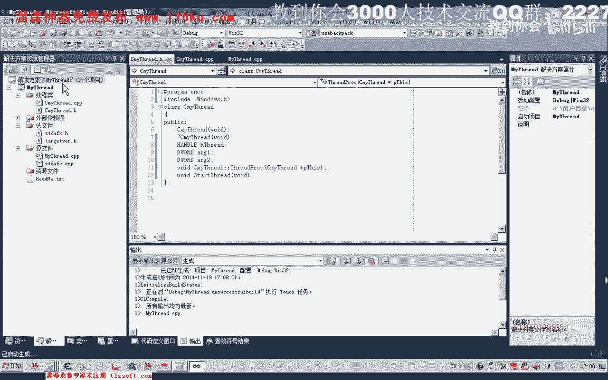

以下是两种修改 `ThreadProc` 函数的方法：

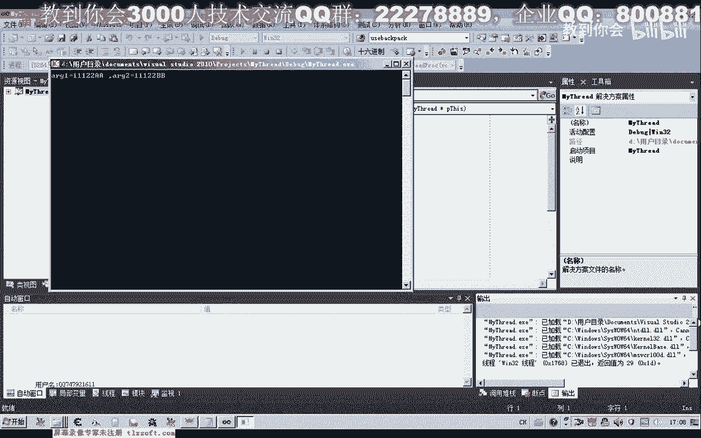

**方法一：直接使用参数指针**
将函数签名和实现改为直接使用传入的 `LPVOID` 参数，并在内部进行类型转换后访问成员。

```cpp
DWORD WINAPI MyThread::ThreadProc(LPVOID lpParameter) {
    MyThread* pThis = (MyThread*)lpParameter; // 转换回类指针
    // 现在可以通过 pThis->m_param1 等方式访问成员变量
    printf("参数1: %d\n", pThis->m_param1);
    return 0;
}
```

**方法二：使用汇编指令恢复 `this` 指针**
保持成员函数的原型不变，在函数内部使用汇编指令，将传入的 `lpParameter` 参数值移动到 `ECX` 寄存器。

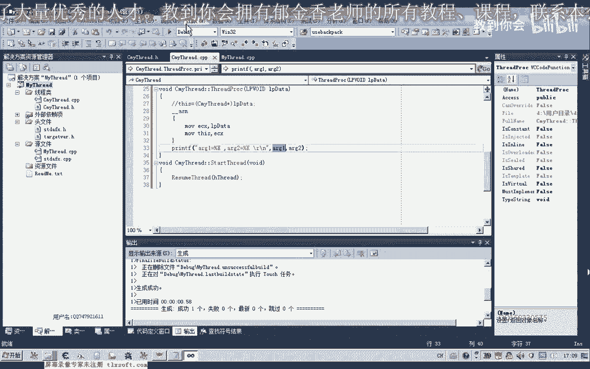

```cpp
DWORD WINAPI MyThread::ThreadProc(LPVOID lpParameter) {
    __asm { mov ecx, lpParameter } // 将参数赋值给 ECX (this 指针)
    // 现在可以直接使用成员变量，如 m_param1
    printf("参数1: %d\n", m_param1);
    return 0;
}
```

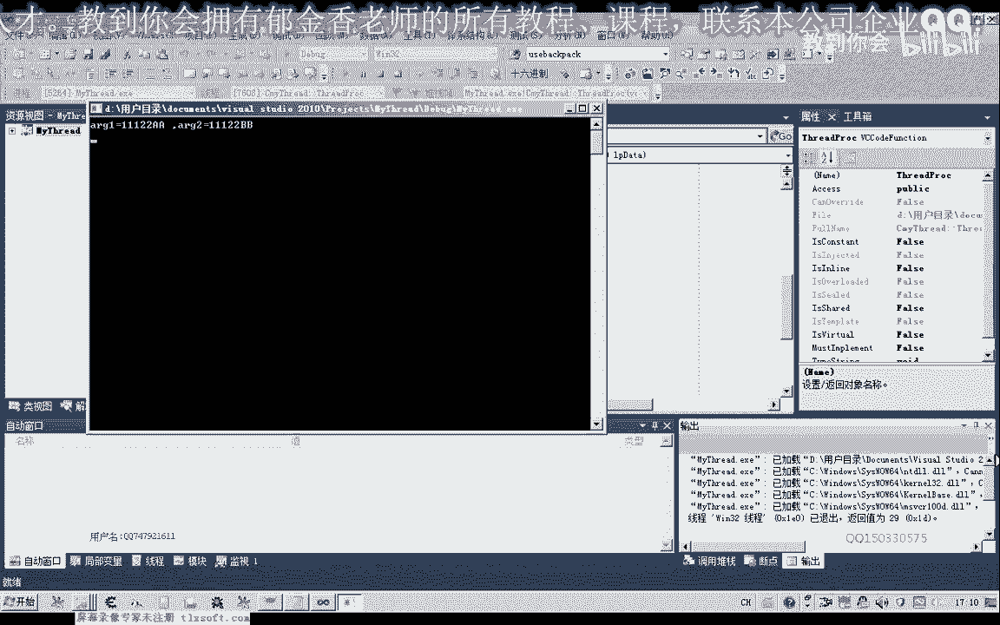

使用以上任一方法修改后，程序即可正常运行，并成功在回调函数中访问类的成员变量。

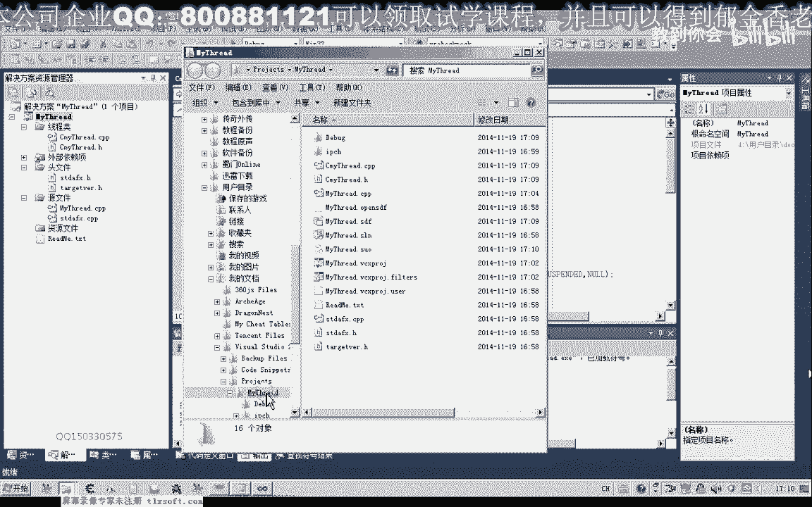

## 应用实践：修改第45课代码

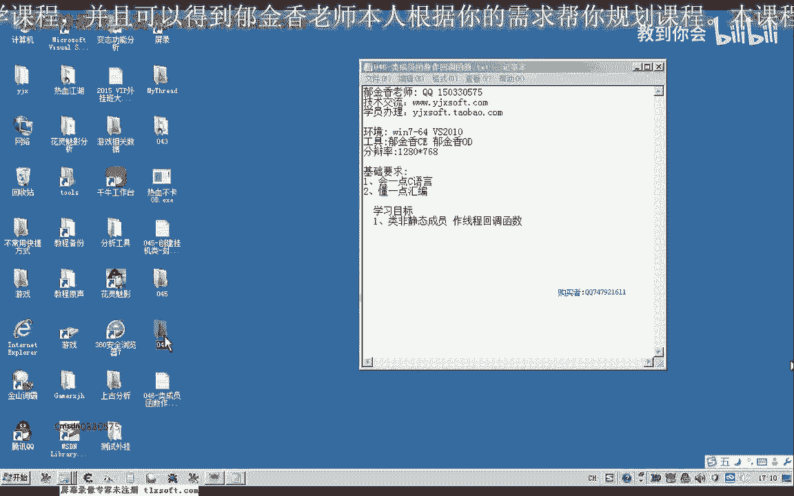

测试成功后，我们可以回过头去修改第45课的挂机类代码。

1.  移除原回调函数的 `static` 关键字。
2.  使用本节介绍的汇编技巧获取函数地址，以通过编译。
3.  在 `CreateThread` 时传入 `this` 指针作为参数。
4.  在回调函数内部，采用上述**方法二**（汇编指令）来正确接收 `this` 指针。
5.  修改后，即可删除之前为了突破封装而使用的全局变量，使代码更加整洁和符合面向对象原则。

具体的代码修改和测试工作，建议大家作为练习亲自完成。

---

## 总结

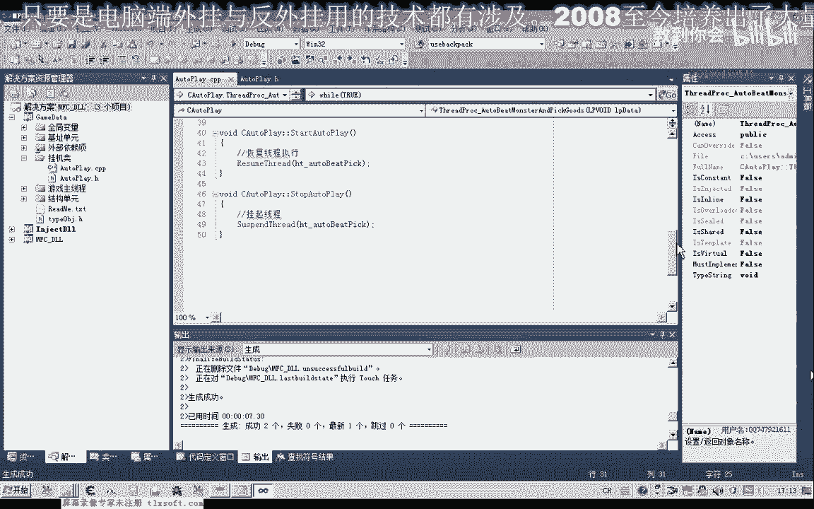

本节课我们一起学习了如何将类的非静态成员函数用作线程回调函数。我们分析了直接使用会遇到的编译和运行时问题，并介绍了通过内联汇编技巧获取函数地址，以及在回调函数内部正确处理 `this` 指针的两种方法。最终，我们成功实现了在保持类封装性的前提下，在回调函数中自由访问成员变量。这种方法比使用静态函数配合全局变量更加优雅和安全。