# 逆向工程课程 P36：047-快速更新基址方法 🛠️

在本节课中，我们将学习如何在游戏更新后，快速定位并更新失效的基址。我们将通过分析汇编指令、使用特征码搜索以及利用已知数据回溯等多种方法，以背包基址、物品使用Call和人物属性基址为例，进行实战演练。

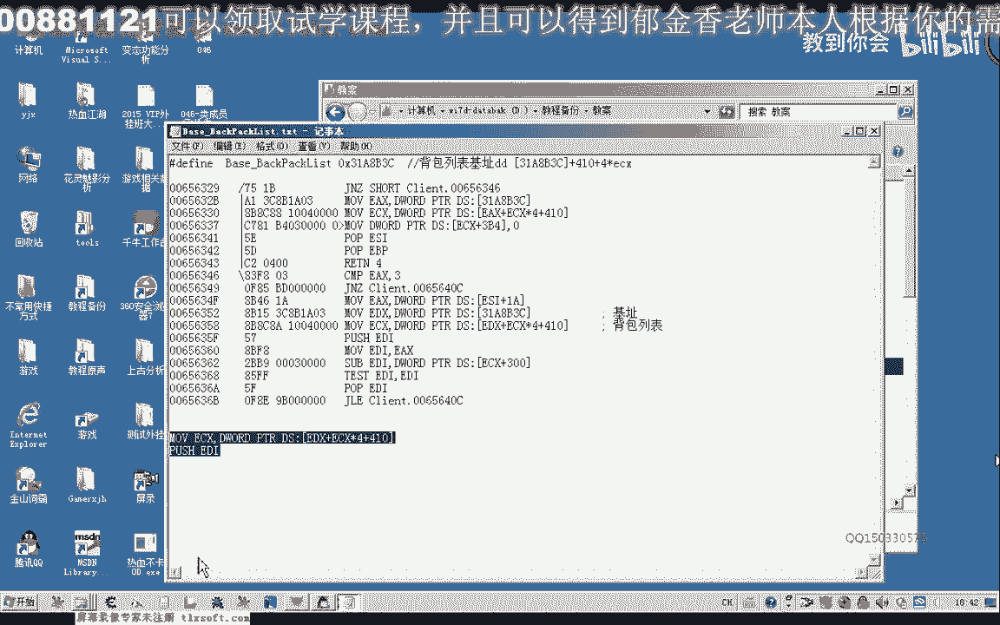

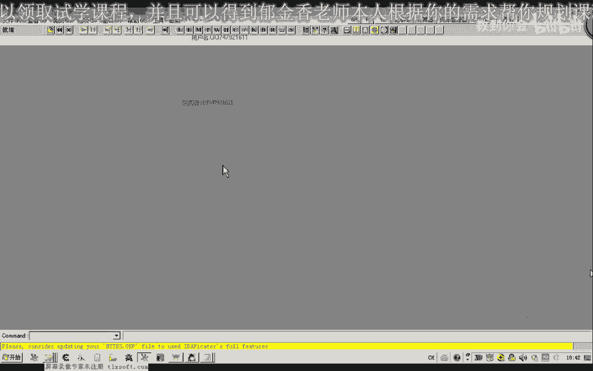


## 概述

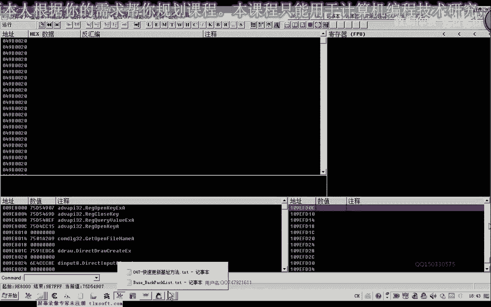


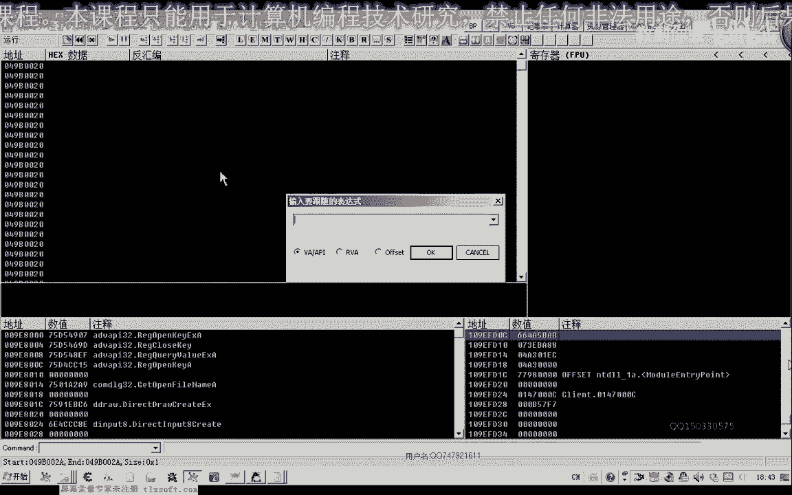

游戏更新后，代码地址会发生变动，导致之前找到的基址失效。本节课的核心目标是掌握几种高效更新基址的技巧，减少重复分析的工作量。我们将主要使用OD（OllyDbg）和CE（Cheat Engine）两款工具。


## 方法一：利用汇编指令特征码（OD）


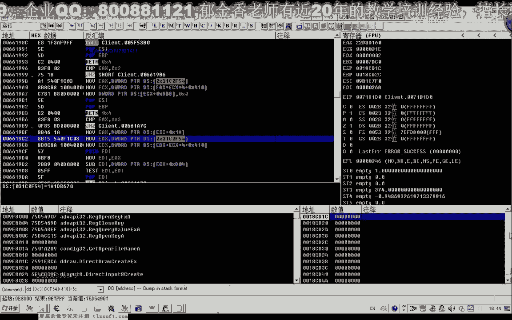

上一节我们介绍了课程目标，本节中我们来看看第一种方法：在OD中利用未变动的汇编指令序列作为特征码进行搜索定位。


**核心原理**：游戏更新时，高层逻辑和数据结构可能变化，但底层的数组访问、计算等汇编指令模式往往保持不变。我们可以将这些不变的指令序列作为“特征码”来定位基址附近区域。

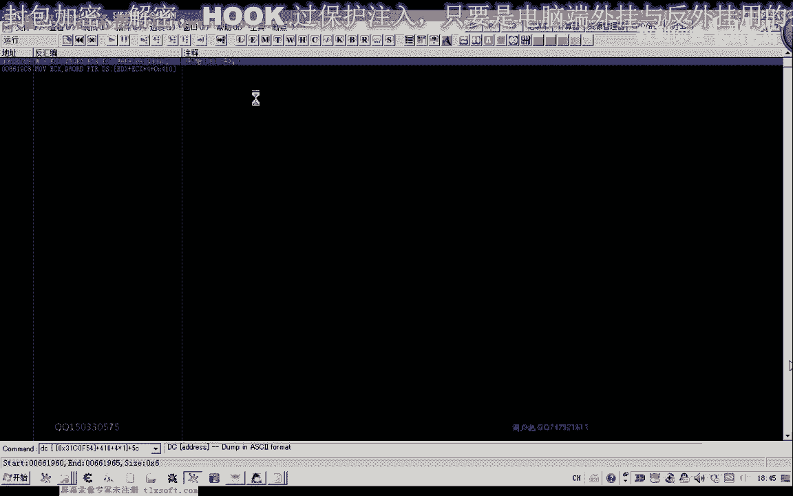

以下是利用OD查找命令序列的步骤：

1.  在OD中附加目标游戏进程。
2.  转到更新前基址所在的代码区域。
3.  复制一段确信在更新后仍会存在的、独特的汇编指令序列（例如，访问数组的指令）。
4.  在OD中使用“查找所有命令序列”功能，粘贴该序列进行搜索。
5.  在搜索结果中，找到位于原基址地址附近的指令，其上方通常就是新的基址加载指令（如 `mov ecx, [xxxxxxxx]`）。

**代码示例**（特征码指令序列）：
```
mov edi, [ecx+0x5C]
lea esi, [edi+eax*4]
```

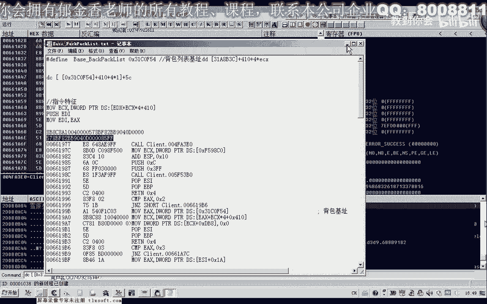

通过此方法，我们成功定位到了新的背包基址。

## 方法二：利用机器码特征码（CE）

除了汇编指令，我们还可以直接使用其对应的机器码（十六进制字节数组）作为特征码，在CE中进行搜索。

**核心原理**：汇编指令在内存中最终以机器码形式存在。提取关键指令的机器码，在CE中扫描，可以快速定位到代码位置。


以下是利用CE进行十六进制扫描的步骤：

1.  从OD中复制目标汇编指令对应的机器码（十六进制字节）。
2.  在CE中附加游戏进程，选择“十六进制”扫描类型。
3.  将复制的机器码粘贴到CE的搜索框，执行扫描。
4.  在找到的地址上，通过“查看内存”功能，并向前翻阅，即可找到加载基址的指令。


**公式/代码描述**（机器码特征码）：
```
57 8B F8 8D 34 87 8B 0C B1
```

此方法同样有效，并且有时比搜索汇编指令更直接。

## 方法三：通过已知数据指针回溯基址

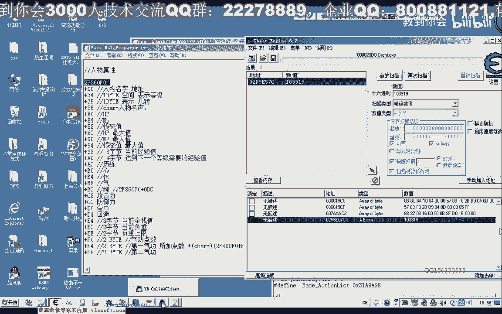

对于像人物属性这类可能没有现成特征码的复杂基址，我们可以通过其下属的已知数据（如生命值、经验值）指针来反向推算。


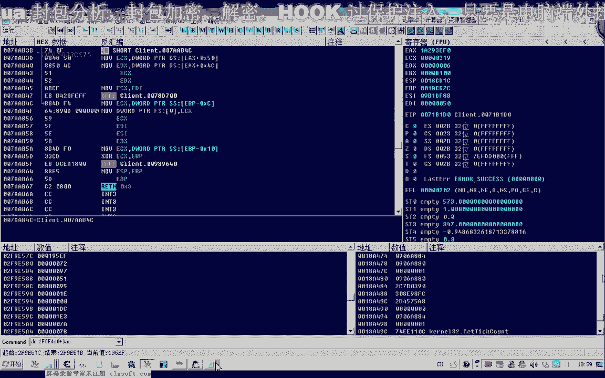

**核心原理**：基址与其下属数据指针之间存在固定的偏移关系。通过CE搜索到某个已知动态数据（如当前经验值）的地址，减去该数据相对于基址的偏移量，即可得到新的基址。

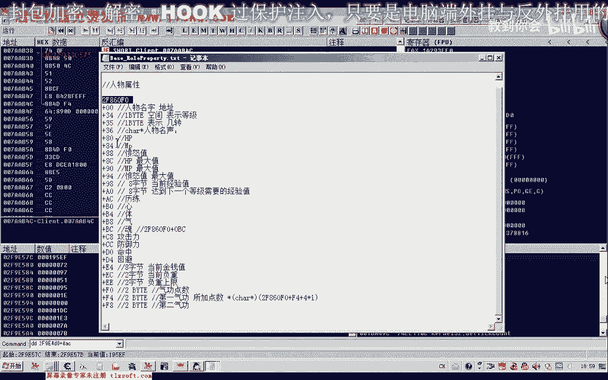

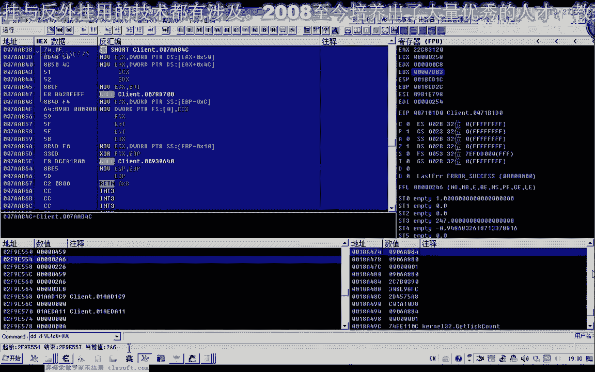


以下是数据回溯法的步骤：


1.  确定要查找的基址（如人物属性基址）和其下一个已知偏移的静态数据（如 `基址+0xAC` = 经验值）。
2.  在游戏中查看当前经验值，并在CE中用精确值搜索。
3.  找到经验值的动态地址后，在CE或OD中查看该地址。
4.  将该地址减去偏移量（如 `-0xAC`），得到的结果即为潜在的人物属性基址。
5.  验证该地址：加上其他已知偏移（如 `+0x84` 是生命值），查看内存中的数据是否与游戏内显示一致。

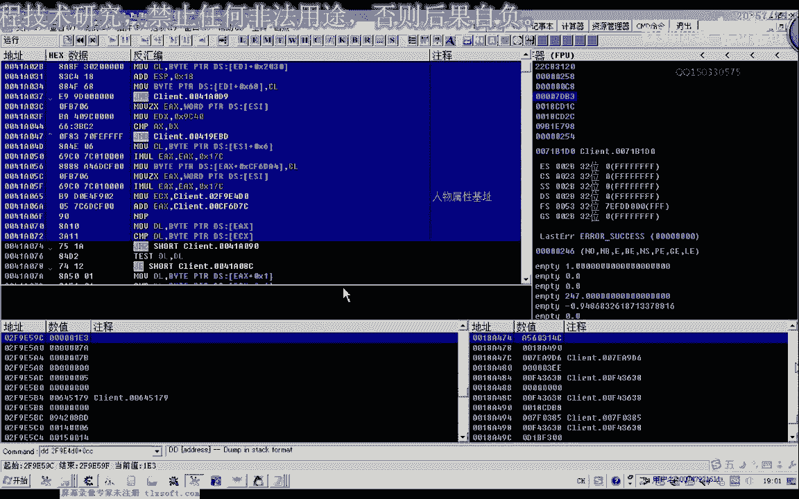

**公式描述**：
`人物属性基址 = 历练值地址 - 0xAC`
`生命值地址 = 人物属性基址 + 0x84`


通过此方法，我们验证并找到了更新后的人物属性基址。


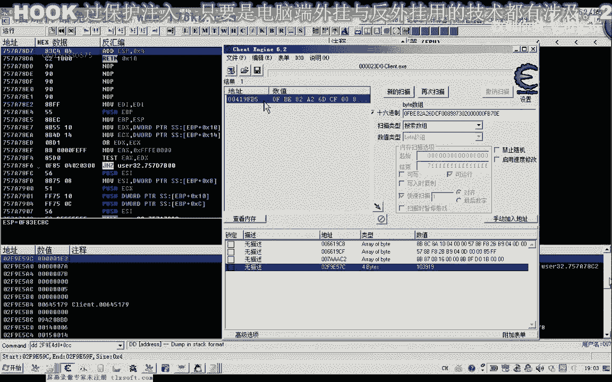

## 总结与作业

本节课中我们一起学习了三种快速更新游戏基址的方法：
1.  **OD指令特征码法**：适用于有稳定汇编指令模式的场景。
2.  **CE机器码特征法**：直接高效，是特征码搜索的常见形式。
3.  **数据指针回溯法**：当缺乏特征码时，通过已知数据关系逆向推导。

这些方法的核心思想都是**利用更新中相对不变的部分来定位变化的部分**。掌握后，可以大幅提高逆向分析效率。

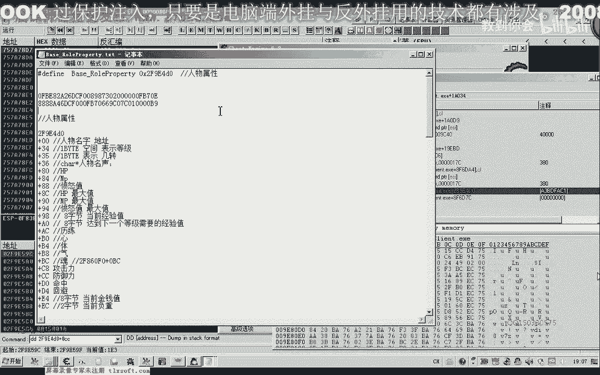

**课后作业**：
请运用本节课学到的方法，尝试更新课程示例中提到的其他基址（如任务列表、场景对象等），并为你找到的新基址提取出可供下次更新的特征码（汇编指令序列或机器码）。