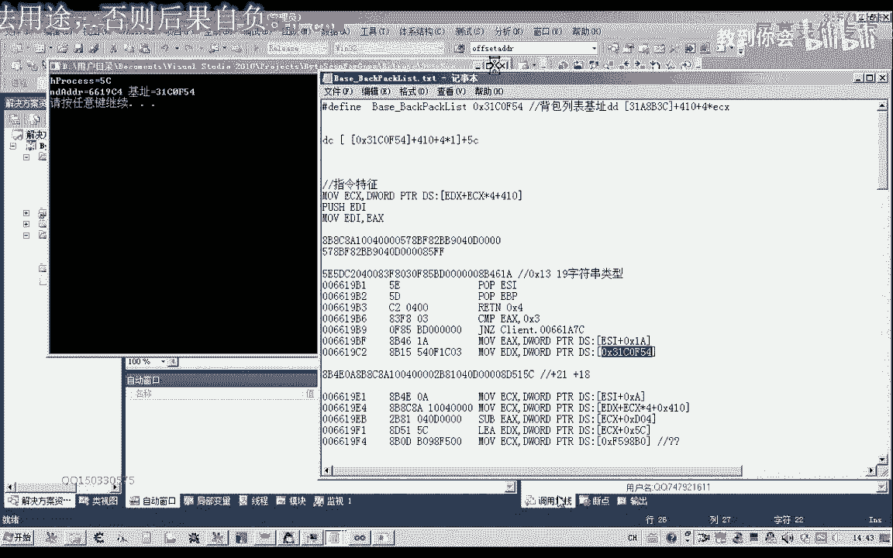
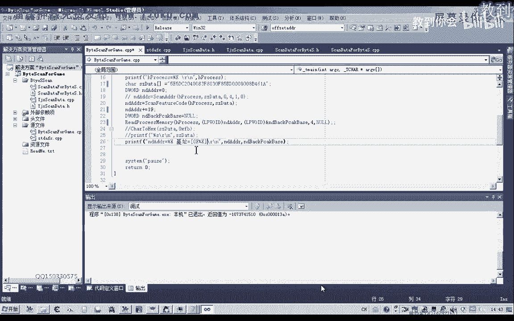
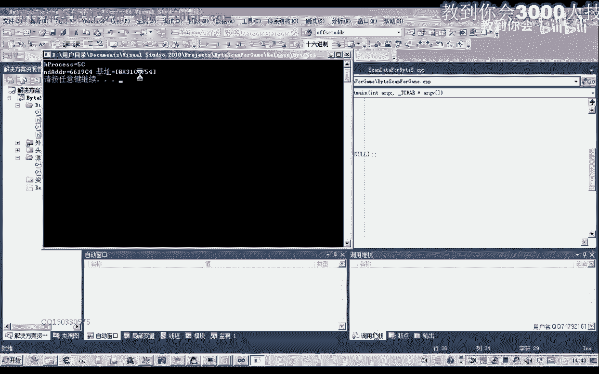
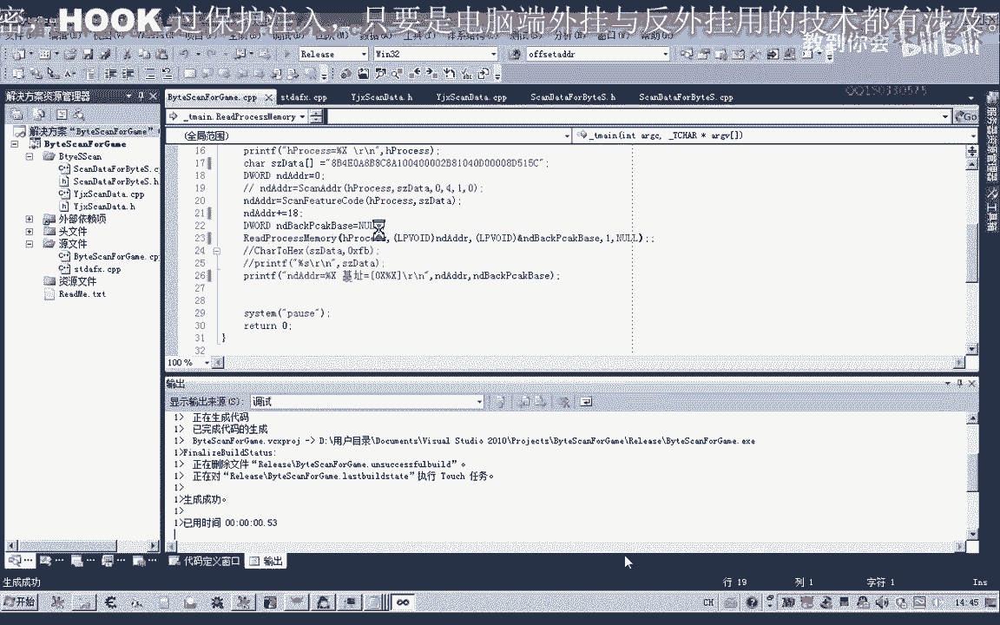
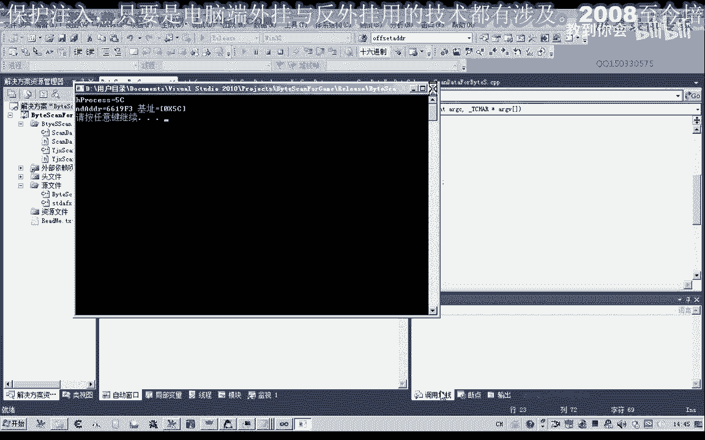
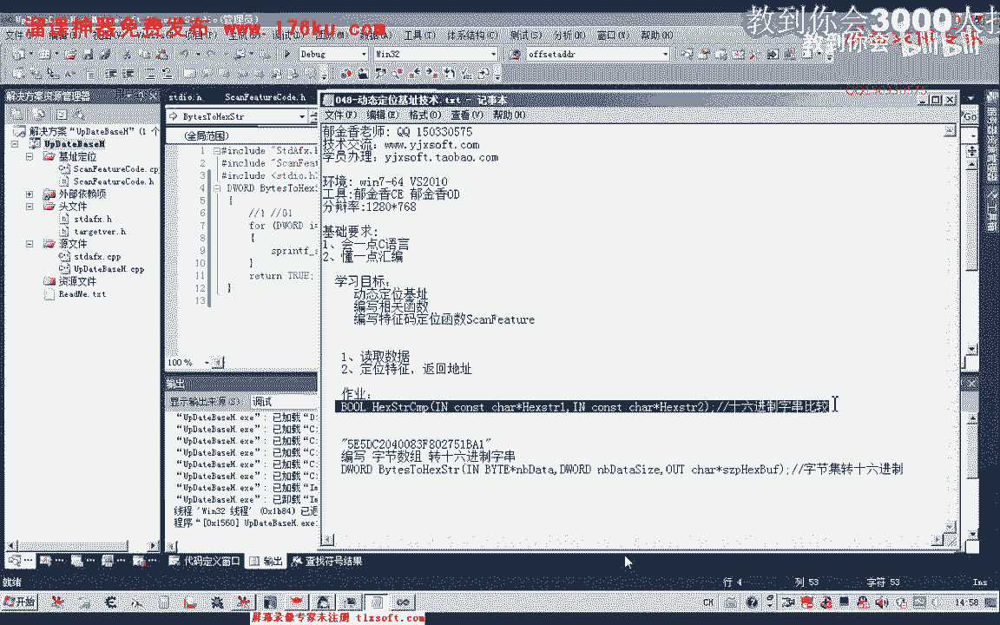

# P37：048-动态定位基址技术 - 教到你会 - BV1DS4y1n7qF

大家好，我是郁金香老师，那么在前面第47课的时候，我们一起来讨论了怎么快速的定位我们的特征码啊，那么最近的这几步的话，我们来探讨一下怎么自己编写代码来实现这个特征码的定位，那么这样做的话会更加的效率啊。

而且灵活性也更高啊，你可以脱离一个工具啊，那么可能我们写好代码之后的话，短短的几秒钟的时间，他就能够把所有的机制就能够更新好。

那么我们在这里举个例子啊，在这里我也编写了一段代码，编写了一段搜索啊，定位这个揭示了一个函数。

那么首先我们以这个背包的这个机子为例，比如说我们这是背包的一个机制，那么我们要定位的话，我们可以把前面的这一段特征码给它取出来，那么我们取它的特征码的话，就是这里的一定，继续重新，好那么删掉中间的空格。

那么这个这就是一个特征码的字串啊，我们把它作为一个字符串类型的特征码，那么这个特征版最后我们通过函数转换之后呢，它会搜索到啊，这个6619比较等啊，它的起始地址呢这个位置。

那么这个其实位置呢距离我们的机子呢它还有一段距离，让我们数一下有多少个字节的偏移差距啊，30+4嗯，14 14+30 70 89啊，那么一共有19个自己的偏移，总x13 30进制是19。

那么我们就可以加上哈，定位到这个机子之后呢，我们可以来加上它的一个偏移，然后再进行读取，就能够得到相关的机制。

好那么这里的话它的偏移是邀请我们读一下，然后呢这里是是自己，那么最后呢他会把妻子计算出来。

那么这个时候呢我们看一下读出来的句子，对不对，3140f1 f5 c啊，当然我们也可以加一个0x的前缀。

在这里，那么看起来的话啊可能就更直观一些。

啊那么这就是我们说出来的这个相关的一个介质。

那么这样的话定位是非常紧准确的，那么比如说我们要定位的是这个机制的，那么我们就可以了，用提取的这个特征串，再加上它的一个偏移也是可以的，然后我们看一下它的偏移有多少资金，这里是七个字节。

10 16 17，20 21个自己的21个字母的心理，那么我们就把这个特殊方法制一下，然后呢粘贴到这里，那么这里的话就是21，那么我们看一下读出来是多少，那么这个时候呢他也想把这个啊特征码啊。

机子把它读取出来，那么我们也可以读它的一个偏移，比如说对c这个偏移一个字节啊，它的一个偏移，那么在这里的话我们就把解除掉，减掉两个字体就可以了，就是这个学这个地方应该是13000个字节进去。

那么我们也可以在这里加一八，然后然后呢这里就你自己。

那么这里的话它也能够啊相关的偏移也能够读出来啊。

那么所以说这样编程的话是非常方便的，那么接下来呢我们就探讨一下怎样用代码来编写一个这样的函数，那么首先呢我们的这个特征嘛它是字符串类型，但是我们游戏里面存在的数据。

它不是字符串中性，那么首先呢我们要把这些字节数组的数据呢，要转换成这种16进制的字串啊，这样我们才能够统一啊，格式，才能够进行比较，当然我们也可以选择啊这个16进制的字串啊，把它转换成我们这种字符数组。

字节数组的数据类型，然后统一成数据的格式来进行比较都是可以的啊，那么今天呢我们来探讨就探讨，先把这个啊把内存里面的这个数据，把它转换成我们的16进制的字符串啊，统一成这个字串的格式呢。

我们更加的灵活一些，好的，那么我们打开一个工厂，创建一个新的工程。

建一个新的项目，那么我们就叫做更新机子，好的，那么我们就建这样的这样一个工程文件，然后我们点完成，那么完成之后呢，我们在这里建一个，筛选器，然后添加一个c加加的内，就完成，然后我们删掉这个对的一个说明。

我们最终的目的是要把这两个文件文件和源文件，然后我们在这里呢进行我们相关函数的一个说明，字节集团我们的死亡，那么然后呢我们开始编辑我们的程序，那编写这个函数的话，我们也有几个不错的前程。

那么首先呢我们是要把前面的字节数组里面的这些数据转换成逐一的，转换成里面的字节，其字符串，那么要转换的话，我们这里需要一个循环，它一共需要转换多少次，那么这个数组里面有多少个字节的。

这个参数的软件一共能转换多少个字节，那么所以说在这里呢，我们第一个变量i，那么这个i呢它最终的数值小于这个代替的缓冲距，传进来的这个世界需求大小，然后按加加，这是它的下标，那么一碰到他换了多少次了嗯。

而且这个我们要申请的这个缓冲区的大小的话，它要是要是我们这个在前面这个缓冲就大小的两倍才可以，因为最终呢他一个字节啊，比如说我们的前面的他一个数字，那么最终呢它转换成16进制之后呢，会成为这种形式啊。

扭腰的这种形式，所以说他要占两个字节字符，那么在这里呢我们可以借助一个函数来实现，那么这个函数我们首先呢就是前面的这个38分，那么在这里呢我们就是取他i 11米二的这个地址，因为他我们一个这个季节的话。

最后呢他转换之后都会成为这种啊，占两个字节呃，呃这种字符啊一定让我日了这位啊一个数字，所以说我们这里呢我们要乘以二，然后取他的这个地址传进，那么后面呢是一个格式化的一个字串。

那么在这里的话我们要格式化为百分之x，那么呢并且呢它只能占两个位置，那么前面呢我们要用零来填充，如果是不够的话，那么后面呢就是我们的nb dt的每一个字节啊。

i那么这样的话我们理论上呢就能够进行一个相应的一个转换了啊，直到转换完成啊，但是呢这个我们要包含一个相应的一个单元，那么这个它在哪一个图文件里面呢，我们可以看到在sdl这个头文件里面。

当然我们看一下这个参数的一个格式，我们进去看一下，看我们使用的对不对，那么首先呢这是我们要存放啊这个呃相应支出的一个缓冲区，啊这是一个缓冲区的大小，这是缓冲区，然后，这个看着有点复杂，我们再来看一下。

先编译一下，那么这里呢我们要包含windows的途径是这样，在变异性，那么这里它显示的这个格式呢要简单一些，那么首先呢这是我们的缓冲区，然后是要转换到自己的大小，然后后面呢才是一个格式化的一个字串字符。

那么这里呢我们还要加上网通比大小13，因为最后呢他还要是字串的话，它还要在尾部添加一个零啊，那我们再生成一下好的好测试一下这个上去，好好，然后呢在这里呢我们，自己定义一个啊相关的一个缓冲区，下。

那么我们在这里的话是要把数据转换啊，转换出来，转换成这个字串，所以说在这里我们要用数据来提出，好，那么然后呢我们就要用刚才的这个函数，然后是缓冲区的大小，啥意思，然后吃掉，那么这就是它的一个大小。

那么后面呢是我们要存放啊，这个16进制字串的一个大小，还有p，二那么这个缓冲区呢我们也需要定义，那么这个缓冲区呢我们可以把它尽量的更大一点，就好比如说256个字节啊，那么一般特征码的话都不会有这么长。

那么他够用就可以了，那么在这里呢我们也来进行一个初始化，那么完成之后呢，在这里呢我们打印一下我们的这个字串，就看一看，看一下转换的成果，好的我们再编译一下。

那么这里的话它因为呢我们这里传到这个数字比较大的时候呢，它有一个负数啊，就会斩断了，那么在这里呢我们用啊呃无符号的枪啊，还有这一个参数的一个转换，我们这里设设计的时候呢，是一个字节集的一个类型的。

再编译一下，最后呢我们要让它停下来啊，这里呢我们可以包含一个cocs的这个文件，然后呢向它发送了一个控制台的一个指令，暂停暂停在这里。

那么这个时候呢就是我们转换的结果，我们来看一下3355嗯，3355为什么有个二幺啊，这个201的话，因为这个三项呢是十进制的，它的转换为黑进去之后的话就等于二幺了啊，这个四次也是一样哈。

它转换之后呢为2c啊，那么后面这些是16进制的，它就会直接的显示出来啊，就会直接，那么实际上它是正确的啊。

这个转换的这个字串，好了，那么这样呢我们的这个函数呢就完成了就完成，那么实际上是很简单的啊，好那么我们下节课呢呃接着写呃下面的函数，那么在这里呢也给大家留一个坐垫。

那么这个作业的话就是呢我们进行这个16进制的字串的一个比较，当下节课可能我们也要讲啊，就是这种16进制计算的啊一个比较啊，自己编写一个比较的函数啊，那么当然呢嗯这里来传播一个木质就可以。

那么如果相等的话，就返回一个大于零的一个值，那么如果这两个字算不相等了，那么我们就嗯就返回一个名字，那么这个作为一个作业啊，大家自己编程把它实现一下。

好的。