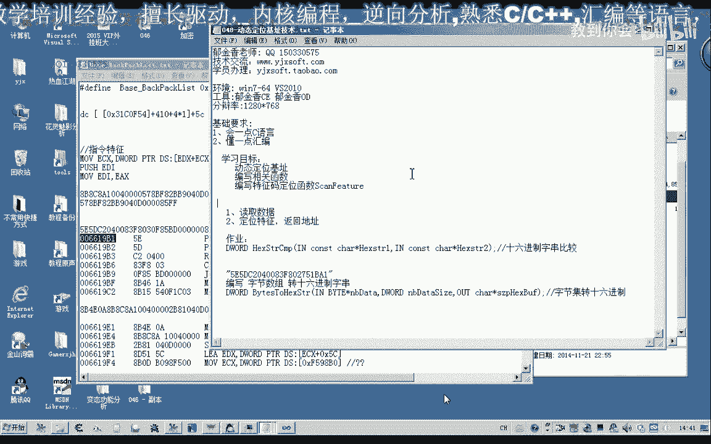
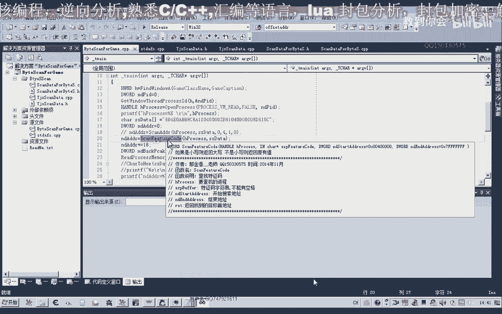
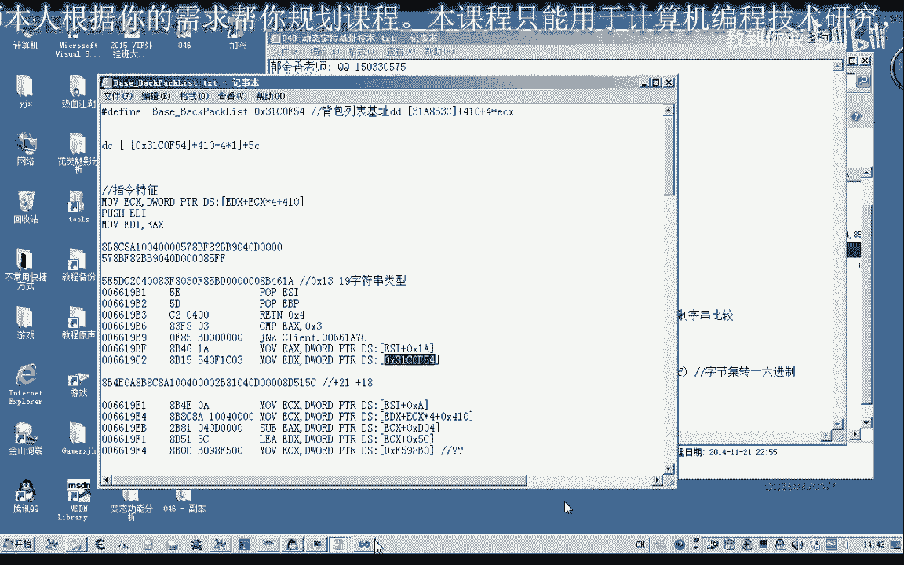
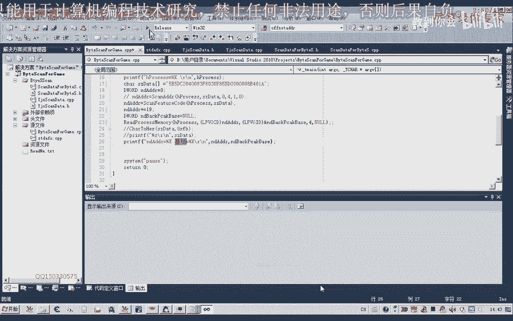
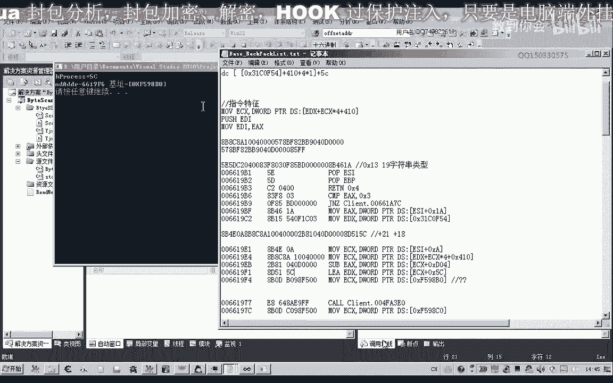
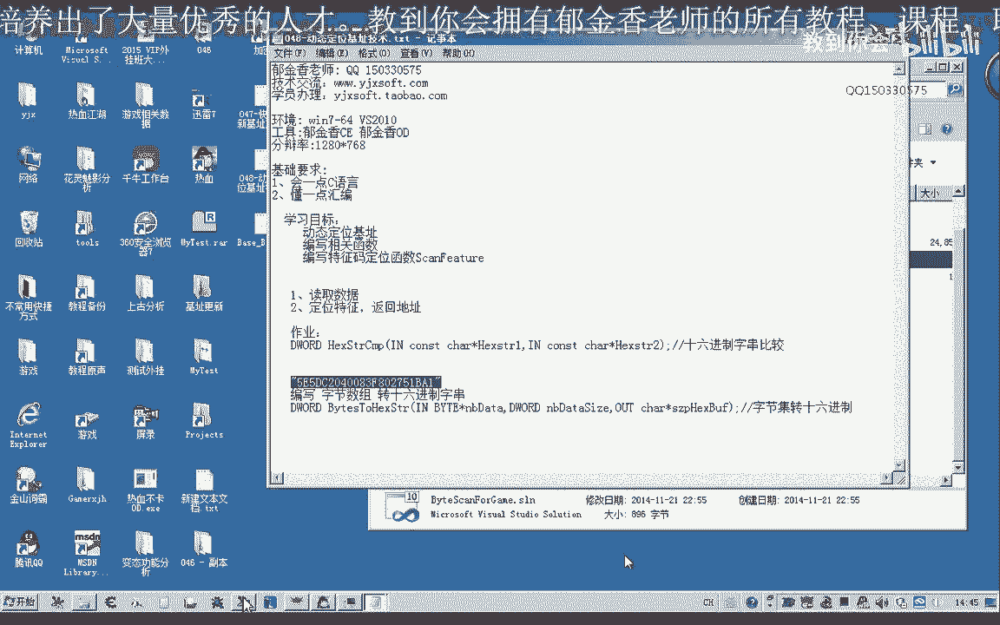
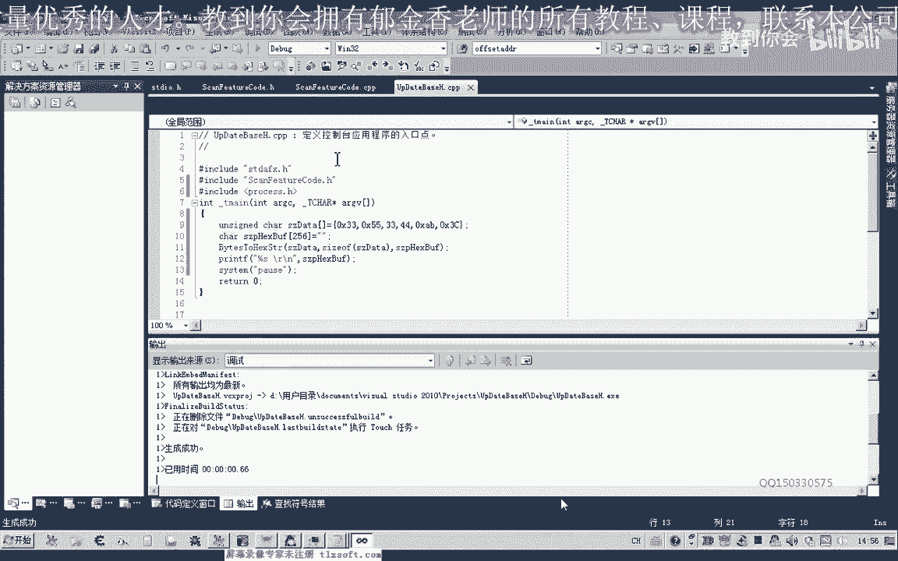
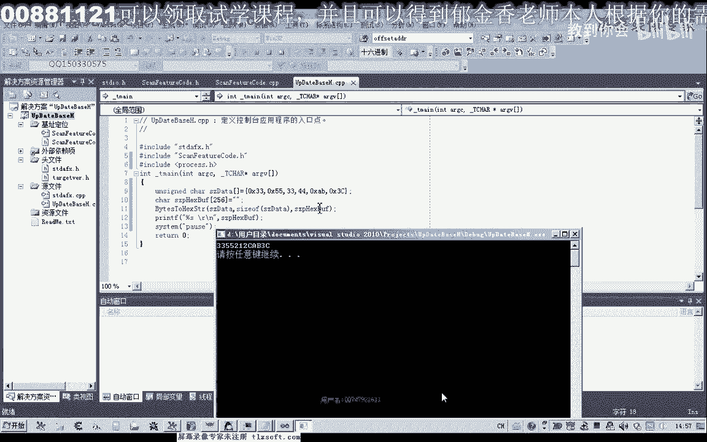

# 课程 P37：048 - 动态定位基址技术 🎯





在本节课中，我们将学习如何通过编写代码来实现特征码的动态定位。这种方法比使用工具更高效、更灵活，能够快速更新游戏基址。

---

上一节我们介绍了快速定位特征码的方法。本节中，我们来看看如何自己编写代码来实现这一过程。





## 原理与示例


首先，我们以一个背包基址为例进行说明。假设这是背包的一个基址，我们需要定位它。我们可以提取其前一段字节作为特征码。


以下是提取特征码的步骤：
1.  复制特征码字节。
2.  删除中间的空格。
3.  得到一个字符串类型的特征码。



例如，特征码字符串经过函数转换后，会搜索到匹配的起始地址。这个起始地址距离我们真正的基址还有一段偏移。


例如，通过计算，我们发现偏移为19个字节（十六进制为0x13）。定位到特征码地址后，加上这个偏移再进行读取，就能得到正确的基址。



**公式表示：**
`基址 = 特征码匹配地址 + 偏移量`

代码演示了如何读取：
```cpp
// 伪代码示例
DWORD 特征码地址 = FindPattern(特征码字符串);
DWORD 基址 = ReadMemory(特征码地址 + 0x13);
```
这样就能准确读出基址值，例如 `0x3140f1f5c`。


如果要定位另一个基址，只需更换特征码字符串和对应的偏移量（例如21个字节的偏移）。通过编程，可以非常方便地读取基址及其相关偏移。

## 代码实现：数据格式转换

接下来，我们探讨如何用代码编写这样的定位函数。核心问题在于，特征码是字符串类型，但游戏内存中的数据是字节数组。因此，我们需要统一格式以便比较。

本节中，我们先将内存中的字节数组数据转换为十六进制字符串。

我们创建一个新的控制台项目，并添加一个C++源文件。

**核心任务是编写一个转换函数**，将字节数组转换为十六进制字符串。因为一个字节（如0x3A）会转换成两个字符（"3A"），所以输出缓冲区的大小需要是输入字节数组大小的两倍。

以下是转换函数的关键实现思路：
```cpp
void BytesToHexString(const unsigned char* data, int size, char* output) {
    for (int i = 0; i < size; ++i) {
        // 将每个字节格式化为两位十六进制字符串
        sprintf_s(output + (i * 2), 3, "%02X", data[i]);
    }
    output[size * 2] = '\0'; // 字符串结尾
}
```

代码说明：
1.  使用循环遍历字节数组中的每个字节。
2.  使用 `sprintf_s` 函数，以 `%02X` 格式将每个字节格式化为两位十六进制数，不足两位用0填充。
3.  在字符串末尾添加结束符 `\0`。

在 `main` 函数中，我们可以定义一个字节数组进行测试：
```cpp
unsigned char testData[] = { 0x33, 0x55, 0x21, 0x2C, 0xFF };
char hexString[256] = { 0 };
BytesToHexString(testData, sizeof(testData), hexString);
printf("转换结果: %s\n", hexString);
system("pause");
```
运行后，控制台会输出转换后的十六进制字符串，例如 "3355212CFF"。十进制数33和21被正确转换为十六进制"21"和"2C"。



---



本节课中，我们一起学习了动态定位基址的基本原理，并成功编写了将内存字节数据转换为十六进制字符串的函数。这是实现自主特征码定位的第一步。

## 课后作业 📝


为了巩固学习，请完成以下练习：
编写一个函数，用于比较两个十六进制字符串是否相等。
*   **函数原型建议**：`int HexStringCompare(const char* str1, const char* str2);`
*   **要求**：如果两个字符串相等，则返回一个大于0的值；如果不相等，则返回0。
*   请尝试独立编程实现这个字符串比较功能，我们将在下节课中继续构建特征码搜索函数。