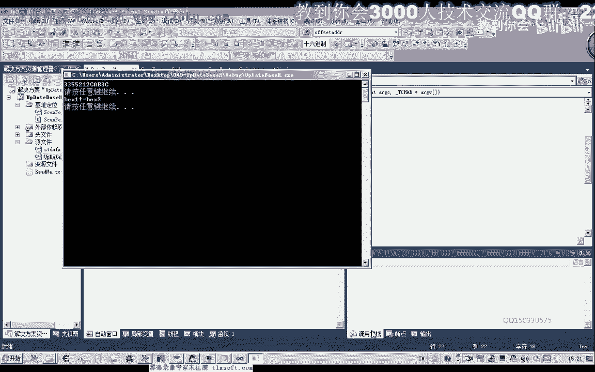
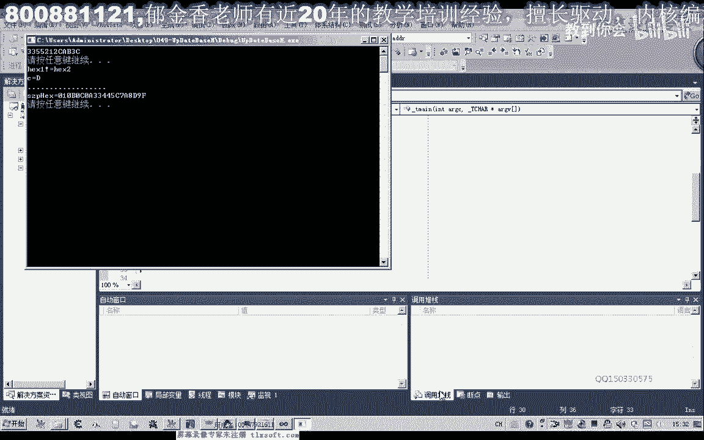
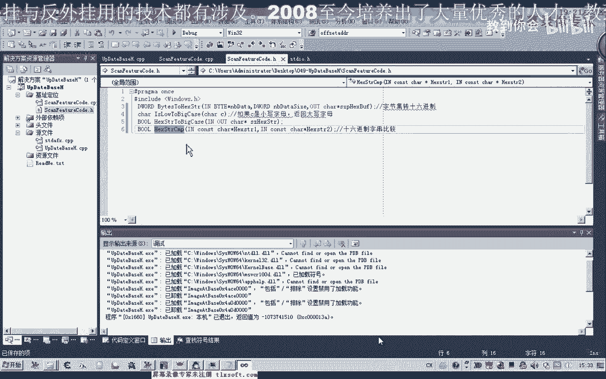

# P38：049-动态定位技术-HexStrCmp - 教到你会 - BV1DS4y1n7qF

大家好，我是郁金香老师，那么在第48课的时候，我们有一个坐垫，那么也就是要实现我们16进制字串的啊一个比较呃，当然这个实际上我们用字符串比较的这个函数呢也是可以的啊，但是这里呢我们自己写啊，自己写的。

为了方便后面呢我们实现了一个模糊的一个搜索啊，那么一个比如说我们有通配符的情况下，那么这里呢我们是一个任意的字符啊，那么我们这种情况呢我们需要自己编写一个函数来实现的话，才能够实现这种模糊的一个比较。

那么有了这个模糊比较之后呢，我们才有一个呃，才有一个这种模糊的这种搜索啊，那么这样的话我们定位特征码的时候更加的灵活好的，那么我们打开第48课的代码。

那么我们添加一个啊16进制啊字串比较的函数，那么这作比较呢，我们首先呢要获得这个相应字串的一个呃长度，那么然后呢方便进行一个循环，那么这个长度的话，我们可以直接用啊字串相关的字串处理函数来进行一个处理。

就是调整，然后呢我们取得这个16进制字串啊b的一个长度，那么然后呢我们再进行一下比较，两个字串的长度呢我们要相等，那么在这里呢我们也给他做一个提示，那么如果这两个长度不相等的话，我们进行一个提示。

或者是进行一个其他的一个处理，那么我们也可以这样的处理，如果呃字符串一的长度比字符串二的长度呢要稍微大一点的话，我们就取这个长度比较小的这个进行一下复制，就两个字串了，我们学这个计算长度比较小的。

然后进行一下定位啊，进行一个比较，那么也是可以的，那么这个呢可以自己控制一下就可以，然后我们接下来就开始一个循环，i不至于有你的牌小于等于我们的这个字串的一个长度，然后，唉加强。

然后每一个我们把它的每一个字节都取出来，进行一个比较就可以了，一，那么如果它相应的字节都相等的话啊，那么我们就继续就继续，那么如果他故乡等待，那么不相等的话，我们这里可以不用20，那么直接。

如果只要能够执行到这个后面的话，就证明它是不相等的，那么不相等的话，我们就返回flash，那么如果整个循环都执行完了之后都是相等的，那么我们这里返回处理啊，就是表示相等，然后我们进行一下编译。

那么这个函数实际上呢它相对的呃很简单啊很简单，然后我们做一个相关的一个测试，那么这里呢我们呃自己定义两个只是算法，那我们把它复制一下，再另外进行一个字串二，啊然后呢，进行一个比较，知道。

那么如果相等的话，在里面打印一个调试信息啊，打印出一段信息啊，显示了相等，二，啊，好的，那我们来看一下，那么这个时候呢它能够判断两个是相等的，那么如果我们中间做一个改动来看一下。

啊那么当然不相等的时候呢，我们应该打印出另外一半调试信息。

啊这个时候呢它会判断两个字串不相等，但是有另外的一种情况哈，有哪一种情况呢，那么上面是大写，下下面是小写的这种情况啊，那么这种情况的话，本来它应该是相等的这两个。

但是呢他这个时候呢呃我们判断他的判断的话，它确实不相等啊，因为它是字串的一个比较。

那么所以说这个大写和小写的话，我们嗯在处理我们字串的时候呢，在前面的这个转换的时候，我们统一的跟他做一个要求，当然转移的这里呢它是本来我们这里进行转换的时候，是转换成大写的。

但是我们在呃输入特征码的时候，有可能会输入小写啊，所以说我们在另外编写一个函数啊，另外编写这个函数呢，就是说呃如果呃如果这个函数它是小写的话，那么我们就跟它自动的啊，把它变成大型啊等等，嗯。

然后我们把它写简单一点图，那么我们就是小写的转换成大写的这样一个写这样一个函数，那么转换的时候呢，我们先转换逐字节的进行一个转换恰然后呢后面进行转换，那么如果如果c是小写小写字母。

那么我们呢则返回大写字母，那么这里我们做一个判断，那么我们进行一下保存，那么这个函数的话，我们呢那么哪些是小写字母嗯，哪些是小写字母呢，就是我们的a直到我们的z，那么这些是小写字母。

那么小写字母要转换换成大写的话，实际上呢这个大写的a我小写的a呢，它之间有一个差值，那么我们只需要加上它中间那个差值就可以，那么我们看一下我们代码怎么编写啊。

那么这里我们可以加上一个判断c那么大于等于我们的a，并且c小于等于z，那么说明的话它是一个小写的字母，在这个区间，那么是小写的字母的话，我们就要进行一个转换，转换成大写字母，那么我们通过那个x码码。

它的一个码表的话啊，那么它有一个相关的一个数字，那么转换的话，我们c呢就可以等于c加上这个大写的a减掉，我们小写a就这一个差值，因为它每一个数值的差值都是一样的，比如说我们嗯ada解决掉我们。

那么它也等于了我们的，b减掉我们啊小写的b他们在这个差值都是相等的，所以说呢在这里呢它加上啊后面的这个差值，就能够把小写的字母转换成一个大小哈，就能够转换成一个大小嗯，然后呢我们返回这个数值就可以了。

当然在这里的话，我们可以直接的这样一看，就可以返回这个数值就行，返回这个c加上这个a减，减掉这个小写而已，那么如果他不不，不属于啊，不属于我们的这种小写的这种情况呢。

那么我们就直接就返回这个数字就可以了，直接好，那么这样的话如果我们是小写的话，我们就能够来进行一个相应的转换，那么我们也来进行一下相应的测试，八，那么我们比如说把它注意这里是单引号啊。

那么我们在这里呢对它进行一个转换，好然后我们再打印这个字，然后我们运行一下啊。

那么我们可以看到啊，这个时候呢它从一个小写的a就转换成一个大型的a代码，那么这里我们可以是任意的字母都是可以的，比如说h它也能够转换成这个大型，它也能够进行一个大小写的一种转换为b c d。

好那么在这样的一个转换，那么进行这样的一个转换之后呢，我们也可以，当然这只是一个字母的一个转换，当然我们还可以把这个函数来写一下啊，写成一个什么呢，我们呃整个字串的一个转换，那么我们在另外再写一个函数。

那么就是我们呢嗯带有小写字母的啊，全部来转换成这个大写，知道，那么这个是一个输入的一个数据，最后呢输出来啊，也从这里输出啊，所以说这里的话它是一个优势，这个参数它是一个双向的啊，作为一个输入的一个参数。

也是一个输出的，最后呢还将对这个字串呢进行一个修改，那么后面的是这个字串的一个大小的目录，我们也需要好嗯，大小的话我们也可以用一个呃strong then啊，来取得这个字串的大小就可以好。

那么我们就在cpp单元那里进行一个相应的实现，啊，那么在这里呢，首先我们也要取得一个字串的长度，那么取得计算长度之后呢，我们也需要来进行一个循环来判断，那么首先呢我们要判断它是否是这个小写字母。

或者是我们每一个字节呢，我们都能调用一下这个函数啊，那么我们可以这样写，复制为零，i小于等于d li加价，那么然后呢我们对这个数组来进行一个操作，数组按那么就等于我们的前面的no two case。

那么全部呢我们都进行一个转换，在我们前面的这个函数就可以了，那么逐字写的我们全部都进行一个相应的转换，那么就那最后就完成了，他，然后呢我们再来编译一下，编译成功之后呢，我们再来做一个相应的测试。

那么在这里呢我们也定一个哈字串的一个缓冲区，然后呢我们进行一个相应的转换，然后呢再进行一个输出，嗯，好再来看一下。

那么这个时候呢我们发现了里边它就不存在这个小写字母。

然后我们进行一下比较好，第四个字母啊，以前是小写的啊，现在变成大写了，那么最后一个字母d9 f啊。

也全部变成了我们的这个大型，但是如果我们没有这个这一句转换的话，他肯定就是小写，好的，那么这节课呢我们就编写这两个函数。

那么我们下一节课呢，嗯下节课我们再进行如下函数的一个编写。

在读取相关的一个数据，那我们看一下啊，我们已经呃基本上的函数我们都已经有了字串的比较呃，还有我们自创的一个转换，转换了之后呢，我们就能够进行一个比较了，那么在下一节课的时候呢。

我们就进行一个游戏数据的一个读取，然后再进行一些逻辑的啊一些整理好的。

