# 课程 P38：049 - 动态定位技术 - HexStrCmp 🔍

在本节课中，我们将学习如何编写一个用于比较十六进制字符串的函数，并处理字符串中的大小写转换问题。这是实现后续模糊搜索和特征码定位功能的基础。

---

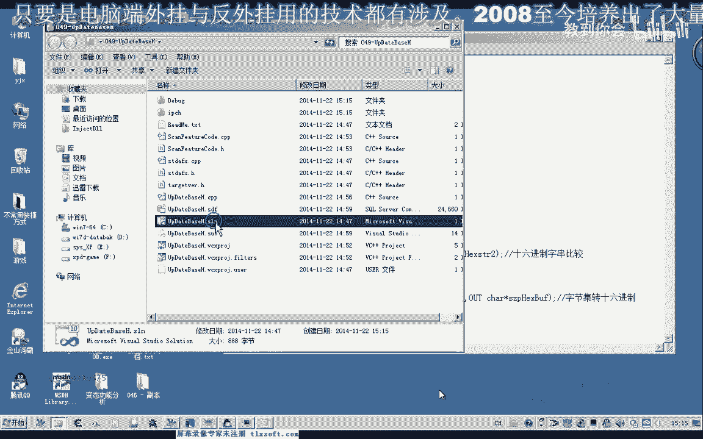

## 回顾与目标 🎯

上一节我们介绍了特征码定位的基本概念。本节中，我们将编写一个自定义的十六进制字符串比较函数。这个函数将允许我们进行精确的字符串比较，并为后续支持通配符的模糊搜索功能打下基础。

## 编写十六进制字符串比较函数

我们需要创建一个函数来比较两个十六进制字符串是否完全相等。以下是实现该函数的核心步骤。

首先，我们需要获取两个字符串的长度。可以使用标准字符串处理函数来完成这一步。

```cpp
int len1 = strlen(str1);
int len2 = strlen(str2);
```

接下来，我们需要确保两个字符串的长度相等。如果长度不相等，我们可以选择提示错误，或者以较短字符串的长度为准进行比较。这里我们选择后一种方式。

```cpp
int minLen = (len1 < len2) ? len1 : len2;
```

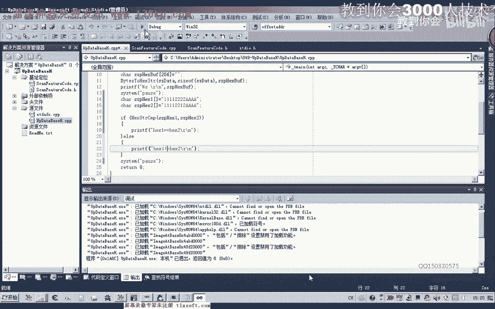


然后，我们开始循环比较每个字符。如果所有字符都相等，则函数返回 `true`；否则，返回 `false`。

```cpp
for (int i = 0; i < minLen; i++) {
    if (str1[i] != str2[i]) {
        return false;
    }
}
return true;
```

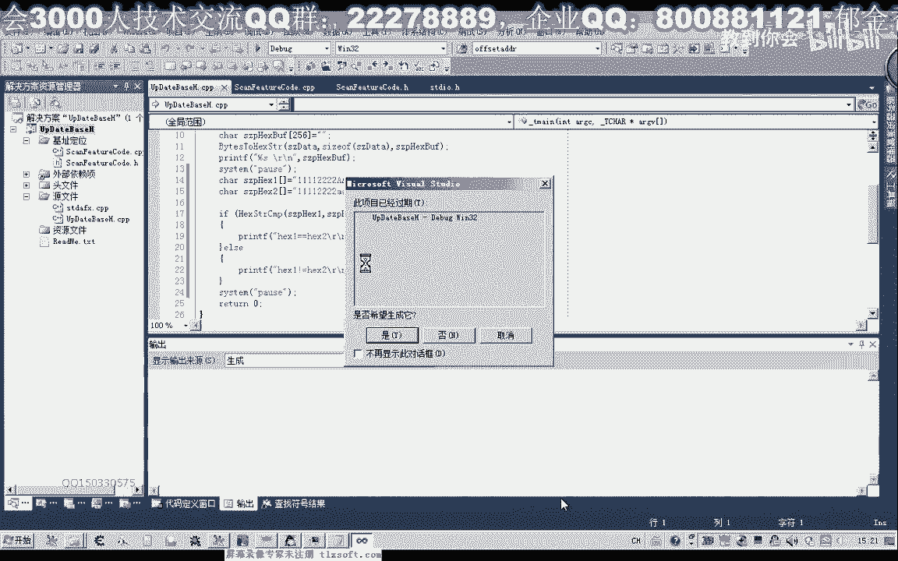

以下是完整的函数实现示例：

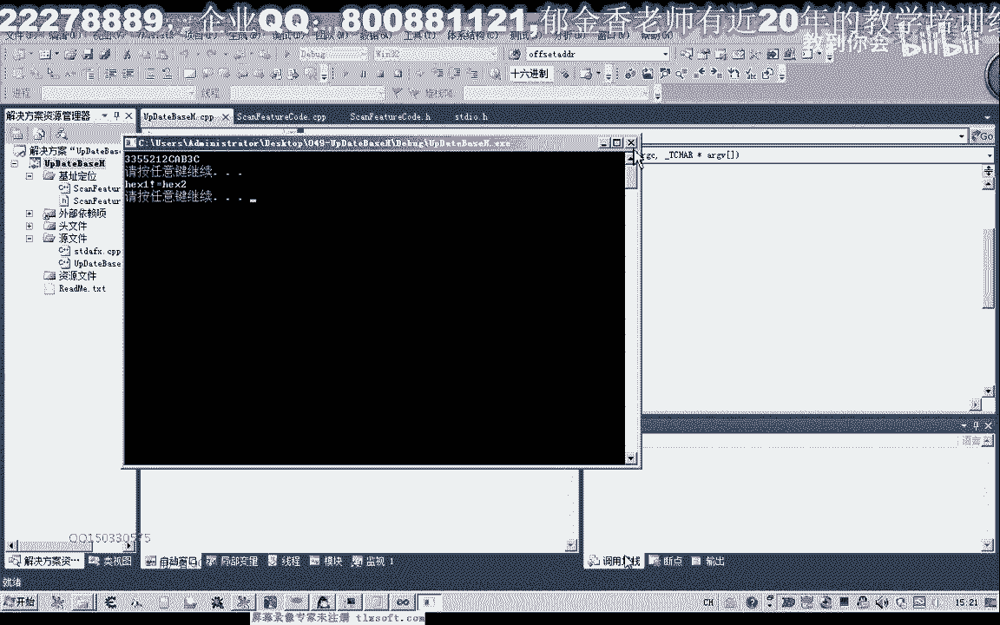

```cpp
bool HexStrCmp(const char* str1, const char* str2) {
    int len1 = strlen(str1);
    int len2 = strlen(str2);
    int minLen = (len1 < len2) ? len1 : len2;

    for (int i = 0; i < minLen; i++) {
        if (str1[i] != str2[i]) {
            return false;
        }
    }
    return true;
}
```

编译并测试这个函数，可以验证它能够正确判断两个字符串是否相等。

---

## 处理大小写问题

在比较十六进制字符串时，我们可能会遇到大小写不一致的情况。例如，`"A1B2"` 和 `"a1b2"` 在逻辑上是相等的，但直接进行字符串比较会认为它们不相等。

为了解决这个问题，我们需要一个将小写字母转换为大写字母的函数。

### 单个字符转换函数

首先，我们编写一个函数，用于将单个小写字母转换为大写字母。

```cpp
char ToUpper(char c) {
    if (c >= 'a' && c <= 'z') {
        return c + ('A' - 'a');
    }
    return c;
}
```

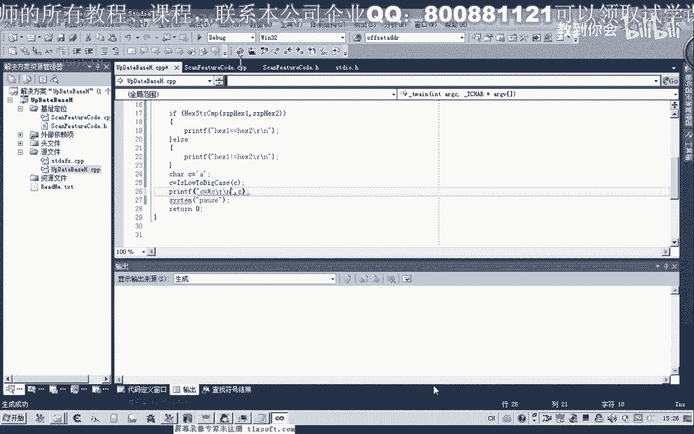

这个函数检查字符是否在小写字母 `'a'` 到 `'z'` 的范围内。如果是，则通过加上 `('A' - 'a')` 的差值将其转换为大写字母。

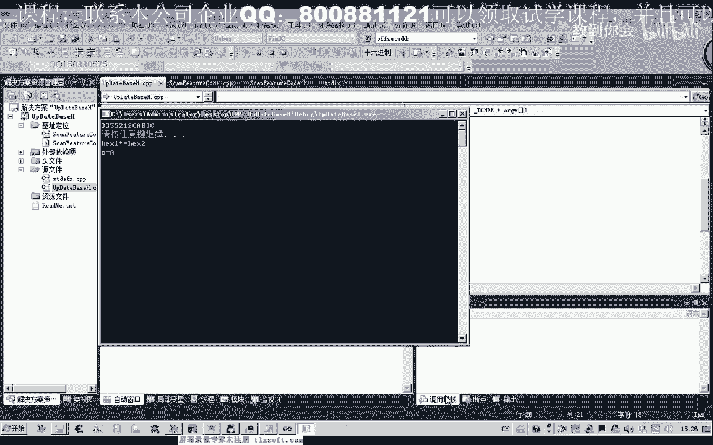

### 整个字符串转换函数

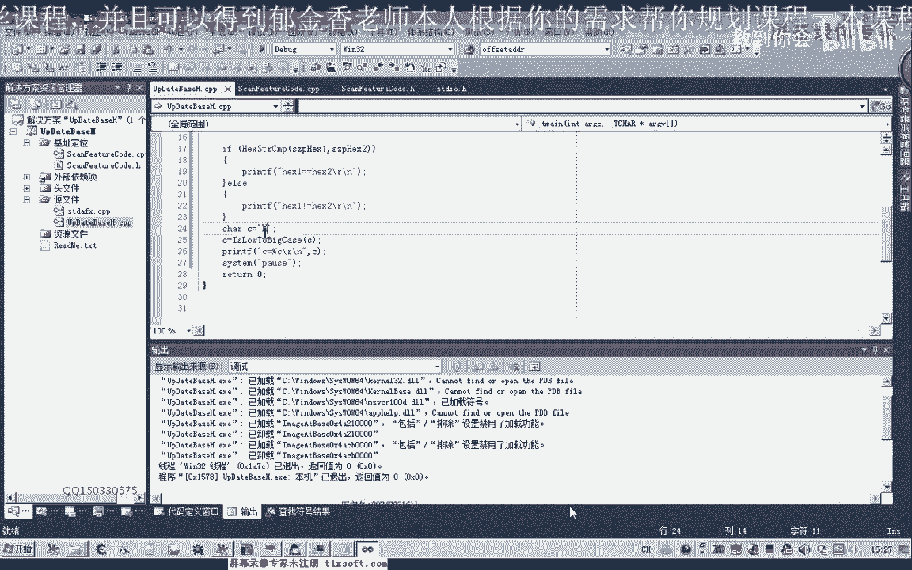

接下来，我们编写一个函数，用于将整个字符串中的小写字母全部转换为大写字母。

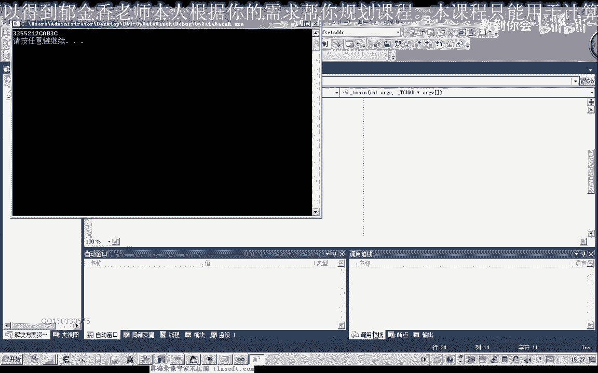

```cpp
void StrToUpper(char* str) {
    int len = strlen(str);
    for (int i = 0; i < len; i++) {
        str[i] = ToUpper(str[i]);
    }
}
```

这个函数遍历字符串中的每个字符，并调用 `ToUpper` 函数进行转换。

---

## 整合与测试

现在，我们可以在字符串比较函数之前，先调用 `StrToUpper` 函数将两个输入字符串都转换为大写，然后再进行比较。这样可以确保比较过程不区分大小写。

以下是整合后的比较流程：

1.  将字符串 `str1` 和 `str2` 复制到临时缓冲区。
2.  调用 `StrToUpper` 函数将两个临时字符串转换为大写。
3.  使用 `HexStrCmp` 函数比较转换后的字符串。

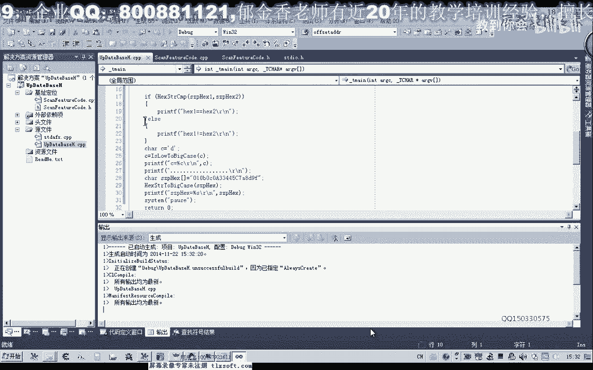


通过这种方式，无论输入字符串是大写、小写还是混合大小写，我们都能进行正确的比较。

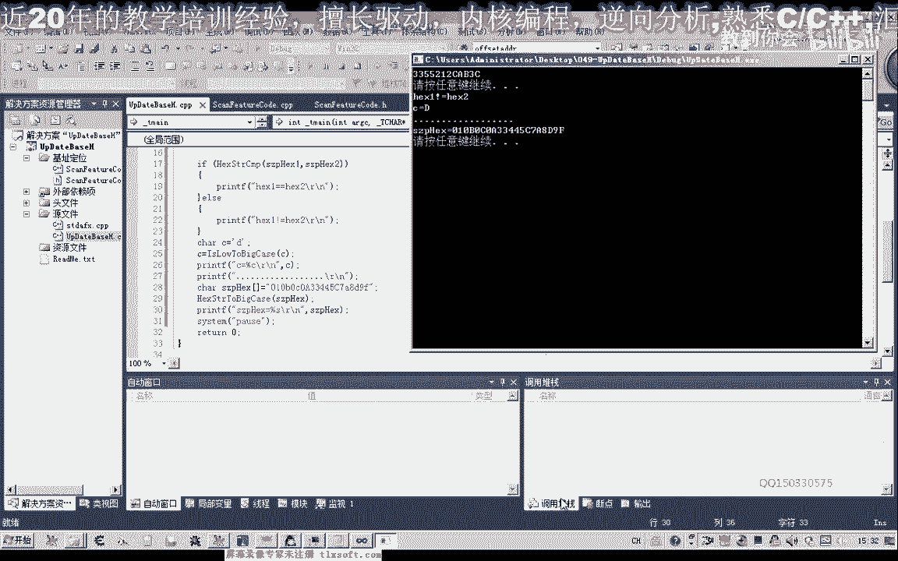

---

## 总结 📝

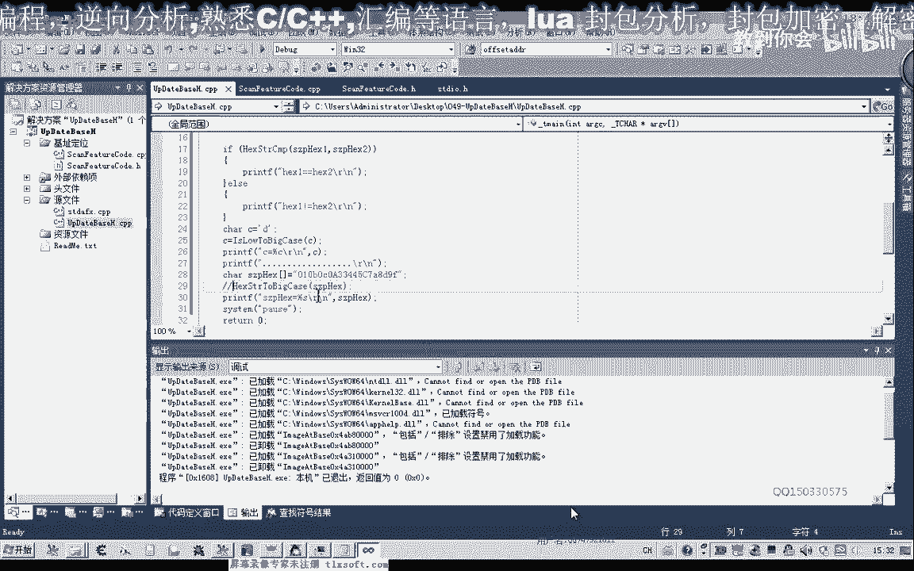

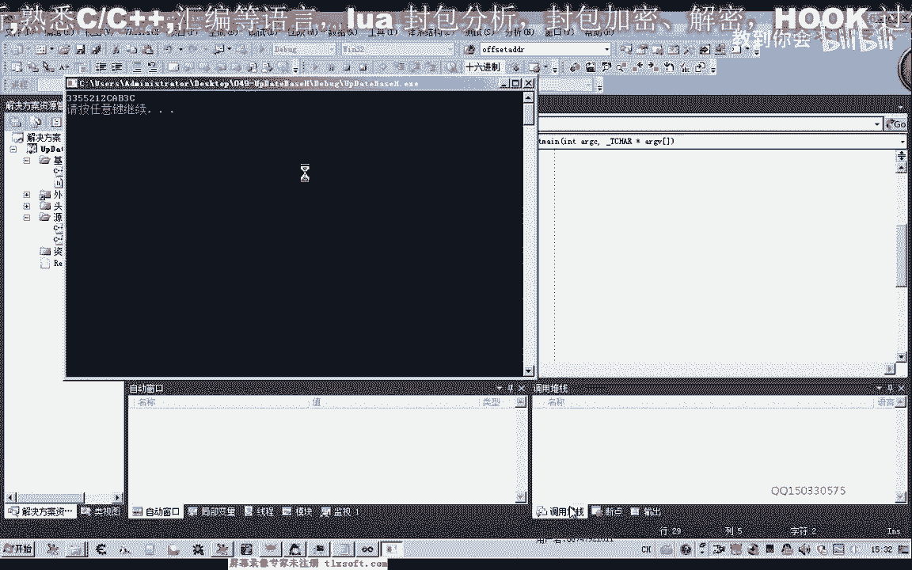

本节课中我们一起学习了两个核心内容：

1.  **编写了十六进制字符串比较函数**：该函数能够比较两个字符串是否完全相等，并支持以较短字符串为基准进行比较。
2.  **实现了大小写转换功能**：通过 `ToUpper` 和 `StrToUpper` 函数，我们解决了十六进制字符串比较中的大小写敏感问题，为后续的模糊搜索做好了准备。


下一节课，我们将学习如何读取游戏内存数据，并结合本节课编写的函数，开始实现特征码搜索的逻辑。