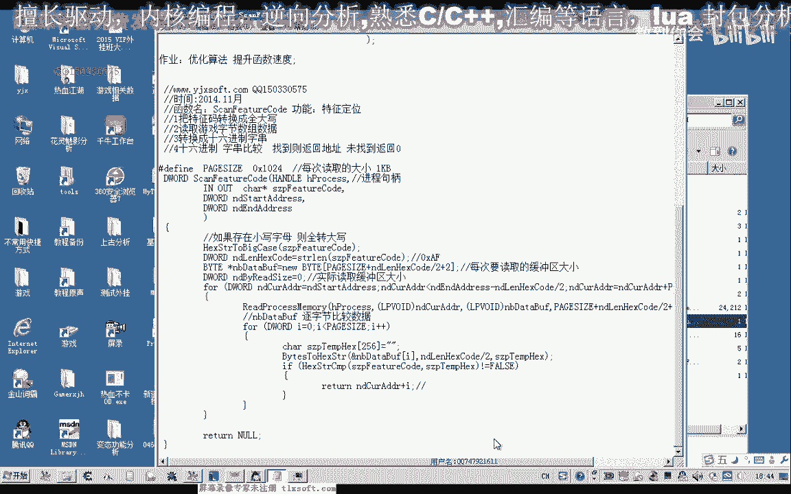

# 课程 P39：050 - 动态定位技术 - ScanFeatureCode 🔍


在本节课中，我们将学习如何编写一个用于在游戏进程内存中搜索特定特征码的主函数。我们将基于之前课程中编写的辅助函数，构建一个完整的动态定位功能。

---


## 概述 📋

上一节我们介绍了动态定位相关的辅助函数。本节中，我们将编写名为 `ScanFeatureCode` 的主函数。该函数的核心功能是：给定一个游戏进程句柄、一个十六进制特征码字符串以及搜索的起始和结束地址，在指定内存范围内查找该特征码，并返回其首次出现的内存地址。

## 函数设计与说明

该函数需要以下参数：
*   **进程句柄**：目标游戏窗口的进程句柄。
*   **特征码字符串**：一个十六进制格式的字符串，例如 `"AF 1B C3"`。
*   **起始地址**：在进程内存中开始搜索的地址。
*   **结束地址**：在进程内存中结束搜索的地址。

这类似于CE（Cheat Engine）扫描中的“起始地址”和“结束地址”选项。我们的特征码字符串则对应CE中的字节数组。

以下是函数的核心逻辑步骤：

1.  **参数预处理**：将传入的特征码字符串转换为统一的大写格式，并计算其实际的字节长度。
2.  **内存分页读取**：为了避免一次性读取过多内存，我们采用分页循环读取的方式。每次读取 `PAGE_SIZE`（例如1024字节）的数据。
3.  **缓冲区比较**：将读取到的内存数据逐字节转换为十六进制字符串，并与目标特征码进行比较。
4.  **返回结果**：如果找到匹配项，则计算并返回对应的内存地址；如果搜索完整个范围都未找到，则返回空值（NULL）。

## 代码实现步骤

### 1. 添加函数声明与预处理

首先，在头文件中添加函数声明，并在CPP文件末尾开始实现。

```cpp
// 函数声明示例
DWORD ScanFeatureCode(HANDLE hProcess, const char* featureCode, DWORD startAddr, DWORD endAddr);
```

在函数内部，首先进行特征码的预处理：

```cpp
// 1. 转换特征码为大写
char upperCode[256];
strcpy(upperCode, featureCode);
// ... 调用之前编写的大写转换函数 ...

// 2. 计算特征码的字节长度
// 字符串"AF 1B"的长度是5，但字节长度为2（AF和1B各占一字节）
int codeByteLen = (strlen(upperCode) + 1) / 3; // 简单估算，实际需处理空格
// 更健壮的方法是移除空格后计算字符串长度的一半
```

### 2. 分页读取内存与搜索

接下来，我们实现循环读取内存并进行比较的逻辑。

以下是内存读取和搜索循环的核心结构：

```cpp
// 定义每页读取的大小
const int PAGE_SIZE = 1024;
// 计算缓冲区大小，需容纳一页数据加上特征码长度，以确保边界数据能被搜索到
int bufferSize = PAGE_SIZE + codeByteLen + 1;
BYTE* buffer = new BYTE[bufferSize]; // 动态分配缓冲区

SIZE_T bytesRead; // 实际读取的字节数


// 从起始地址开始循环读取，直到结束地址
for (DWORD curAddr = startAddr; curAddr < (endAddr - codeByteLen); curAddr += PAGE_SIZE) {
    // 读取进程内存到缓冲区
    BOOL success = ReadProcessMemory(hProcess, (LPCVOID)curAddr, buffer, bufferSize, &bytesRead);
    if (!success || bytesRead == 0) {
        continue; // 读取失败或无可读数据，跳过当前页
    }

    // 在读取到的缓冲区数据中逐字节搜索特征码
    for (int i = 0; i < PAGE_SIZE; i++) {
        // 将当前字节及其后续字节转换为十六进制字符串
        char tempHexStr[256] = {0};
        // ... 调用字节转十六进制字符串的函数，从buffer[i]开始转换codeByteLen个字节 ...

        // 比较转换后的字符串与目标特征码
        if (strcmp(tempHexStr, upperCode) == 0) {
            // 找到匹配！计算实际内存地址并返回
            DWORD foundAddr = curAddr + i;
            delete[] buffer; // 释放缓冲区内存
            return foundAddr;
        }
    }
}


// 循环结束未找到
delete[] buffer;
return NULL;
```

### 3. 整合与测试


编写完主函数后，我们需要编写测试代码来验证其功能。


以下是测试步骤的代码框架：

```cpp
// 1. 获取游戏窗口句柄
HWND hWnd = FindWindow(NULL, "游戏窗口标题");
if (hWnd == NULL) {
    printf("未找到游戏窗口。\n");
    return -1;
}


// 2. 获取进程ID和具有读取权限的进程句柄
DWORD pid;
GetWindowThreadProcessId(hWnd, &pid);
HANDLE hProcess = OpenProcess(PROCESS_VM_READ, FALSE, pid);
if (hProcess == NULL) {
    printf("无法打开进程。\n");
    return -1;
}


// 3. 定义要搜索的特征码（示例）
const char* myFeatureCode = "6A 19 D1 ..."; // 替换为实际特征码

// 4. 调用搜索函数
// 假设我们已知模块基址在0x400000附近，搜索范围可以设定得小一些以提高速度
DWORD startAddr = 0x400000;
DWORD endAddr = 0x7FFFFFFF; // 32位用户空间大致范围
DWORD foundAddress = ScanFeatureCode(hProcess, myFeatureCode, startAddr, endAddr);


// 5. 输出结果
if (foundAddress != NULL) {
    printf("找到特征码！地址：0x%X\n", foundAddress);

    // 6. （可选）根据找到的地址读取数据，例如读取基址
    DWORD baseAddr = 0;
    ReadProcessMemory(hProcess, (LPCVOID)(foundAddress + 0x21), &baseAddr, sizeof(baseAddr), NULL);
    printf("读取到的基址：0x%X\n", baseAddr);
} else {
    printf("未找到特征码。\n");
}


// 7. 清理资源
CloseHandle(hProcess);
```


## 性能优化思考 💡

在测试中，我们发现搜索速度可能较慢。性能瓶颈很可能出现在内层循环的**字节到十六进制字符串的转换**部分。频繁调用 `sprintf` 等格式化函数在大量循环中会显著影响效率。


优化思路是：**编写一个高效的自定义函数来替代通用的格式化转换**。这个函数应专门针对将少量字节快速转换为十六进制字符串的场景进行优化，避免在循环中调用开销较大的库函数。


## 总结 🎯


本节课中我们一起学习了如何构建 `ScanFeatureCode` 函数来实现动态内存特征码定位。我们掌握了以下关键点：


1.  **函数设计**：明确了输入参数（进程句柄、特征码、地址范围）和输出结果（找到的地址）。
2.  **核心逻辑**：采用**分页读取**的方式遍历内存，并在每个页面内进行**逐字节比较**以查找特征码。
3.  **实现细节**：包括字符串预处理、内存操作、地址计算和资源管理。
4.  **测试验证**：通过获取游戏进程、调用搜索函数并解析结果，验证了功能的正确性。
5.  **优化方向**：识别了当前实现中可能存在的性能瓶颈，并提出了通过编写高效转换函数来提升搜索速度的优化方案。




通过本课的学习，你已经掌握了动态定位技术中最核心的搜索功能实现。下节课我们将聚焦于性能优化，尝试改进代码以提升搜索效率。