# P4：015-DbgPrintMine与变参函数 - 教到你会 - BV1DS4y1n7qF

大家好，我是郁金香老师，qq 1533057，欢迎大家参加郁金香技术编程和距离，那么这节课呢我们一起来写一个debug啊，矿井m用这个函数来来替代我们的alt固体debug尺寸。

因为这个alt库体debug尺寸呢它使用起来的时候很不方便，因为它不不能够打印一些变量的一些信息啊，变量的一些信息啊，我们要另外写一个函数，这个函数呢它就像我们以前c语言用的这个pointf啊一样啊。

使用起来很方便，可以打印一些字串的变量啊，而且它的参数的个数的话是可以变化的啊，嗯可以是一个参数，也可以是两个参数或者是多个啊，使用起来非常的方便，那么在这之前呢，我们首先来认识一下啊。

支持啊可变参数的一个函数。

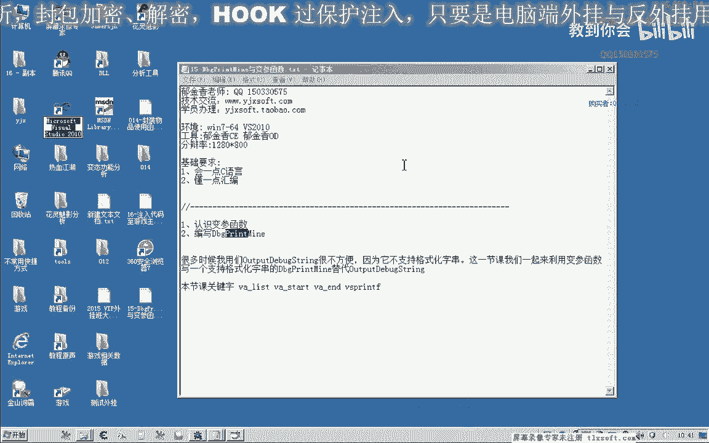

那么我们打开vs 2010，那么先新建一个项目，啊，嗯，控制台的方便，我们测试，那么我们都用过这个point of，它用起来的话非常的方便啊，后面的参数前面是一个格式化的字串啊。

这里啊后面呢真的是我们的这个参数，那么这个参数的个数的话，它是可以变化的啊，也支持我们的字符串啊，支持我们的变量或者常量这一类的，那么这样使用起来的话非常的方便，但是我们的ult put体啊。

第八个尺寸的它就不支持我们这种格式化的这种字串，它只有一个参数，如果我们这样使用的话啊，编辑肯定就是通不过的，当然它也需要一个windows图文件的一个字体，那么这样编译的话我们就会出错。

因为呢它只支持一个字串啊，不支持格式化字串和一个啊这个便餐可变的这个参数，所以说这个alt啊库里第八个尺寸呢，它使用起来很方便，那么在这节课呢我们将做一些改进啊，做一些改进，我知道。

那么首先呢我们在这里加一个盖下，方便我们也会有一个测试，那么我们首先来认识一下哈这个变量啊，那个参数啊，个数可以变化的，这个函数啊，也叫做变参的函数，那么首先我们定一个编程的函数来做一下测试。

就叫做第八个问题，那么首先呢我们第一个呢也是一个呃我视化自创，那么后面呢变成的话它是用三个点来表示，就表示后面的这个呃参数来，可以可以是很多，可以是一个两个，也可以是多个啊，这样我们可以编译一下。

那么电餐呢它的参数的获取到一个办法呢，它需要用到一些啊红啊，除了历史题，首先要定义一个用来接收我们这个参数的一个数组，627miss，那么获取这个数组之后呢。

我们要用一个vs大体来来初始化它对start，然后第二个参数呢啊它是就是我们的这个传进来的，第一个参数指向电，这样是一个呃参数列表，一个初始化，啊然后使用完了之后呢。

我们要用一个vn等来做一些亲密的一个工作，第一个参数是这个参数列表，那么在这中间我们要取它的参数的时候啊，一般我们可以这样去，比如说啊，那么第一个参数如果我们是已知的话啊，第一个参数。

那么我们可以用5月a r g来获取它的第一个参数，后面跟的是我们的参数类别，第二个呢在这个t代表的是参数类型比较硬的，那么如果我们知道第二个参数接他也是正常的，那么我们后面呢也可以这样写。

那么如果第三个参数它是一个字串类型，那么我们可以这样写，好好，那我们可以这样写啊，这样的一共有三个参数啊，三个参数，那么做一下一个测试ptf来打印出这三个参数，你可以搜到计算。

然后后面跟i7 s这三个参数，那么我们来做一下测试，把前面的这个point tp来删掉，要用我们的debug point man，当然第一个字出来，这个时候我们先合约掉啊，因为这次始终不上。

那么后面啊就是我们的几个参数，比如说我们输入111222啊，这里打输入a b c x，然后我们做一下测试。

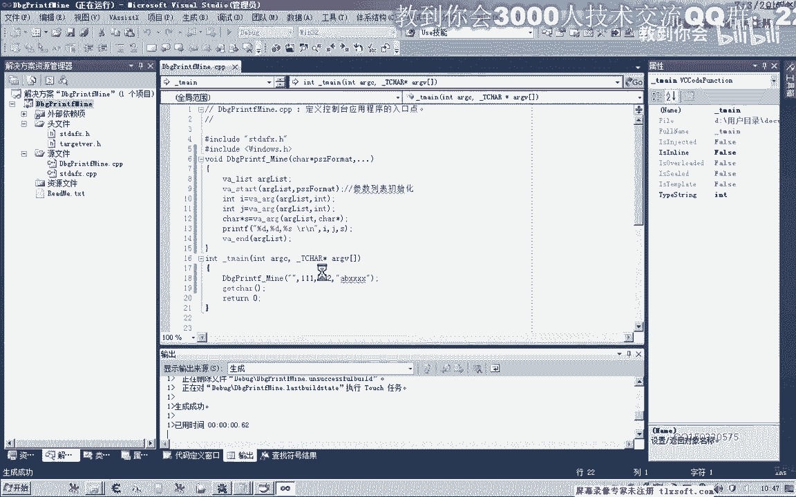

啊这个时候呢我们这几个参数呢啊它执行到这个函数里面。

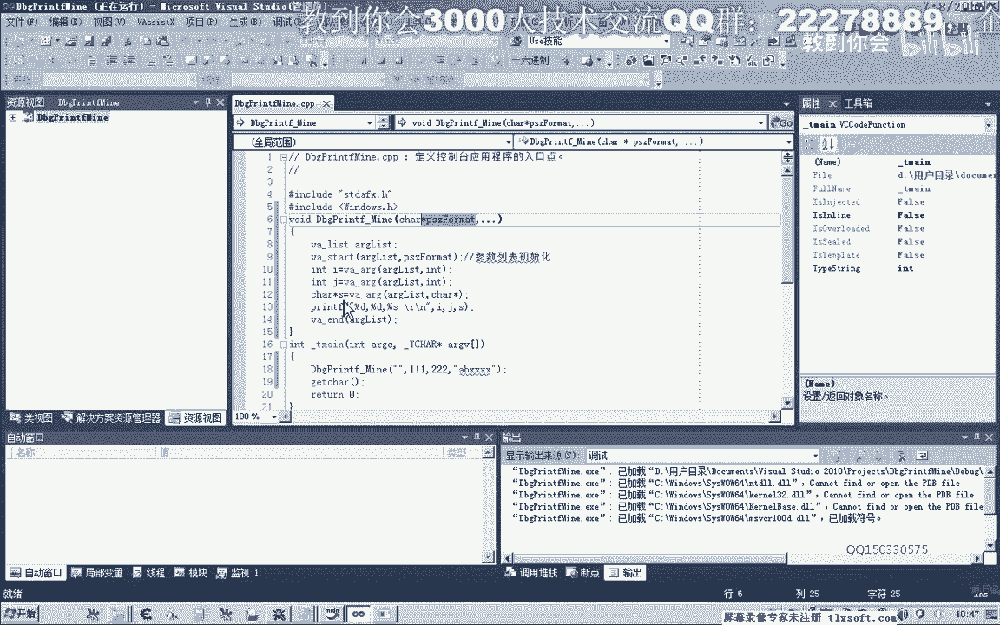

最终呢通过ptf呢把我们这几个参数来打印出来了啊，打印出来当然有过多的参数来。

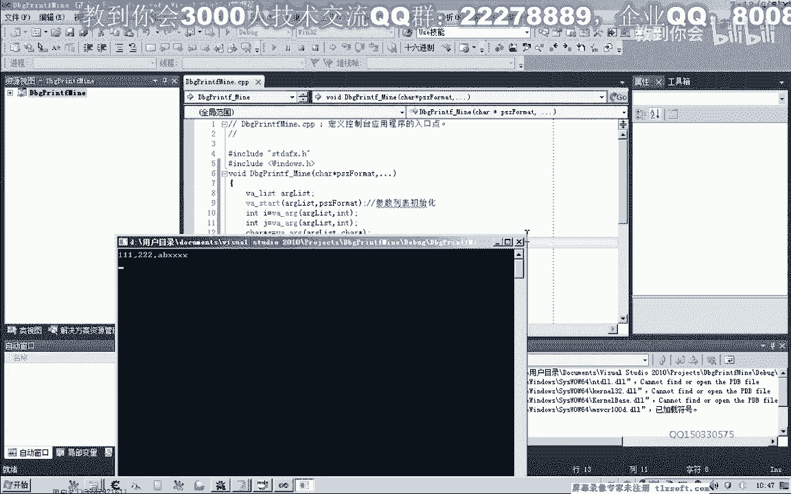

这个时候呢它同样的也可以支持，比如说我们再加上几个参数，当然这几个参数呢它这里呢并没有打印出来而已，然后这样编译编译的话，它是能够通过的，那如果我们知道了，也可以把它取出来。

那么我们再加上一个音体j n k c v r标题意思，那么这里呢我们还可以支持更多的。

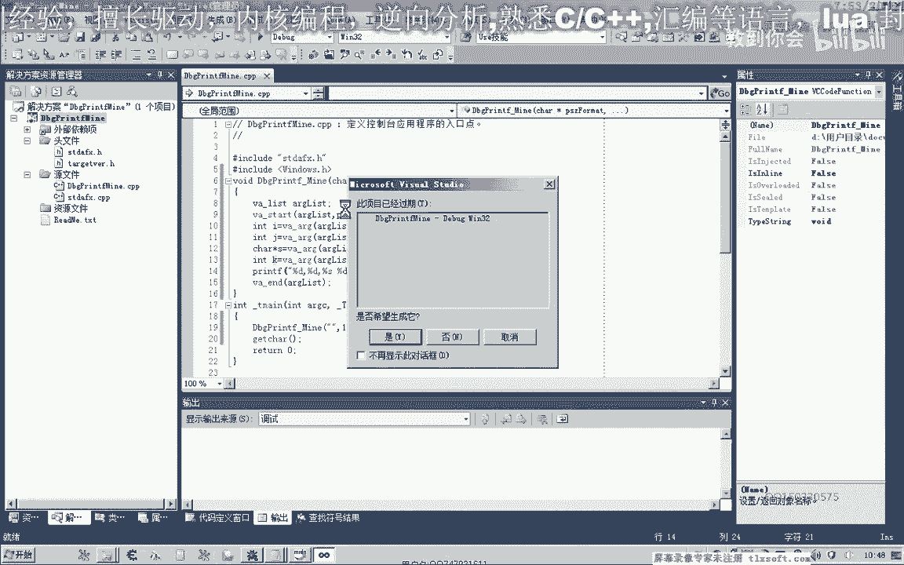

但最后一个这里这个呢我们还没有打印它。

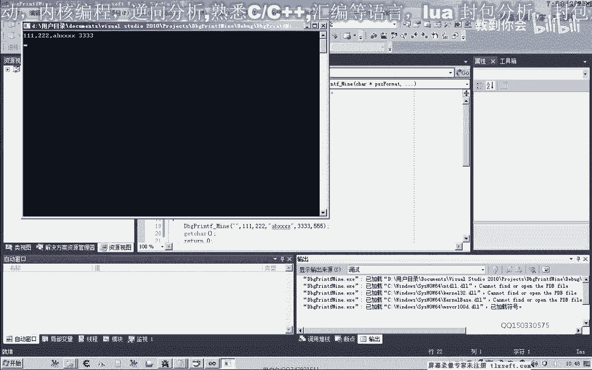

但实际上这样使用起来呢也不是很方便，写起来也相当的复杂，当然这个我们经过一次这个vai激活了这个指针呢，它自动的会指向下一个参数啊，所以说你看到我们这里是写出一样的，这里也是一样的。

为什么他取得的数字不一样，因为这个指针啊它改变了，那么这一句执行完了之后呢，他把这个值取出来啊，把第六个参数取出来，复制给这个i，那么它自动的这个指针呢实际上已经知道啊，地理三个参数的位置。

那么到这里呢取出了第三个，参数啊，然后呢它只是在业余会自家啊，又指向下一个参数啊这种，那么还有一种更简单的方法呢，我们可以这样去把这些呢全部注释掉，注释掉，那么我们另外有一个这个函数vs。

那么这个函数的话，它直接就支持这个参数列表，无论有多少个啊，他自己取出来，但是呢他需要一个字符串的一个缓冲区啊，那我们先另外的定义一个字符串的缓冲区，那么这个呢尽量定义大于，那么这是它的第一个参数。

那么第二个参数呢就是这个石化字串，那么这里我们传进来的啊，这个参数好的，就是我们的格式化制造，那么后边呢就是我们的参数列表，那么直接传进去就行了，那么无论这里是两个参数还是三个还是四个，直接就传给它。

让它来进行一个格式化，那么最后这里的话我们也比较简单了啊，这就我们要替换掉，直接用ptf啊，然后38分就行，直接就打印出这个缓冲区就行，当然这里的话啊，因为我们这里的格式化字字算没有了。

所以说在这里传进来的时候呢，这里是我看是空哈，所以说在这里呢我们要进行修改他们点啊，把这s问题，那么这样的话我们直接就支持五个参数或者是任意个数的参数，我们都可以打印出来。

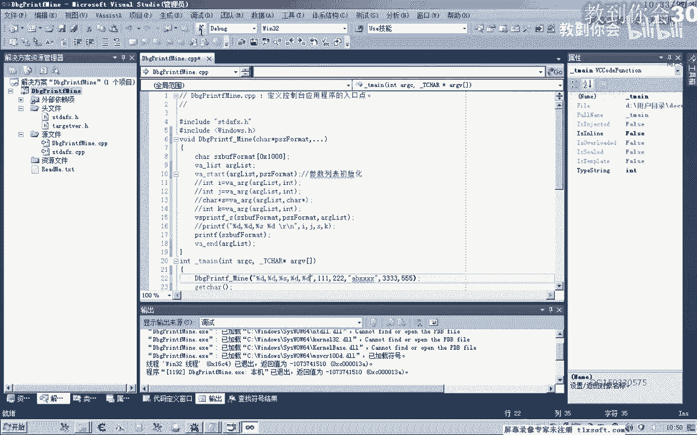

这个时候我们可以看到，那么你这个时候呢我们打印一个变量也可以。

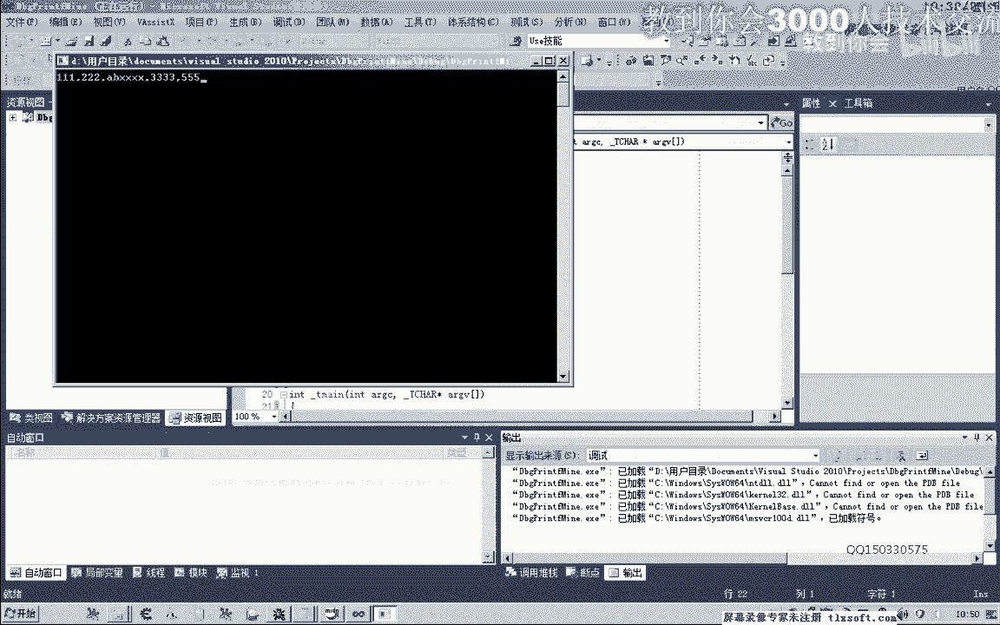

那么我们换一行，那我们把后面的删除掉，哈哈哈哈哈哈哈哈，给他换一个行，这里做一个换行的处理，那我们再次打印。

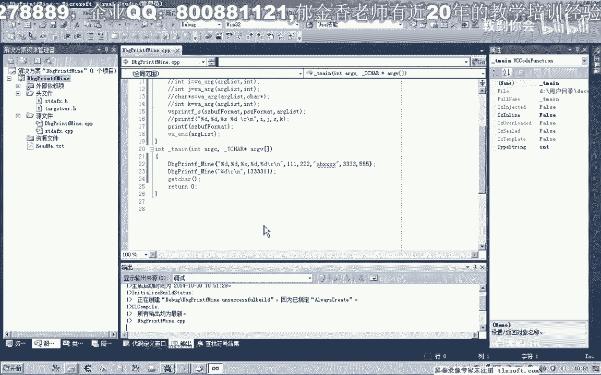

好那么到现在的话我们这个已经成功了一半了。

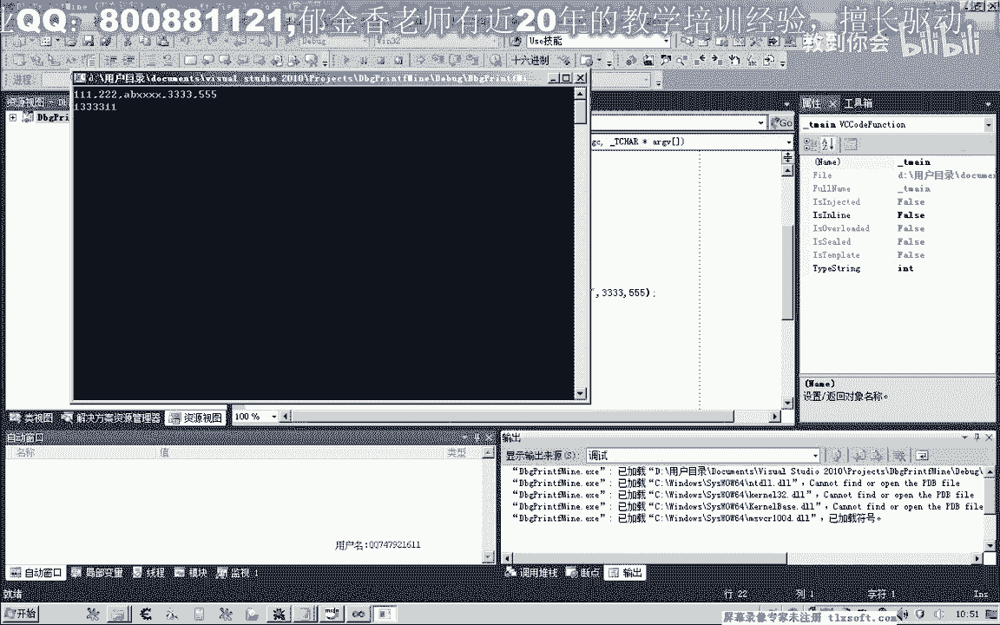

那么接下来呢我们就可以用我们因为我们的奥体附体第八个尺寸呢，这个调色字串呃啊打印函数呢它也是支持一个啊一个变量啊，一个字符串，那么在这里呢我们就可以直接用这个，那么我们在测试把这一行呢注释掉。

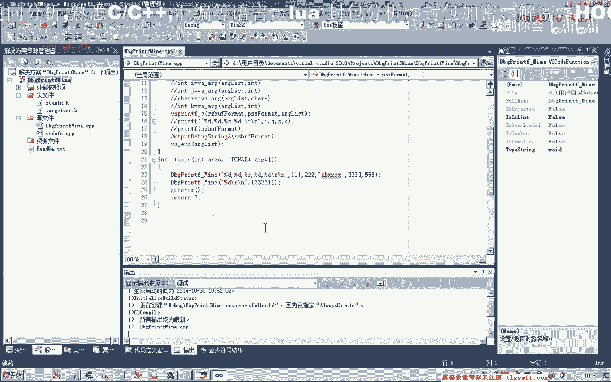

当然这个aut哈debug时出门，autifully debug时出门。

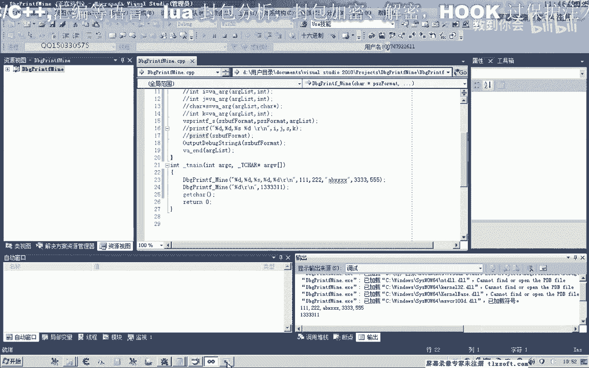

他输入的啊这个信息呢就不会显示在这个窗口里。

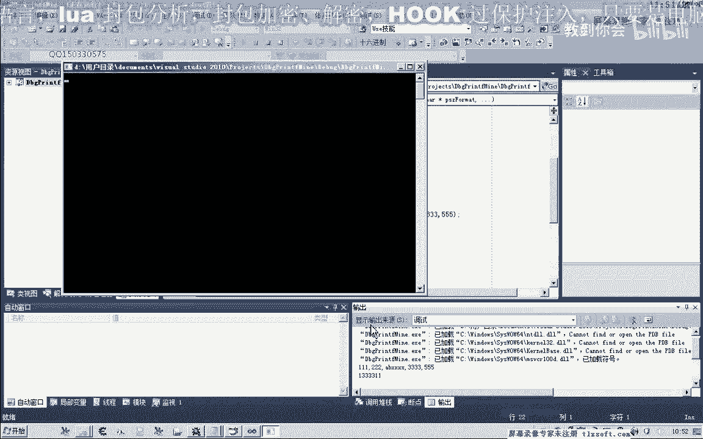

它会显示在这里啊，如果我们是单独运行的时候呢，它会显示在这个地方，会显示在这里，那么你也可以单独的运行一下啊，因为在现在它是调试啊。

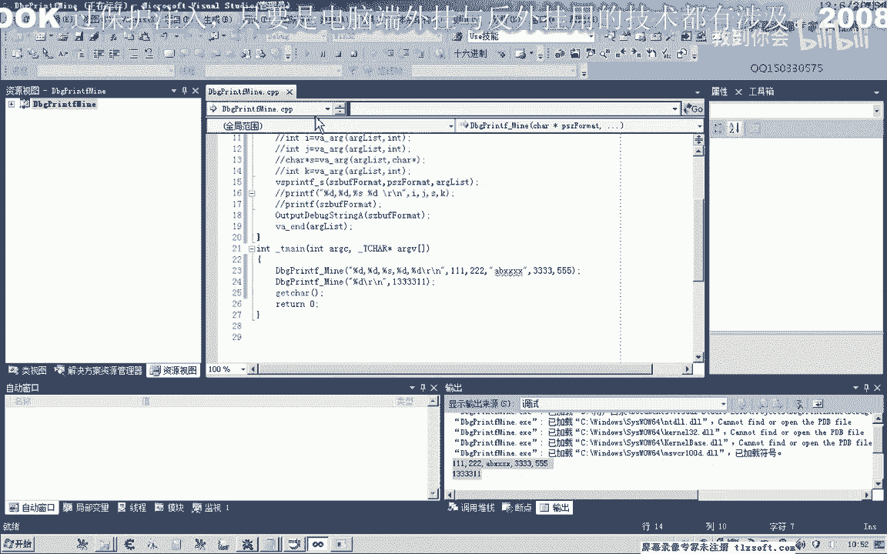

调试运行的，调试运行的呢，它本身有这个调试器呢，它本身会载货啊，这个函数说啊，所打印的一个字串，那么我们找到啊它生存的地方。

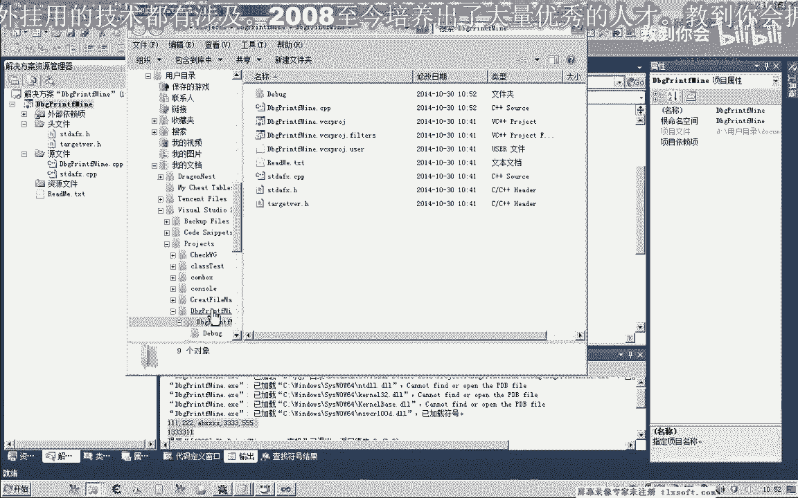

单独的运行性，那么单独的运行的话，它就会显示在我们的工具上来，那么我们的目的了哈。

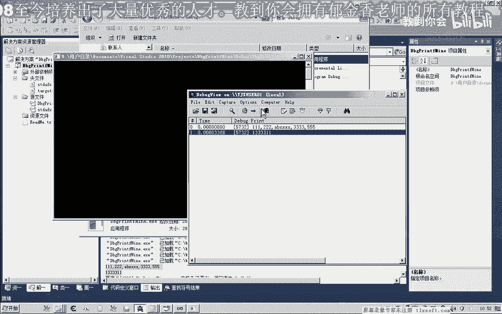

基本上就达到了，那么为什么我们说的基本上都达到了，因为很多时候呢我们其他的程序也会产生很多的调试信息，那么在这里呢我们经常要用到这个啊过滤器啊，比如说我们用啊之前用到这个gai前去开头了。

那么如果我们加上了这个前缀，那么在这里的话，他执行的时候，我们同样啊拦截不到，因为这里呢他没有加上这个前缀。

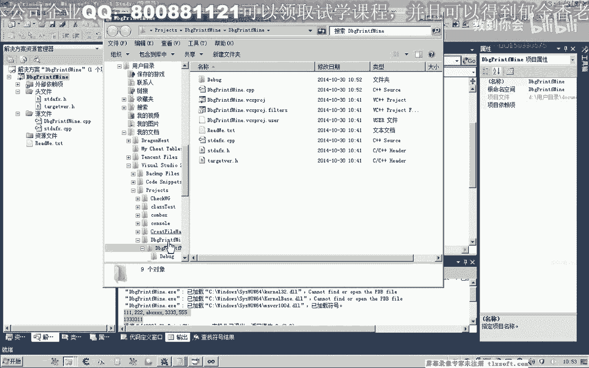

这里呢它同样的会显示出来。

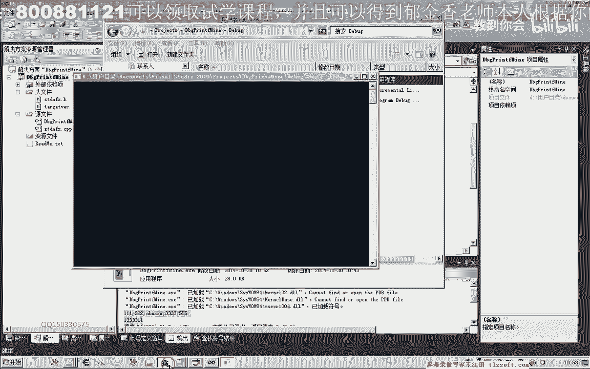

所以说我们为了方便啊，与其他其他这个软件之间的一个调试信息的一个混淆啊，所以说在这里呢我们也为这个字符串呢加上一个前缀，那么，在这里呢我们再定义另外一个这个网上去，什么，那么这里呢我们多多上八自己呢。

就是因为后边的这个这个加上一个更得一个前缀啊，游戏的一个前缀，好那么加上之后呢，我们在打印之前，我们要把这里所获得的啊这个格式化字串，人要追加到这个字符串的后边。

这个时候呢我们可以用也是用一个函数来进行，那是tr cut嘛，嗯然后呢第一个参数当然就是我们的这个for mart game。

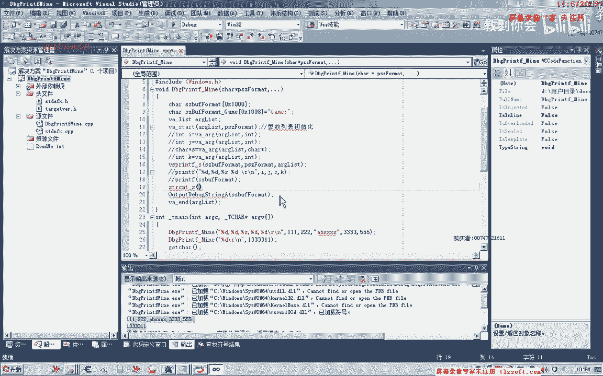

第六个参数呢就是这个我们前面获得了这个啊策划自创这里获得，然后呢最终呢我们打印的是这个红毛，红毛才更啊，然后我们再来运行，啊这里我们它就有一个这个根本的一个前缀了啊。

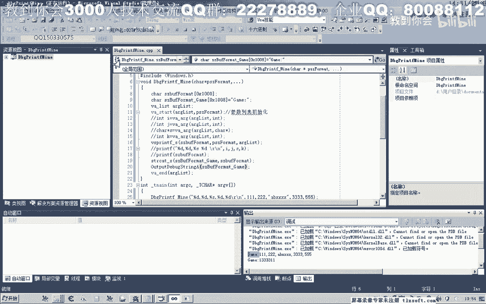

这是啥，那么这个时候在第八个里面的，那么我们再次运行的时候。

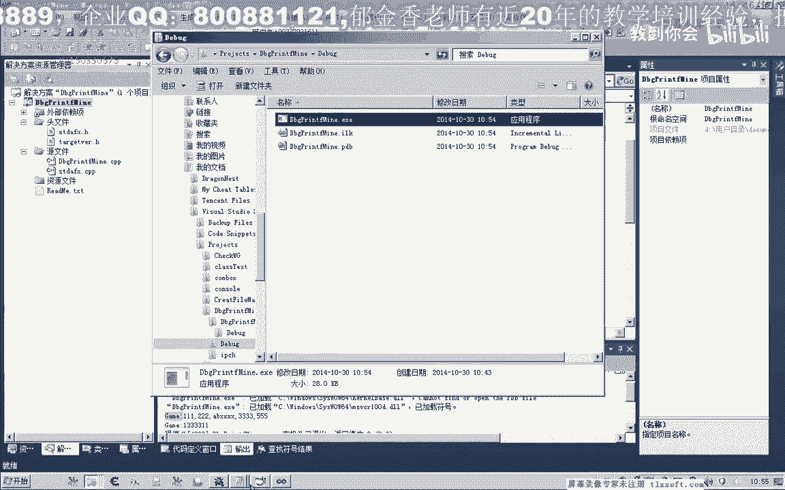

单独运行的时候，这里它就能够整合到这个载荷到了，因为我们这里呢它设置了一个过滤器的啊，必须要有这个前缀的呢，它才会显示在这里，那么这样呢我们输出来的信息呢就比较干净，那么其他软件他输出的这个调试信息啊。

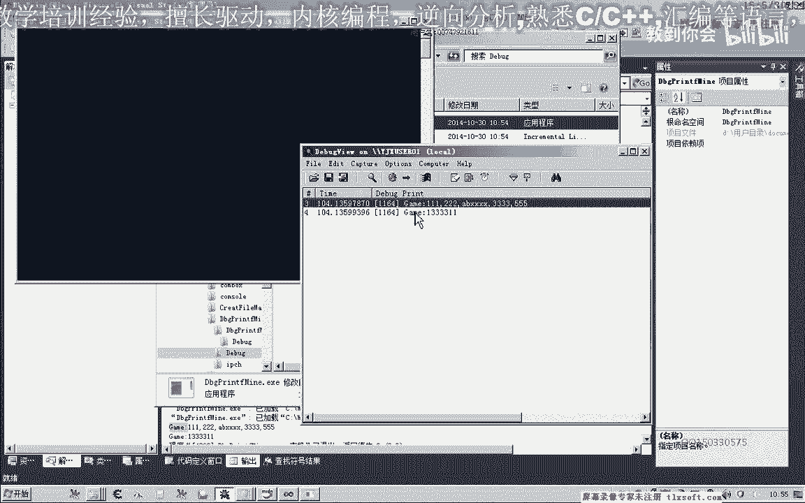

因为没有这个根的这个前缀呢，他就不会在这里显示出来，那么这样的话我们自己的一个啊支持格式化支撑的一个第八个pointing啊，fly基本上我们就写好了。

那么以后我们再呃打印我们的这个变量的一些信息啊什么什么的，就比较方便的，那我们再做一下测试，哈哈哈哈。

啊这里呢就是我们的调试信息啊，那么我们在这里运行的时候，调试信息呢它都会被拦截在这里，不会显示在我们这个地方，会显示在这个地方，好那么还有最后一点，那么就是我们一般在debug啊，这个模式下呢。

我们才需要用到，才需要打印这个调试信息，那么一旦到我们啊正式发布那个release这个版本的时候，你就不需要这个调试信息了啊，但是我们又不想去改动这个代码啊，当然一种笨的办法呢。

就是我们在发布一个历史版本的时候呢，我们把这里的代码删掉，那么实际上用不着这么麻烦，那么我们可以加上一条幅啊，啊可以加上这一条红，那么我们看一下这个debug啊，是不是这啊，这个是不是被定义了。

那么如果被定义了，我们在下面的这一段了才执行自信，那么也就是说它这个呢是判断在这个第八个版本下面，来，在后面的人才会被编译被执行，如果说这个release项目，它就不会被执行了啊。

那么如果在写这个下面呢，它这里它就是一个空函数的，这里呢他也不会说出我们的调试信息，那么如果我们切换切换到切换到第八个这个版本下面来。

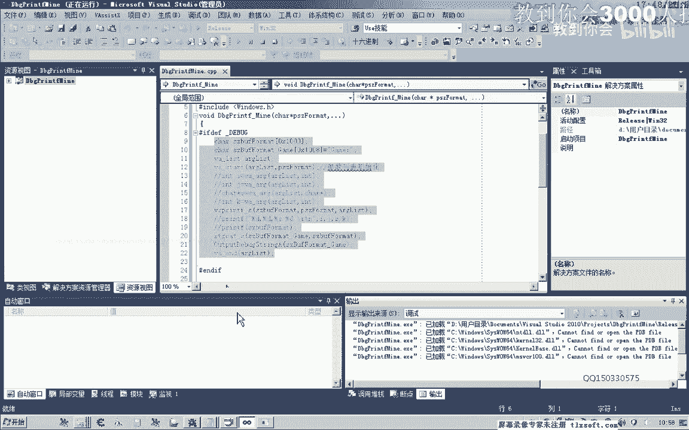

唉，生成之后呢，它就会输出我们的这个调试信息，调试信息啊，所以说这一条红的话也是非常有用的啊，非常有用的，而且我们在编写这个我们的游戏辅助的时候，如果啊你给别人用的是这个八本的这个版本的话。

别人啊很方便的来内向的一个代理，就是通过这些调试的这个函数啊，你以及相关的一个字出来，它就很容易把你的功能呢给立项出来，所以说的话我们最好的给别人用的话是发布的这个有意思的这个版本。

那么这后面的这些代码呢它就没有了，那么这里调用的这个函数呢也是一个空函数，什么都不做啊，相当于好的，那么既然我们的这个函数写好了之后呢，我们就把这个相应的这个函数来把它复制一下哈。

呃一直到啊我们的第十次课的代码里面。

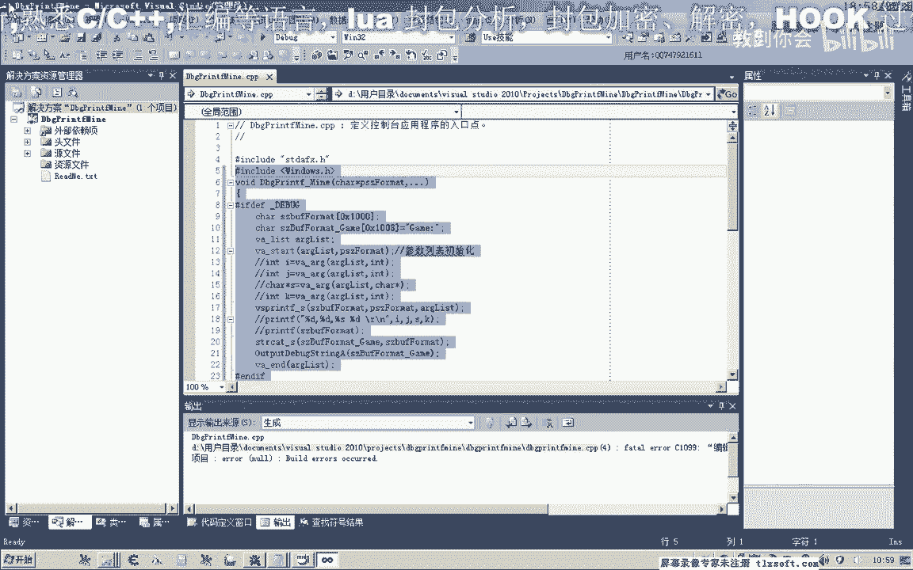

那么打开我们十次课的代码。

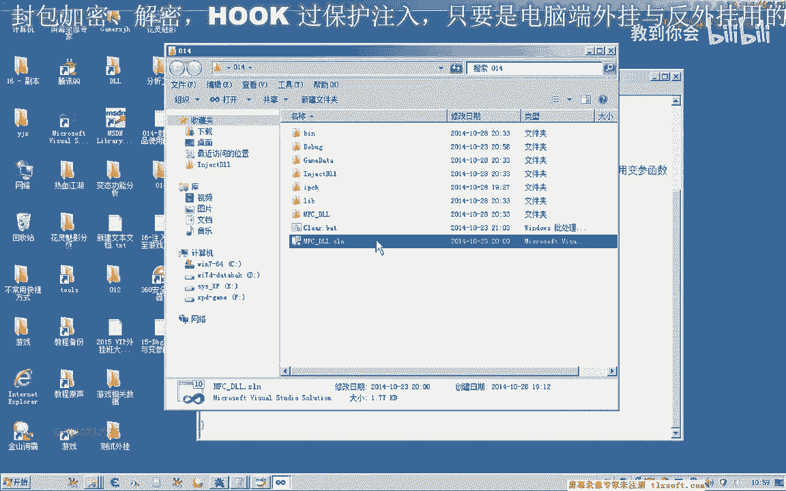

那么我们就添加到这个结构啊，交流xp p里面添加到它的一个头部，那么添加到头部之后呢，然后我们再把这个套出一下啊，在这个结构的头部，这样套出一下，套出之后呢，以后啊，各个单元的人都可以使用。

那么重新申请一下，那么这个时候呢它会报一下这个这个单元呢不能够用啊，因为这个函数的话啊，vs qut呢它需要另外的一个同建的一个支持，那我们加上一个相应的一个条件的一个知识，就是tt，或者提前。

那就等于，那么这个时候呢我们就真正成功了，那么以后呢我们就可以用我们自己的这个呃，这个函数来打印我们的调试信息的话，比这个out debug是村民就要方便啊，就要方便许多好的，那么我们下一节课再见啊。

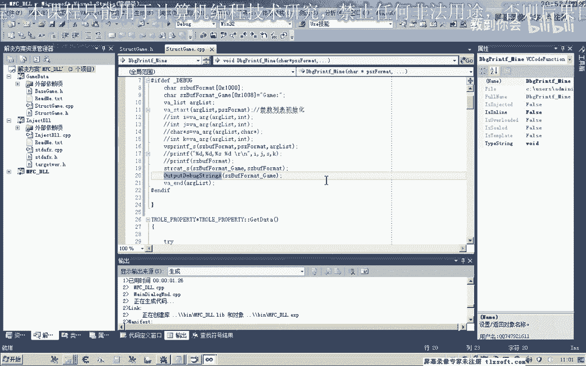