# 课程 P4：015-DbgPrintMine 与变参函数 📝

在本节课中，我们将学习如何创建一个名为 `DbgPrintMine` 的自定义调试输出函数，以替代 Windows API 中的 `OutputDebugString` 函数。`OutputDebugString` 使用不便，因为它只能接受一个字符串参数，无法像 C 语言的 `printf` 函数那样格式化输出变量信息。我们将实现一个支持可变参数的函数，使其使用起来更加灵活方便。


---

## 认识变参函数 🔍

上一节我们介绍了课程目标，本节中我们来看看什么是变参函数。变参函数是指参数个数可以变化的函数，例如 C 语言标准库中的 `printf` 函数。它使用一个格式化字符串和后续的可变数量参数来输出信息。

在开始编写 `DbgPrintMine` 之前，我们需要先了解如何在 C/C++ 中定义和使用变参函数。

以下是定义一个简单变参函数的基本步骤：

1.  包含头文件 `<stdarg.h>`。
2.  函数声明中使用省略号 `...` 表示可变参数。
3.  使用 `va_list` 类型定义一个参数列表。
4.  使用 `va_start` 宏初始化参数列表。
5.  使用 `va_arg` 宏逐个获取参数。
6.  使用 `va_end` 宏结束参数获取。

下面是一个简单的示例函数 `DebugPrintMan`：

```c
#include <stdio.h>
#include <stdarg.h>

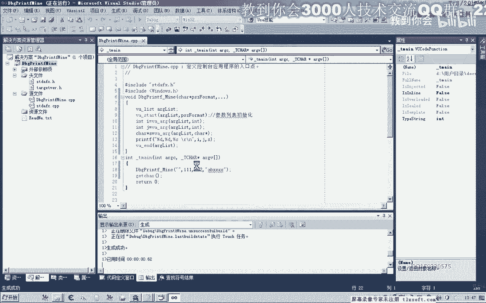

void DebugPrintMan(const char* format, ...)
{
    // 定义一个参数列表
    va_list args;
    // 初始化参数列表，format 是最后一个固定参数
    va_start(args, format);
    
    // 假设我们知道有三个参数：int, int, char*
    int arg1 = va_arg(args, int);
    int arg2 = va_arg(args, int);
    char* arg3 = va_arg(args, char*);
    
    // 使用 printf 打印获取到的参数
    printf(format, arg1, arg2, arg3);
    
    // 清理工作
    va_end(args);
}
```

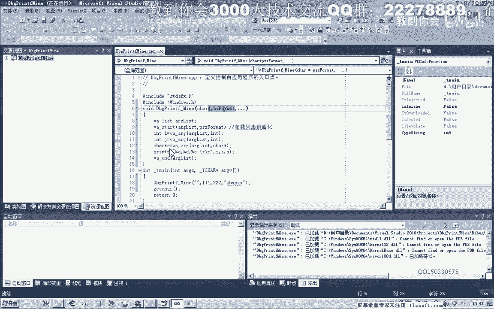


调用方式如下：
```c
DebugPrintMan("参数：%d, %d, %s\n", 111, 222, "abc");
```

这种方法需要预先知道参数的个数和类型，并不灵活。


---

## 使用 `vsprintf` 简化变参处理 🛠️

上一节我们介绍了手动获取变参的方法，本节中我们来看看一种更简便的方法。我们可以使用 `vsprintf` 函数（或其安全版本 `vsprintf_s`）来直接处理格式化字符串和可变参数列表，这比手动使用 `va_arg` 逐个获取要方便得多。

以下是使用 `vsprintf_s` 的改进版本：

```c
#include <stdio.h>
#include <stdarg.h>

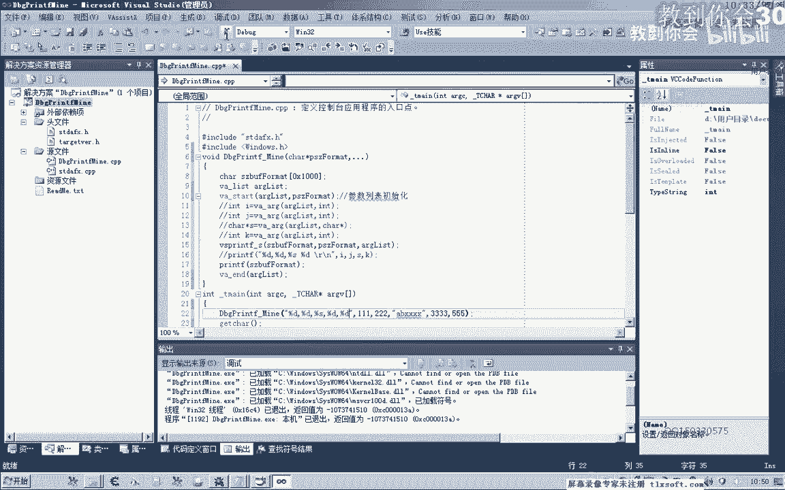


void DebugPrintMan(const char* format, ...)
{
    char buffer[1024]; // 定义一个足够大的缓冲区
    va_list args;
    
    va_start(args, format);
    // 将格式化字符串和参数列表组合到 buffer 中
    vsprintf_s(buffer, format, args);
    va_end(args);
    
    // 输出结果
    printf("%s", buffer);
}
```


现在，这个函数可以接受任意数量、任意类型的参数，只要它们与格式化字符串匹配即可。调用方式与 `printf` 完全相同：
```c
DebugPrintMan("调试信息：%d, %s\n", 123, "测试");
```

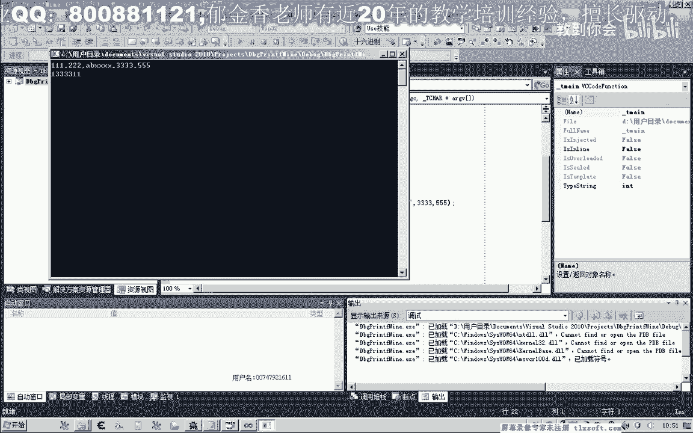

---


## 整合 `OutputDebugString` 并添加前缀 🏷️


上一节我们实现了一个灵活的格式化输出函数，本节中我们来看看如何将其与实际的调试输出 API 结合。我们的目标是替换 `OutputDebugString`，因此需要将格式化后的字符串传递给 `OutputDebugStringW`（宽字符版本）。

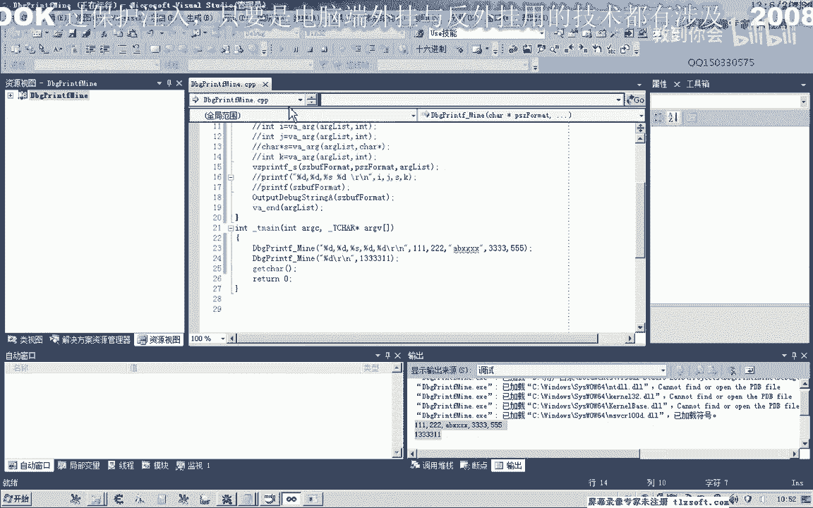

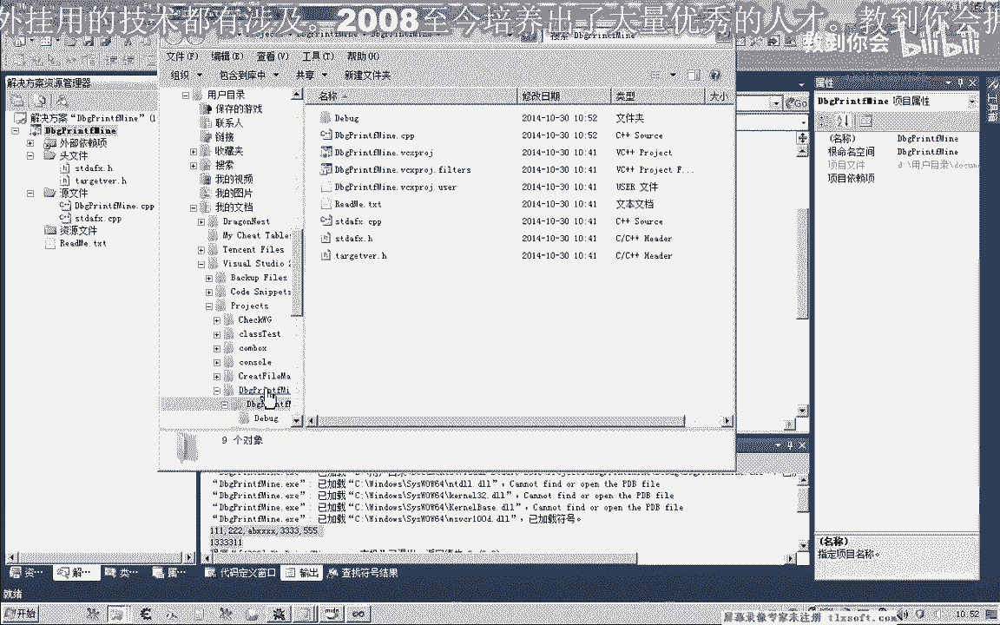

同时，为了在调试器（如 DbgView）中过滤出我们自己的调试信息，避免与其他程序的输出混淆，我们为输出的字符串添加一个特定前缀，例如 `[Game]`。

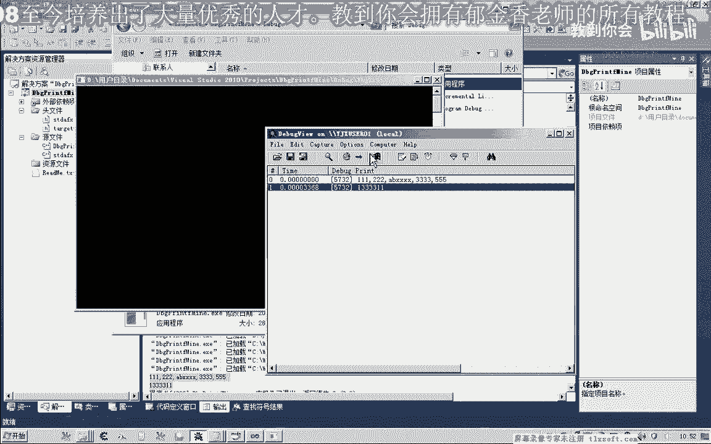

以下是整合后的 `DbgPrintMine` 函数：

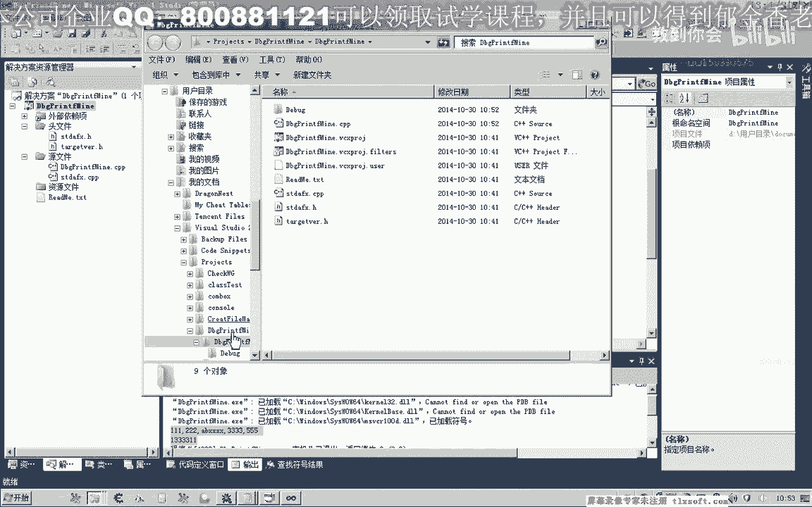

```c
#include <Windows.h>
#include <stdio.h>
#include <stdarg.h>


void DbgPrintMine(const char* format, ...)
{
    char buffer[1024];
    char finalBuffer[1100]; // 预留空间给前缀
    va_list args;
    
    // 添加自定义前缀
    strcpy_s(finalBuffer, "[Game] ");
    
    va_start(args, format);
    // 将用户传入的格式和参数格式化到 buffer
    vsprintf_s(buffer, format, args);
    va_end(args);
    
    // 将格式化后的内容追加到带前缀的字符串后
    strcat_s(finalBuffer, buffer);
    
    // 调用 Windows API 输出调试信息（需要转换为宽字符）
    OutputDebugStringA(finalBuffer);
}
```

现在，调用 `DbgPrintMine("值：%d", 100);` 将在调试器中输出 `[Game] 值：100`。这样，我们可以在调试器中设置过滤器，只显示包含 `[Game]` 的日志，使输出更加清晰。

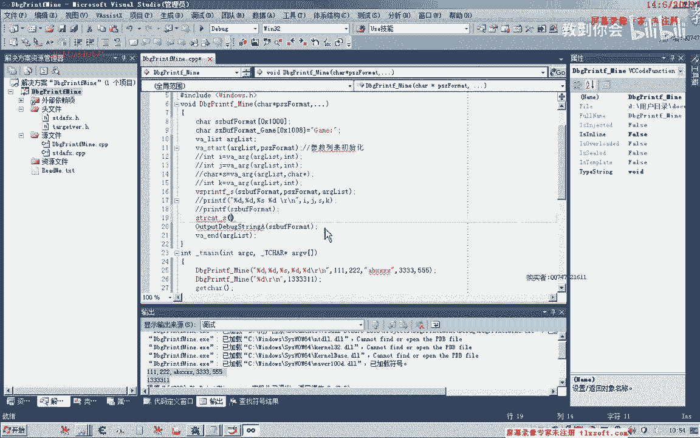

---

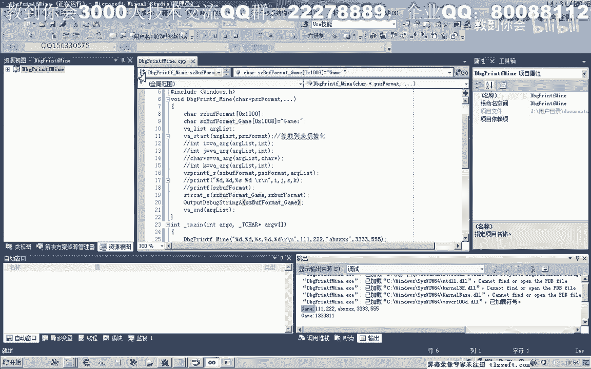

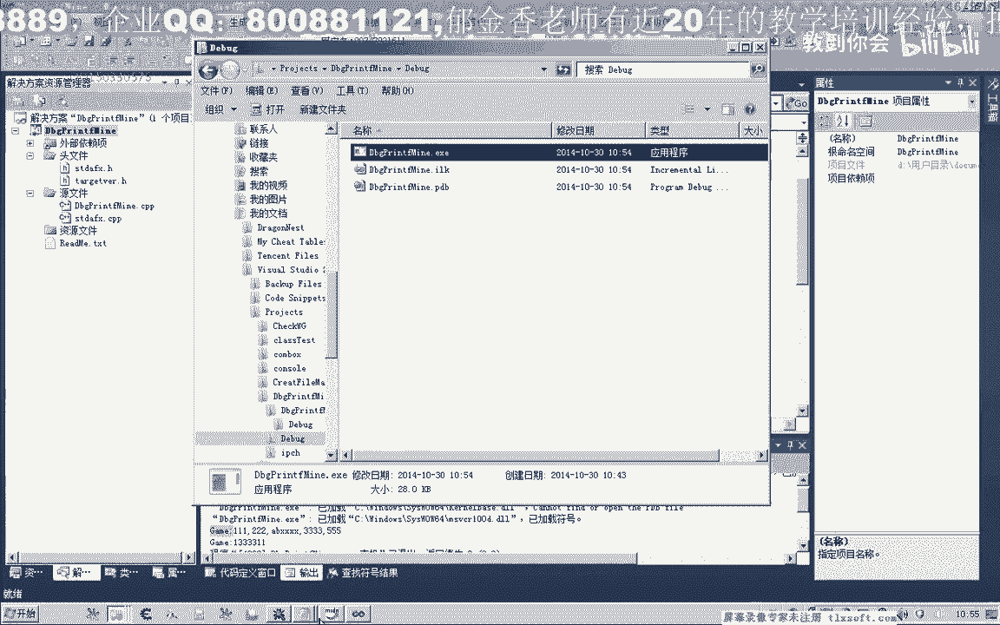

## 区分 Debug 与 Release 版本 🚦


上一节我们完成了核心功能，本节中我们来做最后一项优化。调试信息通常在开发调试（Debug）版本时需要，而在发布（Release）版本时不需要。我们希望在 Release 版本中彻底移除调试输出代码，以提高性能并防止他人通过调试信息分析我们的程序。

这可以通过预处理器指令 `#ifdef _DEBUG` 来实现。这个宏在 Debug 编译配置下会被定义，在 Release 下则不会。


以下是最终的 `DbgPrintMine` 函数：

```c
#include <Windows.h>
#include <stdio.h>
#include <stdarg.h>

#ifdef _DEBUG
void DbgPrintMine(const char* format, ...)
{
    char buffer[1024];
    char finalBuffer[1100];
    va_list args;
    
    strcpy_s(finalBuffer, "[Game] ");
    
    va_start(args, format);
    vsprintf_s(buffer, format, args);
    va_end(args);
    
    strcat_s(finalBuffer, buffer);
    OutputDebugStringA(finalBuffer);
}
#else
// 在 Release 版本下，DbgPrintMine 是一个空函数，调用它不会产生任何代码
#define DbgPrintMine(...) ((void)0)
#endif
```


**使用方式：**
*   在 Debug 模式下编译，`DbgPrintMine` 会正常输出信息。
*   在 Release 模式下编译，`DbgPrintMine` 调用会被预处理器替换为空操作，不产生任何有效代码和字符串信息，既提升了效率，也增强了安全性。

将上述函数定义放在公共头文件（如 `common.h`）中，并在所有需要使用的源文件中包含此头文件，即可在整个项目中方便地使用这个增强的调试输出工具。

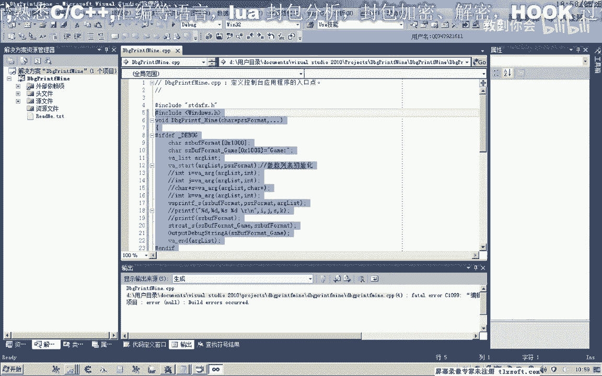

---

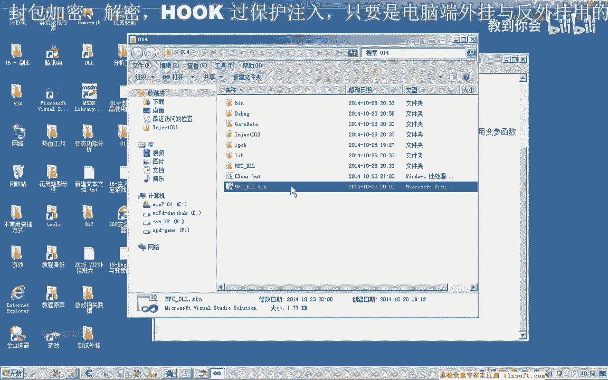

## 总结 📚

本节课中我们一起学习了如何创建和使用变参函数。我们从认识变参函数的基本原理开始，然后使用 `vsprintf` 简化了参数处理过程。接着，我们将格式化输出与 Windows 的 `OutputDebugString` API 结合，并添加了自定义前缀以便过滤日志。最后，我们利用 `#ifdef _DEBUG` 预处理器指令，使调试输出功能只在 Debug 版本中生效，从而优化了 Release 版本的性能与安全性。

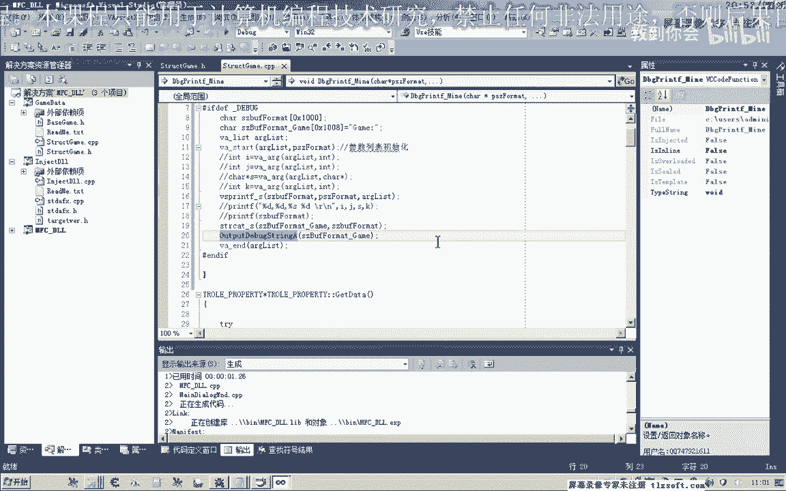

最终，我们成功实现了一个比 `OutputDebugString` 更强大、更便捷的调试输出函数 `DbgPrintMine`，它支持格式化字符串，能输出变量信息，并且易于管理。