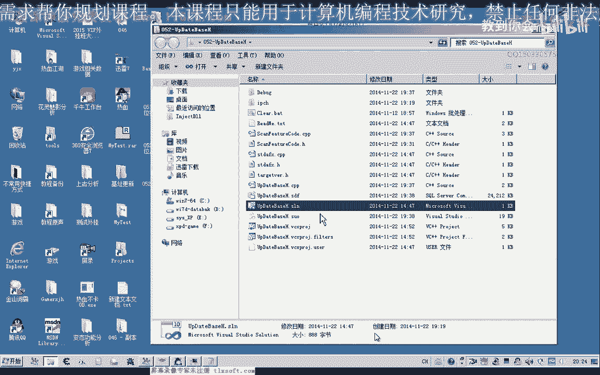
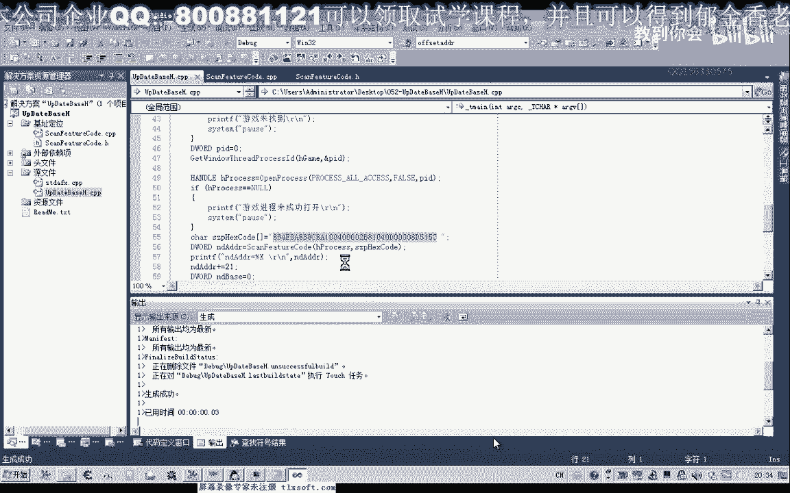
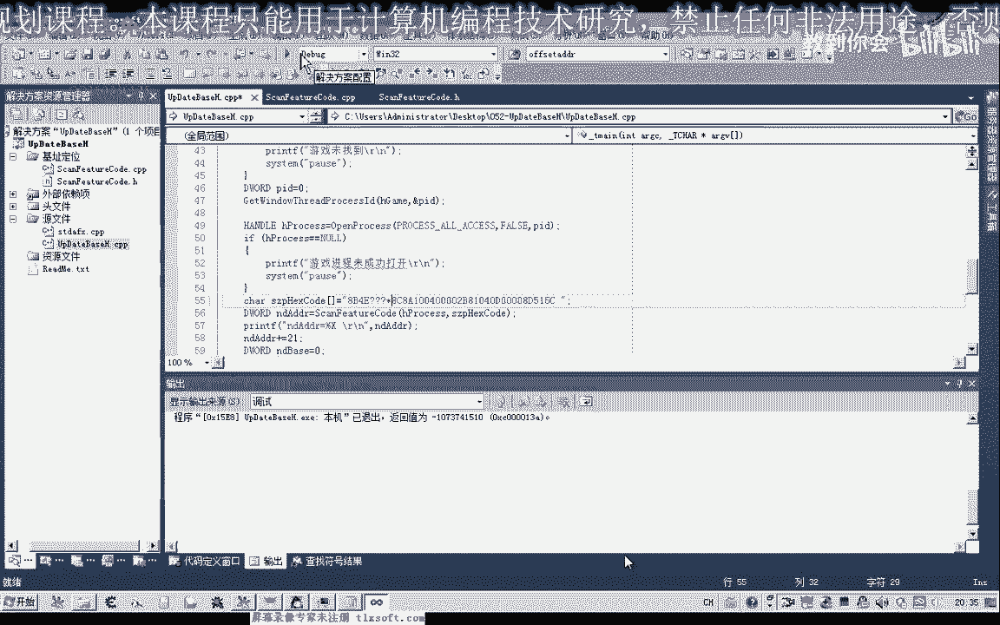
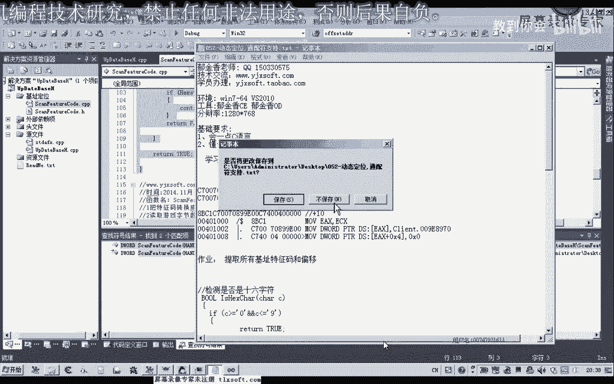

# 课程 P41：052-动态定位与通配符支持 🎯


在本节课中，我们将学习如何为特征码搜索功能添加通配符支持，实现模糊定位搜索。这将使我们的搜索功能更加强大和灵活，能够应对代码中某些字节动态变化的情况。

## 概述

在之前的课程中，我们实现了精确的特征码搜索。然而，在实际应用中，目标代码的某些部分（例如动态地址或变量）可能会发生变化。为了在这种情况下仍能准确定位，我们需要引入通配符，允许特征码的某些部分匹配任意字节。

## 通配符的概念

通配符类似于DOS命令中的`*`或`?`，可以代表任意一个字符。在我们的特征码搜索中，我们将使用特定字符（如`X`）来表示一个可以匹配任意内容的字节。



例如，假设我们有以下特征码：
`55 8B EC 83 EC 10 A1 ?? ?? ?? ?? 85 C0`

其中的`?? ?? ?? ??`部分表示这四个字节可以是任意值，我们的搜索算法将忽略这些位置的精确匹配。

## 实现步骤

上一节我们介绍了通配符的概念，本节中我们来看看如何修改现有代码来实现它。核心修改点有两处：一是转换函数，二是比较逻辑。

### 1. 修改特征码转换函数

首先，我们需要创建一个函数，将包含通配符（如`?`）的特征码字符串，转换为程序内部可识别的格式（例如将`?`替换为`X`）。

以下是该函数的核心逻辑描述：

```pascal
function ConvertPatternWithWildcards(var PatternStr: string): Boolean;
var
  i, Len: Integer;
  C: Char;
begin
  Len := Length(PatternStr);
  for i := 1 to Len do
  begin
    C := PatternStr[i];
    // 判断字符是否为有效的十六进制字符（0-9, A-F）
    if not IsHexChar(C) then
    begin
      // 如果不是，则将其替换为通配符标记，例如 ‘X’
      PatternStr[i] := ‘X’;
    end;
  end;
  Result := True;
end;
```

其中，`IsHexChar`函数用于判断一个字符是否属于十六进制字符集（0-9, A-F, a-f）。其逻辑可以用以下公式表示：
**有效字符 ∈ {‘0’..‘9’, ‘A’..‘F’, ‘a’..‘f’}**

### 2. 修改特征码比较逻辑

在比较两个特征码字节时，我们需要加入对通配符的判断。只要待比较的双方中，任意一方的当前字节是通配符`X`，我们就认为这个字节匹配成功，继续比较下一个字节。

以下是修改后的比较逻辑核心描述：

```pascal
function BytesMatchWithWildcards(Byte1, Byte2: Char): Boolean;
begin
  // 如果任意一个字节是通配符 ‘X‘，则视为匹配
  if (Byte1 = ‘X’) or (Byte2 = ‘X’) then
    Result := True
  else
    Result := (Byte1 = Byte2); // 否则进行精确比较
end;
```

在搜索的主循环中，我们将调用这个修改后的比较函数来代替原有的精确字节比较。

## 功能测试



完成上述修改后，我们就可以使用带通配符的特征码进行搜索了。


例如，原本精确的特征码为：`A1 F5 98 B0 00`
我们可以将其改为：`A1 ?? ?? ?? 00`
程序在搜索时，会忽略中间三个字节的具体内容，只要首字节是`A1`，末字节是`00`，且总长度符合，就能成功定位。



这种方式的优势在于，即使游戏更新导致中间`F5 98 B0`这三个字节的值发生了变化，只要前后特征稳定，我们依然能够找到目标地址附近。


## 课后作业与下节预告

本节课我们一起学习了如何实现带通配符的特征码搜索。

为了巩固知识，留给大家一个作业：尝试编写代码，在定位到特征码后，进一步提取出该特征码之后的某个**偏移量**处的数据。

举个例子：
假设我们定位到的特征码结构如下：
`[特征码， 占6字节] [偏移数据， 占4字节]`
如果我们要读取`偏移数据`，就需要计算偏移量。若特征码本身长6字节，那么目标数据的偏移就是6。程序需要能自动解析这种“特征码+偏移”的结构。

在下节课中，我们将以此为基础，实现自动化提取多个“特征码与偏移”对，并最终生成可用于外部调用的、包含这些地址信息的头文件或脚本。



---
**总结**：本节课中，我们通过添加特征码转换函数和修改字节比较逻辑，成功实现了支持通配符的模糊搜索功能。这极大地增强了特征码定位的鲁棒性和适用性。