# 课程 P42：053 - 提取特征码和偏移 🧩

在本节课中，我们将学习如何从游戏内存中提取特征码和偏移量。这是实现自动化定位动态地址的关键步骤，能确保我们的辅助工具在游戏更新后仍能正常工作。

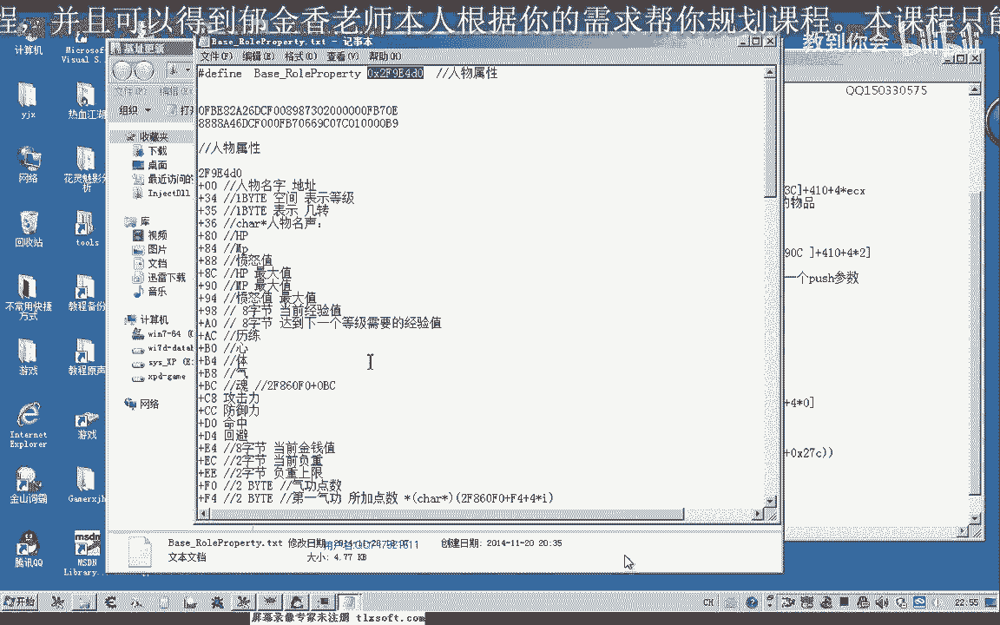

上一节我们已经编辑好了特征码定位函数。本节中，我们将为几个关键的游戏基址整理出相应的特征码字符串和偏移距离。

## 准备工作

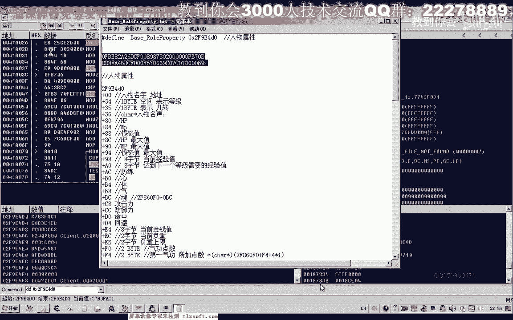

首先，我们打开第46课的基址文件进行整理。

以下是整理基址的步骤：
1.  将基址管理单元复制出来。
2.  对于两个功能共用的基址，将其放到列表最后，我们只需要更新前一个即可。
3.  复制前面需要独立更新的基址并保存。

或者，也可以将整个基址列表复制出来，然后为每一个基址抓取相应的特征码和偏移，并附在后面。

## 提取人物属性基址

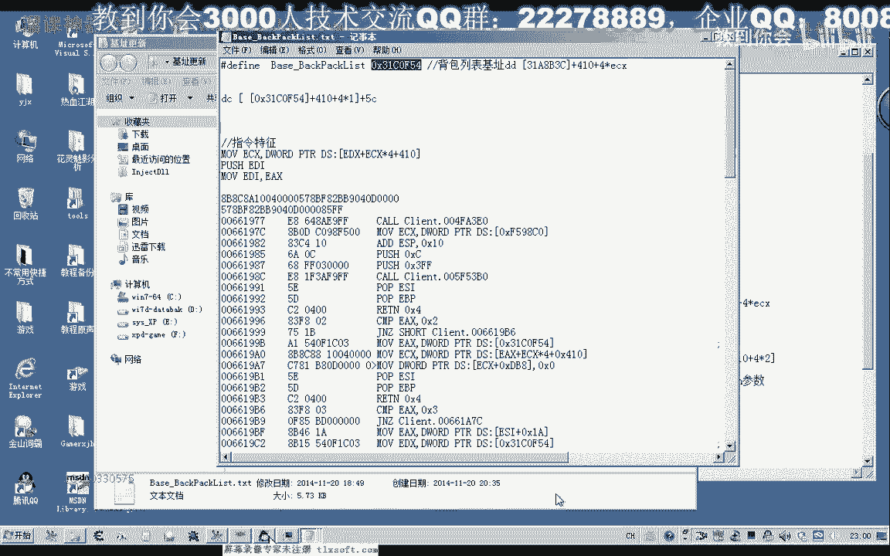

我们从“人物属性”基址开始。首先找到它的基址，上次更新地址是 `2F9400`。

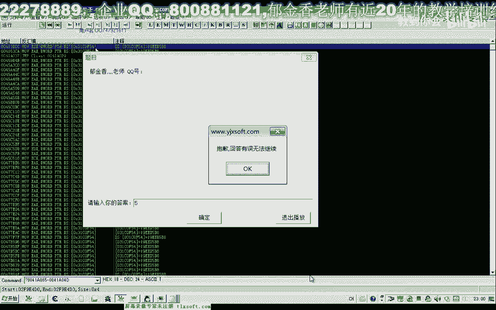

由于我们之前没有为人物属性添加特征码，现在需要转到调试器（OD）中重新提取。

进入调试器，查看人物属性的地址。第一个地址是人物的名字。我们在底部搜索这个字符串，会得到很多结果。

此时，我们随便选择一个地址即可。例如选择其中一个，然后复制它前面或后面的一段代码，用于提取特征码和偏移。

我们复制地址 `2F914D0` 前面的一段代码作为特征码。提取时，我们通常选择基址前面的稳定代码段，因为游戏更新时，前面的代码变动可能性较小。

接下来计算偏移量。我们可以在调试器里计算：用基址地址减去特征码定位到的地址。计算得出偏移量为 `0x18`（十进制24）。

读取方式为直接读取计算出的基址地址 `02F914D0`。

至此，我们完成了第一个基址（人物属性）的特征码和偏移提取，并将其保存。

## 提取背包列表基址

接下来寻找“背包列表”的基址。可以直接在调试器中搜索，因为之前的地址已更新，我们需要最新的基址。

搜索后找到多个地址，我们选择比较靠前的一个作为背包基址。

然后提取它前面的一串代码作为特征码。提取后，可以在内存扫描工具（如CE）中尝试搜索，如果搜索到的地址都是有效的，则证明特征码可用。

注意在搜索时，需要取消勾选“可写”等限制条件。

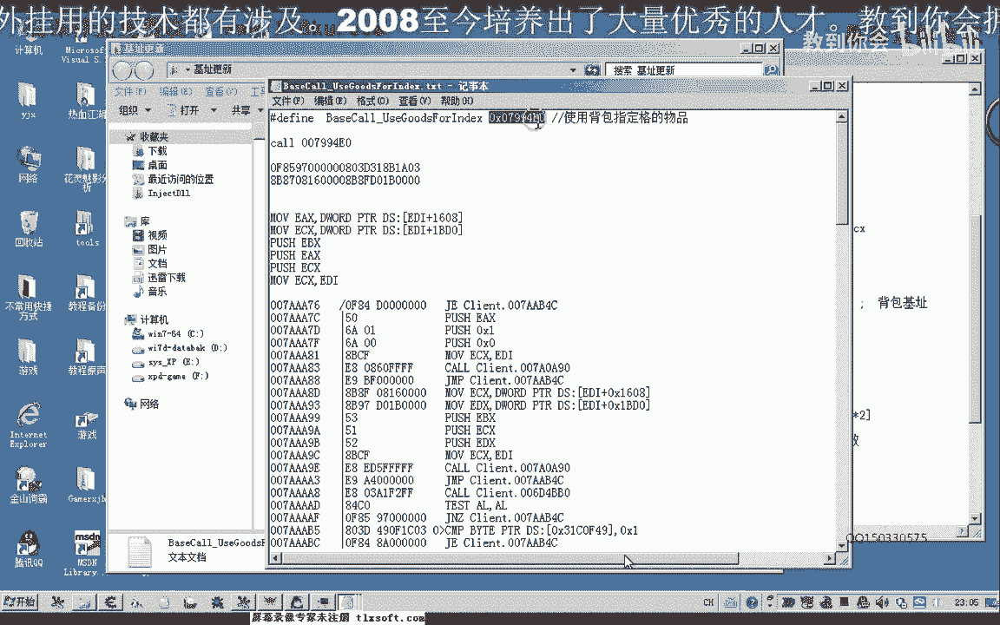

搜索到一个有效地址后，我们记录它。接着计算偏移量：用基址地址减去特征码定位到的地址。计算得出偏移量为 `0x11`（十进制17）。

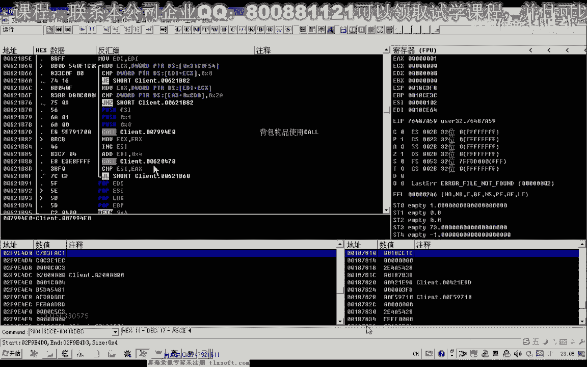

## 提取使用背包的基址

现在提取“使用背包”功能相关的基址（Qord）。我们寻找最新的地址。

这个地址位于一个循环内部，我们复制循环内的一段代码来提取特征码。

以下是提取特征码的注意事项：
*   对于像 `75 ??` 这样的跳转指令，后面的偏移字节（`??`）容易变动，需要用通配符表示。
*   对于不涉及跳转的普通指令（如 `6A 01`），一般不会变化，可以直接使用。
*   特征码应尽可能选择稳定、不易变动的代码片段。

编辑好特征码后，在内存扫描工具中测试其唯一性。如果搜索不到或结果不对，需要核对特征码字节，检查是否有遗漏（例如，有时代码中隐藏的字节未被复制下来）。

修正特征码后再次搜索，定位到地址。然后计算偏移量：用目标基址地址减去特征码定位到的地址。计算得出偏移量为 `0x18`。

## 提取游戏主窗口基址

接下来更新“游戏主窗口”的基址。我们到调试器中直接提取。

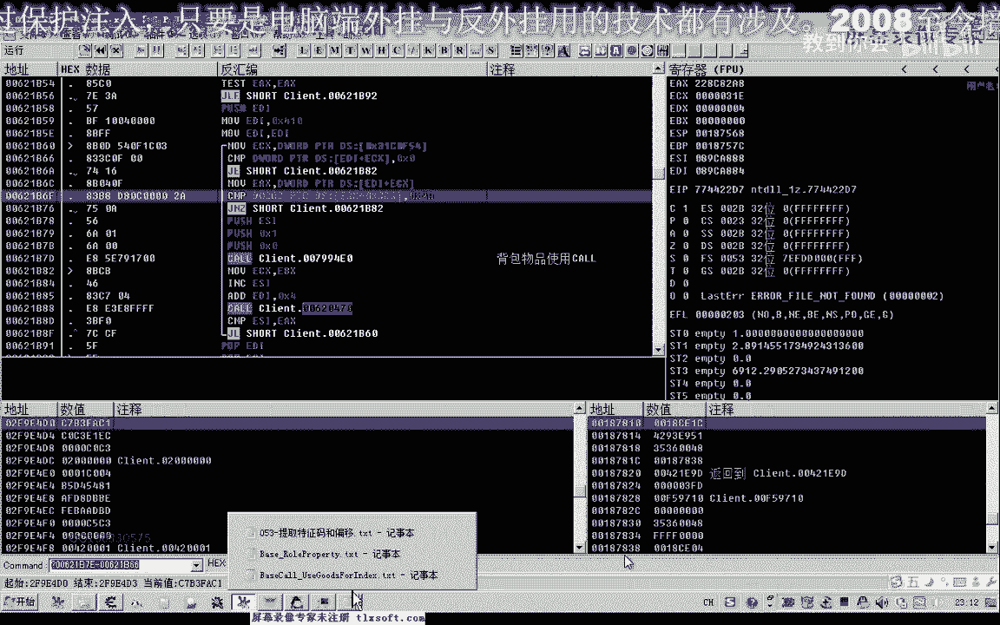

选择一段合适的代码。如果一段代码内全是地址数字，游戏更新后这些数字会变，需要大量通配符，不适合做特征码。因此我们应选择指令代码更稳定的片段。

复制一段靠前的代码，用其后半部分制作特征码。在内存扫描工具中搜索，定位到地址。

计算偏移量时需要注意：由于我们搜索的是目标地址后面的特征码来定位到前面的基址，所以偏移量可能是负数。例如，计算得出需要向前回溯4个字节，那么偏移量就是 `-4`。

## 提取怪物列表基址

最后提取“怪物列表”的基址。我们使用最新更新的地址。

搜索后，选择靠前的一个地址，提取其前面的一段代码作为特征码。

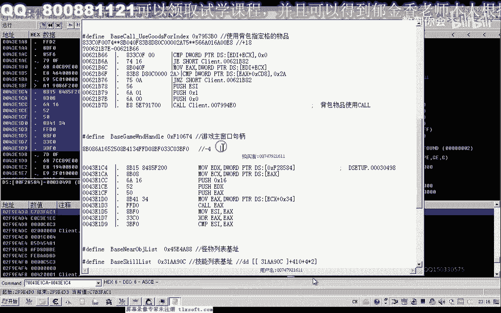

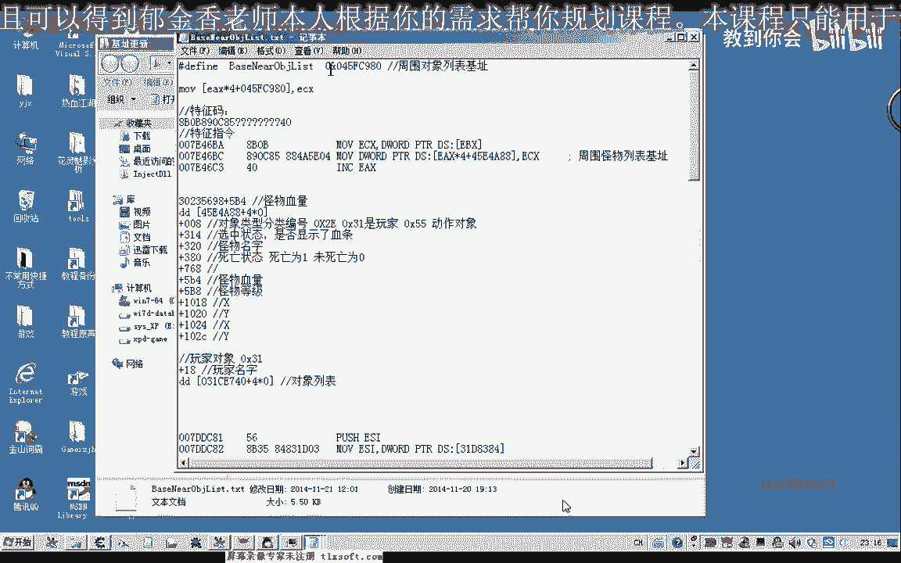

制作特征码时，对于其中的地址数据和跳转偏移，使用通配符表示。编辑好一段足够长的特征码后，在内存扫描工具中定位。

计算偏移量：用怪物列表基址地址减去特征码定位到的地址。计算得出偏移量为 `0xEF`（十进制239）。

## 总结与作业

本节课中，我们一起学习了为多个游戏功能基址提取特征码和计算偏移量的完整流程。

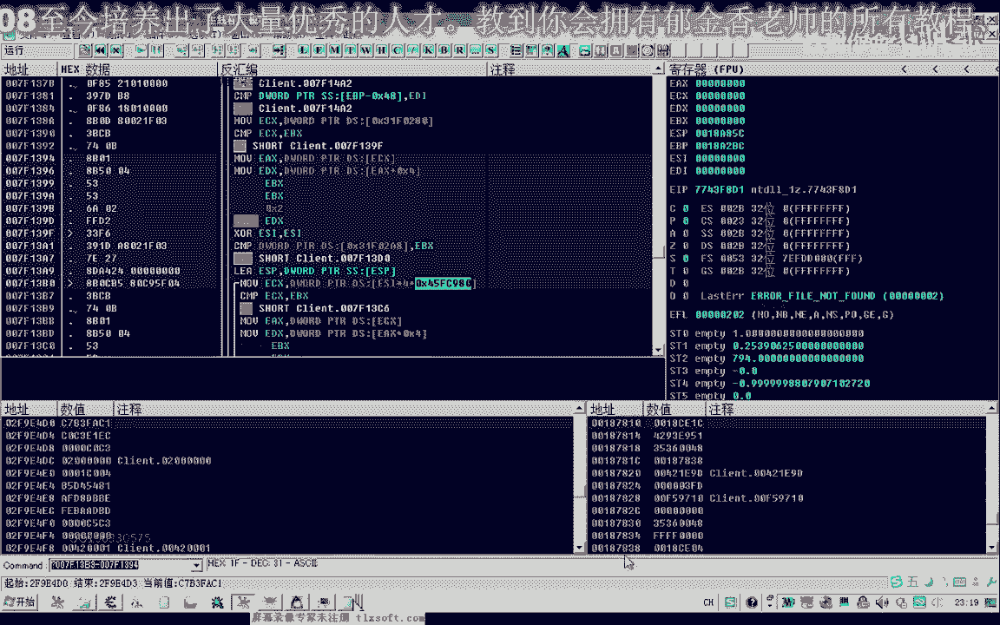

剩下的其他基址，请大家结合前面讲解的“快速更新基址”的方法，按照相同的格式提取好特征码。

在下一节第54课中，我们将编写代码，利用这些提取好的特征码和偏移量，统一地、自动化地更新出所有的游戏基址。

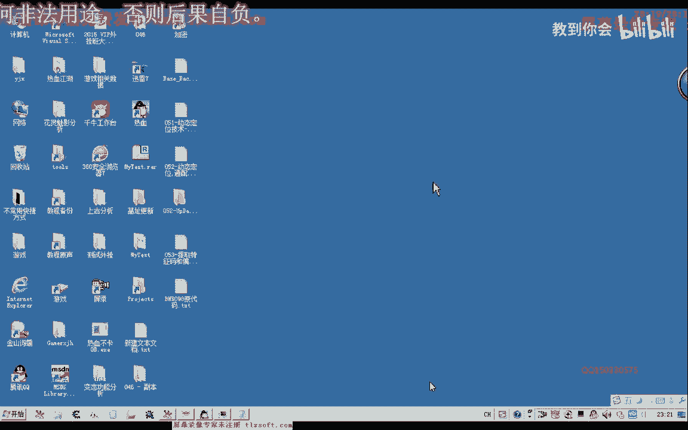

**作业**：请根据本节课的方法，完成剩余基址的特征码提取工作。