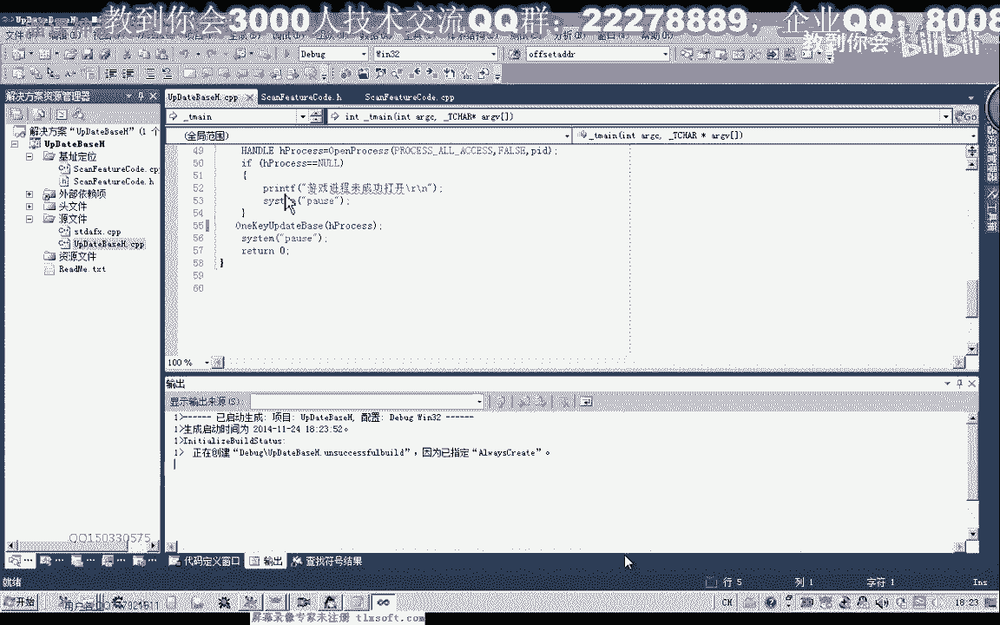
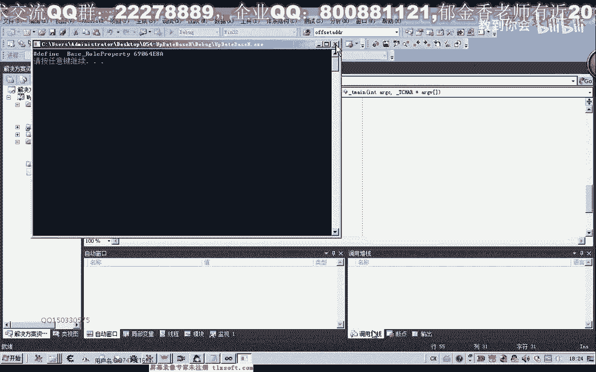
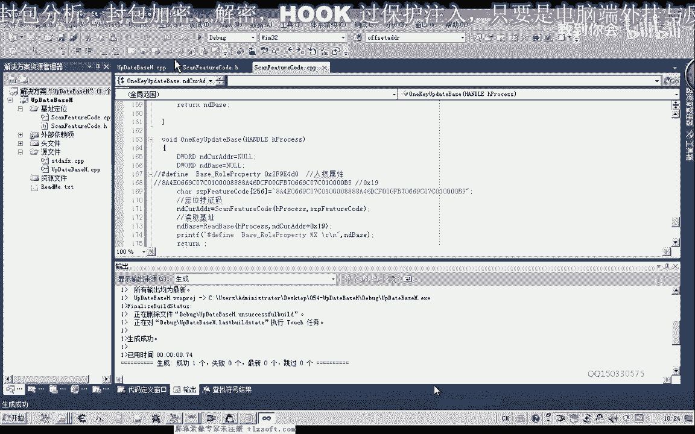
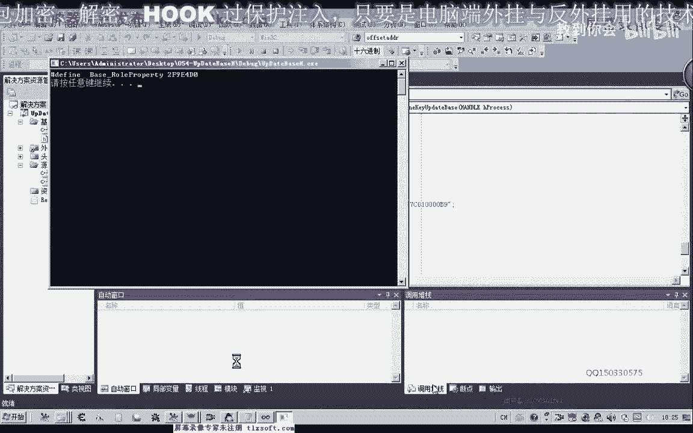
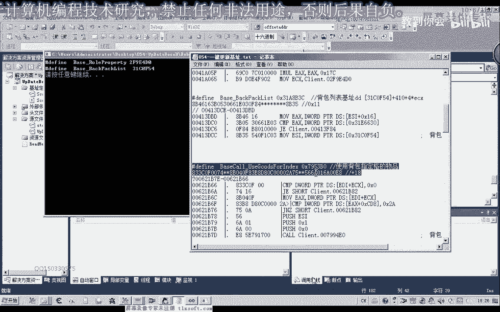
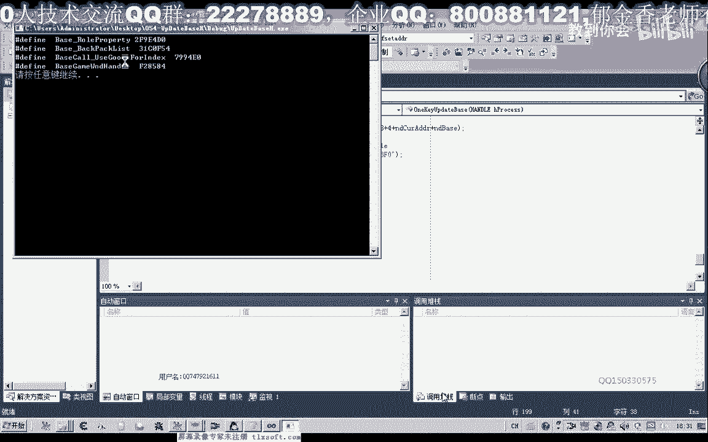
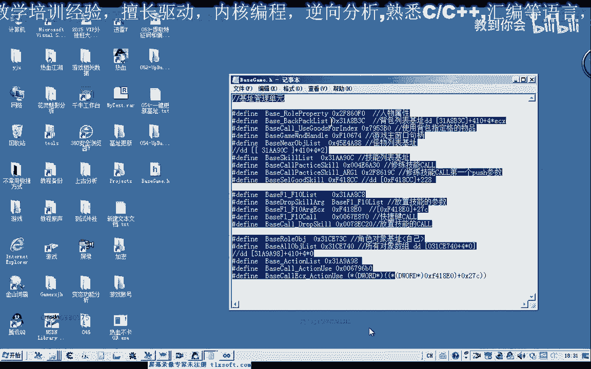

# 课程 P43：054-一键更新基址 🛠️

在本节课中，我们将学习如何编写一个“一键更新基址”的函数。我们将基于之前课程中已完成的特征码定位和偏移提取功能，整合并优化代码，实现自动化读取多个游戏基址。


---

## 概述

上一节我们介绍了如何定位特征码并提取基址偏移。本节中，我们将把这些功能封装成一个完整的函数，实现一键读取并更新多个关键的游戏基址。

---

## 优化基址定位函数

首先，我们对之前编写的基址定位函数进行优化。在读取内存缓冲区时，原代码固定读取1024字节。但某些地址的数据可能没有这么多，因此我们改用实际读取的字节数作为循环结束条件，以提高效率。

```c
// 优化循环结束条件，使用实际读取的字节数
while (bytesRead > 0) {
    // 处理逻辑...
}
```

---

## 封装一键更新函数

接下来，我们开始封装核心的一键更新基址函数 `UpdateAllBases`。该函数接收游戏的进程句柄作为参数。

```c
void UpdateAllBases(HANDLE hProcess) {
    // 函数实现...
}
```

在函数内部，我们需要完成以下几件事：
1.  定义特征码缓冲区。
2.  定位特征码地址。
3.  根据偏移量读取最终基址。
4.  打印或存储读取到的基址。

以下是具体步骤：

### 1. 定义特征码缓冲区

首先，在函数头部定义一个缓冲区来存放特征码字符串。



```c
char szPattern[256] = {0};
```



我们使用第一个基址（例如“人物属性”基址）的特征码来初始化这个缓冲区。注意，复制特征码字符串时需要删除其中的空格。

```c
// 示例：初始化“人物属性”特征码
strcpy(szPattern, "8B 0D ?? ?? ?? ?? 85 C9 74 0F");
```

### 2. 定位特征码地址





调用之前封装好的特征码定位函数 `FindPattern` 来获取特征码所在的内存地址。


```c
DWORD dwPatternAddr = FindPattern(hProcess, szPattern);
if (dwPatternAddr == 0) {
    printf("特征码定位失败。\n");
    return;
}
```

### 3. 封装基址读取函数

为了代码清晰，我们单独封装一个用于读取基址的函数 `ReadBaseAddress`。

```c
DWORD ReadBaseAddress(HANDLE hProcess, DWORD dwAddress) {
    DWORD dwBase = 0;
    SIZE_T bytesRead = 0;
    // 读取4字节（32位系统地址长度）
    ReadProcessMemory(hProcess, (LPCVOID)dwAddress, &dwBase, sizeof(DWORD), &bytesRead);
    return dwBase;
}
```


### 4. 计算并读取最终基址



定位到特征码地址后，需要加上特定的偏移量，然后读取该地址存储的值，这才是真正的基址。


```c
// 假设“人物属性”基址的偏移是 0x19
DWORD dwFinalAddr = dwPatternAddr + 0x19;
DWORD dwBaseValue = ReadBaseAddress(hProcess, dwFinalAddr);
printf("人物属性基址: 0x%X\n", dwBaseValue);
```

---

## 测试与验证

完成上述代码后，我们进行测试。将函数集成到主程序中，并传入正确的进程句柄。

```c
int main() {
    HANDLE hProcess = OpenProcess(PROCESS_ALL_ACCESS, FALSE, processId);
    if (hProcess) {
        UpdateAllBases(hProcess);
        CloseHandle(hProcess);
    }
    return 0;
}
```

运行程序，控制台应能正确输出读取到的基址数值。如果数值错误，请检查特征码字符串和偏移量是否正确。

---

## 扩展更新其他基址


按照相同的模式，我们可以扩展函数，一次性更新多个基址，例如背包基址、怪物列表基址等。

以下是更新“背包基址”的示例步骤：


1.  **替换特征码**：将 `szPattern` 缓冲区的内容替换为背包的特征码。
2.  **更新偏移量**：计算并使用背包基址对应的偏移量（例如 `0x11`）。
3.  **输出结果**：打印读取到的背包基址。

```c
// 更新背包基址
strcpy(szPattern, "A1 ?? ?? ?? ?? 8B 4D 08"); // 背包特征码
dwPatternAddr = FindPattern(hProcess, szPattern);
if (dwPatternAddr) {
    dwFinalAddr = dwPatternAddr + 0x11; // 背包偏移
    dwBaseValue = ReadBaseAddress(hProcess, dwFinalAddr);
    printf("背包基址: 0x%X\n", dwBaseValue);
}
```

对于更复杂的多级指针基址（例如“怪物列表”），其读取逻辑需要额外步骤：
*   首先读取一级指针地址。
*   然后根据该地址再次读取，并加上二级偏移。
*   最后才能得到真正的基址。

这需要仔细分析内存结构并调整代码逻辑。


---



## 总结


本节课中我们一起学习了如何将特征码定位与偏移读取功能整合，编写出一个“一键更新基址”的函数。我们优化了读取逻辑，封装了通用函数，并实现了对多个游戏基址的自动化读取。

关键点在于：
*   **优化循环**：使用实际读取字节数作为条件。
*   **函数封装**：使代码结构清晰，易于维护。
*   **模式复用**：通过替换特征码和偏移量，快速扩展新基址的读取功能。



下一节课，我们将探讨如何通过编程自动生成包含这些基址的头文件，实现真正意义上的“一键更新”，无需手动修改代码。