# P44：055-一键更新基址生成BaseGameH - 教到你会 - BV1DS4y1n7qF

大家好，我是郁金香老师，那么在上一节课呢，我们一起编写了代码，来实现了机制的更新啊，但是当时的更新的话，我们只是更新到屏幕上，并没有来生成我们的白根的头文件，没有自动的，那么所以说呢这节课呢。

我们继续来完善它啊，添加代码，让它生成一个呃basic的头文件啊，那么我们直接把这个文件，那么复制到我们的项目里面呢，就直接可以用啊，生成一个类似这样的一个头文件啊，当然这个机子呢是没有更新的啊。

那么我们需要一个更新的机制，那么在上一节课来给大家留了一个，作业啊，就是来把相应的代码呢，后面的代码呢把它添加完整啊，那么下来之后呢，我也跟大家一起做了这个作品，并把它添加完整的。

那么现在我们把这个做类的代码啊，添加到我们第54课啊，那这个项目里边。

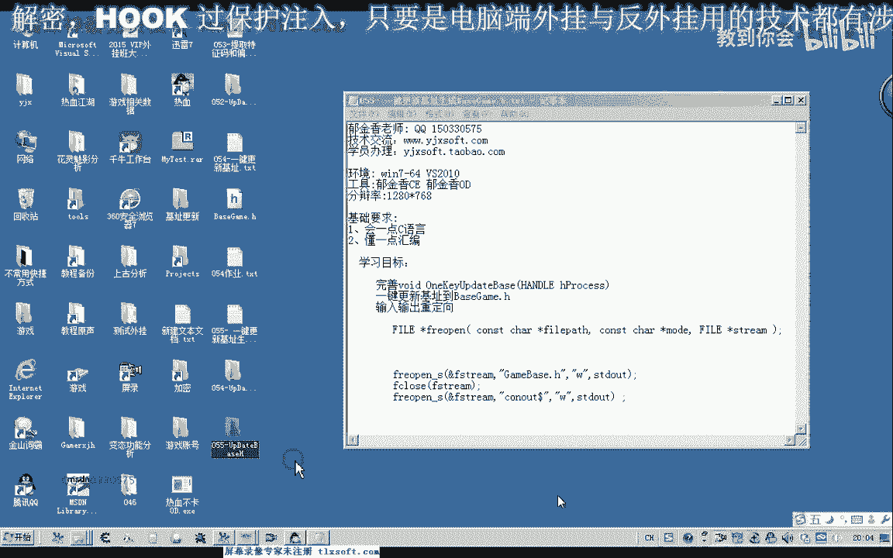

那么展开我们的机子定位单元，那么移到最后，那么我们用新的这个拙劣的这个函数，来替换掉它，嗯然后我们编译一下，看能否通过，但是这个时候的话我们呢更新呢它只是，把我们的更新的数据呢，显示在我们的屏幕上。

显示在我们的屏幕上标一起。

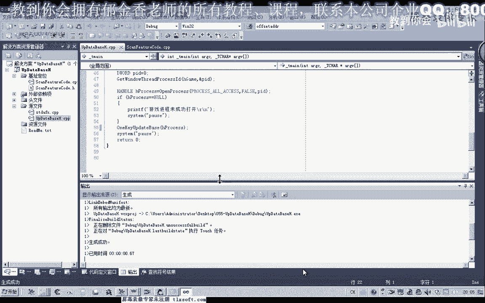

那么现在我们要的效果的话，是要让它自动的生成文件啊，那么还有一点我们需要注意，那么这个数据前面呢，呃我们需要加上linux的前缀，这一点我们忘了。

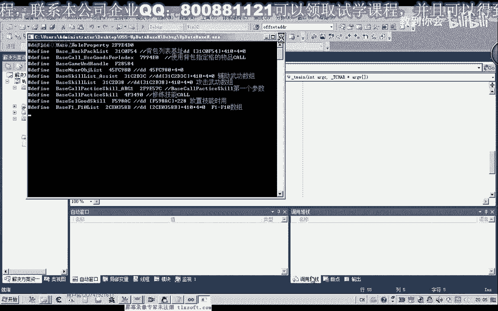

那么我们在这个作业里边再把它更新好，然后添加进去，那么首先呢我们这个0x啊，那么前面我们需要呃把它替换一下，相关的这个格式，那么我们需要把这个0x的前面再加一个，0x的一个前缀，再是2%啊。

然后你这个x然后全部替换好。

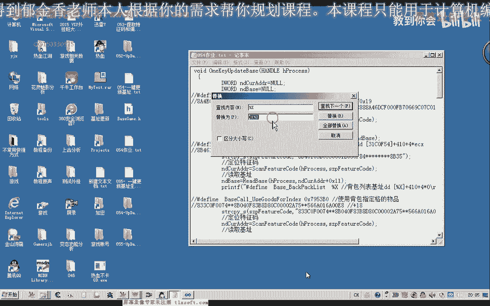

那么我们替换了之后呢，我们再把它复制到代码里面。

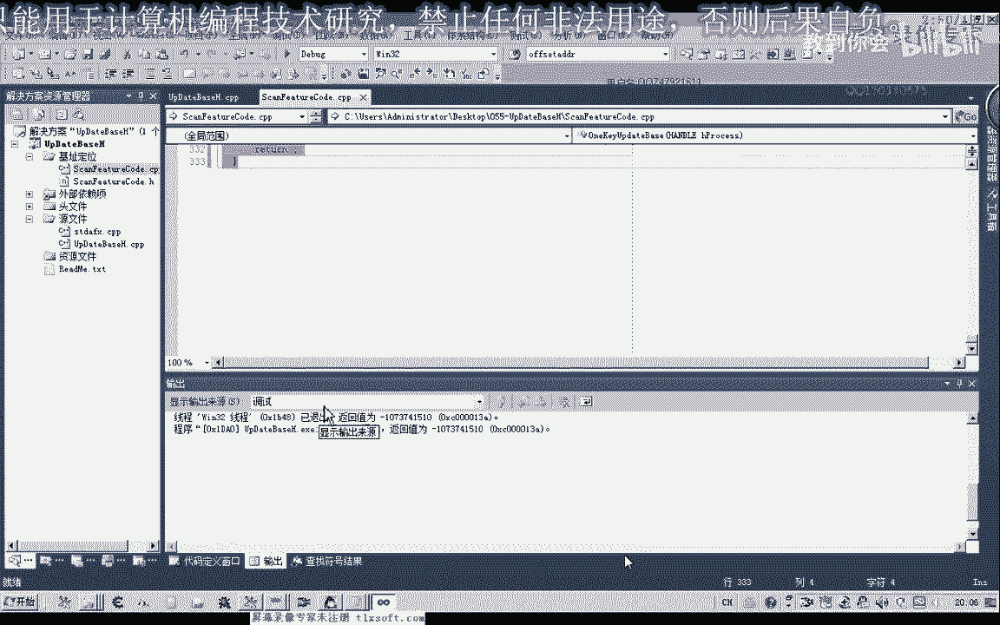

那么我们再来测试一下，那么这个时候呢，它就有一个相应的一个前缀了啊，那么但是现在的这些数据来显示在屏幕上，我们如果是去手动的去添加这些代码的话。

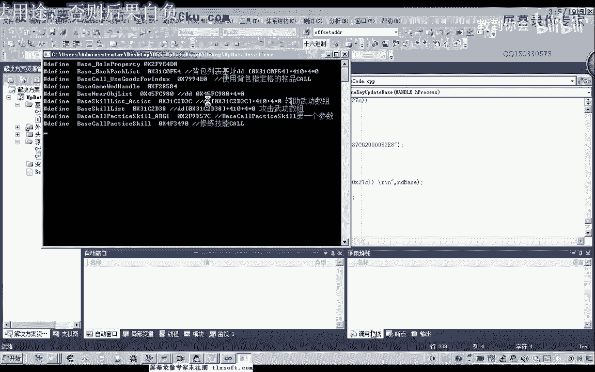

那么呢也比较麻烦，那么所以说呢我们可以把它生成，生成一个文件啊，跟ve，那么这个呢我们需要在这里添加一些代码，这里我们可以来把这个输出来，重定向到我们的文件，也就是跟bs点来取，那么用完了之后呢。

我们再来啊恢复这个输出啊，的这个恢复这个标准的输出，那么这个呢我们可以用控制呃。

可以用到这个相关的函数来实现，那么这这个c语言当中，它提供了一个f2 open的这样一个文件，那么可以呢它实现可以实现一个从进项啊，呃也可以实现文件的打开这一类的操作。

那么我们先来看一下这个文件的一个说明。

那么首先呢在前面的第一个，它是一个文件文件名，带带路径的一个文件名，当然它也可以是一个相对的路径啊，相对路径就只有一个文件名带路径，那么第二个是它的一个打开的模式。

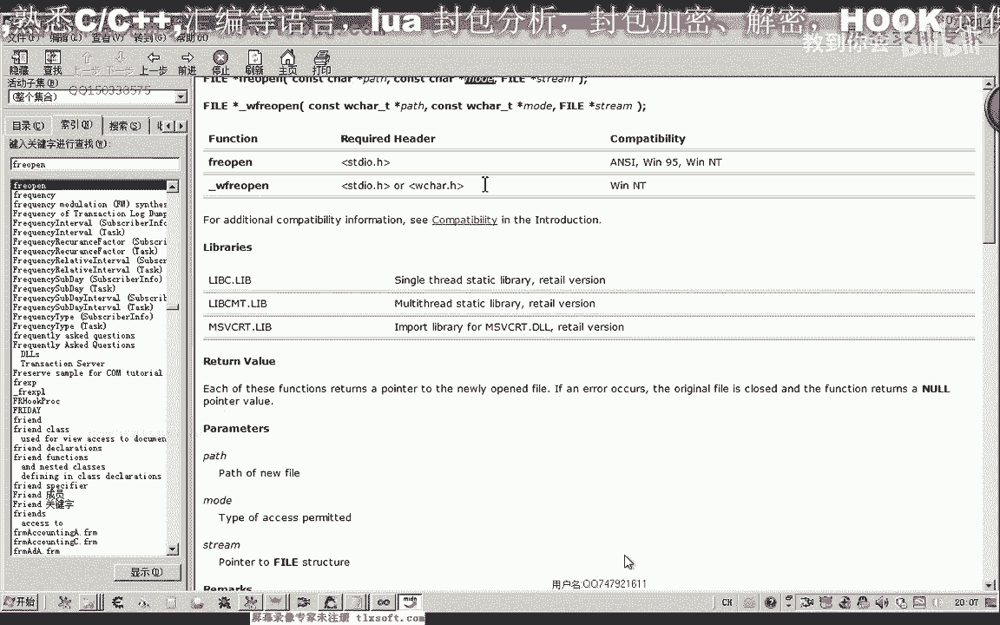

它模式有下边这些模式啊，那么我们需要用到的是这个w这个模式，那么如果我们需要这种模式的话，它会来每次呃使用这个函数的时候呢，它会先创建一个新的空文件啊，用来写入，那么如果这个文件存在的话。

那么它将啊销毁并且覆盖的它的一个内容，那么这就是我们所需要的，那么后面的这些呢我们暂时用不到啊，那么并且呢我们可以来啊，打开像htttt out，s tt一这一类的标准的输入输出，那么这些都是控制台的。

那么这个s t d out了啊，它表示的是一个，我们就是控制台的一个输出的，一个文件的一个职称啊，这个是输入的，那么现在我们控制台，就是我们需要把这个输出的，这就是这些数据，来重定向到我们的文件里面啊。

我们可以用下面的这个语句来实现，那么这个函数呢，它与我们上面这个函数呢有一些差别，那么这个呢它到了一个下划线加s的，表示了，这个函数呢更加的安全，它是新的版本里面提供的，那么这个他把前面这个。

把这个文件的指针返回值呢，作为了它的第一个参数啊，作为它的一个第一个参数，它是一个指向文件文件指针的指针，好的，那么我们一起来使用一下它。

那么首先呢我们就用一个啊f r o s，那么o o s呢，它需要的第一个呢，是指向一个文件的指针的一个尺寸，那么这里呢我们需要啊，用这个file来定义它指针的一个尺寸，那么首先呢我们定义一个啊文件指针。

file，p file，然后呢我们给它进行一个初始化，那么作为他的第一个参数，但是它是指向一个指针的指针啊，那么所以说这里呢我们传它的地址进去，那么第二个呢是我们的一个呃，要打开的一个文件名。

那么这里呢就是我们的根best，点h，第三个呢是我们就是打开的一个模式啊，掐略性的，那么我们在这里呢用w啊，就是说每次我们生成一个新的啊，通的空文件啊，让我们这个数据输入进去。

那么最后呢这个就是我们的一个呃，文件流的一个职称，就是说我们数据的一个来源，像我们这个跟bs加h这个文件里面写的，这个数据的来源，那么这个数据的来源呢就来源于s t d2 。

那么这个指针呢它在相关的头文件里面呢，已经定义了啊，就是我们控制台的屏幕输出的这些数据，然后呢写入到它里面好，那么然后我们也就是执行这个弯k啊，updated base的时候呢，所有的啊像屏幕输。

输出的数据来，都将啊输入到我们的这个文件里面，当然这个文件我们要用完了，我们还要输出信息啊，比如说我们在后面我们要输出啊，这期已经完成了，那么这些的话数据的话，如果我们不做相应的恢复的话。

它同样的会更新到我们的这个跟贝嗯，这个文件里面，所以说这里呢我们要做一些还原啊，首先我们关闭之前的一个距离，并且呢释放掉相应的这些资源，p，那么然后呢我们再重新打开它，进行一个定向批判。

这是他这是一个用来啊，返回这个打开了一个文件的一个指针，的一个指针，那么第二个这个参数相相当的重要啊，那么这个参数呢，它是一个特殊的一个字串啊，特殊的一个计算，come out这个字串。

那么这个字串的话，它表示的意义呢，就是我们的控制台的一个呃，标准的一个输出，那么我们就恢复它就是它，然后然后后边的这个模式呢我们也用w啊，那么写入那么这个设备啊，相当于是。

那么后面呢也是s tt out它的一个来源啊，那么我们，把它重重定向啊，进行一个恢复，回复标准的这个输出，这里呢是把输出来定向到我们的文件啊，这里呢是关掉我们之前的一个区别。

当然在后面呢我们就用手关关掉了啊，后面这个控制台退出的时候呢，它自动的会关掉这个距离，好的，那么我们再生成一下，重新，那么这个时候我们还要需要有有一个设置，那么也就是我们的一个调试的，一个中间目录。

我们需要把它嗯，这里我们设一个统一的一个目录，b或者是ex一就可以，那么这样可能更容易理解一些，那么调试这里呢它的工作目录呢，我们也给他设置一下，这样方便我们找这个头文件，那我重新生成嗯，然后执行一下。

那么他调试的这个目录呢，我们需要了也要跟他更新一下，这是工作的目录，调试目录，然后还有一个再看一下，常规中间目录啊，中间目录我们也把它设置到这个ex一的，这个目录下面啊，然后呢我们点确定重新生成一。

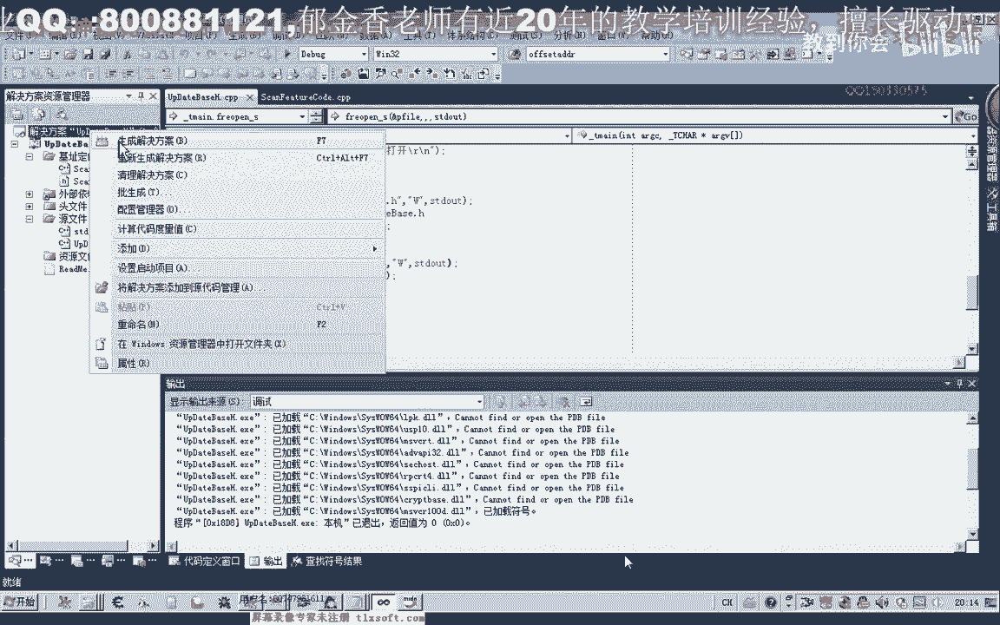

那么这个时候呢我们有一个错误，我们来看一下啊，open的时候错误的打开模式。

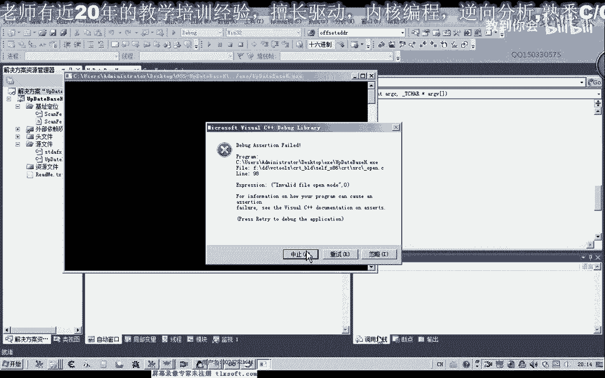

那么可能是这个大小写啊，它有一定的关系啊，在这里的话它是写了一个小写的啊，那么我们把它替换成小写，那么重新再编译一下。

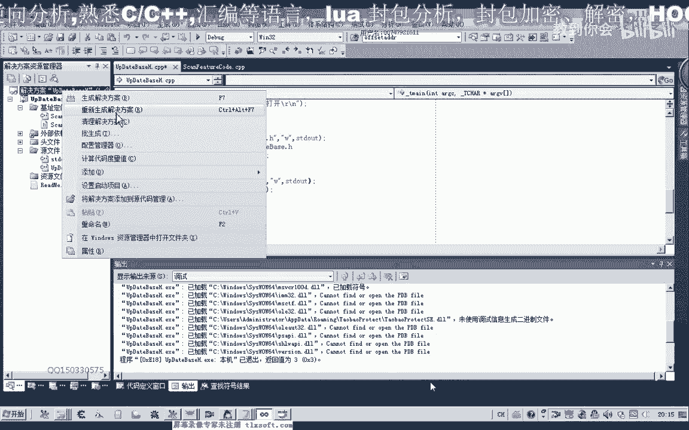

再运行，当然这个更新这个机子的话，它需要一点时间啊，因为它更新的机子比较多啊，不得收索。

好这个时候更新完成了之后，我们去找一下我们的文件嗯。

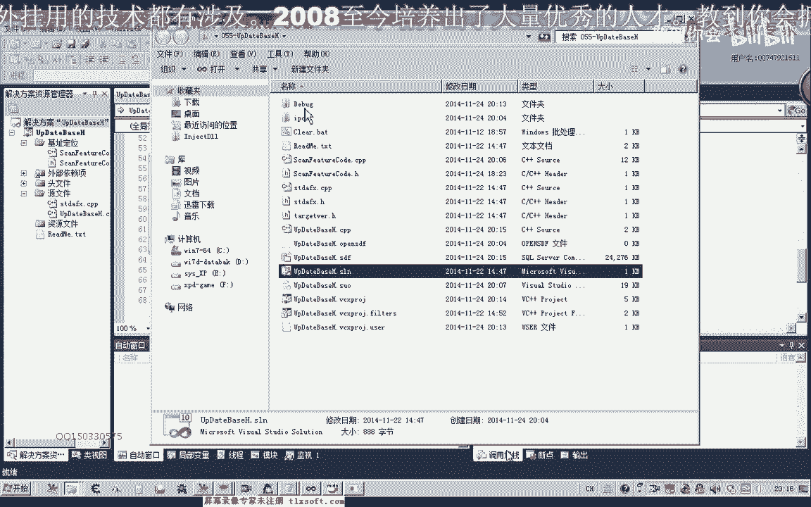

在ex e的这个目录上，在我们上一级的这个ex e的这个目录上。

然后呢我们找一下这里有个跟boss啊，那么这里所有的这个数据呢，都生成在里面来了，那么所以说我们在设置的时候的话，我们可以把那个上级的目录啊取消掉，那直接我们设置成1x一就行了。

因为这个工程呢它没有它的上一级目录，网上的，那就在本目录下面啊啊运行就可以了，然后调试的时候，这里呢我们把前面的上级目录的那两个点，把它取消掉，那么再重，新申请一下，把这个关掉啊，好的。

那么我们这个时候再生成一下，这个时候呢生成失败了，他说的这个某个文件的一个打开，看一下update gx g，再重新生成一下，试一下，看一下我们路径的一个设置，啊中间目录啊。

这里中间目录e x g输出目录，中间目录和这个输出的目录，可能是相同的啊，那么在这里呢，我们另外它跟它下一条再试一下，调试，应用。

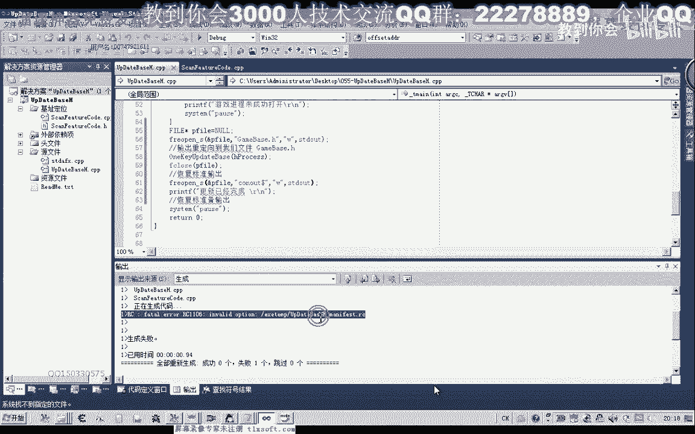

我们把工程关掉，然后再重新打开一下这个目录。

我们删掉。

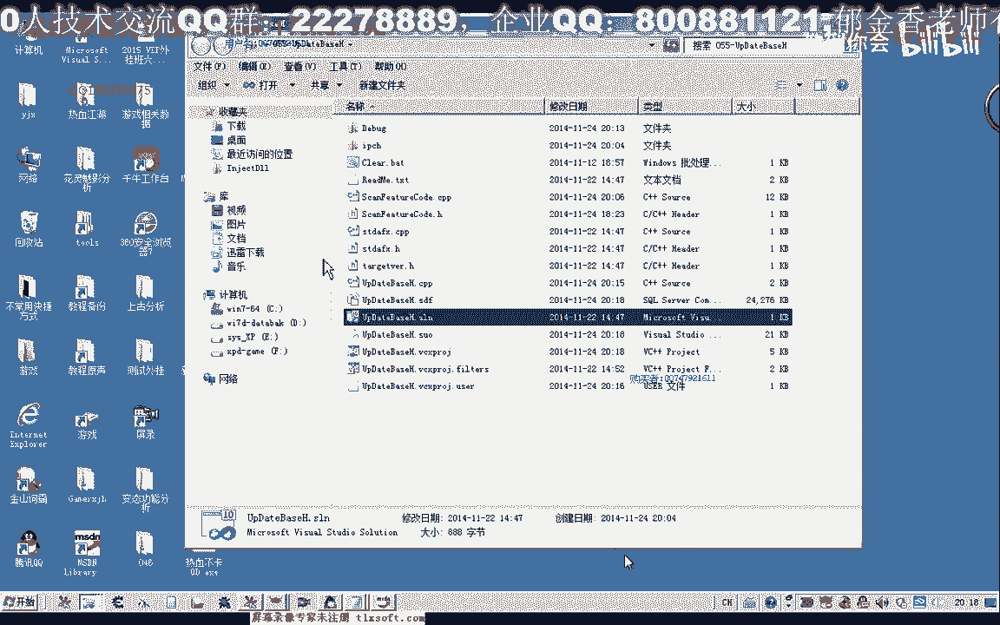

再重新生成一下，啊这个选项有问题啊，我们再来看一下吧，那么这是一个中间的一个目录啊，那么后面这个名字我们把它去掉。

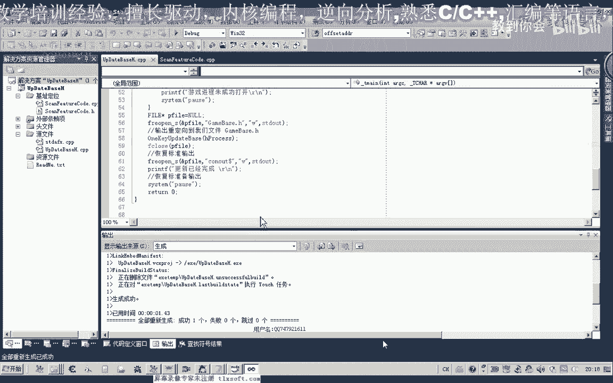

好那么这个时候生成成功了，那么我们执行一下。

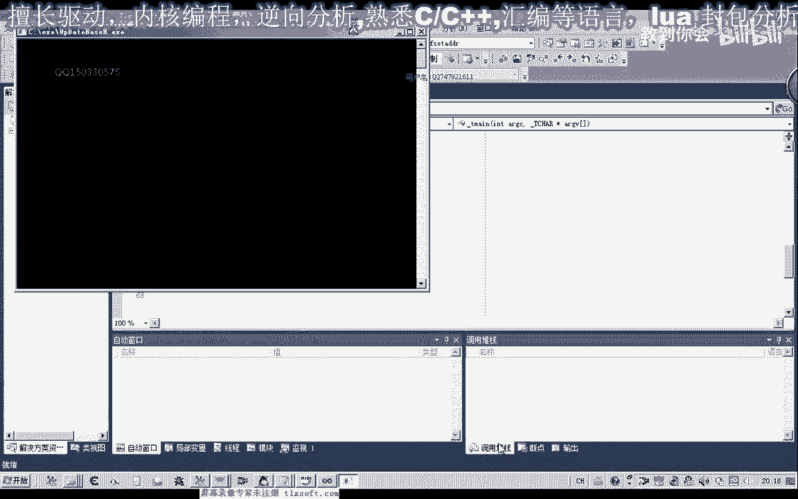

那么这个时候呢，我们看一下它执行的路径的话，在c盘的根目录下面去了，这个路径有点不太对啊。

我们再来看一下它的一个路径的一个设置，输出的一个目录啊，调试的一个封装功能，那我们还是把它设置设置成这个上级的。

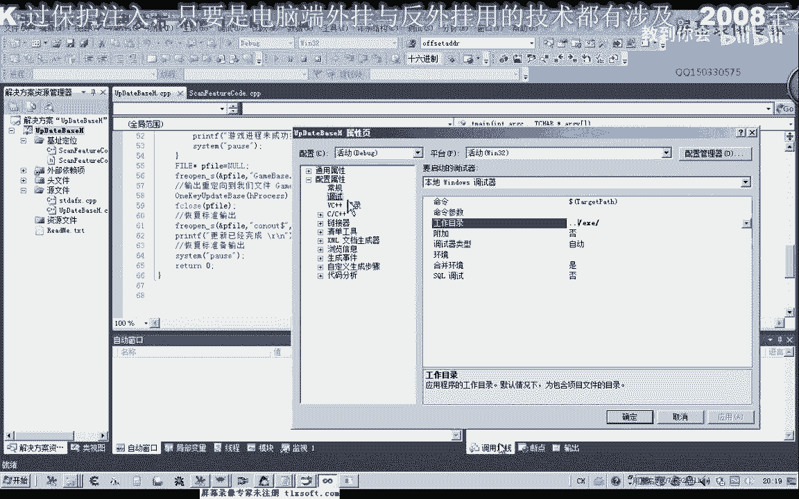

这个目录，好那么这个时候更新完成了，那么更新完成的话。

它应当是在这个c盘的根目录下面去了，这个生成的文件，那我们在它的根目录下面去找一下，啊到这个地方来了，生成了我们的文件，但是是成成功的，只是我们设置的一个路径啊，出来一点问题，好的。

那么我们在设置路径的时候呢，重新刚才把它设置了一下，再重新的编译一下，目录名必须以斜杠结尾了，我们这个参数里面它设置有一点问题，调色，啊这个中间目录啊，看懂，啊这个时候更新呢我们再看一下，关掉啊。

这个时候呢，在我们上一级的这个exe的目录下面呢，它就生成了我们相关的文件，那么我们在这里啊运行的时候呢。

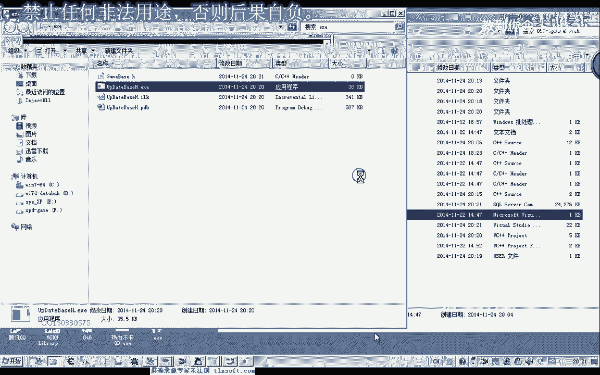

它也会在这下面呢，申请一个跟bs的这个目录。

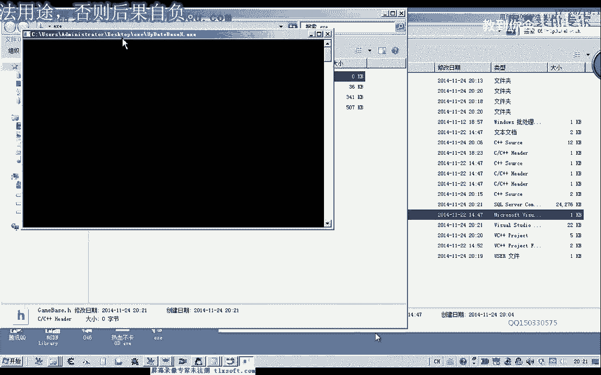

那么等它更新完成了之后呢，我们就可以拷贝到我们之前的项目文件，里面去啊，运行了。

好那么更新完成我们关掉啊，在这里呢，它就会把我们所有的机子呢，都生存成一个文件啊，然后我们只需要把这个文件复制一下。

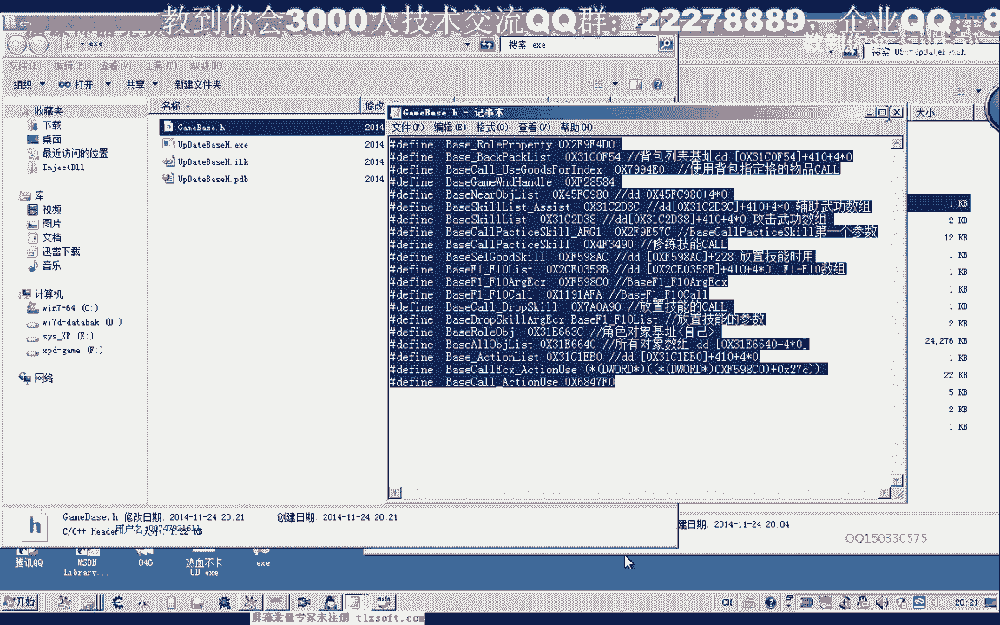

然后复制到我们第46课的代码里面，就可以了，我们找一下这里有没有第46章的代码。

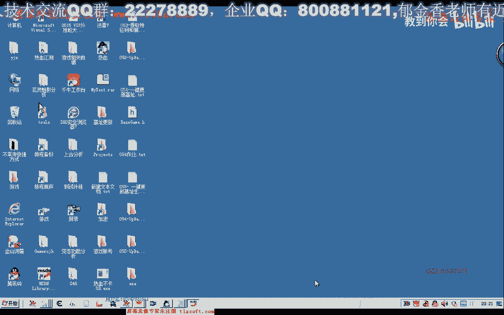

教程规范的。

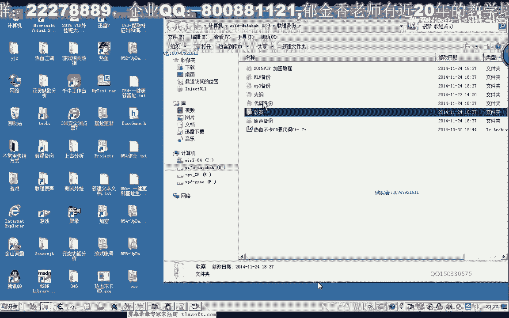

46课的代码，然后呢我们把它复制出来。

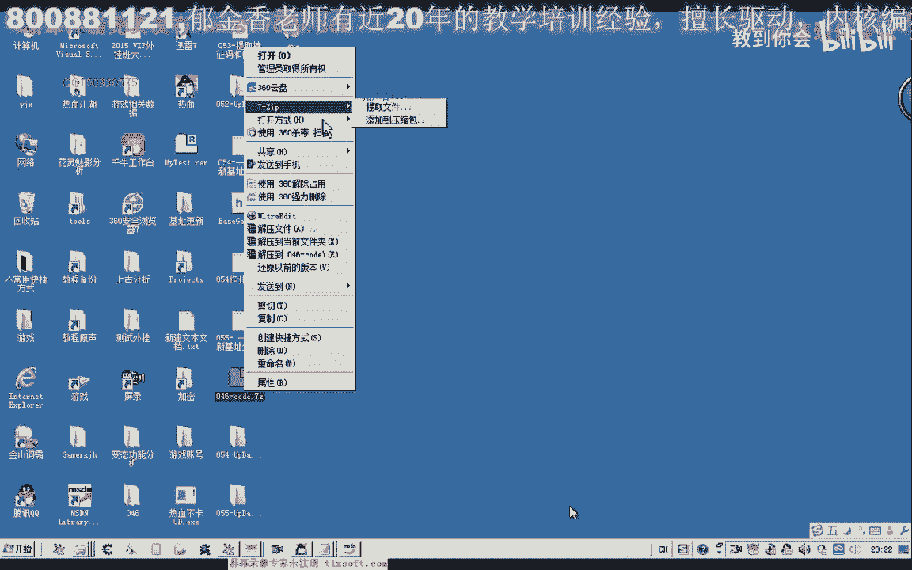

把我们的这个新的跟贝斯呢，把它粘贴进去就行哦，叫base ga啊，不是叫跟贝斯啊，那么我们把它复制一下，重命名吧，叫bison啊，那么在这里的话，我们需要再改动一下它的一个源代码。

那么这里要改成我们的bg，啊这样就可以了好的，那么我们下一节课再见。

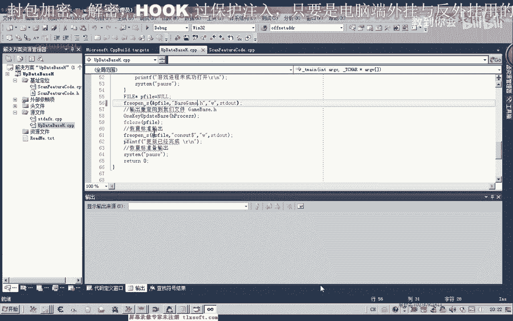