# 课程 P44：055 - 一键更新基址并生成 BaseGame.h 🛠️


在本节课中，我们将学习如何完善上一课的基址更新功能，使其不仅能显示更新结果，还能自动生成一个可直接在项目中使用的头文件（如 `BaseGame.h`）。我们将通过添加文件操作代码来实现这一目标。

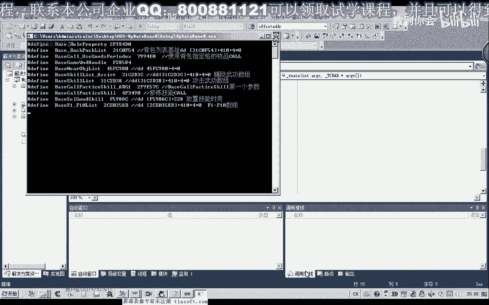

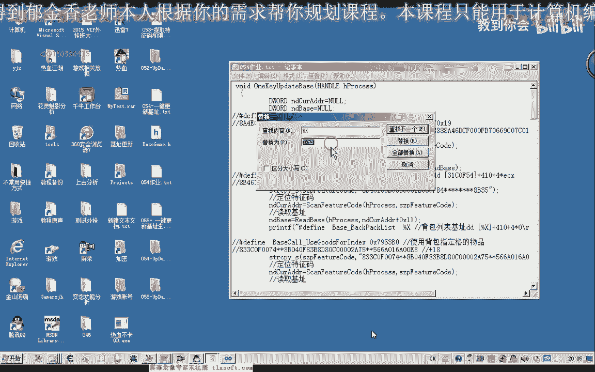


---


上一节我们介绍了如何编写代码来更新游戏基址并显示在屏幕上。本节中，我们来看看如何将这些数据自动写入到一个头文件中，以便后续项目直接引用。


首先，我们需要将上节课完成的、更完善的基址更新函数代码，整合到当前项目中。具体操作是定位到“基址定位单元”代码的末尾，并用新的函数替换旧版本。

替换完成后，应编译项目以确保代码无误。此时运行程序，更新后的基址数据会显示在控制台屏幕上。


然而，我们的目标是自动生成文件。此外，我们注意到生成的地址数据前需要添加 `0x` 前缀，这在之前的代码中被遗漏了。因此，我们需要先修正输出格式。

以下是修正输出格式的步骤，确保每个地址前都有 `0x` 前缀：
1.  在格式化字符串中，将 `%x` 修改为 `0x%x`。
2.  更新所有相关的 `printf` 语句。

修正后，再次测试，控制台输出的地址就会带有正确的前缀格式。

但是，手动从控制台复制这些代码到头文件仍然很麻烦。因此，我们需要将程序的输出重定向到一个文件中。


在C语言中，可以使用 `freopen_s` 函数来实现标准输出的重定向。这个函数比旧的 `freopen` 更安全。它的作用是将原本输出到屏幕（`stdout`）的内容，转而写入到我们指定的文件中。


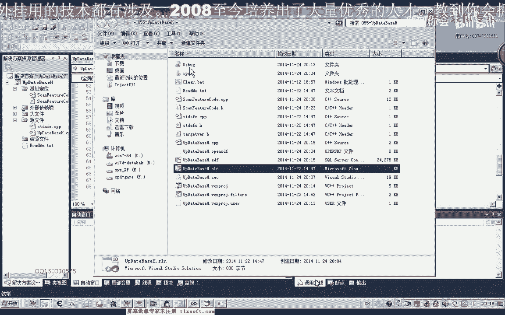


**核心函数原型如下：**
```c
errno_t freopen_s( FILE** pFile, const char* path, const char* mode, FILE* stream );
```


以下是使用 `freopen_s` 将输出重定向到文件的关键步骤：
1.  **重定向到文件**：在开始输出基址信息前，调用 `freopen_s`，将 `stdout` 流重定向到我们想要创建的文件（例如 `BaseGame.h`）。
2.  **执行更新操作**：调用基址更新函数，此时所有 `printf` 的输出都会写入文件。
3.  **恢复标准输出**：在基址更新完成后，再次调用 `freopen_s`，将 `stdout` 流重定向回控制台（使用特殊路径 `"CONOUT$"`）。这样，后续如“更新完成”的提示信息就能正常显示在屏幕上了。

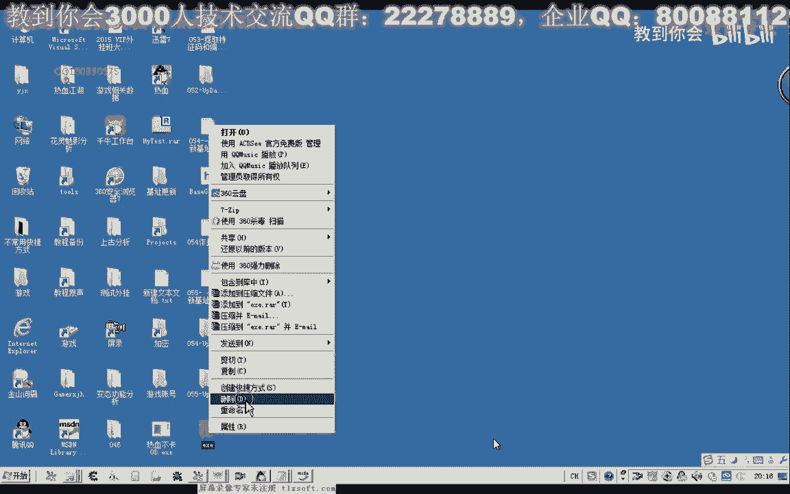


在实现过程中，需要注意项目生成目录的设置。为了便于找到生成的头文件，建议在项目属性中，将“输出目录”和“中间目录”设置为相同的路径（例如 `.\exe\`）。同时，将“调试”配置中的“工作目录”也设置为该路径。

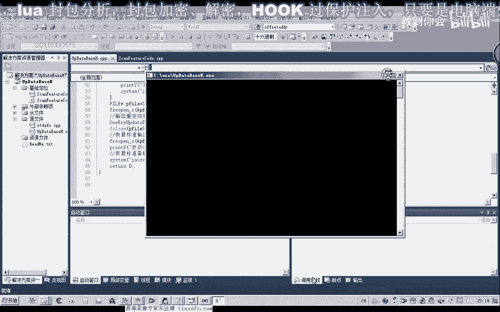


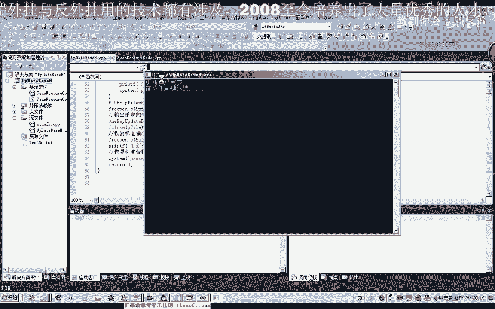

设置好路径并添加上述文件操作代码后，重新编译并运行程序。程序执行完毕后，在设定的输出目录（如 `exe` 文件夹）下，就能找到自动生成的 `BaseGame.h` 文件。这个文件包含了所有已更新的、格式正确的基址定义。

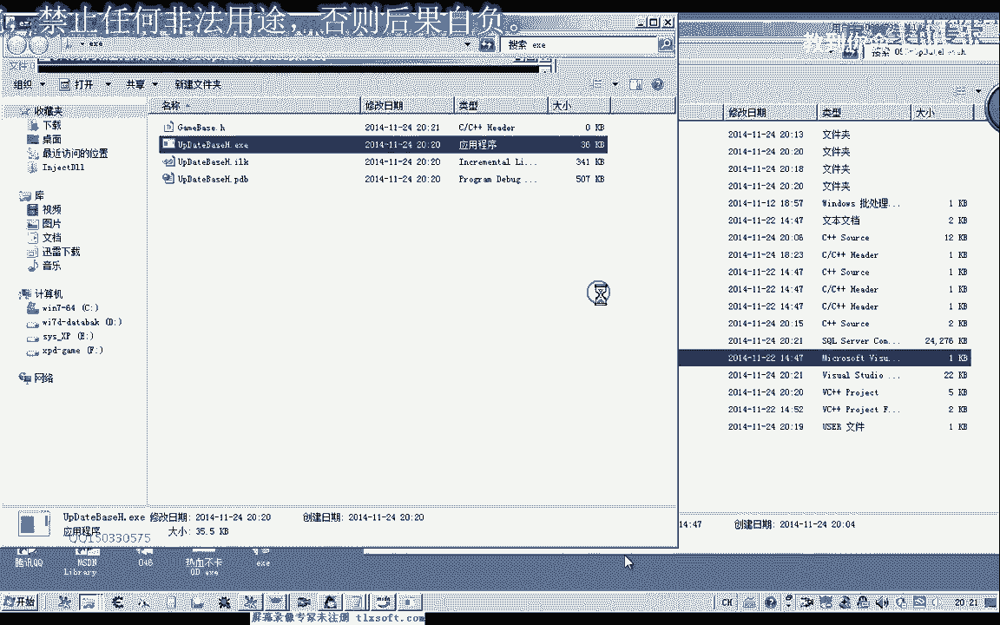

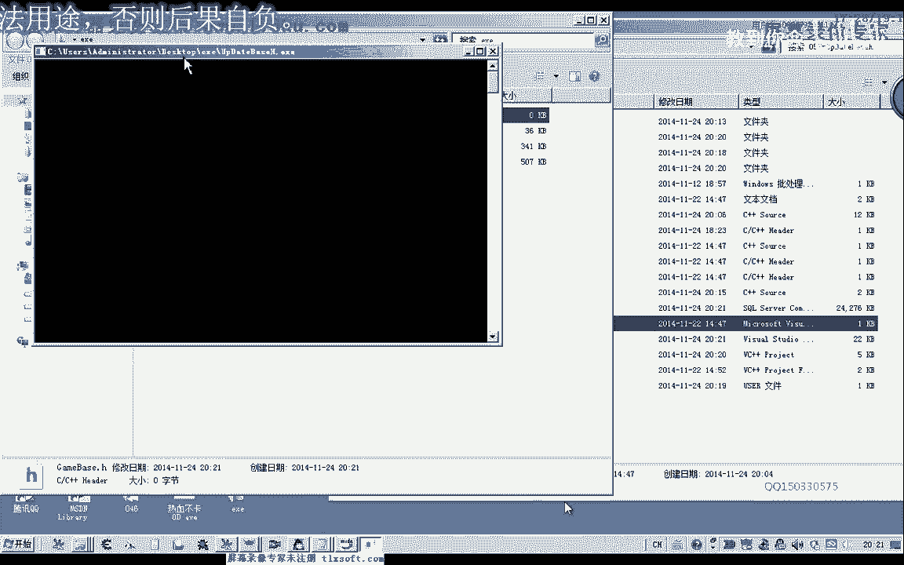

最后，我们可以将这个新生成的 `BaseGame.h` 文件复制到其他游戏项目（例如第46课的代码项目）中，替换旧的头文件，并相应修改源代码中的包含语句（例如将 `#include "Base.h"` 改为 `#include "BaseGame.h"`），即可使用最新的基址。

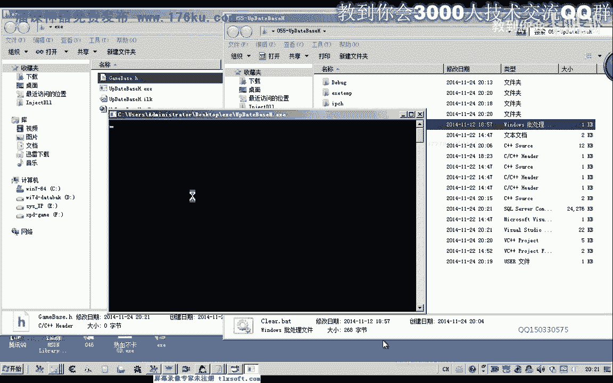


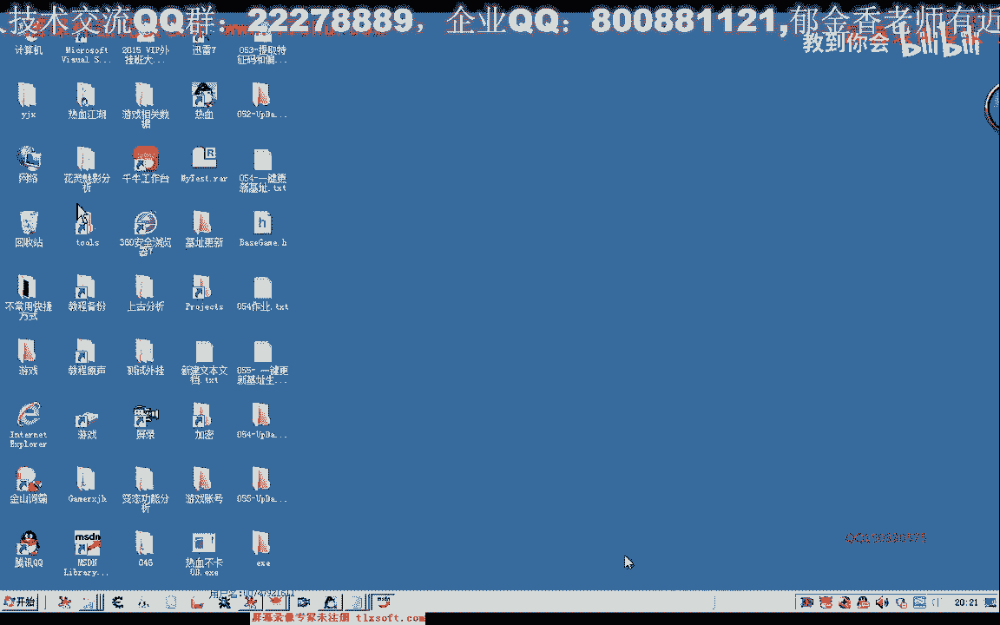

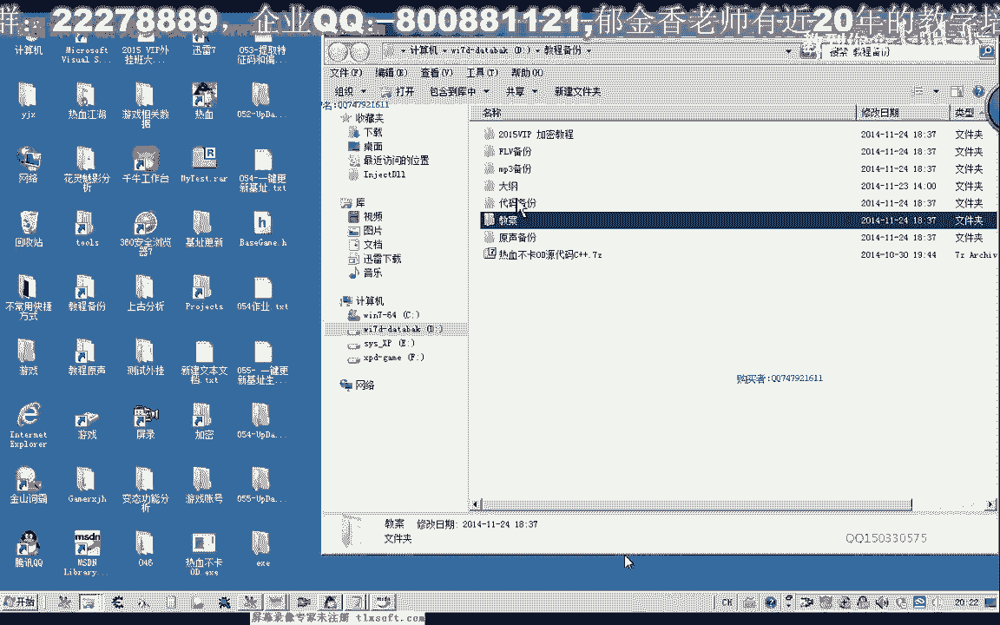

---

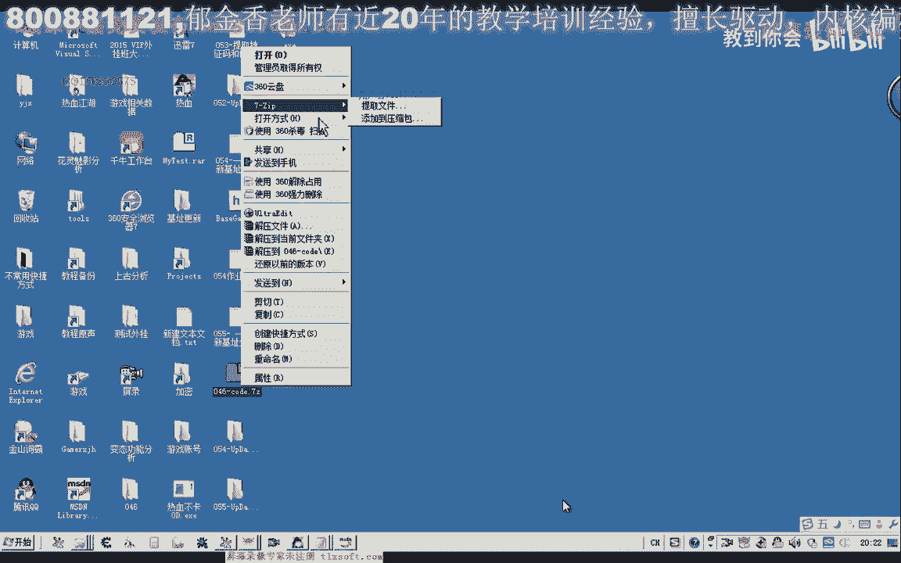


本节课中我们一起学习了如何通过 `freopen_s` 函数将程序输出重定向到文件，从而实现了在更新基址后自动生成 `BaseGame.h` 头文件的功能。这大大提高了开发效率，使得基址更新和代码集成变得自动化。